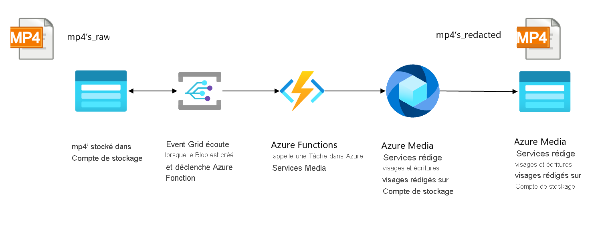
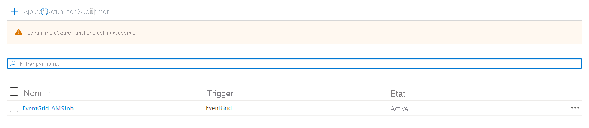
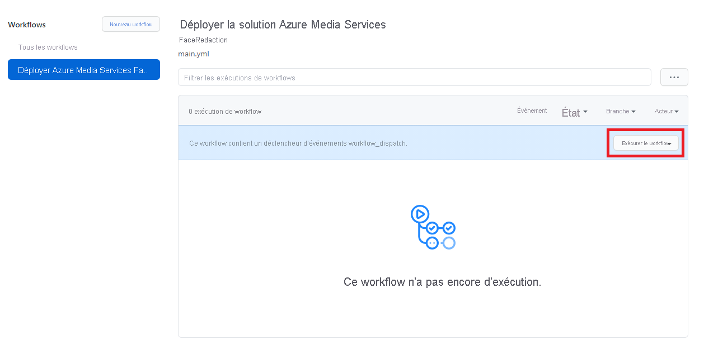

# <a name="event-based-face-redaction"></a>Édition des visages basée sur des événements

[!INCLUDE [media services api v3 logo](./includes/v3-hr.md)]

## <a name="introduction"></a>Introduction
 
Dans certains scénarios ou cas d’usage, Azure Media Services doit traiter ou analyser des vidéos dès qu’elles arrivent dans un magasin de données. Voici un exemple de cas d’usage : une équipe veut analyser des vidéos d’un site ou d’une usine pour voir si les personnes du site suivent les consignes de sécurité (par exemple porter un casque). Pour ce cas d’usage, un appareil périphérique sur le site peut capturer les vidéos quand un mouvement est détecté, puis les envoyer à Azure. Pour se conformer aux standards de confidentialité, les visages des gens capturés sur les vidéos doivent être préparés pour être publiés avant de pouvoir être analysés par l’équipe. Pour pouvoir partager les vidéos enrichies dès que possible avec l’équipe, l’étape de préparation des visages pour publication doit être effectuée au moment où une vidéo arrive sur Azure. Ce guide de démarrage rapide montre comment utiliser Azure Media Services dans un tel scénario basé sur des événements sur Azure. Les vidéos chargées sur un compte de stockage sont transformées en utilisant un travail dans Azure Media Services. Il utilise l’API Media Service v3.

La transformation spécifique qui sera utilisée est appelée [Face Redactor](./analyze-face-redaction-concept.md). Il s’agit d’une présélection d’Azure Media Analytics qui vous permet de modifier votre vidéo en floutant les visages de personnes sélectionnées.

À la fin du guide de démarrage rapide, vous serez en mesure de préparer les visages pour publication dans une vidéo.

 

## <a name="solution-overview"></a>Vue d'ensemble de la solution

 
          
Ce guide de démarrage rapide montre comment déployer la solution qui se trouve dans la vue d’ensemble de la solution ci-dessus. Il commence avec un compte de stockage (Azure Data Lake Storage Gen2), avec un écouteur d’événements connecté à ce compte (Event Grid), qui déclenche une fonction Azure quand de nouveaux fichiers .mp4 sont chargés sur le compte de stockage. La fonction Azure envoie un travail à une transformation préconfigurée dans Azure Media Services. La vidéo préparée pour publication qui en résulte sera stockée sur un compte de stockage Blob.

## <a name="prerequisites"></a>Prérequis

- Si vous n’avez pas d’abonnement Azure, créez un [compte gratuit](https://azure.microsoft.com/free/?WT.mc_id=A261C142F) avant de commencer.
- Créez un groupe de ressources à utiliser avec ce guide de démarrage rapide.

## <a name="get-the-sample-and-understand-its-deployment"></a>Obtenir l’exemple et comprendre son déploiement

Créez une duplication (fork) du [dépôt d’exemples Python](https://github.com/Azure-Samples/media-services-v3-python). Pour ce guide de démarrage rapide, nous travaillons avec l’exemple FaceRedactorEventBased.

Le déploiement de cet exemple se compose de trois étapes distinctes : le déploiement des services Azure pour configurer la solution globale, le déploiement de l’application de fonction qui soumet un travail à Azure Media Services quand un nouveau fichier est chargé et la configuration du déclencheur Event Grid. Nous avons créé un workflow GitHub Actions qui effectue ces étapes. Par conséquent, cette solution peut être déployée en ajoutant les variables nécessaires à votre environnement GitHub, ce qui signifie qu’aucun outil de développement local n’est nécessaire.

## <a name="create-a-service-principal"></a>Créer un principal du service

Avant de pouvoir exécuter le workflow GitHub Actions, vous devez créer un principal de service qui a les rôles *Contributeur* et *Lecteur des données Blob du stockage* sur le groupe de ressources. Ce principal de service sera l’application qui va provisionner et configurer tous les services Azure pour le compte de GitHub Actions. Le principal du service est également utilisé une fois que la solution est déployée pour générer un jeton SAS pour les vidéos qui doivent être traitées.

Pour créer le principal de service et lui donner les rôles nécessaires sur le groupe de ressources, renseignez les variables dans la commande bash suivante et exécutez-la dans Cloud Shell :
```bash
# Replace <subscription-id>, <name-of-resource-group> and <name-of-app> with the corresponding values. 
# Make sure to use a unique name for the app name parameter.

app_name="<name-of-app>"
resource_group="<name-of-resource-group>"
subscription_id="<subscription-id>"

az ad sp create-for-rbac --name $app_name --role contributor \
                     --scopes /subscriptions/$subscription_id/resourceGroups/$resource_group \
                     --sdk-auth

object_id=$(az ad sp list --display-name $app_name --query [0].objectId -o tsv)

az role assignment create --assignee $object_id --role "Storage Blob Data Reader" \
                      --scope /subscriptions/$subscription_id/resourceGroups/$resource_group
```
  
La commande doit produire un objet JSON similaire à celui-ci :
   
```json
{
  "clientId": "<GUID>",
  "clientSecret": "<GUID>",
  "subscriptionId": "<GUID>",
  "tenantId": "<GUID>",
  (...)
}
```
Veillez à copier la sortie et en disposer pour l’étape suivante.
 
## <a name="add-service-principal-details-to-github-secrets"></a>Ajouter les détails du principal de service à GitHub Secrets 

Les détails du principal de service doivent être stockés en tant que [secret GitHub](https://docs.github.com/en/actions/reference/encrypted-secrets) pour que GitHub Actions puisse déployer et configurer les services nécessaires dans Azure. Accédez à Repo Settings -> Secrets of your forked repo (Paramètres du dépôt -> Secrets de votre dépôt dupliqué), puis cliquez sur « Create New Secrets » (Créer de nouveaux secrets). Créez les secrets suivants :
 - Créez « AZURE_CREDENTIALS » et collez la sortie de l’étape précédente (le JSON au complet). Dans le workflow de GitHub Actions, ce secret sera utilisé pour créer une connexion à Azure. 
 - Créez « CLIENT_ID » et collez la valeur de « clientId » de l’étape précédente.
 - Créez « CLIENT_SECRET » et collez la valeur de « clientSecret » de l’étape précédente.
 - Créez « TENANT_ID » et collez la valeur de « tenantId » de l’étape précédente.
 
## <a name="create-the-env-file"></a>Créer le fichier .env

Copiez le contenu du fichier sample.env qui se trouve dans votre dépôt dupliqué dans le dossier VideoAnalytics/FaceRedactorEventBased. Ensuite, créez votre propre fichier .env en cliquant sur Add file -> Create new file (Ajouter un fichier -> Créer un fichier). Nommez le fichier *.env* et renseignez les variables. Quand vous avez terminé, cliquez sur « Commit new file » (Commiter le nouveau fichier). Nous sommes maintenant prêts à déployer la solution, mais nous allons d’abord examiner les fichiers de code que nous utiliserons.

## <a name="examine-the-code-for-provisioning-the-azure-resources"></a>Examiner le code pour provisionner les ressources Azure

Le script bash ci-dessous provisionne les services Azure utilisés dans cette solution. Le script bash utilise Azure CLI et exécute les actions suivantes :
- Charger les variables d’environnement dans des variables locales.
- Définir des noms pour ADLSgen2, un compte stockage Azure générique, Azure Media Services, une application de fonction Azure, et une rubrique et un abonnement système Event Grid.
- Provisionner les services Azure définis.

[!code-bash[Main](../../../media-services-v3-python/VideoAnalytics/FaceRedactorEventBased/AzureServicesProvisioning/deploy_resources.azcli)]

## <a name="examine-azure-function-code"></a>Examiner le code de la fonction Azure

Maintenant que les ressources Azure sont provisionnées, nous sommes prêts à déployer le code Python sur notre fonction Azure. Le fichier **/azure-function/EventGrid_AMSJob/__init__.py** contient la logique permettant de déclencher un travail AMS chaque fois qu’un fichier arrive dans le système de fichiers Azure Data Lake Gen2. Le script effectue les étapes suivantes :
- Importer les dépendances et les bibliothèques.
- Utiliser le Binder de fonction pour écouter Azure Event Grid.
- Récupérer et définir des variables à partir du schéma des événements.
- Créer une ressource d’entrée/sortie pour le travail AMS.
- Se connecter à Azure Data Lake Gen2 en utilisant le lient DataLakeService et générer un jeton SAS à utiliser comme authentification pour l’entrée du travail AMS.
- Configurer et créer le travail.

[!code-python[Main](../../../media-services-v3-python/VideoAnalytics/FaceRedactorEventBased/AzureFunction/EventGrid_AMSJob/__init__.py)]

## <a name="examine-the-code-for-configuring-the-azure-resources"></a>Examiner le code pour configurer les ressources Azure 

Le script bash ci-dessous est utilisé pour configurer les ressources une fois qu’elles ont été provisionnées. L’exécution de ce script est la dernière étape du déploiement de la solution, après le déploiement de notre code de fonction. Le script exécute les étapes suivantes :
- Configurer les paramètres d’application pour l’application de fonction.
- Créer une rubrique système Azure Event Grid.
- Créez l’abonnement aux événements, de sorte que quand ’un objet blob est créé dans le dossier Raw d’ADLSg2, la fonction Azure est déclenchée.
- Créer la transformation Azure Media Services en utilisant un appel d’API REST. Cette transformation sera appelée dans la fonction Azure.

> [!NOTE]
> Actuellement, ni le SDK Python Azure Media Services v3, ni Azure CLI ne prend en charge la création d’une transformation FaceRedaction. Nous utilisons donc la méthode de l’API REST pour créer le travail de transformation.

[!code-bash[Main](../../../media-services-v3-python/VideoAnalytics/FaceRedactorEventBased/AzureServicesProvisioning/configure_resources.azcli)]
 
## <a name="enable-github-actions-pipeline"></a>Activer le pipeline GitHub Actions
 Le fichier de workflow de ce dépôt contient les étapes pour exécuter le déploiement de cette solution. Pour démarrer le workflow, vous devez l’activer pour votre propre dépôt. Pour l’activer, accédez à l’onglet Actions de votre dépôt et sélectionnez « I understand my workflows, go ahead and enable them » (Je comprends mes workflows, continuez et activez-les).
 
  
 
Après avoir activé GitHub Actions, vous pouvez trouver le fichier de charge de travail ici : [.github/workflows/main.yml](https://github.com/Azure-Samples/media-services-v3-python/blob/main/.github/workflows/main.yml).  En plus des déclencheurs, il y a un travail de création avec quelques étapes. Les étapes suivantes sont incluses :
- **Environnement** : plusieurs variables d’environnement sont définies ici, faisant référence aux secrets GitHub que nous avons ajoutés précédemment.
- **Lecture du fichier d’environnement** : le fichier d’environnement est lu pour le travail de création.
- **Résoudre les dépendances du projet en utilisant Pip** : les bibliothèques nécessaires dans nos fonctions Azure sont chargées dans l’environnement GitHub Actions.
- **Connexion Azure** : cette étape utilise le secret GitHub pour la connexion à Azure CLI en utilisant les détails du principal de service.
- **Déployer les ressources en utilisant le fichier de script Azure CLI** : exécute le script de déploiement pour provisionner les ressources Azure.
- **Déployer le code de la fonction Azure** : cette étape empaquette et déploie la fonction Azure dans le répertoire « ./azure-function ». Une fois la fonction Azure déployée, elle doit être visible dans le portail Azure sous le nom « EventGrid_AMSJob » :
 

- **Configurer les ressources Azure en utilisant un fichier de script Azure CLI** : si tout est correct, la dernière étape est de configurer les services Azure déployés pour activer l’écouteur d’événements.

Après avoir activé les workflows, sélectionnez le workflow « Deploy Azure Media Service FaceRedaction solution » (Déployer la solution FaceRedaction d’Azure Media Service) et sélectionnez « Run workflow » (Exécuter le workflow). À présent, la solution va être déployée en utilisant les variables ajoutées dans les étapes précédentes. Attendez quelques minutes, puis vérifiez qu’il a été exécutée avec succès.

 

## <a name="test-your-solution"></a>Tester votre solution
Accédez à l’Explorateur de stockage de votre instance ADLS Gen2 dans le portail Azure. Chargez une vidéo dans le conteneur Raw. Si vous cherchez une vidéo de test, vous pouvez en télécharger une à partir de [ce site web](https://www.pexels.com/search/videos/group/). Consultez l’image ci-dessous pour des instructions sur le chargement d’une vidéo dans le compte de stockage ADLS Gen2 :

 

Vérifiez dans votre instance Azure Media Services qu’un travail est créé en accédant à votre compte Azure Media Services, puis en sélectionnant Transformations + Travaux dans le menu. Sélectionnez ensuite la transformation Face Redactor.

 

Cette page doit montrer le travail qui a été déclenché par la fonction Azure. Le travail peut être terminé ou toujours en cours de traitement.

  

En sélectionnant le travail, vous verrez des détails sur le travail spécifique. Si vous sélectionnez le nom de la ressource Sortie et que vous utilisez le lien vers le conteneur de stockage qui y est lié, vous pouvez voir votre vidéo traitée une fois le travail terminé.

  

## <a name="clean-up-resources"></a>Suppression des ressources

Quand vous avez terminé le guide de démarrage rapide, supprimez les ressources créées dans le groupe de ressources. Vous pouvez aussi supprimer le dépôt dupliqué.

## <a name="next-steps"></a>Étapes suivantes

Si vous voulez modifier cet exemple, vous préférerez probablement exécuter le code localement. Pour un développement local, les variables du fichier sample.env sont suffisantes, car le principal de service n’est pas nécessaire lorsqu’un compte d’utilisateur est connecté à l’interface Azure CLI installée localement. Pour obtenir des instructions sur l’utilisation locale de votre fonction Azure, consultez [ce document](../../azure-functions/create-first-function-vs-code-python.md).
