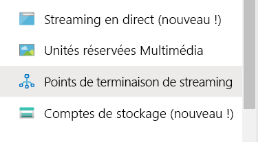
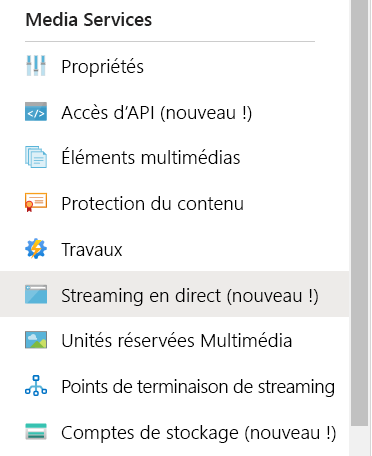
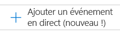
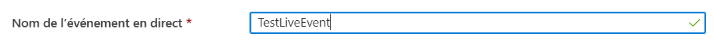
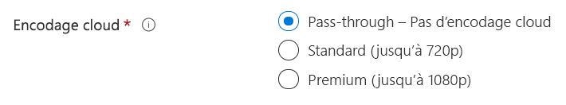
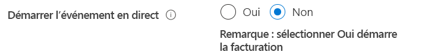
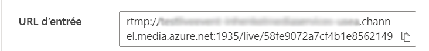
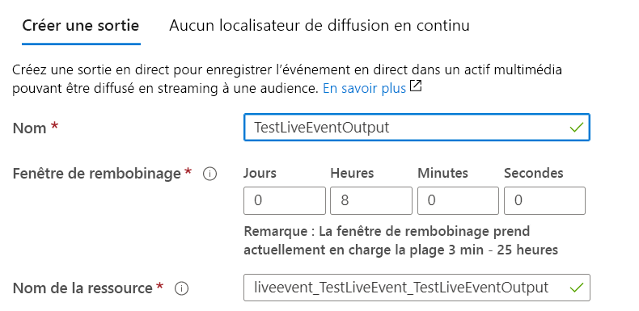
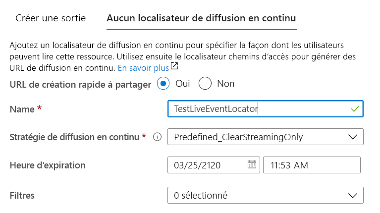

# Créer un stream en direct Azure Media Services avec OBS

[!INCLUDE [media services api v3 logo](./includes/v3-hr.md)]

Ce guide de démarrage rapide vous permet de créer un événement en direct Media Services à l’aide du portail Azure et de diffuser à l’aide d’Open Broadcasting Studio (OBS). Il suppose que vous disposez d’un abonnement Azure et que vous avez créé un compte Media Services.

Dans ce guide de démarrage rapide, nous allons aborder les points suivants :

- Configuration d’un encodeur local avec OBS
- Configuration d’un stream en direct
- Configuration de sorties de stream en direct
- Exécution d’un point de terminaison de streaming par défaut
- Utilisation du Lecteur multimédia Azure pour afficher le stream en direct et la sortie à la demande

## Prérequis

Si vous n’avez pas d’abonnement Azure, créez un [compte gratuit](https://azure.microsoft.com/free/) avant de commencer.

## Connectez-vous au portail Azure.

Ouvrez votre navigateur web et accédez au [portail Microsoft Azure](https://portal.azure.com/). Entrez vos informations d’identification pour vous connecter au portail. Il s’ouvre par défaut sur le tableau de bord des services.

## Configurer un encodeur local avec OBS

1. Téléchargez et installez OBS pour votre système d’exploitation sur le [site web d’Open Broadcaster Software](https://obsproject.com/).
1. Démarrez l’application et laissez-la ouverte.

## Exécuter le point de terminaison de streaming par défaut

1. Sélectionnez **Points de terminaison de streaming** dans la liste Media Services.

   
1. Si l’état du point de terminaison de streaming par défaut est arrêté, sélectionnez-le. Cette étape vous fait accéder à la page de ce point de terminaison.
1. Sélectionnez **Démarrer**.

   

## Configurer un stream en direct Azure Media Services

1. Accédez au compte Azure Media Services dans le portail, puis sélectionnez **Streaming en direct** dans la liste **Media Services**.

   
1. Sélectionnez **Ajouter un événement en direct** pour créer un événement de streaming en direct.

   
1. Entrez un nom pour le nouvel événement, par exemple *TestLiveEvent*, dans la zone **Nom de l’événement en direct**.

   
1. Entrez une description de l’événement dans la zone **Description** (facultatif).
1. Sélectionnez l’option **Transfert direct - pas d’encodage cloud**.

   
1. Sélectionnez l’option **RTMP**.
1. Vérifiez que l’option **Non** est sélectionnée pour **Démarrer l’événement en direct** afin d’éviter la facturation de l’événement en direct avant qu’il ne soit prêt. (La facturation commence au démarrage de l’événement en direct.)

   
1. Sélectionnez le bouton **Vérifier + créer** pour passer en revue les paramètres.
1. Sélectionnez le bouton **Créer** pour créer l’événement en direct. Vous êtes ensuite redirigé vers la liste des événements en direct.
1. Sélectionnez le lien vers l’événement en direct que vous avez créé. Notez que votre événement est arrêté.
1. Laissez cette page ouverte dans votre navigateur. Nous y reviendrons plus tard.

## Configurer un stream en direct avec OBS Studio

OBS démarre avec une scène par défaut, mais sans entrée sélectionnée.

   

### Ajouter une source vidéo

1. Dans le panneau **Sources**, sélectionnez l’icône **ajouter** pour sélectionner un nouveau périphérique source. Le menu **Sources** s’ouvre.

1. Sélectionnez **Video Capture Device** (Périphérique de capture vidéo) dans le menu de périphériques sources. Le menu **Create/Select Source** (Créer/sélectionner une source) s’ouvre.

   

1. Sélectionnez la case d’option **Ajouter existant**, puis cliquez sur **OK**. Le menu **Properties for Video Device** (Propriétés du périphérique vidéo) s’ouvre.

   

1. Dans la liste déroulante **Device** (Périphérique), sélectionnez l’entrée vidéo que vous souhaitez utiliser pour votre diffusion. Ne vous souciez pas des autres paramètres pour le moment et sélectionnez **OK**. La source d’entrée sera ajoutée au panneau **Sources**, et la vue d’entrée vidéo s’affichera dans la zone **Preview** (Aperçu)

   

### Ajouter une source audio

1. Dans le panneau **Sources**, sélectionnez l’icône **ajouter** pour sélectionner un nouveau périphérique source. Le menu Source Device (Périphérique source) s’ouvre.

1. Sélectionnez **Audio Input Capture** (Capture d’entrée audio) dans le menu de périphériques sources. Le menu **Create/Select Source** s’ouvre.

   

1. Sélectionnez la case d’option **Ajouter existant**, puis cliquez sur **OK**. Le menu **Properties for Audio Input Capture** (Propriétés de capture d’entrée audio) s’ouvre.

   

1. Dans la liste déroulante **Device**, sélectionnez le périphérique de capture audio que vous souhaitez utiliser pour votre diffusion. Ne vous souciez pas des autres paramètres pour le moment et sélectionnez OK. Le périphérique de capture audio est ajouté au panneau de mixage audio.

   

### Configurer les paramètres de diffusion en continu et d’encodage avancé dans OBS

Dans le cadre de la procédure suivante, vous allez revenir à Azure Media Services dans votre navigateur pour copier l’URL d’entrée à indiquer dans les paramètres de sortie :

1. Dans la page Azure Media Services du portail, sélectionnez **Démarrer** pour démarrer l’événement de stream en direct. (La facturation commence maintenant.)

   
1. Définissez le bouton bascule **RTMP** sur **RTMPS**.
1. Copiez l’URL de la zone **URL d’entrée** dans le Presse-papiers.

   

1. Basculez vers l’application OBS.

1. Sélectionnez le bouton **Paramètres** dans le panneau **Contrôles**. Les options des paramètres s’ouvrent.

   

1. Sélectionnez **Stream** dans le menu **Settings**.

1. Dans la liste déroulante **service**, sélectionnez Show all (Afficher tout), puis **Custom...** (Personnalisé).

1. Dans le champ **Server** (Serveur), collez l’URL RTMPS que vous avez copiée dans le Presse-papiers.

1. Entrez quelque chose dans le champ **Stream key** (Clé de flux).  Peu importe ce que vous tapez ; l’important est que ce champ ait une valeur.

    

1. Sélectionnez **Output** (Sortie) dans le menu **Settings**.

1. Sélectionnez la liste déroulante **Mode de sortie** en haut de la page et choisissez **Avancé** pour accéder à tous les paramètres de l’encodeur disponibles.

1. Sélectionnez l’onglet **Streaming** pour configurer l’encodeur.

1. Sélectionnez l’encodeur approprié à votre système.  Si votre matériel prend en charge l’accélération GPU, faites un choix entre NVIDIA **NVENC** H.264 ou Intel **QuickSync** H.264. Si votre système ne dispose pas d’un GPU pris en charge, sélectionnez l’option d’encodeur logiciel **X264**.

#### Paramètres de l’encodeur X264

1. Si vous avez sélectionné l’option d’encodage **X264**, sélectionnez la case **Redimensionner la sortie**. Sélectionnez 1920x1080 si vous utilisez un événement en direct Premium dans Media Services ou 1280x720 si vous utilisez un événement en direct Standard (720P).  Si vous utilisez un événement en direct Pass-through, vous pouvez choisir n’importe quelle résolution disponible.

1. Définissez la **Vitesse de transmission** sur une valeur au choix comprise entre 1 500 Kbits/s et 4 000 Kbits/s. Nous vous recommandons 2 500 Kbits/s si vous utilisez un événement en direct d’encodage Standard à 720P. Si vous utilisez un événement en direct Premium de 1080P, la valeur 4 000 Kbits/s est recommandée. Vous pouvez ajuster la vitesse de transmission en fonction des capacités de l’UC et de la bande passante disponibles sur votre réseau pour obtenir le paramètre de qualité souhaité.

1. Entrez *2* dans le champ **Keyframe interval** (Intervalle d’image clé). La valeur définit l’intervalle d’image clé sur 2 secondes, ce qui contrôle la taille finale des fragments fournis sur TLS ou DASH par Media Services. Ne définissez jamais l’intervalle d’image clé sur une valeur supérieure à 4 secondes.  Si vous constatez une latence élevée lors de la diffusion, vous devez toujours revérifier ou informer les utilisateurs de votre application qu’ils doivent toujours définir cette valeur sur 2 secondes. Lorsque vous tentez d’obtenir une livraison en direct avec une latence inférieure, vous pouvez choisir de définir cette valeur sur une valeur inférieure à 1 seconde.

1. FACULTATIF : définissez la présélection de l’utilisation de l’UC sur **veryfast** et effectuez des tests pour déterminer si votre UC locale peut gérer la combinaison de vitesse de transmission et de présélection avec une surcharge suffisante. Essayez d’éviter les paramètres qui aboutissent à une UC moyenne supérieure à 80 % pour éviter tout problème pendant la diffusion en direct. Pour améliorer la qualité, vous pouvez tester les paramètres de présélection **faster** et **fast** jusqu’à ce que vous atteigniez les limitations de votre UC.

   

1. Laissez les autres paramètres inchangés et sélectionnez **OK**.

#### Paramètres de l’encodeur NVIDIA NVENC

1. Si vous avez sélectionné l’option d’encodage de GPU **NVENC**, sélectionnez la case **Redimensionner la sortie** et 1920x1080 si vous utilisez un événement en direct Premium dans Media Services ou 1280x720 si vous utilisez un événement en direct Standard (720P). Si vous utilisez un événement en direct Pass-through, vous pouvez choisir n’importe quelle résolution disponible.

1. Définissez le **Contrôle de la vitesse de transmission** sur CBR pour le contrôle de la vitesse de transmission constante.

1. Définissez la **Vitesse de transmission** sur une valeur au choix comprise entre 1 500 Kbits/s et 4 000 Kbits/s. Nous vous recommandons 2 500 Kbits/s si vous utilisez un événement en direct d’encodage Standard à 720P. Si vous utilisez un événement en direct Premium de 1080P, la valeur 4 000 Kbits/s est recommandée. Vous pouvez choisir d’ajuster cette valeur en fonction des capacités de l’UC et de la bande passante disponibles sur votre réseau pour obtenir le paramètre de qualité souhaité.

1. Définissez l'**Intervalle d’image clé** sur 2 secondes comme indiqué ci-dessus sous les options X264. Ne dépassez pas 4 secondes, car cela peut avoir un impact significatif sur la latence de votre diffusion en direct.

1. Définissez **Présélection** sur Faible latence, Performances à faible latence ou Qualité à faible latence en fonction de la vitesse du processeur sur votre ordinateur local. Testez ces paramètres pour obtenir le meilleur équilibre entre la qualité et l’utilisation de l’UC sur votre propre matériel.

1. Définissez le **Profil** sur « main » ou « high » si vous utilisez une configuration matérielle plus puissante.

1. Laissez la case **Anticipation** non cochée. Si vous disposez d’un ordinateur très puissant, vous pouvez la cocher.

1. Laissez la case **Réglage visuel psycho** non cochée. Si vous disposez d’un ordinateur très puissant, vous pouvez la cocher.

1. Définissez le **GPU** sur 0 pour décider automatiquement des GPU à allouer. Si vous le souhaitez, vous pouvez limiter l’utilisation du GPU.

1. Définissez le **Nombre maximal d’images de type b** sur 2

   

#### Paramètres de l’encodeur Intel QuickSync

1. Si vous avez sélectionné l’option d’encodage de GPU **QuickSync**, sélectionnez la case **Redimensionner la sortie** et 1920x1080 si vous utilisez un événement en direct Premium dans Media Services ou 1280x720 si vous utilisez un événement en direct Standard (720P). Si vous utilisez un événement en direct Pass-through, vous pouvez choisir n’importe quelle résolution disponible.

1. Définissez l'**Utilisation cible** sur « équilibrée » ou ajustez-la selon vos besoins en fonction de la charge combinée de l’UC et du GPU. Ajustez-les en fonction des besoins et faites des essais pour obtenir une utilisation maximale de 80 % de l’UC en moyenne avec la qualité que votre matériel est peut offrir. Si votre matériel est plus limité, effectuez un test avec « fast » ou désélectionnez « very fast » si vous rencontrez des problèmes de performances.

1. Définissez le **Profil** sur « main » ou « high » si vous utilisez une configuration matérielle plus puissante.

1. Définissez l'**Intervalle d’image clé** sur 2 secondes comme indiqué ci-dessus sous les options X264. Ne dépassez pas 4 secondes, car cela peut avoir un impact significatif sur la latence de votre diffusion en direct.

1. Définissez le **Contrôle de la vitesse de transmission** sur CBR pour le contrôle de la vitesse de transmission constante.

1. Définissez la **Vitesse de transmission** sur une valeur au choix comprise entre 1 500 et 4 000 Kbits/s.  Nous vous recommandons 2 500 Kbits/s si vous utilisez un événement en direct d’encodage Standard à 720P. Si vous utilisez un événement en direct Premium de 1080P, la valeur 4 000 Kbits/s est recommandée. Vous pouvez choisir d’ajuster cette valeur en fonction des capacités de l’UC et de la bande passante disponibles sur votre réseau pour obtenir le paramètre de qualité souhaité.

1. Définissez **Latence** sur « low ».

1. Définissez **Images de type b** sur 2.

1. Laissez la case **Améliorations vidéo subjectives** non cochée.

   

### Définir les paramètres audio

Dans la procédure suivante, vous allez ajuster les paramètres d’encodage audio.

1. Sélectionnez l’onglet Sortie -> Audio dans Paramètres.

1. Définissez **Vitesse de transmission audio** de la piste 1 sur 128 Kbits/s.

   

1. Sélectionnez l’onglet Audio dans Paramètres.

1. Définissez **Taux d’échantillonnage** sur 44,1 kHz.

   

### Démarrer le streaming

1. Dans le panneau **Controls**, cliquez sur **Start Streaming** (Démarrer le streaming).

    

2. Basculez vers l’écran d’événement en direct Azure Media Services dans votre navigateur, puis cliquez sur le lien **Recharger le lecteur**. Vous devez maintenant voir votre flux dans le lecteur d’aperçu.

## Configurer les sorties

Cette partie configure vos sorties et vous permet d’enregistrer un enregistrement de votre stream en direct.  

> [!NOTE]
> Pour que vous puissiez diffuser cette sortie, le point de terminaison de streaming doit être en cours d’exécution. Consultez la section [Exécuter le point de terminaison de streaming par défaut](#run-the-default-streaming-endpoint) plus bas.

1. Sélectionnez le lien **Create outputs** sous la visionneuse de vidéo **Outputs**.
1. Si vous le souhaitez, remplacez le nom de la sortie dans la zone **Name** par un nom plus convivial, plus facile à rechercher ultérieurement.

   
1. Ne modifiez aucune des autres zones pour le moment.
1. Sélectionnez **Next** pour ajouter un localisateur de streaming.
1. Si vous le souhaitez, remplacez le nom du localisateur par un nom plus convivial.

   
1. Ne changez rien d’autre sur cet écran pour le moment.
1. Sélectionnez **Create** (Créer).

## Lire la diffusion de la sortie avec le Lecteur multimédia Azure

1. Copiez l’URL de streaming sous le lecteur vidéo de **Sortie**.
1. Dans un navigateur web, ouvrez la [démonstration du Lecteur multimédia Azure](https://ampdemo.azureedge.net/azuremediaplayer.html).
1. Collez l’URL de streaming dans la zone **URL** du Lecteur multimédia Azure.
1. Sélectionnez le bouton **Mettre à jour le lecteur**.
1. Sélectionnez l’icône **Lire** sur la vidéo pour voir le stream en direct.

## Arrêter la diffusion

Quand vous pensez avoir diffusé suffisamment de contenu, arrêtez la diffusion.

1. Dans le portail, sélectionnez **Arrêter**.

1. Dans OBS, sélectionnez le bouton **Stop Streaming** (Arrêter le streaming) dans le panneau **Controls**. Cette étape arrête la diffusion à partir d’OBS.

## Lire la sortie à la demande avec le Lecteur multimédia Azure

La sortie que vous avez créée est désormais disponible pour le streaming à la demande tant que votre point de terminaison de streaming est en cours d’exécution.

1. Accédez à la liste Media Services, puis sélectionnez **Actifs multimédias**.
1. Recherchez la sortie d’événement que vous avez créée précédemment et sélectionnez le lien vers l’actif multimédia. La page de sortie de l’actif multimédia s’ouvre.
1. Copiez l’URL de streaming sous le lecteur vidéo de l’actif multimédia.
1. Revenez au Lecteur multimédia Azure dans le navigateur et collez l’URL de streaming dans la zone URL.
1. Sélectionnez **Update Player (Mettre à jour le lecteur)** .
1. Sélectionnez l’icône **Lire** sur la vidéo pour voir l’actif multimédia à la demande.

## Nettoyer les ressources

> [!IMPORTANT]
> Arrêtez les services ! Après avoir effectué les étapes de ce guide de démarrage rapide, veillez à arrêter l’événement en direct et le point de terminaison de streaming. Sinon, vous serez facturé pour la durée pendant laquelle leur exécution se poursuit. Pour arrêter l’événement en direct, reportez-vous aux étapes 2 et 3 de la procédure [Arrêter la diffusion](#stop-the-broadcast).

Pour arrêter le point de terminaison de streaming :

1. Dans la liste Media Services, sélectionnez **Points de terminaison de streaming**.
2. Sélectionnez le point de terminaison de streaming par défaut que vous avez démarré précédemment. Cette étape ouvre la page du point de terminaison.
3. Sélectionnez **Arrêter**.

> [!TIP]
> Si vous ne voulez pas conserver les actifs multimédias de cet événement, veillez à les supprimer pour éviter une facturation du stockage.

## Étapes suivantes

> [!div class="nextstepaction"]
> [Événements en direct et sorties en direct dans Media Services](./live-event-outputs-concept.md)
