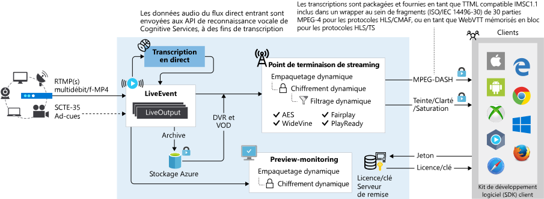

# Événements en direct et sorties en direct dans Media Services

Azure Media Services vous permet de transmettre des événements en direct auprès de vos clients dans le cloud Azure. Pour configurer vos événements de streaming en direct dans Media Services v3, vous devez comprendre les concepts abordés dans cet article.

> [!TIP]
> Pour les clients migrant depuis les API de Media Services v2, l’entité **Live Event** remplace **Channel** dans la version 2 et **Live Output** remplace **Program**.

## Événements en direct

Les [événements en direct](/rest/api/media/liveevents) sont chargés de la réception et du traitement des flux vidéo en direct. Quand vous créez un événement en direct, un point de terminaison d’entrée primaire et secondaire est également créé. Vous pouvez utiliser ce point de terminaison pour envoyer un signal en direct à partir d’un encodeur à distance. L’encodeur live à distance envoie le flux de contribution à ce point de terminaison d’entrée par le biais du protocole d’entrée [RTMP](https://www.adobe.com/devnet/rtmp.html) ou [Smooth Streaming](/openspecs/windows_protocols/ms-sstr/8383f27f-7efe-4c60-832a-387274457251) (MP4 fragmenté). Pour le protocole de réception RTMP, le contenu peut être envoyé en clair (`rtmp://`) ou chiffré pour plus de sécurité sur la connexion filaire (`rtmps://`). Pour le protocole de réception Smooth Streaming, les schémas d’URL pris en charge sont `http://` ou `https://`.  

## Types d’événements en direct

Un [événement en direct](/rest/api/media/liveevents) peut être défini sur *Pass-through* (un encodeur live local envoie un flux à débit binaire multiple) ou sur *Live Encoding* (un encodeur live local envoie un flux à débit binaire unique). Durant la création, les types sont définis à l’aide de [LiveEventEncodingType](/rest/api/media/liveevents/create#liveeventencodingtype) :

* **LiveEventEncodingType.None** : Un encodeur live local envoie un flux à débit binaire multiple. Le flux reçu transite par l’événement en direct sans traitement supplémentaire. Également appelé le mode pass-through.
* **LiveEventEncodingType.Standard** : Un encodeur live local envoie un flux à débit unique à l’Événement en direct, puis Media Services crée des flux à débits multiples. Si la résolution du flux de contribution est de 720p ou plus, la présélection **Default720p** encode un jeu de 6 paires résolution/débits.
* **LiveEventEncodingType.Premium1080p** : Un encodeur live local envoie un flux à débit unique à l’Événement en direct, puis Media Services crée des flux à débits multiples. La présélection Default1080p spécifie le jeu de sortie des paires résolution/débits.

### Requête directe

Quand vous utilisez l’**événement en direct** de type pass-through, vous chargez l’encodeur live local de générer un flux vidéo à vitesse de transmission multiple et d’envoyer ce flux comme flux de contribution à l’événement en direct (à l’aide du protocole RTMP ou MP4 fragmenté). L’événement en direct est ensuite transmis dans les flux vidéo entrants sans traitement supplémentaire. Une transmission LiveEvent est optimisée pour les événements en direct de longue durée ou le streaming en direct linéaire sans interruption (24 heures sur 24, 365 jours par an). Si vous créez ce type d’événement en direct, spécifiez le paramètre None (LiveEventEncodingType.None).

Vous pouvez envoyer le flux de contribution à une résolution jusqu’à 4 K et à une fréquence de 60 images/seconde, avec des codecs vidéo H.264/AVC ou H.265/HEVC et des codecs audio AAC (AAC-LC, HE-AACv1 ou HE-AACv2). Pour plus d’informations, consultez [Comparaison des types d’événements en direct](live-event-types-comparison.md).

> [!NOTE]
> La méthode pass-through est le moyen le plus économique de diffuser des vidéos en continu si plusieurs événements vous concernent sur une longue période, et si vous avez déjà investi dans des encodeurs locaux. Consultez les détails de la [tarification](https://azure.microsoft.com/pricing/details/media-services/) .
>

Consultez un exemple de code .NET dans [MediaV3LiveApp](https://github.com/Azure-Samples/media-services-v3-dotnet-core-tutorials/blob/master/NETCore/Live/MediaV3LiveApp/Program.cs#L126).

### Encodage en direct  

Quand vous utilisez Live Encoding avec Media Services, vous configurez votre encodeur live local pour qu’il envoie un flux vidéo à une seule vitesse de transmission comme flux de contribution à l’événement en direct (à l’aide du protocole RTMP ou MP4 fragmenté). Vous configurerez ensuite un événement en direct de sorte qu’il encode ce flux vidéo à une seule vitesse de transmission entrant en [flux vidéo à vitesse de transmission multiple](https://en.wikipedia.org/wiki/Adaptive_bitrate_streaming), pour rendre la transmission et la lecture de la sortie possibles sur les appareils via des protocoles comme MPEG-DASH, HLS et Smooth Streaming.

Lorsque vous utilisez un encodage en direct, vous pouvez envoyer le flux de contribution uniquement aux résolutions jusqu’à 1080p et à une fréquence de 30 images/seconde, avec un codec vidéo H.264/AVC et un codec audio AAC (AAC-LC, HE-AACv1 ou HE-AACv2). Notez que les événements en direct pass-through peut prendre en charge les résolutions jusqu’à 4K à 60 images/seconde. Pour plus d’informations, consultez [Comparaison des types d’événements en direct](live-event-types-comparison.md).

La présélection détermine les résolutions et débits de la sortie émanant de l’encodeur live. Si vous utilisez un encodeur live **Standard** (LiveEventEncodingType.Standard), la présélection *Default720p* spécifie un jeu de six paires résolution/débit, allant de 720p à 3,5 Mbits/s à 192p à 200 kbits/s. Autrement, si vous utilisez un encodeur live **Premium1080p** (LiveEventEncodingType.Premium1080p), la présélection *Default1080p* spécifie un jeu de six paires résolution/débit, allant de 1080p à 3,5 Mbits/s à 180p à 200 kbits/s. Pour plus d’informations, consultez [Présélections système](live-event-types-comparison.md#system-presets).

> [!NOTE]
> Si vous avez besoin de personnaliser la présélection d’encodage live, ouvrez un ticket de support sur le Portail Azure. Spécifiez la table de résolution et de débits binaires souhaitée. Vérifiez qu’il n’existe qu’un calque à 720p (si vous demandez un préréglage pour un encodeur live Standard) ou à 1080p (si vous demandez un préréglage pour un encodeur live Premium1080p). Le nombre maximal de calques est de 6.

## Création d’événements en direct

### Options

Quand vous créez un événement en direct, vous pouvez spécifier les options suivantes :

* Protocole de streaming de l’événement en direct (les protocoles RTMP et Smooth Streaming sont actuellement pris en charge). Vous ne pouvez pas changer l’option de protocole pendant l’exécution de l’événement en direct ou des sorties en direct qui lui sont associées. Si vous avez besoin d’autres protocoles, créez des événements en direct distincts pour chaque protocole de streaming.  
* Lors de la création de l’événement, vous pouvez spécifier qu’il démarre automatiquement.  Lorsque le démarrage automatique est défini sur true, l’événement en direct démarre après sa création. La facturation commence donc dès que son exécution démarre. Vous devez appeler explicitement la commande Stop sur la ressource de l’événement en direct pour arrêter toute facturation supplémentaire. Sinon, lancez-le dès que vous souhaitez commencer le streaming.

    Pour plus d’informations, consultez [États et facturation des événements en direct](live-event-states-billing.md).

* Restictions IP sur l’ingestion et la préversion. Vous pouvez définir les adresses IP autorisées à recevoir du contenu vidéo sur cet événement en direct. Les adresses IP autorisées peuvent être définies sous forme d’adresse IP unique (par exemple, « 10.0.0.1 »), de plage d’adresses IP constituée d’une adresse IP et d’un masque de sous-réseau CIDR (par exemple, « 10.0.0.1/22 ») ou de plage d’adresses IP constituée d’une adresse IP et d’un masque de sous-réseau au format décimal séparé par des points (par exemple, « 10.0.0.1(255.255.252.0) »). Si aucune adresse IP n’est spécifiée et qu’il n’existe pas de définition de règle, alors aucune adresse IP ne sera autorisée. Pour autoriser toutes les adresses IP, créez une règle et définissez la valeur 0.0.0.0/0. Les adresses IP doivent utiliser un des formats suivants : adresses IPv4 à quatre chiffres ou plage d’adresses CIDR.

    Si vous souhaitez activer certaines adresses IP sur vos propres pare-feu ou si vous souhaitez limiter les entrées à vos événements en direct à des adresses IP Azure, téléchargez un fichier JSON à partir de [Plages d’adresses IP du centre de données Azure ](https://www.microsoft.com/download/details.aspx?id=41653). Pour plus d’informations sur ce fichier, sélectionnez la section **Détails** de la page.
    
* Lors de la création de l’événement, vous pouvez choisir d’activer les transcriptions en direct.   Par défaut, la transcription en direct est désactivée. Vous ne pouvez pas changer cette propriété pendant l’exécution de l’événement en direct ou des sorties en direct qui lui sont associées. 

### Règles d’affectation des noms

* Le nom de l’événement en direct peut contenir au maximum 32 caractères.
* Le nom doit suivre ce modèle [regex](/dotnet/standard/base-types/regular-expression-language-quick-reference) : `^[a-zA-Z0-9]+(-*[a-zA-Z0-9])*$`.

Consultez également les [conventions de nommage des points de terminaison de streaming](streaming-endpoint-concept.md#naming-convention).

> [!TIP]
> Pour garantir l’unicité du nom de votre événement en direct, vous pouvez générer un GUID, puis supprimer tous les traits d’union et les accolades (le cas échéant). La chaîne sera unique pour tous les événements en direct et sa longueur sera de 32 caractères.

## URL de réception des événements en direct

Une fois l’événement en direct créé, vous pouvez obtenir des URL de réception que vous devez fournir à l’encodeur live local. L’encodeur live utilise ces URL pour entrer un flux temps réel. Pour plus d’informations, consultez [Encodeurs live locaux recommandés](recommended-on-premises-live-encoders.md).

Vous pouvez utiliser des URL de redirection ou de non-redirection vers un microsite.

> [!NOTE] 
> Pour qu’une URL de réception soit prédictive, réglez le mode « personnel ».

* URL de non-redirection vers un microsite

    L’URL de non-redirection vers un microsite est le mode par défaut dans Media Services v3. Vous obtenez éventuellement l’événement en direct rapidement, mais l’URL de réception est connue uniquement quand l’événement en direct est démarré. L’URL change si vous arrêtez/démarrez l’événement en direct.  La non-redirection vers un microsite est utile dans les scénarios quand un utilisateur final souhaite diffuser à l’aide d’une application là où l’application souhaite obtenir un événement en direct dès que possible et qu’une URL de réception dynamique n’est pas un problème.

    Si une application cliente n’a pas besoin de prégénérer une URL de réception avant la création de l’événement en direct, laissez simplement Media Services générer automatiquement le jeton d’accès pour l’événement en direct.

* URL de redirection vers un microsite

    Le mode de redirection vers un microsite est préféré par les diffuseurs multimédias importants qui utilisent des encodeurs de diffusion matériels et ne veulent pas reconfigurer leurs encodeurs quand ils démarrent l’événement en direct. Ces diffuseurs veulent une URL de réception prédictive qui ne change pas au fil du temps.
    
    > [!NOTE]
    > Sur le portail Azure, l'URL de redirection vers un microsite est nommée « *URL d'entrée persistante* ».

    Pour spécifier ce mode dans l'API, définissez `vanityUrl` sur `true` au moment de la création (valeur par défaut : `false`). Vous devez également transmettre votre jeton d’accès (`LiveEventInput.accessToken`) lors de la création. Vous spécifiez la valeur du jeton pour éviter qu’un jeton aléatoire soit inséré dans l’URL. Le jeton d’accès doit être une chaîne GUID valide (avec ou sans traits d’union). Une fois défini, le mode ne peut pas être mis à jour.

    Le jeton d’accès doit être unique dans votre centre de données. Si votre application doit utiliser une URL personnelle, il est recommandé de toujours créer une nouvelle instance GUID pour votre jeton d’accès (au lieu de réutiliser un GUID existant).

    Utiliser les API suivantes pour activer l’URL personnelle et de définir le jeton d’accès sur un GUID valide (par exemple `"accessToken": "1fce2e4b-fb15-4718-8adc-68c6eb4c26a7"`).  

    |Langage|Activer une URL de redirection vers un microsite|Définir le jeton d’accès|
    |---|---|---|
    |REST|[properties.vanityUrl](/rest/api/media/liveevents/create#liveevent)|[LiveEventInput.accessToken](/rest/api/media/liveevents/create#liveeventinput)|
    |Interface de ligne de commande|[--vanity-url](/cli/azure/ams/live-event?view=azure-cli-latest#az-ams-live-event-create)|[--access-token](/cli/azure/ams/live-event?view=azure-cli-latest#optional-parameters)|
    |.NET|[LiveEvent.VanityUrl](/dotnet/api/microsoft.azure.management.media.models.liveevent.vanityurl?view=azure-dotnet#Microsoft_Azure_Management_Media_Models_LiveEvent_VanityUrl)|[LiveEventInput.AccessToken](/dotnet/api/microsoft.azure.management.media.models.liveeventinput.accesstoken?view=azure-dotnet#Microsoft_Azure_Management_Media_Models_LiveEventInput_AccessToken)|
    
### Règles de nommage de l’URL de réception en direct

* La chaîne *aléatoire* ci-dessous est un nombre hexadécimal de 128 bits (qui se compose de 32 caractères de 0 à 9 et de a à f).
* *votre jeton d’accès* : Chaîne GUID valide que vous définissez lorsque vous utilisez le mode personnel. Par exemple : `"1fce2e4b-fb15-4718-8adc-68c6eb4c26a7"`.
* *nom du flux* : Indique le nom du flux pour une connexion spécifique. La valeur du nom du flux est généralement ajoutée par l’encodeur live que vous utilisez. Vous pouvez configurer l’encodeur live pour qu’il utilise n’importe quel nom afin de décrire la connexion, par exemple : « video1_audio1 », « video2_audio1 », « stream ».

#### URL de non-redirection vers un microsite

##### RTMP

`rtmp://<random 128bit hex string>.channel.media.azure.net:1935/live/<auto-generated access token>/<stream name>` 
`rtmp://<random 128bit hex string>.channel.media.azure.net:1936/live/<auto-generated access token>/<stream name>` 
`rtmps://<random 128bit hex string>.channel.media.azure.net:2935/live/<auto-generated access token>/<stream name>` 
`rtmps://<random 128bit hex string>.channel.media.azure.net:2936/live/<auto-generated access token>/<stream name>` 

##### Smooth Streaming

`http://<random 128bit hex string>.channel.media.azure.net/<auto-generated access token>/ingest.isml/streams(<stream name>)` 
`https://<random 128bit hex string>.channel.media.azure.net/<auto-generated access token>/ingest.isml/streams(<stream name>)` 

#### URL de redirection vers un microsite

##### RTMP

`rtmp://<live event name>-<ams account name>-<region abbrev name>.channel.media.azure.net:1935/live/<your access token>/<stream name>` 
`rtmp://<live event name>-<ams account name>-<region abbrev name>.channel.media.azure.net:1936/live/<your access token>/<stream name>` 
`rtmps://<live event name>-<ams account name>-<region abbrev name>.channel.media.azure.net:2935/live/<your access token>/<stream name>` 
`rtmps://<live event name>-<ams account name>-<region abbrev name>.channel.media.azure.net:2936/live/<your access token>/<stream name>` 

##### Smooth Streaming

`http://<live event name>-<ams account name>-<region abbrev name>.channel.media.azure.net/<your access token>/ingest.isml/streams(<stream name>)` 
`https://<live event name>-<ams account name>-<region abbrev name>.channel.media.azure.net/<your access token>/ingest.isml/streams(<stream name>)` 

## URL de l’aperçu des événements en direct

Une fois que l’événement en direct commence à recevoir le flux de contribution, vous pouvez utiliser son point de terminaison d’aperçu pour prévisualiser et valider le flux temps réel que vous recevez avant de continuer la publication. Après avoir vérifié que le flux d’aperçu est correct, vous pouvez utiliser l’événement en direct pour rendre le flux temps réel diffusable via un ou plusieurs points de terminaison de streaming (créés au préalable). Pour cela, créez une [sortie en direct](/rest/api/media/liveoutputs) sur l’événement en direct.

> [!IMPORTANT]
> Veillez à ce que la vidéo transite par l’URL d’aperçu avant de poursuivre !

## Opérations de longue durée d’un événement en direct

Pour plus de détails, consultez [Opérations de longue durée](media-services-apis-overview.md#long-running-operations).

## Sorties en direct

Une fois que le flux transite dans l’événement en direct, vous pouvez commencer l’événement de streaming en créant un [actif multimédia](/rest/api/media/assets), une [sortie en direct](/rest/api/media/liveoutputs) et un [localisateur de streaming](/rest/api/media/streaminglocators). La sortie en direct archive le flux et le met à la disposition des observateurs via le [point de terminaison de streaming](/rest/api/media/streamingendpoints).  

Pour plus d’informations sur les sorties en direct, consultez [Utiliser un magnétoscope numérique cloud](live-event-cloud-dvr.md).

## Forum aux questions

Consultez l’article [Foire aux questions](frequently-asked-questions.md#live-streaming).

## Questions et actualités

Découvrez l’article [Communauté Azure Media Services](media-services-community.md) pour découvrir les différentes façons dont vous pouvez poser des questions, faire des commentaires et obtenir des mises à jour sur Media Services.

## Étapes suivantes

[Didacticiel sur le streaming en direct](stream-live-tutorial-with-api.md)
