# Créer un stream en direct Azure Media Services

[!INCLUDE [media services api v3 logo](./includes/v3-hr.md)]

Ce guide de démarrage rapide vous permet de créer un stream en direct Azure Media Services à l’aide du portail Azure et de Telestream Wirecast. Il suppose que vous disposez d’un abonnement Azure et que vous avez créé un compte Media Services.

Si vous n’avez pas d’abonnement Azure, créez un [compte gratuit](https://azure.microsoft.com/free/) avant de commencer.

## Connectez-vous au portail Azure.

Ouvrez votre navigateur web et accédez au [portail Microsoft Azure](https://portal.azure.com/). Entrez vos informations d’identification pour vous connecter au portail. Il s’ouvre par défaut sur le tableau de bord des services.

Dans ce guide de démarrage rapide, nous allons aborder les points suivants :

- Configuration d’un encodeur local avec un essai gratuit de Telestream Wirecast
- Configuration d’un stream en direct
- Configuration de sorties de stream en direct
- Exécution d’un point de terminaison de streaming par défaut
- Utilisation du Lecteur multimédia Azure pour afficher le stream en direct et la sortie à la demande

Pour simplifier les choses, nous allons utiliser un encodage prédéfini pour Azure Media Services dans Wirecast, l’encodage cloud par transfert direct et RTMP.

## Configurer un encodeur local avec Wirecast

1. Téléchargez Wirecast pour votre système d’exploitation sur le [site web Telestream](https://www.telestream.net) et installez-le.
1. Démarrez l’application et utilisez votre adresse e-mail préférée pour inscrire le produit. Laissez l’application ouverte.
1. Dans l’e-mail que vous recevez, vérifiez votre adresse e-mail. L’application démarre ensuite l’essai gratuit.
1. Recommandé : Regardez le tutoriel vidéo dans l’écran d’ouverture de l’application.

## Configurer un stream en direct Azure Media Services

1. Accédez au compte Azure Media Services dans le portail, puis sélectionnez **Streaming en direct** dans la liste **Media Services**.

   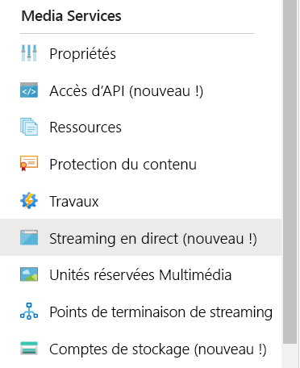
1. Sélectionnez **Ajouter un événement en direct** pour créer un événement de streaming en direct.

   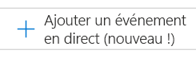
1. Entrez un nom pour le nouvel événement, par exemple *TestLiveEvent*, dans la zone **Nom de l’événement en direct**.

   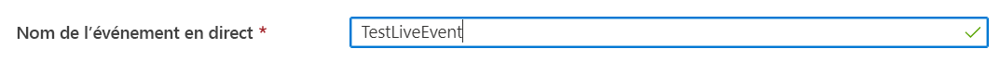
1. Entrez une description de l’événement dans la zone **Description** (facultatif).
1. Sélectionnez l’option **Transfert direct - pas d’encodage cloud**.

   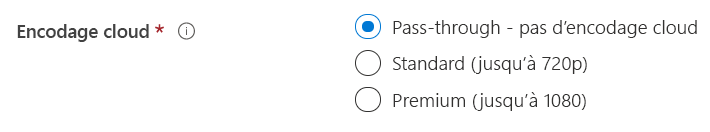
1. Sélectionnez l’option **RTMP**.
1. Vérifiez que l’option **Non** est sélectionnée pour **Démarrer l’événement en direct** afin d’éviter la facturation de l’événement en direct avant qu’il ne soit prêt. (La facturation commence au démarrage de l’événement en direct.)

   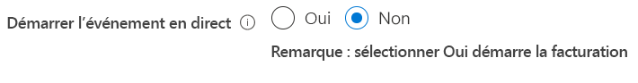
1. Sélectionnez le bouton **Vérifier + créer** pour passer en revue les paramètres.
1. Sélectionnez le bouton **Créer** pour créer l’événement en direct. Vous êtes ensuite redirigé vers la liste des événements en direct.
1. Sélectionnez le lien vers l’événement en direct que vous venez de créer. Notez que votre événement est arrêté.
1. Laissez cette page ouverte dans votre navigateur. Nous y reviendrons plus tard.

## Configurer un stream en direct avec Wirecast Studio

1. Dans l’application Wirecast, sélectionnez **Create Empty Document** dans le menu principal, puis sélectionnez **Continue**.

   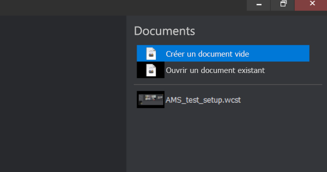
1. Pointez sur la première couche dans la zone des **couches Wirecast**.  Sélectionnez l’icône d’**ajout** qui s’affiche, puis sélectionnez l’entrée vidéo que vous voulez diffuser.

   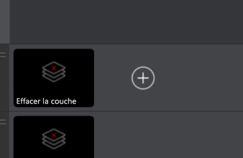

   La boîte de dialogue **Master Layer 1** s’affiche.
1. Sélectionnez **Video Capture** dans le menu, puis sélectionnez l’appareil photo que vous voulez utiliser.

   

   La vue de l’appareil photo s’affiche dans la zone d’aperçu.
1. Pointez sur la deuxième couche dans la zone des **couches Wirecast**. Sélectionnez l’icône d’**ajout** qui s’affiche, puis sélectionnez l’entrée audio que vous voulez diffuser. La boîte de dialogue **Master Layer 2** s’affiche.
1. Sélectionnez **Audio capture** dans le menu, puis sélectionnez l’entrée audio que vous voulez utiliser.

   
1. Dans le menu principal, sélectionnez **Paramètres de sortie**. La boîte de dialogue **Select an Output Destination** s’affiche.
1. Sélectionnez **Azure Media Services** dans la liste déroulante **Destination**. Le paramètre de sortie pour Azure Media Services renseigne automatiquement *la plupart* des paramètres de sortie.

   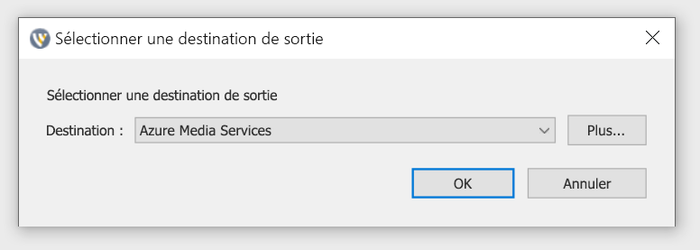

Dans le cadre de la procédure suivante, vous allez revenir à Azure Media Services dans votre navigateur pour copier l’URL d’entrée à indiquer dans les paramètres de sortie :

1. Dans la page Azure Media Services du portail, sélectionnez **Démarrer** pour démarrer l’événement de stream en direct. (La facturation commence maintenant.)

   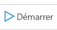
2. Positionnez le bouton bascule **Sécurisé/Non sécurisé** sur **Non sécurisé**. Cette étape permet de définir le protocole sur RTMP au lieu de RTMPS.
3. Copiez l’URL de la zone **URL d’entrée** dans le Presse-papiers.

   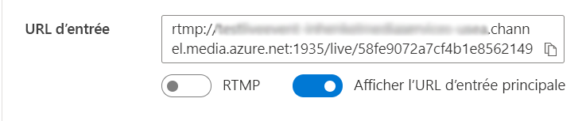
4. Basculez vers l’application Wirecast, puis collez l’**URL d’entrée** dans la zone **Address** dans les paramètres de sortie.

   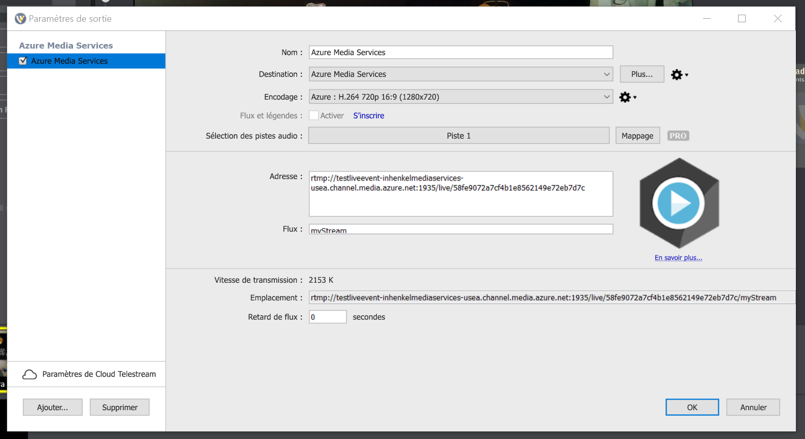
5. Sélectionnez **OK**.

## Configurer les sorties

Cette partie configure vos sorties et vous permet d’enregistrer un enregistrement de votre stream en direct.  

> [!NOTE]
> Pour que vous puissiez diffuser cette sortie, le point de terminaison de streaming doit être en cours d’exécution. Consultez la section [Exécuter le point de terminaison de streaming par défaut](#run-the-default-streaming-endpoint) plus bas.

1. Sélectionnez le lien **Create outputs** sous la visionneuse de vidéo **Outputs**.
1. Si vous le souhaitez, remplacez le nom de la sortie dans la zone **Name** par un nom plus convivial, plus facile à rechercher ultérieurement.
   
   
1. Ne modifiez aucune des autres zones pour le moment.
1. Sélectionnez **Next** pour ajouter un localisateur de streaming.
1. Si vous le souhaitez, remplacez le nom du localisateur par un nom plus convivial.
   
   
1. Ne changez rien d’autre sur cet écran pour le moment.
1. Sélectionnez **Create** (Créer).

## Démarrer la diffusion

1. Dans Wirecast, sélectionnez **Output** > **Start / Stop Broadcasting** > **Start Azure Media Services : Azure Media Services** dans le menu principal.

   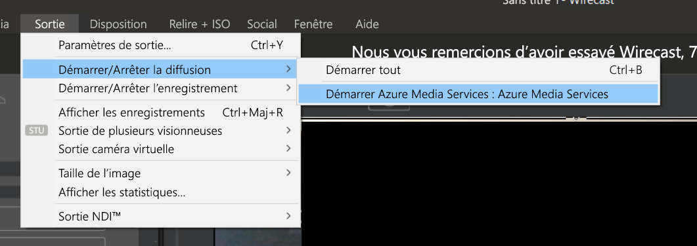

   Quand le flux est envoyé à l’événement en direct, la fenêtre **Live** de Wirecast s’affiche dans le lecteur vidéo, sur la page des événements en direct dans Azure Media Services.

1. Sélectionnez le bouton **Go** sous la fenêtre d’aperçu pour commencer la diffusion de la vidéo et de l’audio que vous avez sélectionnés pour les couches Wirecast.

   

   > [!TIP]
   > En cas d’erreur, essayez de recharger le lecteur en sélectionnant le lien **Recharger le lecteur** situé au-dessus du lecteur.

## Exécuter le point de terminaison de streaming par défaut

1. Sélectionnez **Points de terminaison de streaming** dans la liste Media Services.

   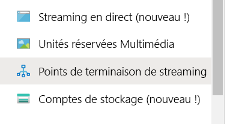
1. Si l’état du point de terminaison de streaming par défaut est arrêté, sélectionnez-le. Cette étape vous fait accéder à la page de ce point de terminaison.
1. Sélectionnez **Démarrer**.
   
   

## Lire la diffusion de la sortie avec le Lecteur multimédia Azure

1. Copiez l’URL de streaming sous le lecteur vidéo de **Sortie**.
1. Dans un navigateur web, ouvrez la [démonstration du Lecteur multimédia Azure](https://ampdemo.azureedge.net/azuremediaplayer.html).
1. Collez l’URL de streaming dans la zone **URL** du Lecteur multimédia Azure.
1. Sélectionnez le bouton **Mettre à jour le lecteur**.
1. Sélectionnez l’icône **Lire** sur la vidéo pour voir le stream en direct.

## Arrêter la diffusion

Quand vous pensez avoir diffusé suffisamment de contenu, arrêtez la diffusion.

1. Dans Wirecast, sélectionnez le bouton **Broadcast**. Cette étape arrête la diffusion à partir de Wirecast.
1. Dans le portail, sélectionnez **Arrêter**. Un message d’avertissement s’affiche, indiquant que le stream en direct va s’arrêter, mais que la sortie va devenir un actif multimédia à la demande.
1. Sélectionnez **Arrêter** dans le message d’avertissement. Le Lecteur multimédia Azure affiche désormais une erreur, car le stream en direct n’est plus disponible.

## Lire la sortie à la demande avec le Lecteur multimédia Azure

La sortie que vous avez créée est désormais disponible pour le streaming à la demande tant que votre point de terminaison de streaming est en cours d’exécution.

1. Accédez à la liste Media Services, puis sélectionnez **Actifs multimédias**.
1. Recherchez la sortie d’événement que vous avez créée précédemment et sélectionnez le lien vers l’actif multimédia. La page de sortie de l’actif multimédia s’ouvre.
1. Copiez l’URL de streaming sous le lecteur vidéo de l’actif multimédia.
1. Revenez au Lecteur multimédia Azure dans le navigateur et collez l’URL de streaming dans la zone URL.
1. Sélectionnez **Update Player (Mettre à jour le lecteur)** .
1. Sélectionnez l’icône **Lire** sur la vidéo pour voir l’actif multimédia à la demande.

## Nettoyer les ressources

> [!IMPORTANT]
> Arrêtez les services ! Après avoir effectué les étapes de ce guide de démarrage rapide, veillez à arrêter l’événement en direct et le point de terminaison de streaming. Sinon, vous serez facturé pour la durée pendant laquelle leur exécution se poursuit. Pour arrêter l’événement en direct, reportez-vous aux étapes 2 et 3 de la procédure [Arrêter la diffusion](#stop-the-broadcast).

Pour arrêter le point de terminaison de streaming :

1. Dans la liste Media Services, sélectionnez **Points de terminaison de streaming**.
2. Sélectionnez le point de terminaison de streaming par défaut que vous avez démarré précédemment. Cette étape ouvre la page du point de terminaison.
3. Sélectionnez **Arrêter**.

> [!TIP]
> Si vous ne voulez pas conserver les actifs multimédias de cet événement, veillez à les supprimer pour éviter une facturation du stockage.

## Étapes suivantes
> [!div class="nextstepaction"]
> [Événements en direct et sorties en direct dans Media Services](./live-events-outputs-concept.md)
