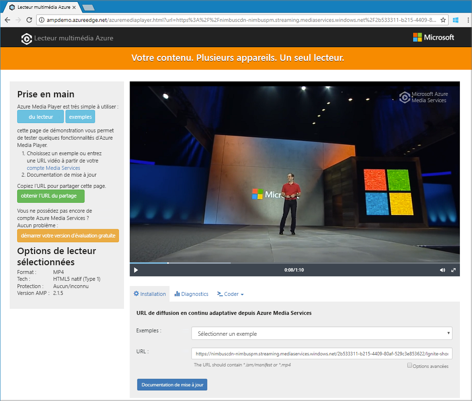

# <a name="tutorial-encode-a-remote-file-based-on-url-and-stream-the-video---azure-cli"></a>Tutoriel : Encoder un fichier distant basé sur une URL et diffuser la vidéo en streaming - Azure CLI

[!INCLUDE [media services api v3 logo](./includes/v3-hr.md)]

Ce tutoriel vous montre combien il est facile d’encoder et de diffuser en continu des vidéos sur divers navigateurs et appareils à l’aide d’Azure Media Services et d’Azure CLI. Vous pouvez spécifier un contenu d’entrée à l’aide d’URL HTTPS ou SAP ou de chemins d’accès aux fichiers situés dans le Stockage Blob Azure.

Dans cet article, l’exemple encode du contenu que vous mettez à disposition via une URL HTTPS. Media Services v3 ne prend pas en charge actuellement l’encodage de transfert mémorisé en bloc sur les URL HTTPS.

À la fin de ce tutoriel, vous serez en mesure de diffuser en continu une vidéo.  



[!INCLUDE [quickstarts-free-trial-note](../../../includes/quickstarts-free-trial-note.md)]

## <a name="create-a-media-services-account"></a>Créer un compte Media Services

Avant que vous puissiez commencer à chiffrer, encoder, analyser, gérer et diffuser en streaming du contenu multimédia dans Azure, vous devez créer un compte Media Services. Ce compte doit être associé à un ou plusieurs comptes de stockage.

Votre compte Media Services et tous les comptes de stockage associés doivent faire partie du même abonnement Azure. Nous vous recommandons d’utiliser des comptes de stockage situés au même emplacement que le compte Media Services afin de limiter la latence et les frais liés à la sortie des données.

### <a name="create-a-resource-group"></a>Créer un groupe de ressources

```azurecli-interactive
az group create -n amsResourceGroup -l westus2
```

### <a name="create-an-azure-storage-account"></a>Créer un compte de stockage Azure

Dans cet exemple, vous allez créer un compte LRS standard v2 à usage général.

Si vous voulez faire des expériences avec des comptes de stockage, utilisez `--sku Standard_LRS`. Lorsque vous sélectionnez une référence SKU pour la production, envisagez d’utiliser `--sku Standard_RAGRS`, qui offre la réplication géographique pour la continuité de l’activité. Pour plus d’informations, consultez [Comptes de stockage](/cli/azure/storage/account).

```azurecli-interactive
az storage account create -n amsstorageaccount --kind StorageV2 --sku Standard_LRS -l westus2 -g amsResourceGroup
```

### <a name="create-an-azure-media-services-account"></a>Créer un compte Azure Media Services

```azurecli-interactive
az ams account create --n amsaccount -g amsResourceGroup --storage-account amsstorageaccount -l westus2
```

La réponse ressemble à ceci :

```
{
  "id": "/subscriptions/<id>/resourceGroups/amsResourceGroup/providers/Microsoft.Media/mediaservices/amsaccount",
  "location": "West US 2",
  "mediaServiceId": "8b569c2e-d648-4fcb-9035-c7fcc3aa7ddf",
  "name": "amsaccount",
  "resourceGroup": "amsResourceGroupTest",
  "storageAccounts": [
    {
      "id": "/subscriptions/<id>/resourceGroups/amsResourceGroup/providers/Microsoft.Storage/storageAccounts/amsstorageaccount",
      "resourceGroup": "amsResourceGroupTest",
      "type": "Primary"
    }
  ],
  "tags": null,
  "type": "Microsoft.Media/mediaservices"
}
```

## <a name="start-the-streaming-endpoint"></a>Démarrer le point de terminaison de streaming

La commande Azure CLI suivante démarre le **point de terminaison de streaming** par défaut.

```azurecli-interactive
az ams streaming-endpoint start  -n default -a amsaccount -g amsResourceGroup
```

La réponse ressemble à ceci :

```
{
  "accessControl": null,
  "availabilitySetName": null,
  "cdnEnabled": true,
  "cdnProfile": "AzureMediaStreamingPlatformCdnProfile-StandardVerizon",
  "cdnProvider": "StandardVerizon",
  "created": "2019-02-06T21:58:03.604954+00:00",
  "crossSiteAccessPolicies": null,
  "customHostNames": [],
  "description": "",
  "freeTrialEndTime": "2019-02-21T22:05:31.277936+00:00",
  "hostName": "amsaccount-usw22.streaming.media.azure.net",
  "id": "/subscriptions/<id>/resourceGroups/amsResourceGroup/providers/Microsoft.Media/mediaservices/amsaccount/streamingendpoints/default",
  "lastModified": "2019-02-06T21:58:03.604954+00:00",
  "location": "West US 2",
  "maxCacheAge": null,
  "name": "default",
  "provisioningState": "Succeeded",
  "resourceGroup": "amsResourceGroup",
  "resourceState": "Running",
  "scaleUnits": 0,
  "tags": {},
  "type": "Microsoft.Media/mediaservices/streamingEndpoints"
}
```

Si le point de terminaison de streaming est déjà en cours d’exécution, vous obtenez ce message :

```
(InvalidOperation) The server cannot execute the operation in its current state.
```

## <a name="create-a-transform-for-adaptive-bitrate-encoding"></a>Créer une transformation pour l’encodage à débit adaptatif

Créez une **transformation** pour configurer des tâches courantes d’encodage ou d’analyse des vidéos. Dans cet exemple, vous allez effectuer un encodage à débit adaptatif. Ensuite, vous allez envoyer un travail sous la transformation que vous avez créée. Le travail est la demande envoyée à Media Services pour appliquer la transformation à un contenu vidéo ou audio donné.

```azurecli-interactive
az ams transform create --name testEncodingTransform --preset AdaptiveStreaming --description 'a simple Transform for Adaptive Bitrate Encoding' -g amsResourceGroup -a amsaccount
```

La réponse ressemble à ceci :

```
{
  "created": "2019-02-15T00:11:18.506019+00:00",
  "description": "a simple Transform for Adaptive Bitrate Encoding",
  "id": "/subscriptions/<id>/resourceGroups/amsResourceGroup/providers/Microsoft.Media/mediaservices/amsaccount/transforms/testEncodingTransform",
  "lastModified": "2019-02-15T00:11:18.506019+00:00",
  "name": "testEncodingTransform",
  "outputs": [
    {
      "onError": "StopProcessingJob",
      "preset": {
        "odatatype": "#Microsoft.Media.BuiltInStandardEncoderPreset",
        "presetName": "AdaptiveStreaming"
      },
      "relativePriority": "Normal"
    }
  ],
  "resourceGroup": "amsResourceGroup",
  "type": "Microsoft.Media/mediaservices/transforms"
}
```

## <a name="create-an-output-asset"></a>Créer une ressource de sortie

Créez un **élément multimédia** de sortie qui est utilisé comme sortie du travail d’encodage.

```azurecli-interactive
az ams asset create -n testOutputAssetName -a amsaccount -g amsResourceGroup
```

La réponse ressemble à ceci :

```
{
  "alternateId": null,
  "assetId": "96427438-bbce-4a74-ba91-e38179b72f36",
  "container": null,
  "created": "2019-02-14T23:58:19.127000+00:00",
  "description": null,
  "id": "/subscriptions/<id>/resourceGroups/amsResourceGroup/providers/Microsoft.Media/mediaservices/amsaccount/assets/testOutputAssetName",
  "lastModified": "2019-02-14T23:58:19.127000+00:00",
  "name": "testOutputAssetName",
  "resourceGroup": "amsResourceGroup",
  "storageAccountName": "amsstorageaccount",
  "storageEncryptionFormat": "None",
  "type": "Microsoft.Media/mediaservices/assets"
}
```

## <a name="start-a-job-by-using-https-input"></a>Démarrer un travail à l’aide d’une entrée HTTPS

Lorsque vous soumettez des travaux pour traiter des vidéos, vous devez indiquer à Media Services où trouver la vidéo d’entrée. Une option consiste à spécifier une URL HTTPS comme entrée de travail (comme illustré dans cet exemple).

Quand vous exécutez `az ams job start`, vous pouvez définir une étiquette sur la sortie du travail. Vous pouvez ensuite utiliser l’étiquette pour identifier l’objectif de cet élément multimédia de sortie.

- Si vous affectez une valeur à l’étiquette, définissez « --output-assets » sur « assetname=label ».
- Si vous n’affectez pas de valeur à l’étiquette, définissez « --output-assets » sur « assetname= ».

  Notez que vous ajoutez « = » à `output-assets`.

```azurecli-interactive
az ams job start --name testJob001 --transform-name testEncodingTransform --base-uri 'https://nimbuscdn-nimbuspm.streaming.mediaservices.windows.net/2b533311-b215-4409-80af-529c3e853622/' --files 'Ignite-short.mp4' --output-assets testOutputAssetName= -a amsaccount -g amsResourceGroup
```

La réponse ressemble à ceci :

```
{
  "correlationData": {},
  "created": "2019-02-15T05:08:26.266104+00:00",
  "description": null,
  "id": "/subscriptions/<id>/resourceGroups/amsResourceGroup/providers/Microsoft.Media/mediaservices/amsaccount/transforms/testEncodingTransform/jobs/testJob001",
  "input": {
    "baseUri": "https://nimbuscdn-nimbuspm.streaming.mediaservices.windows.net/2b533311-b215-4409-80af-529c3e853622/",
    "files": [
      "Ignite-short.mp4"
    ],
    "label": null,
    "odatatype": "#Microsoft.Media.JobInputHttp"
  },
  "lastModified": "2019-02-15T05:08:26.266104+00:00",
  "name": "testJob001",
  "outputs": [
    {
      "assetName": "testOutputAssetName",
      "error": null,
      "label": "",
      "odatatype": "#Microsoft.Media.JobOutputAsset",
      "progress": 0,
      "state": "Queued"
    }
  ],
  "priority": "Normal",
  "resourceGroup": "amsResourceGroup",
  "state": "Queued",
  "type": "Microsoft.Media/mediaservices/transforms/jobs"
}
```

### <a name="check-status"></a>Vérification du statut

5 minutes plus tard, vérifiez l’état du travail. L’état doit être défini sur « Terminé ». Si ce n’est pas le cas, revérifiez quelques minutes plus tard. Une fois que l’état est « Terminé », passez à l’étape suivante et créez un **localisateur de streaming**.

```azurecli-interactive
az ams job show -a amsaccount -g amsResourceGroup -t testEncodingTransform -n testJob001
```

## <a name="create-a-streaming-locator-and-get-a-path"></a>Créer un localisateur de streaming et obtenir un chemin

Une fois l’encodage terminé, l’étape suivante consiste rendre la vidéo dans la sortie disponible pour lecture par des clients. Pour ce faire, commencez par créer un localisateur de streaming. Ensuite, générez des URL de streaming que les clients peuvent utiliser.

### <a name="create-a-streaming-locator"></a>Créer un localisateur de diffusion en continu

```azurecli-interactive
az ams streaming-locator create -n testStreamingLocator --asset-name testOutputAssetName --streaming-policy-name Predefined_ClearStreamingOnly  -g amsResourceGroup -a amsaccount 
```

La réponse ressemble à ceci :

```
{
  "alternativeMediaId": null,
  "assetName": "output-3b6d7b1dffe9419fa104b952f7f6ab76",
  "contentKeys": [],
  "created": "2019-02-15T04:35:46.270750+00:00",
  "defaultContentKeyPolicyName": null,
  "endTime": "9999-12-31T23:59:59.999999+00:00",
  "id": "/subscriptions/<id>/resourceGroups/amsResourceGroup/providers/Microsoft.Media/mediaservices/amsaccount/streamingLocators/testStreamingLocator",
  "name": "testStreamingLocator",
  "resourceGroup": "amsResourceGroup",
  "startTime": null,
  "streamingLocatorId": "e01b2be1-5ea4-42ca-ae5d-7fe704a5962f",
  "streamingPolicyName": "Predefined_ClearStreamingOnly",
  "type": "Microsoft.Media/mediaservices/streamingLocators"
}
```

### <a name="get-streaming-locator-paths"></a>Obtenir des chemins de localisateur de streaming

```azurecli-interactive
az ams streaming-locator get-paths -a amsaccount -g amsResourceGroup -n testStreamingLocator
```

La réponse ressemble à ceci :

```
{
  "downloadPaths": [],
  "streamingPaths": [
    {
      "encryptionScheme": "NoEncryption",
      "paths": [
        "/e01b2be1-5ea4-42ca-ae5d-7fe704a5962f/ignite.ism/manifest(format=m3u8-aapl)"
      ],
      "streamingProtocol": "Hls"
    },
    {
      "encryptionScheme": "NoEncryption",
      "paths": [
        "/e01b2be1-5ea4-42ca-ae5d-7fe704a5962f/ignite.ism/manifest(format=mpd-time-csf)"
      ],
      "streamingProtocol": "Dash"
    },
    {
      "encryptionScheme": "NoEncryption",
      "paths": [
        "/e01b2be1-5ea4-42ca-ae5d-7fe704a5962f/ignite.ism/manifest"
      ],
      "streamingProtocol": "SmoothStreaming"
    }
  ]
}
```

Copiez le chemin HTTP live Streaming (HLS). Dans ce cas, il s’agit de `/e01b2be1-5ea4-42ca-ae5d-7fe704a5962f/ignite.ism/manifest(format=m3u8-aapl)`.

## <a name="build-the-url"></a>Générer l’URL

### <a name="get-the-streaming-endpoint-host-name"></a>Obtenir le nom d’hôte du point de terminaison de streaming

```azurecli-interactive
az ams streaming-endpoint list -a amsaccount -g amsResourceGroup -n default
```

Copiez la valeur de `hostName`. Dans ce cas, il s’agit de `amsaccount-usw22.streaming.media.azure.net`.

### <a name="assemble-the-url"></a>Assembler l’URL

« https:// » + &lt;valeur de hostName&gt; + &lt;valeur du chemin Hls&gt;

Voici un exemple :

`https://amsaccount-usw22.streaming.media.azure.net/7f19e783-927b-4e0a-a1c0-8a140c49856c/ignite.ism/manifest(format=m3u8-aapl)`

## <a name="test-playback-by-using-azure-media-player"></a>Tester la lecture avec le lecteur multimédia Azure

> [!NOTE]
> Si un lecteur est hébergé sur un site HTTPS, veillez à débuter l’URL par « https ».

1. Ouvrez un navigateur web et accédez à [https://aka.ms/azuremediaplayer/](https://aka.ms/azuremediaplayer/).
2. Dans la zone **URL**, collez l’URL que vous avez créée dans la section précédente. Vous pouvez coller l’URL au format HLS, Dash ou Smooth. Le lecteur multimédia Azure utilise automatiquement un protocole de streaming approprié pour la lecture sur votre appareil.
3. Sélectionnez **Update Player (Mettre à jour le lecteur)** .

>[!NOTE]
>Le lecteur multimédia Azure peut être utilisé pour effectuer des tests, mais ne doit pas être utilisé dans un environnement de production.

## <a name="clean-up-resources"></a>Nettoyer les ressources

Si vous n’avez plus besoin des ressources de votre groupe de ressources, notamment les comptes Media Services et de stockage que vous avez créés dans ce tutoriel rapide, supprimez le groupe de ressources.

Exécutez cette commande Azure CLI :

```azurecli-interactive
az group delete --name amsResourceGroup
```

## <a name="next-steps"></a>Étapes suivantes

[Présentation de Media Services](media-services-overview.md)
