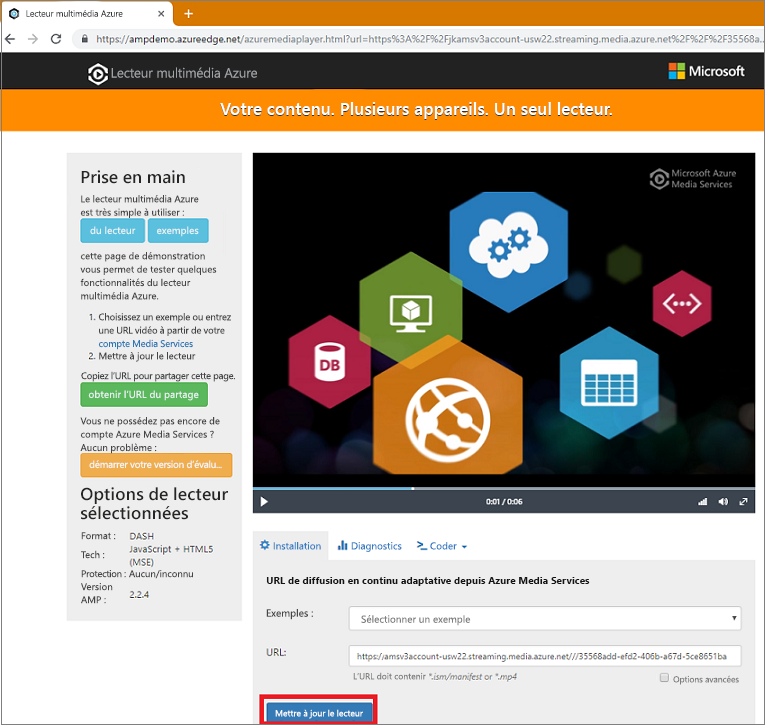

# <a name="tutorial-encode-a-remote-file-based-on-url-and-stream-the-video---nodejs"></a>Tutoriel : Encoder un fichier distant basé sur une URL et diffuser la vidéo en continu - Node.js

Ce tutoriel vous montre combien il est facile de coder et de lancer la diffusion en continu de vidéos sur une grande variété de navigateurs et d’appareils à l’aide d’Azure Media Services. Un contenu d’entrée peut être spécifié à l’aide d’URL HTTPS, d’URL SAP ou de chemins d’accès aux fichiers situés dans le Stockage Blob Azure.

Dans cet article, l’exemple encode du contenu que vous mettez à disposition via une URL HTTPS. Notez qu’AMS v3 ne prend pas en charge l’encodage de transfert mémorisé en bloc sur les URL HTTPS.

À la fin du tutoriel, vous serez en mesure de diffuser en continu une vidéo.  



[!INCLUDE [quickstarts-free-trial-note](../../../includes/quickstarts-free-trial-note.md)]

## <a name="prerequisites"></a>Prérequis

- Installez [Node.js](https://nodejs.org/en/download/)
- [Créer un compte Media Services](create-account-cli-how-to.md).<br/>Veillez à mémoriser les valeurs que vous avez utilisées pour le nom du groupe de ressources et le nom du compte Media Services.
- Suivez les étapes décrites dans [Accéder à l’API Azure Media Services avec Azure CLI](access-api-cli-how-to.md) et enregistrez les informations d’identification. Vous en aurez besoin pour accéder à l’API.

## <a name="download-and-configure-the-sample"></a>Télécharger et configurer l’exemple

Clonez un dépôt GitHub qui contient l’exemple Node.js de streaming sur votre machine à l’aide de la commande suivante :  

 ```bash
 git clone https://github.com/Azure-Samples/media-services-v3-node-tutorials.git
 ```

L’exemple se trouve dans le dossier [StreamFilesSample](https://github.com/Azure-Samples/media-services-v3-node-tutorials/tree/master/AMSv3Samples/StreamFilesSample).

Ouvrez [index.js](https://github.com/Azure-Samples/media-services-v3-node-tutorials/blob/master/AMSv3Samples/StreamFilesSample/index.js#L25) dans le projet téléchargé. Remplacez les valeurs `endpoint config` par les informations d’identification que vous avez obtenues en [accédant aux API](access-api-cli-how-to.md).

L’exemple effectue les actions suivantes :

1. Crée une **transformation** (vérifie d’abord si la transformation spécifiée existe). 
2. Crée un **actif multimédia** de sortie qui est utilisé comme sortie du **travail** d’encodage.
3. Crée l’entrée du **travail** qui est basée sur une URL HTTPS.
4. Soumet le **travail** d’encodage à l’aide de l’entrée et de la sortie créées précédemment.
5. Vérifie l’état du travail.
6. Crée un **localisateur de streaming**.
7. Crée des URL de diffusion en continu.

## <a name="run-the-sample-app"></a>Exécution de l'exemple d'application

1. L’application télécharge des fichiers encodés. Créez un dossier où vous souhaitez placer les fichiers de sortie, et mettez à jour la valeur de la variable **outputFolder** dans le fichier [index.js](https://github.com/Azure-Samples/media-services-v3-node-tutorials/blob/master/AMSv3Samples/StreamFilesSample/index.js#L39).
1. Ouvrez une **invite de commandes**, accédez au répertoire de l’exemple et exécutez les commandes suivantes.

    ```
    npm install 
    node index.js
    ```

Une fois l’exécution terminée, vous devez voir une sortie similaire à celle-ci :


## <a name="test-with-azure-media-player"></a>Test avec Azure Media Player

Pour tester la diffusion en continu, cet article utilise le lecteur multimédia Azure. 

> [!NOTE]
> Si un lecteur est hébergé sur un site https, veillez à mettre à jour l’URL vers « https ».

1. Ouvrez un navigateur web et accédez à [https://aka.ms/azuremediaplayer/](https://aka.ms/azuremediaplayer/).
2. Dans le champ **URL :** , collez l’une des valeurs d’URL de diffusion en continu que vous avez obtenues lors de l’exécution de l’application. 
 
     Vous pouvez coller l’URL dans le format HLS, Dash ou Smooth : le lecteur multimédia Azure passe automatiquement à un protocole de streaming approprié pour la lecture sur votre appareil.
3. Appuyez sur **Mise à jour du Lecteur Windows Media**.

Le lecteur multimédia Azure peut être utilisé pour effectuer des tests, mais ne doit pas être utilisé dans un environnement de production. 

## <a name="clean-up-resources"></a>Nettoyer les ressources

Si vous n’avez plus besoin des ressources de votre groupe de ressources, notamment les comptes Media Services et de stockage que vous avez créés dans ce tutoriel rapide, supprimez le groupe de ressources.

Exécutez la commande CLI suivante :

```azurecli
az group delete --name amsResourceGroup
```

## <a name="see-also"></a>Voir aussi

[Codes d’erreur des tâches](https://docs.microsoft.com/rest/api/media/jobs/get#joberrorcode).

## <a name="next-steps"></a>Étapes suivantes

> [!div class="nextstepaction"]
> [Concepts Media Services](concepts-overview.md)
