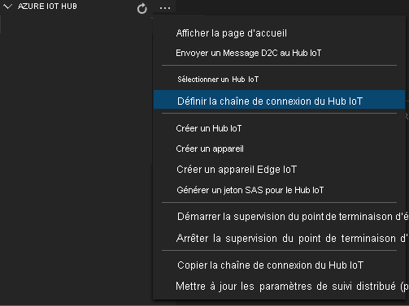

# <a name="tutorial-continuous-video-recording-to-the-cloud-and-playback-from-the-cloud"></a>Tutoriel : Enregistrement vidéo en continu et lecture vidéo dans le cloud

Ce tutoriel va vous apprendre à utiliser Azure Live Video Analytics sur Azure IoT Edge pour effectuer des [enregistrements vidéo en continu](continuous-video-recording-concept.md) (CVR, Continuous Video Recording) dans le cloud et diffuser toute partie de ces vidéos avec Azure Media Services. Cette possibilité peut s’avérer utiles dans des scénarios de sécurité et de conformité où il est nécessaire de conserver une archive des images d’une caméra pendant plusieurs jours ou semaines. 

Ce didacticiel vous apprendra à effectuer les opérations suivantes :

> [!div class="checklist"]
> * Configurer les ressources appropriées.
> * Examiner le code qui effectue l’enregistrement CVR.
> * Exécuter l’exemple de code.
> * Examiner les résultats et regarder la vidéo.

[!INCLUDE [quickstarts-free-trial-note](../../../includes/quickstarts-free-trial-note.md)]

## <a name="suggested-pre-reading"></a>Lecture préalable suggérée  

Lisez ces articles avant de commencer :

* [Présentation de Live Video Analytics sur IoT Edge](overview.md)
* [Terminologie de Live Video Analytics sur IoT Edge](terminology.md)
* [Concepts de graphique multimédia](media-graph-concept.md) 
* [Scénarios d’enregistrement vidéo en continu](continuous-video-recording-concept.md)

## <a name="prerequisites"></a>Prérequis

Les prérequis pour ce tutoriel sont les suivants :

* [Visual Studio Code](https://code.visualstudio.com/) sur votre machine de développement avec les extensions [Azure IoT Tools](https://marketplace.visualstudio.com/items?itemName=vsciot-vscode.azure-iot-tools) et [C#](https://marketplace.visualstudio.com/items?itemName=ms-dotnettools.csharp).

    > [!TIP]
    > Vous serez peut-être invité à installer Docker. Ignorez cette invite.
* Le [SDK .NET Core 3.1](https://dotnet.microsoft.com/download/dotnet-core/thank-you/sdk-3.1.201-windows-x64-installer) sur votre machine de développement.
* Exécuter le [script d’installation des ressources Video Analytics en direct](https://github.com/Azure/live-video-analytics/tree/master/edge/setup).

À l’issue de ces étapes, vous disposerez des ressources Azure appropriées déployées dans votre abonnement Azure :

* Azure IoT Hub
* Compte de Stockage Azure
* Compte Azure Media Services
* Machine virtuelle Linux dans Azure, avec le [runtime IoT Edge](../../iot-edge/how-to-install-iot-edge.md) installé

> [!TIP]
> En cas de problèmes avec les ressources Azure créées, consultez notre **[guide de dépannage](troubleshoot-how-to.md#common-error-resolutions)** qui couvre les problèmes couramment rencontrés.

## <a name="concepts"></a>Concepts

Comme expliqué dans l’article [Concept de graphe multimédia](media-graph-concept.md), un graphe multimédia vous permet de définir ce qui suit :

- Emplacement à partir duquel les médias doivent être capturés.
- Mode de traitement des médias.
- Emplacement auquel remettre les résultats. 
 
 Pour effectuer un enregistrement CVR, vous devez capturer la vidéo à partir d’une caméra compatible RTSP et l’enregistrer en continu sur une [ressource Azure Media Services](terminology.md#asset). Ce diagramme montre une représentation graphique de ce graphe multimédia.

> [!div class="mx-imgBorder"]
> :::image type="content" source="./media/continuous-video-recording-tutorial/continuous-video-recording-overview.svg" alt-text="Graphe multimédia":::

Dans ce tutoriel, vous allez utiliser un module de périphérie créé avec le [serveur multimédia Live555](https://github.com/Azure/live-video-analytics/tree/master/utilities/rtspsim-live555) pour simuler une caméra RTSP. Dans le graphe multimédia, vous allez utiliser un nœud [source RTSP](media-graph-concept.md#rtsp-source) pour obtenir le flux en direct, puis envoyer cette vidéo au [nœud récepteur d’actifs multimédias](media-graph-concept.md#asset-sink) qui enregistrera la vidéo sur un élément multimédia. La vidéo utilisée dans ce tutoriel est un [exemple de vidéo d’intersection d’autoroute](https://lvamedia.blob.core.windows.net/public/camera-300s.mkv).
<iframe src="https://www.microsoft.com/en-us/videoplayer/embed/RE4LTY4" width="640" height="320" allowFullScreen="true" frameBorder="0"></iframe>
> [!VIDEO https://www.microsoft.com/en-us/videoplayer/embed/RE4LTY4]

## <a name="set-up-your-development-environment"></a>Configurer l''environnement de développement

Avant de commencer, vérifiez que vous avez bien exécuté le troisième point de la section [Prérequis](#prerequisites). Une fois le script d’installation des ressources terminé, sélectionnez les accolades pour exposer la structure du dossier. Vous verrez quelques fichiers créés sous le répertoire ~/clouddrive/lva-sample.


Les fichiers qui nous intéressent dans le cadre de ce tutoriel sont les suivants :

* **~/clouddrive/lva-sample/edge-deployment/.env** : Contient les propriétés que Visual Studio Code utilise pour déployer des modules sur un périphérique.
* **~/clouddrive/lva-sample/appsettings.json** : Utilisé par Visual Studio Code pour exécuter l’exemple de code.

Vous aurez besoin de ces fichiers pour ces étapes :

1. Clonez le dépôt à partir du lien GitHub https://github.com/Azure-Samples/live-video-analytics-iot-edge-csharp.
1. Démarrez Visual Studio Code et ouvrez le dossier dans lequel vous avez téléchargé le dépôt.
1. Dans Visual Studio Code, accédez au dossier src/cloud-to-device-console-app et créez un fichier nommé **appsettings.json**. Ce fichier contient les paramètres nécessaires à l’exécution du programme.
1. Copiez le contenu du fichier ~/clouddrive/lva-sample/appsettings.json. Le texte doit ressembler à l’exemple suivant :
    ```
    {  
        "IoThubConnectionString" : "HostName=xxx.azure-devices.net;SharedAccessKeyName=iothubowner;SharedAccessKey=XXX",  
        "deviceId" : "lva-sample-device",  
        "moduleId" : "lvaEdge"  
    }
    ```
    La chaîne de connexion IoT Hub vous permet d’utiliser Visual Studio Code pour envoyer des commandes aux modules de périphérie par le biais d’Azure IoT Hub.
    
1. Ensuite, accédez au dossier src/edge et créez un fichier nommé **.env**.
1. Copiez le contenu du fichier .env « ~/clouddrive/lva-sample/edge-deployment/ ». Le texte doit ressembler à l’exemple suivant :

    ```
    SUBSCRIPTION_ID="<Subscription ID>"  
    RESOURCE_GROUP="<Resource Group>"  
    AMS_ACCOUNT="<AMS Account ID>"  
    IOTHUB_CONNECTION_STRING="HostName=xxx.azure-devices.net;SharedAccessKeyName=iothubowner;SharedAccessKey=xxx"  
    AAD_TENANT_ID="<AAD Tenant ID>"  
    AAD_SERVICE_PRINCIPAL_ID="<AAD SERVICE_PRINCIPAL ID>"  
    AAD_SERVICE_PRINCIPAL_SECRET="<AAD SERVICE_PRINCIPAL ID>"  
    VIDEO_INPUT_FOLDER_ON_DEVICE="/home/lvaedgeuser/samples/input"  
    VIDEO_OUTPUT_FOLDER_ON_DEVICE="/var/media"  
    APPDATA_FOLDER_ON_DEVICE="/var/local/mediaservices"
    CONTAINER_REGISTRY_USERNAME_myacr="<your container registry username>"  
    CONTAINER_REGISTRY_PASSWORD_myacr="<your container registry username>"      
    ```

## <a name="examine-the-sample-files"></a>Examiner les exemples de fichiers

Dans Visual Studio Code, ouvrez le fichier src/edge/deployment.template.json. Ce modèle définit les modules de périphérie que vous allez déployer sur le périphérique (la machine virtuelle Linux Azure). Il existe deux entrées sous la section **modules**, portant les noms suivants :

* **lvaEdge** : Il s’agit du module Live Video Analytics sur IoT Edge.
* **rtspsim** : Il s’agit du simulateur RTSP.

Ensuite, accédez au dossier src/cloud-to-device-console-app. Vous y voyez le fichier appsettings.json que vous avez créé, ainsi que quelques autres fichiers :

* **c2d-console-app.csproj** : Fichier projet pour Visual Studio Code.
* **operations.json** : Ce fichier liste les différentes opérations que vous allez exécuter.
* **Program.cs** : Exemple de code de programme :
    * Il charge les paramètres de l’application.
    * Il invoque les méthodes directes exposées par le module Live Video Analytics sur IoT Edge. Vous pouvez utiliser le module pour analyser des flux vidéo en direct en appelant ses [méthodes directes](direct-methods.md).
    * Il s’interrompt pour vous permettre d’examiner la sortie du programme dans la fenêtre **TERMINAL** et les événements générés par le module dans la fenêtre **SORTIE**.
    * Il appelle des méthodes directes pour nettoyer des ressources.

## <a name="generate-and-deploy-the-iot-edge-deployment-manifest"></a>Générez et déployez le manifeste de déploiement IoT Edge 

Le manifeste de déploiement définit les modules qui sont déployés sur un périphérique et les paramètres de configuration de ces modules. Effectuez les étapes suivantes pour générer un manifeste à partir du fichier de modèle, puis déployez-le sur le périphérique.

1. Démarrez Visual Studio Code.
1. Définissez la chaîne de connexion IoT Hub en sélectionnant l’icône **Autres actions** en regard du volet **AZURE IOT HUB** dans le coin inférieur gauche. Copiez la chaîne à partir du fichier src/cloud-to-device-console-app/appsettings.json. 

    
    > [!NOTE]
    > Vous pouvez être invité à fournir des informations sur le point de terminaison intégré pour le hub IoT. Pour obtenir ces informations, dans le portail Azure, accédez à votre hub IoT et recherchez l’option **Points de terminaison intégrés** dans le volet de navigation gauche. Cliquez et recherchez l’option **Point de terminaison compatible Event Hub** sous la section **Point de terminaison compatible Event Hub**. Copiez et utilisez le texte dans la zone. Le point de terminaison doit ressembler à ceci :  
        ```
        Endpoint=sb://iothub-ns-xxx.servicebus.windows.net/;SharedAccessKeyName=iothubowner;SharedAccessKey=XXX;EntityPath=<IoT Hub name>
        ```

1. Cliquez avec le bouton droit sur le fichier src/edge/deployment.template.json, puis sélectionnez **Générer un manifeste de déploiement IoT Edge**. Visual Studio Code utilise les valeurs du fichier .env pour remplacer les variables trouvées dans le fichier du modèle de déploiement. Cette action permet de créer un fichier manifeste nommé **deployment.amd64.json** dans le dossier src/edge/config.

   
1. Cliquez avec le bouton droit sur le fichier src/edge/config/deployment.amd64.json, puis sélectionnez **Créer un déploiement pour un seul appareil**.

   
1. Vous êtes ensuite invité à **sélectionner un appareil IoT Hub**. Sélectionnez lva-sample-device dans la liste déroulante.
1. Après environ 30 secondes, actualisez Azure IoT Hub dans la section inférieure gauche. Vous devez voir que le périphérique a déployé les modules suivants :
    * Live Video Analytics sur IoT Edge (nom du module **lvaEdge**)
    * Simulateur RTSP (nom du module **rtspsim**)
 
    

## <a name="prepare-to-monitor-the-modules"></a>Préparer la surveillance des modules 

Lorsque vous utilisez le module Live Video Analytics sur IoT Edge pour enregistrer le flux vidéo en direct, il envoie des événements à IoT Hub. Pour voir ces événements, effectuez les étapes suivantes :

1. Ouvrez le volet Explorateur dans Visual Studio Code, puis recherchez **Azure IoT Hub** dans l’angle inférieur gauche.
1. Développez le nœud **Appareils**.
1. Cliquez avec le bouton droit sur le fichier lva-sample-device, puis sélectionnez **Démarrer la supervision du point de terminaison d’événement intégré**.

    

    > [!NOTE]
    > Vous pouvez être invité à fournir des informations sur le point de terminaison intégré pour le hub IoT. Pour obtenir ces informations, dans le portail Azure, accédez à votre hub IoT et recherchez l’option **Points de terminaison intégrés** dans le volet de navigation gauche. Cliquez et recherchez l’option **Point de terminaison compatible Event Hub** sous la section **Point de terminaison compatible Event Hub**. Copiez et utilisez le texte dans la zone. Le point de terminaison doit ressembler à ceci :  
        ```
        Endpoint=sb://iothub-ns-xxx.servicebus.windows.net/;SharedAccessKeyName=iothubowner;SharedAccessKey=XXX;EntityPath=<IoT Hub name>
        ```

## <a name="run-the-program"></a>Exécuter le programme 

1. Dans Visual Studio Code, ouvrez l’onglet **Extensions** (ou appuyez sur Ctrl+Maj+X) et recherchez Azure IoT Hub.
1. Cliquez avec le bouton droit et sélectionnez **Paramètres d’extension**.

    > [!div class="mx-imgBorder"]
    > :::image type="content" source="./media/run-program/extensions-tab.png" alt-text="Paramètres d’extension":::
1. Recherchez et activez « Afficher le message détaillé ».

    > [!div class="mx-imgBorder"]
    > :::image type="content" source="./media/run-program/show-verbose-message.png" alt-text="Afficher le message détaillé":::
1. Accédez à src/cloud-to-device-console-app/operations.json.
1. Sous le nœud **GraphTopologySet**, modifiez les points suivants :

    `"topologyUrl" : "https://raw.githubusercontent.com/Azure/live-video-analytics/master/MediaGraph/topologies/cvr-asset/2.0/topology.json" `
1. Ensuite, sous les nœuds **GraphInstanceSet** et **GraphTopologyDelete**, vérifiez que la valeur de **topologyName** correspond à celle de la propriété **name** dans la topologie de graphe précédente :

    `"topologyName" : "CVRToAMSAsset"`  
1. Ouvrez la [topologie](https://raw.githubusercontent.com/Azure/live-video-analytics/master/MediaGraph/topologies/cvr-asset/2.0/topology.json) dans un navigateur et observez assetNamePattern. Pour vérifier que votre ressource porte un nom unique, vous pouvez modifier le nom de l’instance de graphe dans le fichier operations.json (la valeur par défaut est Sample-Graph-1).

    `"assetNamePattern": "sampleAsset-${System.GraphTopologyName}-${System.GraphInstanceName}"`    
1. Démarrez une session de débogage en appuyant sur F5. Quelques messages s’affichent dans la fenêtre **TERMINAL**.
1. Le fichier operations.json commence par appeler GraphTopologyList et GraphInstanceList. Si vous avez nettoyé des ressources à l’issue de démarrages rapides ou de tutoriels, cette action renvoie des listes vides et marque des pauses pour vous permettre de sélectionner **Entrée**, comme illustré ci-dessous :

    ```
    --------------------------------------------------------------------------
    Executing operation GraphTopologyList
    -----------------------  Request: GraphTopologyList  --------------------------------------------------
    {
      "@apiVersion": "2.0"
    }
    ---------------  Response: GraphTopologyList - Status: 200  ---------------
    {
      "value": []
    }
    --------------------------------------------------------------------------
    Executing operation WaitForInput
    Press Enter to continue
    ```

1. Une fois que vous avez sélectionné **Entrée** dans la fenêtre **TERMINAL**, l’ensemble suivant d’appels de méthode directe est effectué :
   * Un appel à GraphTopologySet à l’aide de la valeur topologyUrl précédente
   * Un appel à GraphInstanceSet à l’aide du corps suivant
     
     ```
     {
       "@apiVersion": "2.0",
       "name": "Sample-Graph-1",
       "properties": {
         "topologyName": "CVRToAMSAsset",
         "description": "Sample graph description",
         "parameters": [
           {
             "name": "rtspUrl",
             "value": "rtsp://rtspsim:554/media/camera-300s.mkv"
           },
           {
             "name": "rtspUserName",
             "value": "testuser"
           },
           {
             "name": "rtspPassword",
             "value": "testpassword"
           }
         ]
       }
     }
     ```
   * Un appel à GraphInstanceActivate pour démarrer l’instance de graphe et démarrer le flux vidéo
   * Un deuxième appel à GraphInstanceList pour indiquer que l’instance de graphe est en cours d’exécution 
1. La sortie de la fenêtre **TERMINAL** s’interrompt maintenant à l’invite **Appuyez sur Entrée pour continuer**. Ne sélectionnez pas **Entrée** pour l’instant. Faites défiler vers le haut pour voir les charges utiles de réponse JSON des méthodes directes que vous avez appelées.
1. Si vous basculez maintenant vers la fenêtre **SORTIE** de Visual Studio Code, vous allez voir les messages envoyés à IoT Hub par le module Live Video Analytics sur IoT Edge.

   Ces messages sont abordés dans la section qui suit.
1. L’instance de graphe continue à s’exécuter et à enregistrer la vidéo. Le simulateur RTSP continue de boucler la vidéo source. Pour arrêter l’enregistrement, revenez à la fenêtre **TERMINAL** et sélectionnez **Entrée**. La série d’appels suivante permet de nettoyer les ressources en utilisant :

   * Un appel à GraphInstanceDeactivate pour désactiver l’instance de graphe.
   * Un appel à GraphInstanceDelete pour supprimer l’instance.
   * Un appel à GraphTopologyDelete pour supprimer la topologie.
   * Un dernier appel à GraphTopologyList pour indiquer que la liste est maintenant vide.

## <a name="interpret-the-results"></a>Interpréter les résultats 

Quand vous exécutez le graphe multimédia, le module Live Video Analytics sur IoT Edge envoie certains événements opérationnels et de diagnostic au hub IoT Edge. Ces événements sont les messages que vous voyez dans la fenêtre **SORTIE** de Visual Studio Code. Ils contiennent une section body et une section applicationProperties. Pour comprendre ce que ces sections représentent, consultez [Créer et lire des messages IoT Hub](../../iot-hub/iot-hub-devguide-messages-construct.md).

Dans les messages suivants, les propriétés de l’application et le contenu du corps sont définis par le module Live Video Analytics.

## <a name="diagnostics-events"></a>Événements de diagnostic 

### <a name="mediasession-established-event"></a>Événement MediaSession Established

Lorsque l’instance de graphe est activée, le nœud source RTSP tente de se connecter au serveur RTSP exécuté dans le module rtspsim. En cas de réussite, il imprime cet événement :

```
[IoTHubMonitor] [9:42:18 AM] Message received from [lvaedgesample/lvaEdge]:
{
  "body": {
    "sdp&quot;: &quot;SDP:\nv=0\r\no=- 1586450538111534 1 IN IP4 XXX.XX.XX.XX\r\ns=Matroska video+audio+(optional)subtitles, streamed by the LIVE555 Media Server\r\ni=media/camera-300s.mkv\r\nt=0 0\r\na=tool:LIVE555 Streaming Media v2020.03.06\r\na=type:broadcast\r\na=control:*\r\na=range:npt=0-300.000\r\na=x-qt-text-nam:Matroska video+audio+(optional)subtitles, streamed by the LIVE555 Media Server\r\na=x-qt-text-inf:media/camera-300s.mkv\r\nm=video 0 RTP/AVP 96\r\nc=IN IP4 0.0.0.0\r\nb=AS:500\r\na=rtpmap:96 H264/90000\r\na=fmtp:96 packetization-mode=1;profile-level-id=4D0029;sprop-parameter-sets=XXXXXXXXXXXXXXXXXXXXXX\r\na=control:track1\r\n"
  },
  "applicationProperties": {
    "dataVersion": "1.0",
    "topic": "/subscriptions/{subscriptionID}/resourceGroups/{name}/providers/microsoft.media/mediaservices/hubname",
    "subject": "/graphInstances/Sample-Graph-1/sources/rtspSource",
    "eventType": "Microsoft.Media.MediaGraph.Diagnostics.MediaSessionEstablished",
    "eventTime": "2020-04-09T09:42:18.1280000Z"
  }
}
```

* Le message est un événement de diagnostic (MediaSessionEstablished). Il indique que le nœud source RTSP (l’objet) a établi une connexion au simulateur RTSP et a commencé à recevoir un flux en direct (simulé).
* La section subject (l’objet) dans applicationProperties fait référence au nœud dans la topologie du graphe à partir duquel le message a été généré. Dans ce cas, le message provient du nœud source RTSP.
* La section eventType dans applicationProperties indique qu’il s’agit d’un événement de diagnostic.
* La section eventTime indique l’heure à laquelle l’événement s’est produit.
* La section body contient des données relatives à l’événement de diagnostic, qui, dans ce cas, correspondent aux détails [SDP](https://en.wikipedia.org/wiki/Session_Description_Protocol).

## <a name="operational-events"></a>Événements opérationnels 

### <a name="recordingstarted-event"></a>Événement RecordingStarted

Lorsque le nœud récepteur d’actifs multimédias commence à enregistrer une vidéo, il émet cet événement de type **Microsoft.Media.Graph.Operational.RecordingStarted** :

```
[IoTHubMonitor] [9:42:38 AM] Message received from [lva-sample-device/lvaEdge]:
{
  "body": {
    "outputType": "assetName",
    "outputLocation&quot;: &quot;sampleAsset-CVRToAMSAsset-Sample-Graph-1"
  },
  "applicationProperties": {
    "topic": "/subscriptions/{subscriptionID}/resourceGroups/{resource-group-name}/providers/microsoft.media/mediaservices/{ams-account-name}",
    "subject": "/graphInstances/Sample-Graph-1/sinks/assetSink",
    "eventType": "Microsoft.Media.Graph.Operational.RecordingStarted",
    "eventTime": "2020-04-09T09:42:38.1280000Z",
    "dataVersion&quot;: &quot;1.0"
  }
}
```

La section subject dans applicationProperties fait référence au nœud récepteur d’actifs multimédias du graphe qui a généré ce message.

La section body contient des informations sur l’emplacement de sortie. Dans ce cas, il s’agit du nom de la ressource Azure Media Services dans laquelle la vidéo est enregistrée. Notez cette valeur.

### <a name="recordingavailable-event"></a>Événement RecordingAvailable

Comme son nom l’indique, l’événement RecordingStarted est envoyé lorsque l’enregistrement a démarré. Il est cependant possible que les données vidéo ne soient pas encore chargées sur l’élément multimédia. Lorsque le nœud récepteur d’actifs multimédias a chargé des données vidéo sur l’élément multimédia, il émet cet événement de type **Microsoft.Media.Graph.Operational.RecordingAvailable** :

```
[IoTHubMonitor] [[9:43:38 AM] Message received from [lva-sample-device/lvaEdge]:
{
  "body": {
    "outputType": "assetName",
    "outputLocation&quot;: &quot;sampleAsset-CVRToAMSAsset-Sample-Graph-1"
  },
  "applicationProperties": {
    "topic": "/subscriptions/{subscriptionID}/resourceGroups/{resource-group-name}/providers/microsoft.media/mediaservices/{ams-account-name}",
    "subject": "/graphInstances/Sample-Graph-1/sinks/assetSink",
    "eventType": "Microsoft.Media.Graph.Operational.RecordingAvailable",
    "eventTime": "2020-04-09T09:43:38.1280000Z",
    "dataVersion&quot;: &quot;1.0"
  }
}
```

Cet événement indique que suffisamment de données ont été écrites dans l’actif multimédia pour que les lecteurs ou clients démarrent la lecture de la vidéo.

La section subject dans applicationProperties fait référence au nœud AssetSink du graphe qui a généré ce message.

La section body contient des informations sur l’emplacement de sortie. Dans ce cas, il s’agit du nom de la ressource Azure Media Services dans laquelle la vidéo est enregistrée.

### <a name="recordingstopped-event"></a>Événement RecordingStopped

Quand vous désactivez l’instance de graphe, le nœud récepteur d’actifs multimédias arrête l’enregistrement vidéo sur l’actif multimédia. Il émet cet événement de type **Microsoft.Media.Graph.Operational.RecordingStopped** :

```
[IoTHubMonitor] [11:33:31 PM] Message received from [lva-sample-device/lvaEdge]:
{
  "body": {
    "outputType": "assetName",
    "outputLocation&quot;: &quot;sampleAsset-CVRToAMSAsset-Sample-Graph-1"
  },
  "applicationProperties": {
    "topic": "/subscriptions/{subscriptionID}/resourceGroups/{resource-group-name}/providers/microsoft.media/mediaservices/{ams-account-name}",
    "subject": "/graphInstances/Sample-Graph-1/sinks/assetSink",
    "eventType": "Microsoft.Media.Graph.Operational.RecordingStopped",
    "eventTime": "2020-04-10T11:33:31.051Z",
    "dataVersion&quot;: &quot;1.0"
  }
}
```

Cet événement indique que l’enregistrement s’est arrêté.

La section subject dans applicationProperties fait référence au nœud AssetSink du graphe qui a généré ce message.

La section body contient des informations sur l’emplacement de sortie, qui est dans ce cas le nom de l’actif multimédia Azure Media Services dans lequel la vidéo est enregistrée.

## <a name="media-services-asset"></a>Actif multimédia Media Services  

Vous pouvez examiner l’actif multimédia Media Services qui a été créé par le graphe multimédia en vous connectant au portail Azure et en visionnant la vidéo.

1. Ouvrez votre navigateur web pour accéder au [portail Azure](https://portal.azure.com/). Entrez vos informations d’identification pour vous connecter au portail. Il s’ouvre par défaut sur le tableau de bord des services.
1. Localisez votre compte Media Services parmi les ressources que vous avez dans votre abonnement, puis ouvrez le volet du compte.
1. Sélectionnez **Ressources** dans la liste **Media Services**.

    
1. Vous trouverez un élément multimédia listé sous le nom sampleAsset-CVRToAMSAsset-Sample-Graph-1. Il s’agit du modèle de nommage choisi dans votre fichier de topologie de graphe.
1. Sélectionnez l’élément multimédia.
1. Dans la page de détails de l’élément multimédia, sélectionnez **Créer** sous la zone de texte **URL de streaming**.

    

1. Dans l’Assistant qui s’ouvre, acceptez les options par défaut et sélectionnez **Ajouter**. Pour plus d’informations, consultez [Lecture vidéo](video-playback-concept.md).

    > [!TIP]
    > Vérifiez que votre [point de terminaison de streaming est en cours d’exécution](../latest/stream-streaming-endpoint-concept.md).
1. Le lecteur doit charger la vidéo. Sélectionnez **Lire** pour la visionner.

> [!NOTE]
> Étant donné que la source de la vidéo était un conteneur simulant le flux d’une caméra, les horodatages de la vidéo sont liés au moment où vous avez activé l’instance de graphe et où vous l’avez désactivée. Pour savoir comment parcourir un enregistrement sur plusieurs jours et visionner certaines parties de cette archive, consultez le tutoriel [Lecture d’enregistrements sur plusieurs jours](playback-multi-day-recordings-tutorial.md). Dans ce tutoriel, vous pouvez également voir les horodatages dans la vidéo affichée à l’écran.

## <a name="clean-up-resources"></a>Nettoyer les ressources

Si vous envisagez d’essayer les autres tutoriels, tenez-vous en aux ressources créées. Sinon, accédez au portail Azure et à vos groupes de ressources, sélectionnez le groupe de ressources sous lequel vous avez exécuté ce tutoriel, puis supprimez le groupe de ressources.

## <a name="next-steps"></a>Étapes suivantes

* Utilisez une [caméra IP](https://en.wikipedia.org/wiki/IP_camera) avec prise en charge de RTSP au lieu d’utiliser le simulateur RTSP. Vous pouvez consulter les caméras IP prenant RTSP en charge dans la [page de produits conformes ONVIF](https://www.onvif.org/conformant-products/) en recherchant les appareils conformes aux profils G, S ou T.
* Utilisez un périphérique Linux AMD64 ou x64 (au lieu d’utiliser une machine virtuelle Linux Azure). Cet appareil doit se trouver dans le même réseau que la caméra IP. Suivez les instructions données dans [Installer le runtime Azure IoT Edge sur Linux](../../iot-edge/how-to-install-iot-edge.md). Suivez ensuite les instructions données dans le démarrage rapide [Déployer votre premier module IoT Edge sur un appareil Linux virtuel](../../iot-edge/quickstart-linux.md) pour inscrire l’appareil auprès d’Azure IoT Hub.