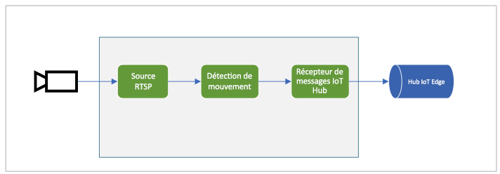

# <a name="quickstart-detect-motion-and-emit-events"></a>Démarrage rapide : Détecter les événements de mouvement et d’émission

Ce guide de démarrage rapide vous guide tout au long des étapes de prise en main de Live Video Analytics sur IoT Edge. Il utilise une machine virtuelle Azure comme appareil IoT Edge et un flux vidéo en direct simulé. Une fois la procédure de configuration terminée, vous pourrez exécuter un flux vidéo en direct simulé à travers un graphe multimédia qui détecte et signale tout mouvement dans ce flux. Le diagramme ci-dessous montre une représentation graphique de ce graphe multimédia.

 

Cet article se base sur un [exemple de code](https://github.com/Azure-Samples/live-video-analytics-iot-edge-csharp) écrit en C#.

## <a name="prerequisites"></a>Prérequis

* Compte Azure avec un abonnement actif. [Créez un compte gratuitement](https://azure.microsoft.com/free/?WT.mc_id=A261C142F).
* [Visual Studio Code](https://code.visualstudio.com/) sur votre ordinateur avec les extensions suivantes :
    1. [Outils IoT Azure](https://marketplace.visualstudio.com/items?itemName=vsciot-vscode.azure-iot-tools)
    2. [C#](https://marketplace.visualstudio.com/items?itemName=ms-dotnettools.csharp)
* [Kit de développement logiciel (SDK) .NET Core 3.1](https://dotnet.microsoft.com/download/dotnet-core/3.1) installé sur votre système

> [!TIP]
> Vous pouvez être invité à installer Docker au moment de l’installation de l’extension Azure IoT Tools. N’hésitez pas à l’ignorer.

## <a name="set-up-azure-resources"></a>Configurer les ressources Azure

Les ressources Azure suivantes sont indispensables dans ce tutoriel.

* IoT Hub
* Compte de stockage
* Compte Azure Media Services
* Machine virtuelle Linux dans Azure, avec le [runtime IoT Edge](https://docs.microsoft.com/azure/iot-edge/how-to-install-iot-edge-linux) installé

Pour ce guide de démarrage rapide, nous vous recommandons d’utiliser le [script d’installation des ressources Live Video Analytics](https://github.com/Azure/live-video-analytics/tree/master/edge/setup) pour déployer les ressources Azure mentionnées ci-dessus dans votre abonnement Azure. Pour ce faire, procédez comme suit :

1. Accédez à https://shell.azure.com.
1. Si vous utilisez Cloud Shell pour la première fois, vous êtes invité à sélectionner un abonnement pour créer un compte de stockage et un partage Microsoft Azure Files. Sélectionnez « Créer un stockage » pour créer un compte de stockage pour le stockage de vos informations de session Cloud Shell. Ce compte de stockage est distinct de celui que le script créera pour l’utilisation avec votre compte Azure Media Services.
1. Sélectionnez « Bash » comme environnement dans la liste déroulante sur le côté gauche de la fenêtre Cloud Shell.

    

1. Exécutez la commande suivante :

    ```
    bash -c "$(curl -sL https://aka.ms/lva-edge/setup-resources-for-samples)"
    ```

    Si le script se termine correctement, vous devez voir toutes les ressources mentionnées ci-dessus dans votre abonnement.

1. Une fois le script terminé, cliquez sur les accolades pour exposer la structure du dossier. Vous verrez quelques fichiers créés sous le répertoire ~/clouddrive/lva-sample. L’intérêt de ce guide de démarrage rapide est le suivant :

     * ~/clouddrive/lva-sample/edge-deployment/.env  - contient des propriétés que Visual Studio utilise pour déployer des modules vers un périphérique
     * ~/clouddrive/lva-sample/appsetting.json - utilisé par Visual Studio Code pour exécuter l’exemple de code
     
Vous en aurez besoin pour mettre à jour les fichiers dans Visual Studio Code plus loin dans le guide de démarrage rapide. Vous souhaiterez peut-être les copier dans un fichier local pour l’instant.


 

## <a name="set-up-your-development-environment"></a>Configurer l''environnement de développement

1. Clonez le référentiel à partir d’ici https://github.com/Azure-Samples/live-video-analytics-iot-edge-csharp.
1. Lancez Visual Studio Code et ouvrez le dossier dans lequel le référentiel a été téléchargé.
1. Dans Visual Studio Code, accédez au dossier « src/cloud-to-device-console-app » et créez un fichier nommé « appsettings.json ». Ce fichier contiendra les paramètres nécessaires à l’exécution du programme.
1. Copiez le contenu depuis le fichier ~/clouddrive/lva-sample/appsettings.json généré dans la section précédente (voir étape 5)

    Le texte doit ressembler à l’exemple suivant :

    ```
    {  
        "IoThubConnectionString" : "HostName=xxx.azure-devices.net;SharedAccessKeyName=iothubowner;SharedAccessKey=XXX",  
        "deviceId" : "lva-sample-device",  
        "moduleId" : "lvaEdge"  
    }
    ```
1. Ensuite, accédez au dossier « src/edge » et créez un fichier nommé « .env ».
1. Copiez le contenu à partir du fichier « /clouddrive/lva-sample/edge-deployment/.env ». Le texte doit ressembler à l’exemple suivant :

    ```
    SUBSCRIPTION_ID="<Subscription ID>"  
    RESOURCE_GROUP="<Resource Group>"  
    AMS_ACCOUNT="<AMS Account ID>"  
    IOTHUB_CONNECTION_STRING="HostName=xxx.azure-devices.net;SharedAccessKeyName=iothubowner;SharedAccessKey=xxx"  
    AAD_TENANT_ID="<AAD Tenant ID>"  
    AAD_SERVICE_PRINCIPAL_ID="<AAD SERVICE_PRINCIPAL ID>"  
    AAD_SERVICE_PRINCIPAL_SECRET="<AAD SERVICE_PRINCIPAL ID>"  
    INPUT_VIDEO_FOLDER_ON_DEVICE="/home/lvaadmin/samples/input"  
    OUTPUT_VIDEO_FOLDER_ON_DEVICE="/home/lvaadmin/samples/input"
    APPDATA_FOLDER_ON_DEVICE="/var/local/mediaservices"
    CONTAINER_REGISTRY_USERNAME_myacr="<your container registry username>"  
    CONTAINER_REGISTRY_PASSWORD_myacr="<your container registry username>"      
    ```

## <a name="examine-the-sample-files"></a>Examinez les exemples de fichiers

1. Dans Visual Studio Code, accédez à « src/edge ». Vous verrez le fichier. env que vous avez créé, ainsi que quelques fichiers de modèle de déploiement.

    Le modèle de déploiement fait référence au manifeste de déploiement du périphérique avec des valeurs d’espace réservé. Le fichier .env contient les valeurs de ces variables.
1. Ensuite, accédez au dossier « src/cloud-to-device-console-app ». Vous y voyez le fichier appsettings.json que vous avez créé, ainsi que quelques autres fichiers :

    * c2d-console-app.csproj : fichier projet pour Visual Studio Code.
    * operations.json : répertorie les différentes opérations que vous souhaitez que le programme exécute.
    * Program.cs : exemple de code de programme, qui effectue les opérations suivantes :
    
        * Il charge les paramètres de l’application.
        * Il invoque les méthodes directes exposées par le module Live Video Analytics sur IoT Edge. Vous pouvez utiliser le module pour analyser des flux vidéo en direct en invoquant ses [méthodes directes](direct-methods.md) 
        * Il s’interrompt pour vous permettre d’examiner la sortie du programme dans la fenêtre TERMINAL et les événements générés par le module dans la fenêtre SORTIE
        * Il invoque des méthodes directes pour nettoyer des ressources   

## <a name="generate-and-deploy-the-iot-edge-deployment-manifest"></a>Générez et déployez le manifeste de déploiement IoT Edge

Le manifeste de déploiement définit les modules qui sont déployés sur un périphérique et les paramètres de configuration de ces modules. Procédez comme suit pour générer un tel manifeste à partir du fichier de modèle, puis déployez-le sur le périphérique.

1. Ouvrez Visual Studio Code
1. Définissez la chaîne de connexion IoTHub en cliquant sur l’icône « Autres actions » en regard du volet AZURE IOT HUB dans l’angle inférieur gauche. Vous pouvez copier la chaîne à partir du fichier src/cloud-to-device-console-app/appsettings.json. 

    
1. Cliquez ensuite avec le bouton droit sur le fichier « src/edge/deployment.template.json », puis cliquez sur « Générer le manifeste de déploiement IoT Edge ».
    

    Cela doit créer un fichier manifeste dans le dossier src/edge/config « deployment.amd64.json ».
1. Cliquez avec le bouton droit sur « src/edge/config/deployment.amd64.json », puis cliquez sur « Créer un déploiement pour un seul appareil » et sélectionnez le nom de votre périphérique.

    
1. Vous êtes ensuite invité à sélectionner un appareil IoT Hub. Sélectionnez lva-sample-device dans la liste déroulante.
1. Environ 30 secondes plus tard, actualisez Azure IoT Hub dans la section inférieure gauche et vous devriez voir le périphérique avec les modules suivants déployés :

    * Module Live Video Analytics sur IoT Edge (nom du module « lvaEdge »)
    * Simulateur RTSP (nom de module « rtspsim »)

Le module de simulateur RTSP simule un flux vidéo en direct à l’aide d’un fichier vidéo stocké qui a été copié sur votre périphérique lorsque vous avez exécuté le [script d’installation des ressources Live Video Analytics](https://github.com/Azure/live-video-analytics/tree/master/edge/setup). À ce stade, vous disposez des modules déployés, mais aucun graphe multimédia n’est actif.

## <a name="prepare-for-monitoring-events"></a>Préparez-vous à des événements de surveillance

Vous utiliserez Live Video Analytics sur le module IoT Edge pour détecter les mouvements dans le flux vidéo en direct entrant et envoyer des événements sur le IoT Hub. Pour afficher ces événements, procédez comme suit :

1. Ouvrez le volet Explorateur dans Visual Studio Code et recherchez Azure IoT Hub dans l’angle inférieur gauche.
1. Développez le nœud Appareils.
1. Cliquez avec le bouton droit sur lva-sample-device et choisissez l’option « Démarrer la supervision de l’événement intégré ».

    

## <a name="run-the-sample-program"></a>Exécutez l'exemple de programme

Procédez comme suit pour exécuter l’exemple de code.
1. Dans Visual Studio Code, accédez à « src/cloud-to-device-console-app/operations.json ».
1. Sous le nœud GraphTopologySet, vérifiez les points suivants :

    ` "topologyUrl" : "https://raw.githubusercontent.com/Azure/live-video-analytics/master/MediaGraph/topologies/motion-detection/topology.json"`
1. Ensuite, sous les nœuds GraphInstanceSet et GraphTopologyDelete, assurez-vous que la valeur de topologyName correspond à la valeur de la propriété « Name » dans la topologie du graphique ci-dessus :

    `"topologyName" : "MotionDetection"`
    
1. Démarrez une session de débogage (appuyez sur F5). Vous allez commencer à voir certains messages imprimés dans la fenêtre TERMINAL.
1. Operations.json commence par appeler GraphTopologyList et GraphInstanceList. Si vous avez nettoyé des ressources après les démarrages rapides précédents, cette opération renvoie des listes vides, puis s’interrompt pour que vous puissiez appuyer sur Entrée.

    ```
    --------------------------------------------------------------------------
    Executing operation GraphTopologyList
    -----------------------  Request: GraphTopologyList  --------------------------------------------------
    {
        "@apiVersion": "1.0"
    }
    ---------------  Response: GraphTopologyList - Status: 200  ---------------
    {
        "value": []
    }
    --------------------------------------------------------------------------
    Executing operation WaitForInput
    Press Enter to continue
    ```
1. Lorsque vous appuyez sur la touche « Entrée » dans la fenêtre TERMINAL, l’ensemble d’appels de méthode directe suivant est créé
     
     * Un appel à GraphTopologySet à l’aide de topologyUrl ci-dessus
     * Un appel à GraphInstanceSet à l’aide du corps suivant
     
     ```
     {
       "@apiVersion": "1.0",
       "name": "Sample-Graph",
       "properties": {
         "topologyName": "MotionDetection",
         "description": "Sample graph description",
         "parameters": [
           {
             "name": "rtspUrl",
             "value": "rtsp://rtspsim:554/media/camera-300s.mkv"
           },
           {
             "name": "rtspUserName",
             "value": "testuser"
           },
           {
             "name": "rtspPassword",
             "value": "testpassword"
           }
         ]
       }
     }
     ```
     
     * Un appel à GraphInstanceActivate pour démarrer l’instance de graphe et démarrer le flux vidéo.
     * Un deuxième appel à GraphInstanceList pour indiquer que l’instance de graphe est effectivement en cours d’exécution.
1. La sortie de la fenêtre TERMINAL s’interrompt maintenant à l’invite « Appuyez sur Entrée pour continuer ». N’appuyez pas sur « Entrée » pour l’instant. Vous pouvez faire défiler vers le haut pour voir les charges utiles de réponse JSON pour les méthodes directes que vous avez invoquées
1. Si vous basculez maintenant vers la fenêtre SORTIE de Visual Studio Code, vous verrez les messages envoyés à IoT Hub par le module Live Video Analytics sur IoT Edge.
     * Ces messages sont traités dans les sections ci-dessous
1. Le graphe multimédia continue à s’exécuter et à imprimer les résultats : le simulateur RTSP continue de boucler la vidéo source. Pour arrêter le graphe multimédia, revenez à la fenêtre TERMINAL et appuyer sur « Entrée ». La série d’appels suivante permet de nettoyer les ressources :
     * Un appel à GraphInstanceDeactivate désactive l’instance de graphe
     * Un appel à GraphInstanceDelete supprime l’instance de graphe
     * Un appel à GraphTopologyDelete supprime la topologie
     * Un dernier appel à GraphTopologyList indique que la liste est maintenant vide

## <a name="interpret-results"></a>Interpréter les résultats

Lorsque vous exécutez le graphe multimédia, les résultats du nœud de processeur de détection de mouvement sont envoyés via le nœud du récepteur IoT Hub à IoT Hub. Les messages qui s’affichent dans la fenêtre SORTIE de Visual Studio Code contiennent une section « body » et une section « applicationProperties ». Pour comprendre ce que ces sections représentent, lisez [cet](https://docs.microsoft.com/azure/iot-hub/iot-hub-devguide-messages-construct) article.

Dans les messages ci-dessous, les propriétés de l’application et le contenu du corps sont définis par le module Live Video Analytics.

## <a name="mediasession-established-event"></a>Événement MediaSession établi

Lorsqu’un graphe multimédia est instancié, le nœud source RTSP tente de se connecter au serveur RTSP exécuté sur le conteneur rtspsim-live555. En cas de réussite, il affiche cet événement :

```
[IoTHubMonitor] [9:42:18 AM] Message received from [lvaedgesample/lvaEdge]:  
{  
"body": {
"sdp": "SDP:\nv=0\r\no=- 1586450538111534 1 IN IP4 xxx.xxx.xxx.xxx\r\ns=Matroska video+audio+(optional)subtitles, streamed by the LIVE555 Media Server\r\ni=media/camera-300s.mkv\r\nt=0 0\r\na=tool:LIVE555 Streaming Media v2020.03.06\r\na=type:broadcast\r\na=control:*\r\na=range:npt=0-300.000\r\na=x-qt-text-nam:Matroska video+audio+(optional)subtitles, streamed by the LIVE555 Media Server\r\na=x-qt-text-inf:media/camera-300s.mkv\r\nm=video 0 RTP/AVP 96\r\nc=IN IP4 0.0.0.0\r\nb=AS:500\r\na=rtpmap:96 H264/90000\r\na=fmtp:96 packetization-mode=1;profile-level-id=4D0029;sprop-parameter-sets={SPS}\r\na=control:track1\r\n"  
},  
"applicationProperties": {  
    "dataVersion": "1.0",  
    "topic": "/subscriptions/{subscriptionID}/resourceGroups/{name}/providers/microsoft.media/mediaservices/hubname",  
    "subject": "/graphInstances/GRAPHINSTANCENAMEHERE/sources/rtspSource",  
    "eventType": "Microsoft.Media.MediaGraph.Diagnostics.MediaSessionEstablished",  
    "eventTime": "2020-04-09T16:42:18.1280000Z"  
    }  
}
```

* Le message est un événement de diagnostic, MediaSessionEstablished, il indique que le nœud source RTSP (l’objet) a pu établir une connexion avec le simulateur RTSP et commence à recevoir un flux en direct (simulé).
* « Subject » dans applicationProperties fait référence au nœud dans la topologie de graphe à partir duquel le message a été généré. Dans ce cas, le message provient du nœud source RTSP.
* « eventType » dans applicationProperties indique qu’il s’agit d’un événement de diagnostic.
* « eventTime » indique l’heure à laquelle l’événement s’est produit.
* « Body » contient des données relatives à l’événement de diagnostic, qui, dans ce cas, sont les détails [SDP](https://en.wikipedia.org/wiki/Session_Description_Protocol).


## <a name="motion-detection-event"></a>Événement de détection de mouvement

Quand un mouvement est détecté, le module Live Video Analytics Edge envoie un événement d’inférence. Le type est défini sur « mouvement » pour indiquer qu’il s’agit d’un résultat provenant du processeur de détection de mouvement, et eventTime vous indique à quelle heure (UTC) le mouvement s’est produit. Voici un exemple :

```
  {  
  "body": {  
    "timestamp": 142843967343090,
    "inferences": [  
      {  
        "type": "motion",  
        "motion": {  
          "box": {  
            "l": 0.573222,  
            "t": 0.492537,  
            "w": 0.141667,  
            "h": 0.074074  
          }  
        }  
      }  
    ]  
  },  
  "applicationProperties": {  
    "topic": "/subscriptions/{subscriptionID}/resourceGroups/{name}/providers/microsoft.media/mediaservices/hubname",  
    "subject": "/graphInstances/GRAPHINSTANCENAME/processors/md",  
    "eventType": "Microsoft.Media.Graph.Analytics.Inference",  
    "eventTime": "2020-04-17T20:26:32.7010000Z",
    "dataVersion": "1.0"  
  }  
}  
```

* « subject » dans applicationProperties fait référence le nœud dans le graphe multimédia à partir duquel le message a été généré. Dans ce cas, le message provient du nœud de détection de mouvement du processeur.
* « eventType » dans applicationProperties indique qu’il s’agit d’un événement Analytics.
* « eventTime » indique l’heure à laquelle l’événement s’est produit.
« body » contient des données relatives à l’événement Analytics. En l’occurrence, l’événement est un événement d’inférence et, par conséquent, le corps contient des données « timestamp » et « inferences ».
* Les données « inferences » indiquent que le « type » est « motion » et contient des données supplémentaires sur l’événement « motion ».
* La section « box » contient les coordonnées d’un cadre englobant autour de l’objet en déplacement. Les valeurs sont normalisées par la largeur et la hauteur de la vidéo en pixels (par exemple, largeur de 1920 et hauteur de 1080).

    ```
    l - distance from left of image
    t - distance from top of image
    w - width of bounding box
    h - height of bounding box
    ```
    
## <a name="cleanup-resources"></a>Nettoyer les ressources

Si vous envisagez d’essayer les autres démarrages rapides, vous devez vous en tenir aux ressources créées. Dans le cas contraire, accédez au Portail Azure et à vos groupes de ressources, sélectionnez le groupe de ressources sous lequel vous avez exécuté ce guide de démarrage rapide, puis supprimez toutes les ressources.

## <a name="next-steps"></a>Étapes suivantes

Exécutez les autres Démarrage rapide, tels que la détection d’un objet dans un flux vidéo en direct.        
