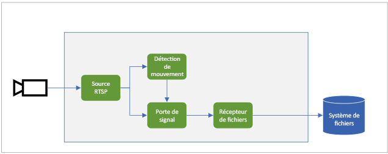

# <a name="quickstart-detect-motion-and-record-video-on-edge-devices"></a>Démarrage rapide : Détecter les mouvements et enregistrer des vidéos sur des appareils de périphérie
 
Ce guide de démarrage rapide vous montre comment utiliser Live Video Analytics sur IoT Edge pour analyser le flux vidéo en direct à partir d’une caméra IP (simulée). Il montre comment détecter la présence d’un mouvement et, le cas échéant, enregistrer un clip vidéo MP4 sur le système de fichiers local de l’appareil de périphérie. Le guide de démarrage rapide utilise une machine virtuelle Azure comme appareil IoT Edge ainsi qu’un flux vidéo en direct simulé. 

Cet article se base sur un exemple de code écrit en C#. Il s’appuie sur le guide de démarrage rapide [Détecter les événements de mouvement et d’émission](detect-motion-emit-events-quickstart.md). 

## <a name="prerequisites"></a>Prérequis

* Compte Azure avec un abonnement actif. Si vous n’en avez pas déjà un, [créez un compte gratuitement](https://azure.microsoft.com/free/?WT.mc_id=A261C142F).
* [Visual Studio Code](https://code.visualstudio.com/), avec les extensions suivantes :
    * [Outils IoT Azure](https://marketplace.visualstudio.com/items?itemName=vsciot-vscode.azure-iot-tools)
    * [C#](https://marketplace.visualstudio.com/items?itemName=ms-dotnettools.csharp)
* [Kit SDK .NET Core 3.1](https://dotnet.microsoft.com/download/dotnet-core/3.1).
* Si vous n’avez pas suivi le guide de démarrage rapide [Détecter les événements de mouvement et d’émission](detect-motion-emit-events-quickstart.md), effectuez les étapes suivantes :
     1. [Configurer des ressources Azure](detect-motion-emit-events-quickstart.md#set-up-azure-resources)
     1. [Configurer votre environnement de développement](detect-motion-emit-events-quickstart.md#set-up-your-development-environment)
     1. [Générer et déployer le manifeste de déploiement IoT Edge](detect-motion-emit-events-quickstart.md#generate-and-deploy-the-deployment-manifest)
     1. [Préparer la supervision d’événements](detect-motion-emit-events-quickstart.md#prepare-to-monitor-events)

> [!TIP]
> Lors de l’installation d’Azure IoT Tools, vous pouvez être invité à installer Docker. N’hésitez pas à ignorer cette invite.

## <a name="review-the-sample-video"></a>Réviser l’exemple de vidéo
Quand vous configurez les ressources Azure pour ce guide de démarrage rapide, une courte vidéo d’une aire de stationnement est copiée dans Azure sur la machine virtuelle Linux qui est utilisée comme appareil IoT Edge. Ce fichier vidéo permet de simuler un flux en direct pour ce tutoriel.

Ouvrez une application comme le [lecteur multimédia VLC](https://www.videolan.org/vlc/), sélectionnez Ctrl+N, puis collez [ce lien](https://lvamedia.blob.core.windows.net/public/lots_015.mkv) dans la vidéo de l’aire de stationnement pour commencer la lecture. Au repère d’approximativement 5 secondes, une voiture blanche traverse l’aire de stationnement.

Effectuez les étapes suivantes pour utiliser Live Video Analytics sur IoT Edge afin de détecter le mouvement de la voiture et enregistrer un clip vidéo commençant aux alentours du repère des 5 secondes.

## <a name="overview"></a>Vue d’ensemble



Le diagramme précédent montre comment les signaux circulent dans ce guide de démarrage rapide. [Un module de périphérie](https://github.com/Azure/live-video-analytics/tree/master/utilities/rtspsim-live555) simule une caméra IP qui héberge un serveur RTSP (Real-Time Streaming Protocol). Un nœud [source RTSP](media-graph-concept.md#rtsp-source) extrait le flux vidéo provenant de ce serveur et envoie des images vidéo au nœud [processeur de détection de mouvement](media-graph-concept.md#motion-detection-processor). La source RTSP envoie les mêmes images vidéo à un nœud [processeur de porte de signal](media-graph-concept.md#signal-gate-processor), qui reste fermé jusqu’à ce qu’il soit déclenché par un événement.

Quand le processeur de détection de mouvement détecte des mouvements dans la vidéo, il envoie un événement au nœud processeur de porte de signal, ce qui le déclenche. La porte s’ouvre pendant la durée configurée, et les images vidéo sont envoyées au nœud [récepteur de fichiers](media-graph-concept.md#file-sink). Ce nœud récepteur enregistre la vidéo au format de fichier MP4 sur le système de fichiers local de votre appareil de périphérie. Le fichier est enregistré à l’emplacement configuré.

Dans ce guide de démarrage rapide, vous allez :

1. créer et déployer le graphe multimédia ;
1. interpréter les résultats ;
1. Supprimer des ressources.

## <a name="examine-and-edit-the-sample-files"></a>Examiner et modifier les exemples de fichiers
Dans le cadre des prérequis pour ce guide de démarrage rapide, vous avez téléchargé l’exemple de code dans un dossier. Effectuez les étapes suivantes pour examiner et modifier l’exemple de code.

1. Dans Visual Studio Code, accédez à *src/edge*. Votre fichier  *.env* et quelques fichiers de modèle de déploiement s’affichent.

    Le modèle de déploiement fait référence au manifeste de déploiement de l’appareil de périphérie, où des variables sont utilisées pour certaines propriétés. Le fichier  *.env* inclut les valeurs de ces variables.
1. Accédez au dossier *src/cloud-to-device-console-app*. Ce dernier contient le fichier *appsettings.json* et quelques autres fichiers :
    * ***c2d-console-app.csproj*** : fichier projet pour Visual Studio Code.
    * ***operations.json*** : liste des opérations que vous voulez que le programme exécute.
    * ***Program.cs*** : exemple de code de programme. Ce code :

        * Il charge les paramètres de l’application.
        * Invoque les méthodes directes exposées par le module Live Video Analytics sur IoT Edge. Vous pouvez utiliser le module pour analyser des flux vidéo en direct en invoquant ses [méthodes directes](direct-methods.md). 
        * S’interrompt pour vous permettre d’examiner la sortie du programme dans la fenêtre **TERMINAL** et d’examiner les événements générés par le module dans la fenêtre **SORTIE**.
        * Invoque des méthodes directes pour nettoyer des ressources.

1. Modifiez le fichier *operations.json* :
    * Changez le lien vers la topologie de graphe :

        `"topologyUrl" : "https://raw.githubusercontent.com/Azure/live-video-analytics/master/MediaGraph/topologies/evr-motion-files/topology.json"`
    * Sous `GraphInstanceSet`, modifiez le nom de la topologie de graphe de manière à ce qu’il corresponde à la valeur figurant dans le lien ci-dessus précédent :
    
      `"topologyName" : "EVRToFilesOnMotionDetection"`

    * Modifiez l’URL RTSP pour qu’elle pointe vers le fichier vidéo :

        `"value": "rtsp://rtspsim:554/media/lots_015.mkv"`

    * Sous `GraphTopologyDelete`, modifiez le nom :

        `"name": "EVRToFilesOnMotionDetection"`

## <a name="review---check-the-modules-status"></a>Vérification - Contrôler l’état des modules

À l’étape [Générer et déployer le manifeste de déploiement IoT Edge](detect-motion-emit-events-quickstart.md#generate-and-deploy-the-deployment-manifest), dans Visual Studio Code, développez le nœud **lva-sample-device** sous **AZURE IOT HUB** (dans la section en bas à gauche). Vous devez voir les modules suivants déployés :

* Le module Live Video Analytics, nommé **lvaEdge**
* Le module **rtspsim**, qui simule un serveur RTSP faisant office de source d’un flux vidéo en direct

  


## <a name="review---prepare-for-monitoring-events"></a>Vérification - Préparer la supervision d’événements
Vérifiez que vous avez effectué les étapes permettant de [préparer la supervision d’événements](detect-motion-emit-events-quickstart.md#prepare-to-monitor-events).


## <a name="run-the-sample-program"></a>Exécuter l'exemple de programme

1. Démarrez une session de débogage en appuyant sur la touche F5. La fenêtre **TERMINAL** affiche des messages.
1. Le code *operations.json* appelle les méthodes directes `GraphTopologyList` et `GraphInstanceList`. Si vous avez nettoyé les ressources après les guides de démarrage rapide précédents, ce processus retourne des listes vides, puis s’interrompt. Sélectionnez la touche Entrée.

    ```
    --------------------------------------------------------------------------
    Executing operation GraphTopologyList
    -----------------------  Request: GraphTopologyList  --------------------------------------------------
    {
      "@apiVersion": "1.0"
    }
    ---------------  Response: GraphTopologyList - Status: 200  ---------------
    {
      "value": []
    }
    --------------------------------------------------------------------------
    Executing operation WaitForInput
    Press Enter to continue
    ```

    La fenêtre **TERMINAL** affiche le jeu d’appels de méthode directe suivant :

     * Un appel à `GraphTopologySet` qui utilise `topologyUrl` 
     * Un appel à `GraphInstanceSet` qui utilise le corps suivant :

         ```
         {
           "@apiVersion": "1.0",
           "name": "Sample-Graph",
           "properties": {
             "topologyName": "EVRToFilesOnMotionDetection",
             "description": "Sample graph description",
             "parameters": [
               {
                 "name": "rtspUrl",
                 "value": "rtsp://rtspsim:554/media/lots_015.mkv"
               },
               {
                 "name": "rtspUserName",
                 "value": "testuser"
               },
               {
                 "name": "rtspPassword",
                 "value": "testpassword"
               }
             ]
           }
         }
         ```
     * Un appel à `GraphInstanceActivate` qui démarre l’instance de graphe et le flux vidéo
     * Un deuxième appel à `GraphInstanceList` qui indique que l’instance de graphe est dans l’état En cours d’exécution
1. La sortie affichée dans la fenêtre **TERMINAL** fait une pause au niveau de `Press Enter to continue`. Ne sélectionnez pas encore Entrée. Faites défiler vers le haut pour voir les charges utiles de réponse JSON pour les méthodes directes que vous avez appelées.
1. Basculez vers la fenêtre **SORTIE** de Visual Studio Code. Les messages indiquant que le module Live Video Analytics sur IoT Edge effectue des envois à IoT Hub s’affichent. La section suivante de ce guide de démarrage rapide décrit ces messages.

1. Le graphe multimédia continue à s’exécuter et à afficher les résultats. Le simulateur RTSP continue de boucler la vidéo source. Pour arrêter le graphe multimédia, retournez dans la fenêtre **TERMINAL**, puis sélectionnez Entrée. 

    La série d’appels suivante nettoie les ressources :
     * Un appel à `GraphInstanceDeactivate` désactive l’instance de graphe.
     * Un appel à `GraphInstanceDelete` supprime l’instance.
     * Un appel à `GraphTopologyDelete` supprime la topologie.
     * Un dernier appel à `GraphTopologyList` indique que la liste est maintenant vide.

## <a name="interpret-results"></a>Interpréter les résultats 
Quand vous exécutez le graphe multimédia, les résultats du nœud processeur de détection de mouvement passe par le nœud récepteur IoT Hub pour atteindre le hub IoT. Les messages qui s’affichent dans la fenêtre **SORTIE** de Visual Studio Code contiennent une section `body` et une section `applicationProperties`. Pour plus d’informations, consultez [Créer et lire des messages IoT Hub](https://docs.microsoft.com/azure/iot-hub/iot-hub-devguide-messages-construct).

Dans les messages suivants, le module Live Video Analytics définit les propriétés de l’application et le contenu du corps.

### <a name="mediasessionestablished-event"></a>Événement MediaSessionEstablished

Quand un graphe multimédia est instancié, le nœud source RTSP tente de se connecter au serveur RTSP qui s’exécute sur le conteneur rtspsim-live555. Si la connexion réussit, l’événement suivant est affiché.

```
[IoTHubMonitor] [05:37:21 AM] Message received from [lva-sample-device/lvaEdge]:
{  
"body": {
"sdp": "SDP:\nv=0\r\no=- 1586450538111534 1 IN IP4 xxx.xxx.xxx.xxx\r\ns=Matroska video+audio+(optional)subtitles, streamed by the LIVE555 Media Server\r\ni=media/camera-300s.mkv\r\nt=0 0\r\na=tool:LIVE555 Streaming Media v2020.03.06\r\na=type:broadcast\r\na=control:*\r\na=range:npt=0-300.000\r\na=x-qt-text-nam:Matroska video+audio+(optional)subtitles, streamed by the LIVE555 Media Server\r\na=x-qt-text-inf:media/camera-300s.mkv\r\nm=video 0 RTP/AVP 96\r\nc=IN IP4 0.0.0.0\r\nb=AS:500\r\na=rtpmap:96 H264/90000\r\na=fmtp:96 packetization-mode=1;profile-level-id=4D0029;sprop-parameter-sets={SPS}\r\na=control:track1\r\n"  
},  
"applicationProperties": {  
    "dataVersion": "1.0",  
    "topic": "/subscriptions/{subscriptionID}/resourceGroups/{name}/providers/microsoft.media/mediaservices/hubname",  
    "subject": "/graphInstances/Sample-Graph-1/sources/rtspSource",  
    "eventType": "Microsoft.Media.MediaGraph.Diagnostics.MediaSessionEstablished",  
    "eventTime": "2020-05-21T05:37:21.398Z",
    }  
}
```

Dans la sortie précédente : 

* Le message est un événement de diagnostic, `MediaSessionEstablished`. Il indique que le nœud source RTSP (l’objet) a établi une connexion au simulateur RTSP et a commencé à recevoir un flux en direct (simulé).
* Dans `applicationProperties`, `subject` fait référence au nœud présent dans la topologie de graphe à partir duquel le message a été généré. Dans ce cas, le message provient du nœud source RTSP.
* Dans `applicationProperties`, `eventType` indique que cet événement est un événement de diagnostic.
* La valeur `eventTime` correspond à l’heure à laquelle l’événement s’est produit.
* La section `body` contient des données relatives à l’événement de diagnostic. Dans ce cas, les données comprennent les détails du [protocole SDP](https://en.wikipedia.org/wiki/Session_Description_Protocol).

### <a name="recordingstarted-event"></a>Événement RecordingStarted

Quand un mouvement est détecté, le nœud processeur de porte de signal est activé et le nœud récepteur de fichiers dans le graphe multimédia commence à écrire un fichier MP4. Le nœud récepteur de fichiers envoie un événement opérationnel. Le `type` est défini sur `motion` pour indiquer qu’il s’agit d’un résultat du processeur de détection de mouvement. La valeur `eventTime` est l’heure UTC à laquelle le mouvement s’est produit. Pour plus d’informations sur ce processus, consultez la section [Vue d’ensemble](#overview) de ce guide de démarrage rapide.

Voici un exemple de ce message :

```
[IoTHubMonitor] [05:37:27 AM] Message received from [lva-sample-device/lvaEdge]:
{
  "body": {
    "outputType": "filePath",
    "outputLocation": "/var/media/sampleFilesFromEVR-filesinkOutput-20200521T053726Z.mp4"
  },
  "applicationProperties": {
    "topic": "/subscriptions/{subscriptionID}/resourceGroups/{name}/providers/microsoft.media/mediaservices/hubname",  
    "subject": "/graphInstances/Sample-Graph-1/sinks/fileSink",
    "eventType": "Microsoft.Media.Graph.Operational.RecordingStarted",
    "eventTime": "2020-05-21T05:37:27.713Z",
    "dataVersion": "1.0"
  }
}
```

Dans le message précédent : 

* Dans `applicationProperties`, `subject` fait référence au nœud présent dans le graphe multimédia à partir duquel le message a été généré. Dans ce cas, le message provient du nœud récepteur de fichiers.
* Dans `applicationProperties`, `eventType` indique que cet événement est opérationnel.
* La valeur `eventTime` correspond à l’heure à laquelle l’événement s’est produit. Cette heure est 5 à 6 secondes après l’événement `MediaSessionEstablished` et après le début du flux vidéo. Cette heure correspond au repère des 5 à 6 secondes quand la [voiture a commencé à se déplacer](#review-the-sample-video) dans l’aire de stationnement.
* La section `body` contient des données relatives à l’événement opérationnel. Dans ce cas, les données comprennent `outputType` et `outputLocation`.
* La variable `outputType` indique que ces informations concernent le chemin du fichier.
* La valeur `outputLocation` est l’emplacement du fichier MP4 dans le module de périphérie.

### <a name="recordingstopped-and-recordingavailable-events"></a>Événements RecordingStopped et RecordingAvailable

Si vous examinez les propriétés du nœud processeur de porte de signal dans la [topologie de graphe](https://github.com/Azure/live-video-analytics/blob/master/MediaGraph/topologies/evr-motion-files/topology.json), vous remarquez que les durées d’activation sont définies sur 5 secondes. Ainsi, 5 secondes environ après la réception de l’événement `RecordingStarted`, vous obtenez :

* Un événement `RecordingStopped`, indiquant que l’enregistrement s’est arrêté.
* Un événement `RecordingAvailable`, indiquant que le fichier MP4 peut maintenant être visualisé.

Les deux événements sont généralement émis à quelques secondes d’intervalle.

## <a name="play-the-mp4-clip"></a>Lire le clip MP4

Les fichiers MP4 sont écrits dans un répertoire sur l’appareil de périphérie que vous avez configuré dans le fichier  *.env* à l’aide de la clé OUTPUT_VIDEO_FOLDER_ON_DEVICE. Si vous avez utilisé la valeur par défaut, les résultats doivent se trouver dans le dossier */home/lvaadmin/samples/output/* .

Pour lire le clip MP4 :

1. Accédez à votre groupe de ressources, recherchez la machine virtuelle, puis connectez-vous à l’aide d’Azure Bastion.

    
    
    

1. Connectez-vous à l’aide des informations d’identification qui ont été générées quand vous avez [configuré vos ressources Azure](detect-motion-emit-events-quickstart.md#set-up-azure-resources). 
1. À l’invite de commandes, accédez au répertoire approprié. L’emplacement par défaut est */home/lvaadmin/samples/output*. Vous devez voir les fichiers MP4 présents dans le répertoire.

     

1. Utilisez [Secure Copy (SCP)](https://docs.microsoft.com/azure/virtual-machines/linux/copy-files-to-linux-vm-using-scp) pour copier les fichiers sur votre ordinateur local. 
1. Lisez les fichiers en utilisant le [lecteur multimédia VLC](https://www.videolan.org/vlc/) ou tout autre lecteur MP4.

## <a name="clean-up-resources"></a>Nettoyer les ressources

Si vous envisagez d’essayer les autres guides de démarrage rapide, conservez les ressources que vous avez créées. Dans le cas contraire, dans le portail Azure, accédez à vos groupes de ressources, sélectionnez le groupe de ressources où vous avez exécuté ce guide de démarrage rapide, puis supprimez toutes les ressources.

## <a name="next-steps"></a>Étapes suivantes

* Suivez le guide de démarrage rapide [Exécuter Live Video Analytics avec votre propre modèle](use-your-model-quickstart.md) pour appliquer l’intelligence artificielle à des flux vidéo en direct.
* Passez en revue les défis supplémentaires pour les utilisateurs expérimentés :

    * Utilisez une [caméra IP](https://en.wikipedia.org/wiki/IP_camera) qui prend en charge RTSP au lieu d’utiliser le simulateur RTSP. Vous trouverez les caméras IP qui prennent RTSP en charge dans la page des [produits conformes ONVIF](https://www.onvif.org/conformant-products). Recherchez les appareils conformes aux profils G, S ou T.
    * Utilisez un appareil Linux AMD64 ou x64 au lieu d’utiliser une machine virtuelle Linux dans Azure. Cet appareil doit se trouver dans le même réseau que la caméra IP. Suivez les instructions mentionnées dans [Installer le runtime Azure IoT Edge sur Linux](https://docs.microsoft.com/azure/iot-edge/how-to-install-iot-edge-linux). Suivez ensuite les instructions mentionnées dans [Déployer votre premier module IoT Edge sur un appareil virtuel Linux](https://docs.microsoft.com/azure/iot-edge/quickstart-linux) pour inscrire l’appareil auprès d’Azure IoT Hub.
