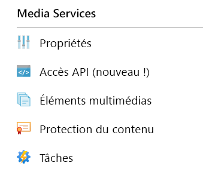
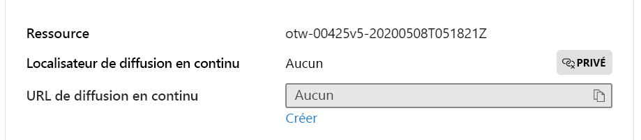

# <a name="quickstart-detect-motion-record-video-to-media-services"></a>Démarrage rapide : Détecter les mouvements et enregistrer des vidéos sur Media Services

Cet article vous guide dans la procédure d’utilisation de Live Video Analytics sur IoT Edge pour l’[l’enregistrement basé sur les événements](event-based-video-recording-concept.md). Il utilise une machine virtuelle Linux comme appareil IoT Edge et un flux vidéo en direct simulé. Ce flux vidéo est analysé en vue de détecter la présence d’objets en mouvement. Lors de la détection d’un mouvement, les événements sont envoyés à Azure IoT Hub et la partie pertinente du flux vidéo est enregistrée comme une ressource dans Azure Media Services.

Cet article s’appuie sur le [Guide de démarrage rapide Prise en main](get-started-detect-motion-emit-events-quickstart.md).

## <a name="prerequisites"></a>Prérequis

* Compte Azure avec un abonnement actif. [Créez un compte gratuitement](https://azure.microsoft.com/free/?WT.mc_id=A261C142F).
* [Visual Studio Code](https://code.visualstudio.com/) sur votre ordinateur avec l’extension [Azure IoT Tools](https://marketplace.visualstudio.com/items?itemName=vsciot-vscode.azure-iot-tools).
* Si vous n’avez pas encore terminé le [Guide de démarrage rapide Prise en main](get-started-detect-motion-emit-events-quickstart.md), exécutez la procédure suivante :
    * [Configurer des ressources Azure](get-started-detect-motion-emit-events-quickstart.md#set-up-azure-resources)
    * [Déployer des modules](get-started-detect-motion-emit-events-quickstart.md#deploy-modules-on-your-edge-device)
    * [Configurer Visual Studio Code](get-started-detect-motion-emit-events-quickstart.md#configure-the-azure-iot-tools-extension)

## <a name="review-the-sample-video"></a>Réviser l’exemple de vidéo

Dans le cadre de la procédure ci-dessus permettant de configurer les ressources Azure, une (courte) vidéo d’une aire de stationnement va être copiée dans Azure sur la machine virtuelle Linux qui est utilisée comme périphérique IoT Edge. Ce fichier vidéo permet de simuler un flux en direct pour ce tutoriel.

Vous pouvez utiliser une application, telle que [VLC Player](https://www.videolan.org/vlc/), la lancer, appuyer sur `Ctrl+N` et coller le lien de l’[exemple de vidéo d’aire de stationnement](https://lvamedia.blob.core.windows.net/public/lots_015.mkv) pour commencer la lecture. Au repère d’approximativement 5 secondes, une voiture blanche traverse l’aire de stationnement.

Lorsque vous terminez la procédure ci-dessous, vous avez utilisé Live Video Analytics sur IoT Edge pour détecter que le mouvement de la voiture et l’enregistrement d’un extrait vidéo commence au repère d’approximativement 5 secondes. Le diagramme ci-dessous est la représentation visuelle du flux global.

> [!div class="mx-imgBorder"]
> :::image type="content" source="./media/quickstarts/topology.svg" alt-text="Vidéo basée sur les événements enregistrée dans les ressources basées sur des événements de mouvement":::

## <a name="use-direct-method-calls"></a>Utiliser des appels de méthode directe

Vous pouvez utiliser le module pour analyser des flux vidéo en direct en invoquant des méthodes directes. Lisez [Méthodes directes pour Live Video Analytics sur IoT Edge](direct-methods.md) pour comprendre toutes les méthodes directes fournies par le module. 

1. Dans Visual Studio Code, ouvrez l’onglet **Extensions** (ou appuyez sur Ctrl+Maj+X) et recherchez Azure IoT Hub.
1. Cliquez avec le bouton droit et sélectionnez **Paramètres d’extension**.

    > [!div class="mx-imgBorder"]
    > :::image type="content" source="./media/run-program/extensions-tab.png" alt-text="Paramètres d’extension":::
1. Recherchez et activez « Afficher le message détaillé ».

    > [!div class="mx-imgBorder"]
    > :::image type="content" source="./media/run-program/show-verbose-message.png" alt-text="Afficher le message détaillé":::

### <a name="invoke-graphtopologylist"></a>Invoquer GraphTopologyList
Cette étape énumère toutes les [topologies de graphes](media-graph-concept.md#media-graph-topologies-and-instances) du module.

1. Cliquez avec le bouton droit sur le module « lvaEdge » et sélectionnez « Invoquer la méthode directe du module » dans le menu contextuel.
1. Vous verrez une zone de modification apparaître dans la partie centrale supérieure de la fenêtre Visual Studio Code. Entrez « GraphTopologyList » dans la zone de modification et appuyez sur Entrée.
1. Ensuite, copiez et collez la charge utile JSON ci-dessous dans la zone de modification, puis appuyez sur Entrée.
    
```
{
    "@apiVersion" : "2.0"
}
```

En quelques secondes, vous verrez la fenêtre SORTIE de Visual Studio Code apparaître avec la réponse suivante
    
```
[DirectMethod] Invoking Direct Method [GraphTopologyList] to [lva-sample-device/lvaEdge] ...
[DirectMethod] Response from [lva-sample-device/lvaEdge]:
{
  "status": 200,
  "payload": {
    "value": []
  }
}
```
    
La réponse ci-dessus est attendue, car aucune topologie de graphe n’a été créée.

### <a name="invoke-graphtopologyset"></a>Invoquer GraphTopologySet

À l’aide des mêmes étapes que celles décrites pour invoquer GraphTopologyList, vous pouvez invoquer GraphTopologySet pour définir une [topologie de graphe](media-graph-concept.md#media-graph-topologies-and-instances) à l’aide du code JSON suivant comme charge utile. Vous allez créer une topologie de graphe nommée « EVRtoAssetsOnMotionDetecion ».

```
{
    "@apiVersion": "2.0",
    "name": "EVRtoAssetsOnMotionDetection",
    "properties": {
      "description": "Event-based video recording to Assets based on motion events",
      "parameters": [
        {
            "name": "rtspUserName",
            "type": "String",
            "description": "rtsp source user name.",
            "default": "dummyUserName"
        },
        {
            "name": "rtspPassword",
            "type": "String",
            "description": "rtsp source password.",
            "default" : "dummyPassword"
        },
        {
            "name": "rtspUrl",
            "type": "String",
            "description": "rtsp Url"
        },
        {
            "name": "motionSensitivity",
            "type": "String",
            "description": "motion detection sensitivity",
            "default" : "medium"
        },
        {
            "name": "hubSinkOutputName",
            "type": "String",
            "description": "hub sink output name",
            "default" : "iothubsinkoutput"
        }                              
    ],         

      "sources": [
        {
          "@type": "#Microsoft.Media.MediaGraphRtspSource",
          "name": "rtspSource",
          "endpoint": {
            "@type": "#Microsoft.Media.MediaGraphUnsecuredEndpoint",
            "url": "${rtspUrl}",
            "credentials": {
              "@type": "#Microsoft.Media.MediaGraphUsernamePasswordCredentials",
              "username": "${rtspUserName}",
              "password": "${rtspPassword}"
            }
          }
        }
      ],
      "processors": [
        {
          "@type": "#Microsoft.Media.MediaGraphMotionDetectionProcessor",
          "name": "motionDetection",
          "sensitivity": "${motionSensitivity}",
          "inputs": [
            {
              "nodeName": "rtspSource"
            }
          ]
        },
        {
          "@type": "#Microsoft.Media.MediaGraphSignalGateProcessor",
          "name": "signalGateProcessor",
          "inputs": [
            {
              "nodeName": "motionDetection"
            },
            {
              "nodeName": "rtspSource"
            }
          ],
          "activationEvaluationWindow": "PT1S",
          "activationSignalOffset": "PT0S",
          "minimumActivationTime": "PT30S",
          "maximumActivationTime": "PT30S"
        }
      ],
      "sinks": [
        {
          "@type": "#Microsoft.Media.MediaGraphAssetSink",
          "name": "assetSink",
          "assetNamePattern": "sampleAssetFromEVR-LVAEdge-${System.DateTime}",
          "segmentLength": "PT0M30S",
          "localMediaCacheMaximumSizeMiB": "2048",
          "localMediaCachePath": "/var/lib/azuremediaservices/tmp/",
          "inputs": [
            {
              "nodeName": "signalGateProcessor"
            }
          ]
        },
        {
          "@type": "#Microsoft.Media.MediaGraphIoTHubMessageSink",
          "name": "hubSink",
          "hubOutputName": "${hubSinkOutputName}",
          "inputs": [
            {
              "nodeName": "motionDetection"
            }
          ]
        }
      ]
    }
}
```

La charge utile JSON ci-dessus entraîne la création d’une topologie de graphe qui définit cinq paramètres (quatre ayant des valeurs par défaut). La topologie possède un nœud source ([source RTSP](media-graph-concept.md#rtsp-source)), deux nœuds de processeur ([processeur de détection de mouvement](media-graph-concept.md#motion-detection-processor) et [processeur de porte de signal](media-graph-concept.md#signal-gate-processor),) ainsi que deux nœuds récepteurs (récepteur IoT Hub et [récepteur de ressource](media-graph-concept.md#asset-sink)). La représentation visuelle de la topologie est indiquée ci-dessus.

En quelques secondes, vous verrez la réponse suivante dans la fenêtre SORTIE.

```
[DirectMethod] Invoking Direct Method [GraphTopologySet] to [lva-sample-device/lvaEdge] ...
[DirectMethod] Response from [lva-sample-device/lvaEdge]:
{
  "status": 201,
  "payload": {
    "systemData": {
      "createdAt": "2020-05-12T22:05:31.603Z",
      "lastModifiedAt": "2020-05-12T22:05:31.603Z"
    },
    "name": "EVRtoAssetsOnMotionDetection",
    "properties": {
      "description": "Event-based video recording to assets based on motion events",
      "parameters": [
        {
          "name": "rtspUserName",
          "type": "String",
          "description": "rtsp source user name.",
          "default": "dummyUserName"
        },
        {
          "name": "rtspPassword",
          "type": "String",
          "description": "rtsp source password.",
          "default": "dummyPassword"
        },
        {
          "name": "rtspUrl",
          "type": "String",
          "description": "rtsp Url"
        },
        {
          "name": "motionSensitivity",
          "type": "String",
          "description": "motion detection sensitivity",
          "default": "medium"
        },
        {
          "name": "hubSinkOutputName",
          "type": "String",
          "description": "hub sink output name",
          "default": "iothubsinkoutput"
        }
      ],
      "sources": [
        {
          "@type": "#Microsoft.Media.MediaGraphRtspSource",
          "name": "rtspSource",
          "transport": "Tcp",
          "endpoint": {
            "@type": "#Microsoft.Media.MediaGraphUnsecuredEndpoint",
            "url": "${rtspUrl}",
            "credentials": {
              "@type": "#Microsoft.Media.MediaGraphUsernamePasswordCredentials",
              "username": "${rtspUserName}",
              "password": "${rtspPassword}"
            }
          }
        }
      ],
      "processors": [
        {
          "@type": "#Microsoft.Media.MediaGraphMotionDetectionProcessor",
          "sensitivity": "${motionSensitivity}",
          "name": "motionDetection",
          "inputs": [
            {
              "nodeName": "rtspSource",
              "outputSelectors": []
            }
          ]
        },
        {
          "@type": "#Microsoft.Media.MediaGraphSignalGateProcessor",
          "activationEvaluationWindow": "PT1S",
          "activationSignalOffset": "PT0S",
          "minimumActivationTime": "PT30S",
          "maximumActivationTime": "PT30S",
          "name": "signalGateProcessor",
          "inputs": [
            {
              "nodeName": "motionDetection",
              "outputSelectors": []
            },
            {
              "nodeName": "rtspSource",
              "outputSelectors": []
            }
          ]
        }
      ],
      "sinks": [
        {
          "@type": "#Microsoft.Media.MediaGraphAssetSink",
          "localMediaCachePath": "/var/lib/azuremediaservices/tmp/",
          "localMediaCacheMaximumSizeMiB": "2048",
          "segmentLength": "PT0M30S",
          "assetNamePattern": "sampleAssetFromEVR-LVAEdge-${System.DateTime}",
          "name": "assetSink",
          "inputs": [
            {
              "nodeName": "signalGateProcessor",
              "outputSelectors": []
            }
          ]
        },
        {
          "@type": "#Microsoft.Media.MediaGraphIoTHubMessageSink",
          "hubOutputName": "${hubSinkOutputName}",
          "name": "hubSink",
          "inputs": [
            {
              "nodeName": "motionDetection",
              "outputSelectors": []
            }
          ]
        }
      ]
    }
  }
}
```

L’état retourné est 201, ce qui indique qu’une nouvelle topologie de graphe a été créée. Essayez les méthodes directes suivantes en exécutant la procédure suivante :

* Appelez de nouveau GraphTopologySet et vérifiez que le code d’état retourné est 200. Le code d’état 200 indique qu’une topologie de graphe existante a été mise à jour.
* Invoquez de nouveau GraphTopologySet, mais modifiez la chaîne de description. Vérifiez que le code d’état dans la réponse est 200 et que la description est mise à jour avec la nouvelle valeur.
* Appelez GraphTopologyList en procédant de la manière décrite dans la section précédente, puis vérifiez que vous pouvez maintenant voir la topologie de graphe « EVRtoAssetsOnMotionDetecion » dans la charge utile retournée.

### <a name="invoke-graphtopologyget"></a>Invoquer GraphTopologyGet

Invoquez maintenant GraphTopologyGet avec la charge utile suivante
```

{
    "@apiVersion" : "2.0",
    "name" : "EVRtoAssetsOnMotionDetection"
}
```

En quelques secondes, vous devriez voir la réponse suivante dans la fenêtre Sortie

```
[DirectMethod] Invoking Direct Method [GraphTopologyGet] to [lva-sample-device/lvaEdge] ...
[DirectMethod] Response from [lva-sample-device/lvaEdge]:
{
  "status": 200,
  "payload": {
    "systemData": {
      "createdAt": "2020-05-12T22:05:31.603Z",
      "lastModifiedAt": "2020-05-12T22:05:31.603Z"
    },
    "name": "EVRtoAssetsOnMotionDetection",
    "properties": {
      "description": "Event-based video recording to Assets based on motion events",
      "parameters": [
        {
          "name": "rtspUserName",
          "type": "String",
          "description": "rtsp source user name.",
          "default": "dummyUserName"
        },
        {
          "name": "rtspPassword",
          "type": "String",
          "description": "rtsp source password.",
          "default": "dummyPassword"
        },
        {
          "name": "rtspUrl",
          "type": "String",
          "description": "rtsp Url"
        },
        {
          "name": "motionSensitivity",
          "type": "String",
          "description": "motion detection sensitivity",
          "default": "medium"
        },
        {
          "name": "hubSinkOutputName",
          "type": "String",
          "description": "hub sink output name",
          "default": "iothubsinkoutput"
        }
      ],
      "sources": [
        {
          "@type": "#Microsoft.Media.MediaGraphRtspSource",
          "name": "rtspSource",
          "transport": "Tcp",
          "endpoint": {
            "@type": "#Microsoft.Media.MediaGraphUnsecuredEndpoint",
            "url": "${rtspUrl}",
            "credentials": {
              "@type": "#Microsoft.Media.MediaGraphUsernamePasswordCredentials",
              "username": "${rtspUserName}",
              "password": "${rtspPassword}"
            }
          }
        }
      ],
      "processors": [
        {
          "@type": "#Microsoft.Media.MediaGraphMotionDetectionProcessor",
          "sensitivity": "${motionSensitivity}",
          "name": "motionDetection",
          "inputs": [
            {
              "nodeName": "rtspSource",
              "outputSelectors": []
            }
          ]
        },
        {
          "@type": "#Microsoft.Media.MediaGraphSignalGateProcessor",
          "activationEvaluationWindow": "PT1S",
          "activationSignalOffset": "PT0S",
          "minimumActivationTime": "PT30S",
          "maximumActivationTime": "PT30S",
          "name": "signalGateProcessor",
          "inputs": [
            {
              "nodeName": "motionDetection",
              "outputSelectors": []
            },
            {
              "nodeName": "rtspSource",
              "outputSelectors": []
            }
          ]
        }
      ],
      "sinks": [
        {
          "@type": "#Microsoft.Media.MediaGraphAssetSink",
          "localMediaCachePath": "/var/lib/azuremediaservices/tmp/",
          "localMediaCacheMaximumSizeMiB": "2048",
          "segmentLength": "PT0M30S",
          "assetNamePattern": "sampleAssetFromEVR-LVAEdge-${System.DateTime}",
          "name": "assetSink",
          "inputs": [
            {
              "nodeName": "signalGateProcessor",
              "outputSelectors": []
            }
          ]
        },
        {
          "@type": "#Microsoft.Media.MediaGraphIoTHubMessageSink",
          "hubOutputName": "${hubSinkOutputName}",
          "name": "hubSink",
          "inputs": [
            {
              "nodeName": "motionDetection",
              "outputSelectors": []
            }
          ]
        }
      ]
    }
  }
}
```

Remarquez les propriétés suivantes dans la charge utile de réponse :

* Le code d’état est 200, ce qui indique une réussite.
* La charge utile présente les horodatages « created » et « lastModified ».

### <a name="invoke-graphinstanceset"></a>Invoquer GraphInstanceSet

Ensuite, créez une instance de graphe qui fait référence à la topologie de graphe ci-dessus. Comme expliqué [ici](media-graph-concept.md#media-graph-topologies-and-instances), les instances de graphe vous permettent d’analyser des flux vidéo en direct à partir de plusieurs caméras avec la même topologie de graphe.

Invoquez maintenant la méthode directe GraphInstanceSet avec la charge utile suivante :

```
{
    "@apiVersion" : "2.0",
    "name" : "Sample-Graph-2",
    "properties" : {
        "topologyName" : "EVRtoAssetsOnMotionDetection",
        "description" : "Sample graph description",
        "parameters" : [
            { "name" : "rtspUrl", "value" : "rtsp://rtspsim:554/media/lots_015.mkv" }
        ]
    }
}
```

Notez les points suivants :

* La charge utile ci-dessus spécifie le nom de la topologie de graphe (EVRtoAssetsOnMotionDetecion) pour laquelle l’instance de graphe doit être créée.
* La charge utile contient la valeur de paramètre pour « rtspUrl », qui n’avait pas de valeur par défaut dans la charge utile de la topologie.

En quelques secondes, vous verrez la réponse suivante dans la fenêtre Sortie :

```
[DirectMethod] Invoking Direct Method [GraphInstanceSet] to [lva-sample-device/lvaEdge] ...
[DirectMethod] Response from [lva-sample-device/lvaEdge]:
{
  "status": 201,
  "payload": {
    "systemData": {
      "createdAt": "2020-05-12T23:30:20.666Z",
      "lastModifiedAt": "2020-05-12T23:30:20.666Z"
    },
    "name": "Sample-Graph-2",
    "properties": {
      "state": "Inactive",
      "description": "Sample graph description",
      "topologyName": "EVRtoAssetsOnMotionDetection",
      "parameters": [
        {
          "name": "rtspUrl",
          "value": "rtsp://rtspsim:554/media/lots_015.mkv"
        }
      ]
    }
  }
}
```

Remarquez les propriétés suivantes dans la charge utile de réponse :

* Le code d’état est 201, ce qui indique qu’une nouvelle instance a été créée.
* L’état est « Inactive », ce qui indique que l’instance de graphe a été créée, mais pas activée. Pour plus d’informations, voir les états de [graphe multimédia](media-graph-concept.md).

Essayez les méthodes directes suivantes en procédant comme suit :

* Invoquez de nouveau GraphInstanceSet avec la même charge utile et notez que le code d’état retourné est maintenant 200.
* Invoquez de nouveau GraphInstanceSet, mais avec une description différente et notez la description mise à jour dans la charge utile de réponse, indiquant que l’instance de graphe a été mise à jour.
* Invoquez GraphInstanceSet, mais remplacez le nom par « Sample-Graph-3 » et observez la charge utile de réponse. Notez qu’une nouvelle instance de graphe est créée (c’est-à-dire que le code d’état est 201). N’oubliez pas de nettoyer ces instances en double lorsque vous avez terminé le guide de démarrage rapide.

### <a name="prepare-for-monitoring-events"></a>Préparer des événements de surveillance

Le graphe multimédia que vous avez créé utilise le nœud de processeur de détection de mouvement pour détecter le mouvement et ces événements sont relayés à votre IoT Hub. Pour préparer l’observation de ces événements, procédez comme suit

1. Ouvrez le volet Explorateur dans Visual Studio Code et recherchez Azure IoT Hub dans l’angle inférieur gauche.
1. Développez le nœud Appareils
1. Cliquez avec le bouton droit sur lva-sample-device et choisissez l’option « Démarrer la supervision de l’événement intégré »

    
    
    En quelques secondes, les messages suivants s’affichent dans la fenêtre SORTIE :

```
[IoTHubMonitor] Start monitoring message arrived in built-in endpoint for all devices ...
[IoTHubMonitor] Created partition receiver [0] for consumerGroup [$Default]
[IoTHubMonitor] Created partition receiver [1] for consumerGroup [$Default]
[IoTHubMonitor] Created partition receiver [2] for consumerGroup [$Default]
[IoTHubMonitor] Created partition receiver [3] for consumerGroup [$Default]
```

### <a name="invoke-graphinstanceactivate"></a>Invoquer GraphInstanceActivate

Activez maintenant l’instance de graphe, qui démarre le flux de vidéos en direct dans le module. Invoquez la méthode directe GraphInstanceActivate avec la charge utile suivante :

```
{
    "@apiVersion" : "2.0",
    "name" : "Sample-Graph-2"
}
```

En quelques secondes, vous devriez voir la réponse suivante dans la fenêtre SORTIE

```
[DirectMethod] Invoking Direct Method [GraphInstanceActivate] to [lva-sample-device/lvaEdge] ...
[DirectMethod] Response from [lva-sample-device/lvaEdge]:
{
  "status": 200,
  "payload": null
}
```

Le code d’état 200 dans la charge utile de réponse indique que l’instance de graphe a été activée.

### <a name="invoke-graphinstanceget"></a>Invoquer GraphInstanceGet

Invoquez maintenant la méthode directe GraphInstanceGet avec la charge utile suivante :

```
{
    "@apiVersion" : "2.0",
    "name" : "Sample-Graph-2"
}
```

En quelques secondes, vous devriez voir la réponse suivante dans la fenêtre SORTIE

```
[DirectMethod] Invoking Direct Method [GraphInstanceGet] to [lva-sample-device/lvaEdge] ...
[DirectMethod] Response from [lva-sample-device/lvaEdge]:
{
  "status": 200,
  "payload": {
    "systemData": {
      "createdAt": "2020-05-12T23:30:20.666Z",
      "lastModifiedAt": "2020-05-12T23:30:20.666Z"
    },
    "name": "Sample-Graph-2",
    "properties": {
      "state": "Active",
      "description": "Sample graph description",
      "topologyName": "EVRtoAssetsOnMotionDetection",
      "parameters": [
        {
          "name": "rtspUrl",
          "value": "rtsp://rtspsim:554/media/lots_015.mkv"
        }
      ]
    }
  }
}
```

Remarquez les propriétés suivantes dans la charge utile de réponse :

* Le code d’état est 200, ce qui indique une réussite.
* L’état est « Active », ce qui indique que l’instance de graphe est maintenant dans l’état « actif ».

## <a name="observe-results"></a>Observer les résultats

L’instance de graphe que vous avez créée et activée ci-dessus utilise le nœud de processeur de détection de mouvement pour détecter les mouvements dans le flux vidéo en direct entrant et envoie des événements au récepteur IoT Hub. Ces événements sont ensuite relayés vers votre IoT Hub, qui peut maintenant être observé. Les messages suivants s’affichent dans la fenêtre SORTIE

```
[IoTHubMonitor] [4:33:04 PM] Message received from [lva-sample-device/lvaEdge]:
{
  "body": {
    "sdp": "SDP:\nv=0\r\no=- 1589326384077235 1 IN IP4 XXX.XX.XX.XXX\r\ns=Matroska video+audio+(optional)subtitles, streamed by the LIVE555 Media Server\r\ni=media/lots_015.mkv\r\nt=0 0\r\na=tool:LIVE555 Streaming Media v2020.04.12\r\na=type:broadcast\r\na=control:*\r\na=range:npt=0-73.000\r\na=x-qt-text-nam:Matroska video+audio+(optional)subtitles, streamed by the LIVE555 Media Server\r\na=x-qt-text-inf:media/lots_015.mkv\r\nm=video 0 RTP/AVP 96\r\nc=IN IP4 0.0.0.0\r\nb=AS:500\r\na=rtpmap:96 H264/90000\r\na=fmtp:96 packetization-mode=1;profile-level-id=640028;sprop-parameter-sets=XXXXXXXXXXXXXXXXXXXXXXXXXXXXXXXXXXX\r\na=control:track1\r\n"
  },
  "applicationProperties": {
    "topic": "/subscriptions/{subscriptionId}/resourceGroups/{resourceGroupName}/providers/microsoft.media/mediaservices/{amsAccountName}",
    "subject": "/graphInstances/Sample-Graph-2/sources/rtspSource",
    "eventType": "Microsoft.Media.Graph.Diagnostics.MediaSessionEstablished",
    "eventTime": "2020-05-12T23:33:04.077Z",
    "dataVersion": "1.0"
  }
}
[IoTHubMonitor] [4:33:09 PM] Message received from [lva-sample-device/lvaEdge]:
{
  "body": {
    "timestamp": 143039375044290,
    "inferences": [
      {
        "type": "motion",
        "motion": {
          "box": {
            "l": 0.48954,
            "t": 0.140741,
            "w": 0.075,
            "h": 0.058824
          }
        }
      }
    ]
  },
  "applicationProperties": {
    "topic": "/subscriptions/{subscriptionId}/resourceGroups/{resourceGroupName}/providers/microsoft.media/mediaservices/{amsAccountName}",
    "subject": "/graphInstances/Sample-Graph-2/processors/md",
    "eventType": "Microsoft.Media.Graph.Analytics.Inference",
    "eventTime": "2020-05-12T23:33:09.381Z",
    "dataVersion": "1.0"
  }
}
```

Remarquez les propriétés suivantes dans les messages ci-dessus

* Chaque message contient une section « body » et une section « applicationProperties ». Pour comprendre ce que ces sections représentent, lisez l’article [Créer et lire des messages IoT Hub](../../iot-hub/iot-hub-devguide-messages-construct.md).
* Le premier message est un événement de diagnostic, MediaSessionEstablished, indiquant que le nœud source RTSP (objet) a pu établir une connexion avec le simulateur RTSP et commence à recevoir un flux en direct (simulé).
* « Subject » dans applicationProperties fait référence au nœud dans la topologie de graphe à partir duquel le message a été généré. Dans ce cas, le message provient du nœud source RTSP.
* « eventType » dans applicationProperties indique qu’il s’agit d’un événement de diagnostic.
* « EventTime » indique l’heure à laquelle l’événement s’est produit.
* « Body » contient des données relatives à l’événement de diagnostic : il s’agit du message [SDP](https://en.wikipedia.org/wiki/Session_Description_Protocol).
* Le deuxième message est un événement Analytics. Vous pouvez vérifier qu’il est envoyé environ 5 secondes après le message MediaSessionEstablished, qui correspond au délai entre le début de la vidéo et le moment où la voiture traverse l’aire de stationnement.
* « Subject » dans applicationProperties fait référence au nœud de processeur de détection de mouvement dans le graphe, qui a généré ce message
* L’événement est un événement d’inférence et, par conséquent, le corps contient des données « timestamp » et « inferences ».
* La section « inferences » indique que le « type » est « motion » et contient des données supplémentaires sur l’événement « motion ».

Le message suivant s’affiche.

```
[IoTHubMonitor] [4:33:10 PM] Message received from [lva-sample-device/lvaEdge]:
{
  "body": {
    "outputType": "assetName",
    "outputLocation": "sampleAssetFromEVR-LVAEdge-20200512T233309Z"
  },
  "applicationProperties": {
    "topic": "/subscriptions/{subscriptionId}/resourceGroups/{resourceGroupName}/providers/microsoft.media/mediaservices/{amsAccountName}",
    "subject": "/graphInstances/Sample-Graph-2/sinks/assetSink",
    "eventType": "Microsoft.Media.Graph.Operational.RecordingStarted",
    "eventTime": "2020-05-12T23:33:10.392Z",
    "dataVersion": "1.0"
  }
}
```

* Le troisième message est un événement opérationnel. Vous pouvez vérifier qu’il est envoyé presque immédiatement après le message de détection de mouvement, qui a agi en tant que déclencheur pour démarrer l’enregistrement.
* « Subject » dans applicationProperties fait référence au nœud de récepteur de la ressource du graphe qui a généré ce message.
* Le corps contient des informations sur l’emplacement de sortie, qui est dans ce cas le nom de la ressource Azure Media Services dans laquelle la vidéo est enregistrée. Prenez note de cette valeur, vous l’utiliserez plus loin dans le guide de démarrage rapide.

Dans la topologie, le nœud de processeur de la porte de signal a été configuré avec des durées d’activation de 30 secondes, ce qui signifie que la topologie de graphe enregistre environ 30 secondes de vidéo dans la ressource. Pendant l’enregistrement de la vidéo, le nœud de processeur de détection de mouvement continue à émettre des événements d’inférence, qui s’affichent dans la fenêtre SORTIE. Après un certain temps, le message suivant s'affiche.

```
[IoTHubMonitor] [4:33:31 PM] Message received from [lva-sample-device/lvaEdge]:
{
  "body": {
    "outputType": "assetName",
    "outputLocation": "sampleAssetFromEVR-LVAEdge-20200512T233309Z"
  },
  "applicationProperties": {
    "topic": "/subscriptions/{subscriptionId}/resourceGroups/{resourceGroupName}/providers/microsoft.media/mediaservices/{amsAccountName}",
    "subject": "/graphInstances/Sample-Graph-2/sinks/assetSink",
    "eventType": "Microsoft.Media.Graph.Operational.RecordingAvailable",
    "eventTime": "2020-05-12T23:33:31.051Z",
    "dataVersion": "1.0"
  }
}
```

* Ce message est donc un événement opérationnel. L’événement, RecordingAvailable, indique que suffisamment de données ont été écrites dans la ressource pour permettre aux joueurs/clients de lancer la lecture de la vidéo
* « Subject » dans applicationProperties fait référence au nœud de récepteur de la ressource du graphe qui a généré ce message
* Le corps contient des informations sur l’emplacement de sortie, qui est dans ce cas le nom de la ressource Azure Media Services dans laquelle la vidéo est enregistrée.

Si vous laissez l’instance de graphe continuer à s’exécuter, vous verrez ce message.

```
[IoTHubMonitor] [4:33:40 PM] Message received from [lva-sample-device/lvaEdge]:
{
  "body": {
    "outputType": "assetName",
    "outputLocation": "sampleAssetFromEVR-LVAEdge-20200512T233309Z"
  },
  "applicationProperties": {
    "topic": "/subscriptions/{subscriptionId}/resourceGroups/{resourceGroupName}/providers/microsoft.media/mediaservices/{amsAccountName}",
    "subject": "/graphInstances/Sample-Graph-2/sinks/assetSink",
    "eventType": "Microsoft.Media.Graph.Operational.RecordingStopped",
    "eventTime": "2020-05-12T23:33:40.014Z",
    "dataVersion": "1.0"
  }
}
```

* Ce message est donc un événement opérationnel. L’événement, RecordingStopped, indique que l’enregistrement s’est arrêté.
* Notez qu’environ 30 secondes se sont écoulées depuis l’événement RecordingStarted, ce qui correspond aux valeurs des durées d’activation dans le nœud de processeur de la porte de signal.
* « Subject » dans applicationProperties fait référence au nœud de récepteur de la ressource du graphe qui a généré ce message.
* Le corps contient des informations sur l’emplacement de sortie, qui est dans ce cas le nom de la ressource Azure Media Services dans laquelle la vidéo est enregistrée.

Si vous laissez l’instance de graphe continuer à s’exécuter, le simulateur RTSP atteint la fin du fichier vidéo et s’arrête/se déconnecte. Le nœud source RTSP se reconnecte ensuite au simulateur et le processus se répète.
    
## <a name="invoke-additional-direct-method-calls-to-clean-up"></a>Invoquer des appels de méthodes directes supplémentaires pour nettoyer

Invoquez maintenant des méthodes directes pour désactiver et supprimer l’instance de graphe (dans cet ordre).

### <a name="invoke-graphinstancedeactivate"></a>Invoquer GraphInstanceDeactivate

Invoquez la méthode directe GraphInstanceDeactivate avec la charge utile suivante :

```
{
    "@apiVersion" : "2.0",
    "name" : "Sample-Graph-2"
}
```

En quelques secondes, vous devriez voir la réponse suivante dans la fenêtre SORTIE.

```
[DirectMethod] Invoking Direct Method [GraphInstanceDeactivate] to [lva-sample-device/lvaEdge] ...
[DirectMethod] Response from [lva-sample-device/lvaEdge]:
{
  "status": 200,
  "payload": null
}
```

Le code d’état 200 indique que l’instance de graphe a été désactivée.

Essayez ensuite la procédure suivante :

* Invoquez GraphInstanceGet comme indiqué dans les sections précédentes et observez la valeur « state ».

### <a name="invoke-graphinstancedelete"></a>Invoquer GraphInstanceDelete

Invoquez la méthode directe GraphInstanceDelete avec la charge utile suivante

```
{
    "@apiVersion" : "2.0",
    "name" : "Sample-Graph-2"
}
```

En quelques secondes, vous devriez voir la réponse suivante dans la fenêtre SORTIE :

```
[DirectMethod] Invoking Direct Method [GraphInstanceDelete] to [lva-sample-device/lvaEdge] ...
[DirectMethod] Response from [lva-sample-device/lvaEdge]:
{
  "status": 200,
  "payload": null
}
```

Le code d’état 200 dans la réponse indique que l’instance de graphe a été supprimée.

### <a name="invoke-graphtopologydelete"></a>Invoquer GraphTopologyDelete

Invoquez maintenant la méthode directe GraphTopologyDelete avec la charge utile suivante :

```
{
    "@apiVersion" : "2.0",
    "name" : "EVRtoAssetsOnMotionDetection"
}
```

En quelques secondes, vous devriez voir la réponse suivante dans la fenêtre SORTIE

```
[DirectMethod] Invoking Direct Method [GraphTopologyDelete] to [lva-sample-device/lvaEdge] ...
[DirectMethod] Response from [lva-sample-device/lvaEdge]:
{
  "status": 200,
  "payload": null
}
```

Le code d’état 200 indique que la topologie MediaGraph a été supprimée.

Essayez les méthodes directes suivantes en exécutant la procédure suivante :

* Invoquez GraphTopologyList et observez l’absence de topologie de graphe dans le module.
* Invoquez GraphInstanceList avec la même charge utile que GraphTopologyList et observez qu’aucune instance de graphe n’est énumérée.

## <a name="playing-back-the-recorded-video"></a>Lecture de la vidéo enregistrée

Ensuite, vous pouvez utiliser le Portail Azure pour lire la vidéo que vous avez enregistrée.

1. Connectez-vous au [Portail Azure](https://portal.azure.com/) et tapez « Media Services » dans la zone de recherche.
1. Localisez votre compte Azure Media Services et ouvrez-le.
1. Localisez et sélectionnez l’entrée Ressources dans la liste Media Services.

    
1. Si ce guide de démarrage rapide est votre première utilisation d’Azure Media Services, seules les ressources générées à partir de ce guide de démarrage rapide sont listées et vous pouvez choisir la plus ancienne.
1. Sinon, utilisez le nom de la ressource qui a été fournie comme outputLocation dans les événements opérationnels ci-dessus.
1. Sur la page de détails qui s’ouvre, cliquez sur le lien « Créer » situé sous la zone de texte URL de diffusion en continu.

    
1. Dans le volet qui s’ouvre pour « Ajouter un localisateur de diffusion en continu », acceptez les valeurs par défaut et appuyez sur « Ajouter » dans le bas.
1. Sur la page Détails de la ressource, le lecteur vidéo doit maintenant se charger sur la première image de la vidéo et vous pouvez appuyer sur le bouton de lecture. Vérifiez que vous voyez la partie de la vidéo où la voiture se déplace sur l’aire de stationnement.

    

> [!NOTE]
> Dans la mesure où la vidéo en direct simulée démarre lorsque vous activez le graphe, les valeurs d’heure du jour ne sont pas pertinentes et ne sont pas exposées via ce raccourci de lecteur. Le didacticiel sur l’enregistrement et la lecture vidéo en continu vous montre comment afficher les horodateurs.

## <a name="clean-up-resources"></a>Nettoyer les ressources

Si vous cessez d’utiliser cette application, supprimez les ressources que vous avez créées dans ce guide de démarrage rapide.

## <a name="next-steps"></a>Étapes suivantes

* Découvrez comment invoquer les [méthodes directes](direct-methods.md) Live Video Analytics sur IoT Edge par programmation.
* En savoir plus sur les messages de diagnostic.    
