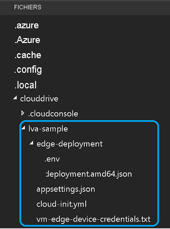

Ce tutoriel nécessite les ressources Azure suivantes :

* IoT Hub
* Compte de stockage
* Compte Azure Media Services
* Machine virtuelle Linux dans Azure, avec le [runtime IoT Edge](../../../../../iot-edge/how-to-install-iot-edge.md) installé

Pour ce guide de démarrage rapide, nous vous recommandons d’utiliser le [script d’installation des ressources Live Video Analytics](https://github.com/Azure/live-video-analytics/tree/master/edge/setup) pour déployer les ressources nécessaires dans votre abonnement Azure. Pour ce faire, procédez comme suit :

1. Ouvrez [Azure Cloud Shell](https://ms.portal.azure.com/#cloudshell/).
    > [!div class="mx-imgBorder"]
    > :::image type="content" source="../../../media/quickstarts/cloud-shell.png" alt-text="Cloud Shell":::
1. Si vous utilisez Cloud Shell pour la première fois, vous serez invité à sélectionner un abonnement pour créer un compte de stockage et un partage Microsoft Azure Files. Sélectionnez **Créer un stockage** pour créer un compte de stockage pour vos informations de session Cloud Shell. Ce compte de stockage est distinct du compte que le script créera pour être utilisé avec votre compte Azure Media Services.
1. Dans le menu déroulant situé sur le côté gauche de la fenêtre Cloud Shell, sélectionnez **Bash** comme environnement.

    
1. Exécutez la commande suivante :

    ```
    bash -c "$(curl -sL https://aka.ms/lva-edge/setup-resources-for-samples)"
    ```
    
    Si le script se termine correctement, toutes les ressources nécessaires doivent apparaître dans votre abonnement. Un total de 12 ressources est configuré par le script :
    1. **Point de terminaison de streaming** : facilite la lecture de la ressource AMS enregistrée.
    1. **Machine virtuelle** : il s’agit d’une machine virtuelle qui fait office d’appareil de périphérie.
    1. **Disque** : disque de stockage qui est attaché à la machine virtuelle pour stocker les éléments multimédias et les artefacts.
    1. **Groupe de sécurité réseau** : permet de filtrer le trafic réseau à destination et en provenance des ressources Azure dans un réseau virtuel Azure.
    1. **Interface réseau** : permet à une machine virtuelle Azure de communiquer avec des ressources Internet, Azure et autres.
    1. **Connexion bastion** : vous permet de vous connecter à votre machine virtuelle à l’aide de votre navigateur et du portail Azure.
    1. **Adresse IP publique** : permet aux ressources Azure de communiquer avec Internet et les services Azure publics.
    1. **Réseau virtuel** : permet à de nombreux types de ressources Azure, comme votre machine virtuelle, de communiquer de manière sécurisée entre elles, avec Internet et avec les réseaux locaux. En savoir plus sur les [réseaux virtuels](../../../../../virtual-network/virtual-networks-overview.md)
    1. **IoT Hub** : fait office de hub de messagerie centralisé pour la communication bidirectionnelle entre votre application IoT, les modules IoT Edge et les appareils qu'il gère.
    1. **Compte Media Services** : facilite la gestion et le streaming du contenu multimédia dans Azure.
    1. **Compte de stockage** : vous devez disposer d’un compte de stockage principal et vous pouvez avoir n’importe quel nombre de comptes de stockage secondaires associés à votre compte Media Services. Pour plus d'informations, consultez [Comptes de stockage Azure avec comptes Azure Media Services](../../../../latest/storage-account-concept.md).
    1. **Registre de conteneurs** : permet de stocker et de gérer vos images de conteneur Docker privé et les artefacts associés.
1. Une fois le script terminé, sélectionnez les accolades pour exposer la structure des dossiers. Quelques fichiers s’affichent dans le répertoire *~/clouddrive/lva-sample*. L’intérêt de ce guide de démarrage rapide est le suivant :

     * ***~/clouddrive/lva-sample/edge-deployment/.env*** : ce fichier contient des propriétés que Visual Studio Code utilise pour déployer des modules sur un appareil de périphérie.
     * ***~/clouddrive/lva-sample/appsetting.json*** : Visual Studio Code utilise ce fichier pour exécuter l’exemple de code.
     
    Vous aurez besoin de ces fichiers quand vous configurerez votre environnement de développement dans Visual Studio Code dans la prochaine section. Vous pouvez les copier dans un fichier local pour l’instant.
    
    

> [!TIP]
> En cas de problèmes avec les ressources Azure créées, consultez notre **[guide de dépannage](../../../troubleshoot-how-to.md#common-error-resolutions)** qui couvre les problèmes couramment rencontrés.