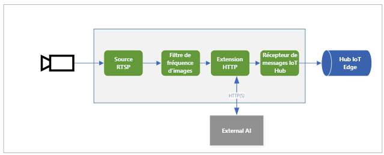

# <a name="quickstart-analyze-live-video-by-using-your-own-model"></a>Démarrage rapide : Analyser une vidéo en direct à l’aide de votre propre modèle

Ce guide de démarrage rapide vous montre comment utiliser Live Video Analytics sur IoT Edge pour analyser un flux vidéo en direct à partir d’une caméra IP (simulée). Vous allez voir comment appliquer un modèle de vision par ordinateur pour détecter des objets. Un sous-ensemble d’images du flux vidéo en direct est envoyé à un service d’inférence. Les résultats sont envoyés à IoT Edge Hub. 

Ce guide de démarrage rapide utilise une machine virtuelle Azure comme appareil IoT Edge, ainsi qu’un flux vidéo en direct simulé. Il est basé sur l’exemple de code écrit en C# et s’appuie sur le guide de démarrage rapide [Détecter les événements de mouvement et d’émission](detect-motion-emit-events-quickstart.md). 

## <a name="prerequisites"></a>Prérequis

* Un compte Azure incluant un abonnement actif. Si vous n’en avez pas déjà un, [créez un compte gratuitement](https://azure.microsoft.com/free/?WT.mc_id=A261C142F).
* [Visual Studio Code](https://code.visualstudio.com/), avec les extensions suivantes :
    * [Outils IoT Azure](https://marketplace.visualstudio.com/items?itemName=vsciot-vscode.azure-iot-tools)
    * [C#](https://marketplace.visualstudio.com/items?itemName=ms-dotnettools.csharp)
* [Kit SDK .NET Core 3.1](https://dotnet.microsoft.com/download/dotnet-core/3.1).
* Si vous n’avez pas suivi le guide de démarrage rapide [Détecter les événements de mouvement et d’émission](detect-motion-emit-events-quickstart.md), veillez à [configurer les ressources Azure](detect-motion-emit-events-quickstart.md#set-up-azure-resources).

> [!TIP]
> Lors de l’installation d’Azure IoT Tools, vous pouvez être invité à installer Docker. Vous pouvez ignorer cette invite.

## <a name="review-the-sample-video"></a>Réviser l’exemple de vidéo
Quand vous configurez les ressources Azure, une courte vidéo du trafic d’une autoroute est copiée dans Azure sur la machine virtuelle Linux que vous utilisez comme appareil IoT Edge. Ce guide de démarrage rapide utilise le fichier vidéo pour simuler un flux en direct.

Ouvrez une application comme le [lecteur multimédia VLC](https://www.videolan.org/vlc/). Sélectionnez Ctrl+N, puis collez un lien vers [la vidéo](https://lvamedia.blob.core.windows.net/public/camera-300s.mkv) pour démarrer la lecture. Vous voyez la séquence vidéo de nombreux véhicules se déplaçant dans le trafic d’une autoroute.

Dans ce guide de démarrage rapide, vous allez utiliser Live Video Analytics sur IoT Edge pour détecter des objets tels que des véhicules et des personnes. Vous allez publier les événements d’inférence associés sur IoT Edge Hub.

## <a name="overview"></a>Vue d’ensemble



Ce diagramme montre comment les signaux circulent dans ce guide de démarrage rapide. Un [module de périphérie](https://github.com/Azure/live-video-analytics/tree/master/utilities/rtspsim-live555) simule une caméra IP hébergeant un serveur RTSP (Real-Time Streaming Protocol). Un nœud de [source RTSP](media-graph-concept.md#rtsp-source) récupère le flux vidéo à partir de ce serveur et envoie des images vidéo au nœud [processeur de filtre de fréquence d’images](media-graph-concept.md#frame-rate-filter-processor). Ce processeur limite la fréquence d’images du flux vidéo qui atteint le nœud [processeur d’extension HTTP](media-graph-concept.md#http-extension-processor). 

Le nœud d’extension HTTP joue le rôle d’un proxy. Il convertit les images vidéo dans le type d’image spécifié. Ensuite, il relaie l’image sur REST vers un autre module de périphérie qui exécute un modèle IA derrière un point de terminaison HTTP. Dans cet exemple, le module de périphérie est généré à l’aide du modèle [YOLOv3](https://github.com/Azure/live-video-analytics/tree/master/utilities/video-analysis/yolov3-onnx), qui peut détecter de nombreux types d’objets. Le nœud processeur d’extension HTTP collecte les résultats de la détection et publie les événements sur le nœud [récepteur IoT Hub](media-graph-concept.md#iot-hub-message-sink). Le nœud envoie ensuite ces événements à [IoT Edge Hub](../../iot-edge/iot-edge-glossary.md#iot-edge-hub).

Dans ce guide de démarrage rapide, vous allez :

1. créer et déployer le graphe multimédia ;
1. interpréter les résultats ;
1. Supprimer des ressources.


## <a name="create-and-deploy-the-media-graph"></a>Créer et déployer le graphe multimédia
    
### <a name="examine-and-edit-the-sample-files"></a>Examiner et modifier les exemples de fichiers

Dans le cadre des prérequis, vous avez téléchargé l’exemple de code dans un dossier. Effectuez les étapes suivantes pour examiner et modifier les exemples de fichiers.

1. Dans Visual Studio Code, accédez à *src/edge*. Votre fichier  *.env* et quelques fichiers de modèle de déploiement s’affichent.

    Le modèle de déploiement fait référence au manifeste de déploiement de l’appareil de périphérie. Il inclut des valeurs d’espace réservé. Le fichier  *.env* inclut les valeurs de ces variables.

1. Accédez au dossier *src/cloud-to-device-console-app*. Ce dernier contient votre fichier *appsettings.json* et quelques autres fichiers :

    * ***c2d-console-app.csproj*** : fichier projet pour Visual Studio Code.
    * ***operations.json*** : liste des opérations que vous voulez que le programme exécute.
    * ***Program.cs*** : exemple de code de programme. Ce code :

        * Il charge les paramètres de l’application.
        * Invoque les méthodes directes exposées par le module Live Video Analytics sur IoT Edge. Vous pouvez utiliser le module pour analyser des flux vidéo en direct en invoquant ses [méthodes directes](direct-methods.md).
        * S’interrompt pour vous permettre d’examiner la sortie du programme dans la fenêtre **TERMINAL** et d’examiner les événements qui ont été générés par le module dans la fenêtre **SORTIE**.
        * Invoque des méthodes directes pour nettoyer des ressources.


1. Modifiez le fichier *operations.json* :
    * Changez le lien vers la topologie de graphe :

        `"topologyUrl" : "https://raw.githubusercontent.com/Azure/live-video-analytics/master/MediaGraph/topologies/httpExtension/topology.json"`

    * Sous `GraphInstanceSet`, modifiez le nom de la topologie de graphe de manière à ce qu’il corresponde à la valeur figurant dans le lien ci-dessus précédent :

      `"topologyName" : "InferencingWithHttpExtension"`

    * Sous `GraphTopologyDelete`, modifiez le nom :

      `"name": "InferencingWithHttpExtension"`

### <a name="generate-and-deploy-the-iot-edge-deployment-manifest"></a>Générez et déployez le manifeste de déploiement IoT Edge

1. Cliquez avec le bouton droit sur le fichier *src/edge/ deployment.yolov3.template.json*, puis sélectionnez **Générer un manifeste de déploiement IoT Edge**.

      

    Le fichier de manifeste *deployment.yolov3.amd64.json* est créé dans le dossier *src/edge/config*.

1. Si vous avez suivi le guide de démarrage rapide [Détecter les événements de mouvement et d’émission](detect-motion-emit-events-quickstart.md), ignorez cette étape. 

    Dans le cas contraire, en regard du volet **AZURE IOT HUB** dans l’angle en bas à gauche, sélectionnez l’icône **Autres actions**, puis sélectionnez **Définir la chaîne de connexion IoT Hub**. Vous pouvez copier la chaîne à partir du fichier *appsettings.json*. Ou, pour garantir que vous avez configuré le hub IoT approprié dans Visual Studio Code, utilisez la [commande Sélectionner IoT Hub](https://github.com/Microsoft/vscode-azure-iot-toolkit/wiki/Select-IoT-Hub).
    
    

1. Cliquez avec le bouton droit sur *src/edge/config/ deployment.yolov3.amd64.json*, puis sélectionnez **Créer un déploiement pour un seul appareil**. 

    

1. Quand vous êtes invité à sélectionner un appareil IoT Hub, sélectionnez **lva-sample-device**.
1. Après environ 30 secondes, dans l’angle en bas à gauche de la fenêtre, actualisez Azure IoT Hub. L’appareil de périphérie affiche maintenant les modules déployés suivants :

    * Le module Live Video Analytics, nommé **lvaEdge**
    * Le module **rtspsim**, qui simule un serveur RTSP et fait office de source d’un flux vidéo en direct
    * Le module **yolov3**, qui est le modèle de détection de l’objet YOLOv3 qui applique la vision par ordinateur aux images et retourne plusieurs classes de types d’objets
 
      

### <a name="prepare-to-monitor-events"></a>Préparer la supervision d’événements

Cliquez avec le bouton droit sur l’appareil Live Video Analytics, puis sélectionnez sur **Démarrer la supervision du point de terminaison d’événement intégré**. Vous devez effectuer cette étape pour superviser les événements IoT Hub dans la fenêtre **SORTIE** de Visual Studio Code. 

 

### <a name="run-the-sample-program"></a>Exécuter l'exemple de programme

1. Pour démarrer une session de débogage, appuyez sur la touche F5. Des messages s’affichent dans la fenêtre **TERMINAL**.
1. Le code *operations.json* commence par appeler les méthodes directes `GraphTopologyList` et `GraphInstanceList`. Si vous avez nettoyé les ressources après avoir suivi les guides de démarrage rapide précédents, ce processus retourne des listes vides, puis s’interrompt. Pour continuer, sélectionnez la touche Entrée.

   ```
   --------------------------------------------------------------------------
   Executing operation GraphTopologyList
   -----------------------  Request: GraphTopologyList  --------------------------------------------------
   {
   "@apiVersion": "1.0"
   }
   ---------------  Response: GraphTopologyList - Status: 200  ---------------
   {
   "value": []
   }
   --------------------------------------------------------------------------
   Executing operation WaitForInput
   Press Enter to continue
   ```

    La fenêtre **TERMINAL** affiche le jeu d’appels de méthode directe suivant :

     * Un appel à `GraphTopologySet` qui utilise le `topologyUrl` précédent
     * Un appel à `GraphInstanceSet` qui utilise le corps suivant :

         ```
         {
           "@apiVersion": "1.0",
           "name": "Sample-Graph-1",
           "properties": {
             "topologyName": "InferencingWithHttpExtension",
             "description": "Sample graph description",
             "parameters": [
               {
                 "name": "rtspUrl",
                 "value": "rtsp://rtspsim:554/media/camera-300s.mkv"
               },
               {
                 "name": "rtspUserName",
                 "value": "testuser"
               },
               {
                 "name": "rtspPassword",
                 "value": "testpassword"
               }
             ]
           }
         }
         ```

     * Un appel à `GraphInstanceActivate` qui démarre l’instance de graphe et le flux vidéo
     * Un deuxième appel à `GraphInstanceList` qui indique que l’instance de graphe est dans l’état En cours d’exécution
1. La sortie affichée dans la fenêtre **TERMINAL** fait une pause au niveau d’une invite `Press Enter to continue`. Ne sélectionnez pas encore Entrée. Faites défiler vers le haut pour voir les charges utiles de réponse JSON pour les méthodes directes que vous avez invoquées.
1. Basculez vers la fenêtre **SORTIE** de Visual Studio Code. Les messages indiquant que le module Live Video Analytics sur IoT Edge effectue des envois à IoT Hub s’affichent. La section suivante de ce guide de démarrage rapide décrit ces messages.
1. Le graphe multimédia continue à s’exécuter et à afficher les résultats. Le simulateur RTSP continue de boucler la vidéo source. Pour arrêter le graphe multimédia, retournez dans la fenêtre **TERMINAL**, puis sélectionnez Entrée. 

    La série d’appels suivante nettoie les ressources :
      * Un appel à `GraphInstanceDeactivate` désactive l’instance de graphe.
      * Un appel à `GraphInstanceDelete` supprime l’instance.
      * Un appel à `GraphTopologyDelete` supprime la topologie.
      * Un dernier appel à `GraphTopologyList` indique que la liste est vide.

## <a name="interpret-results"></a>Interpréter les résultats

Quand vous exécutez le graphe multimédia, les résultats du nœud processeur d’extension HTTP passe par le nœud récepteur IoT Hub au hub IoT. Les messages qui s’affichent dans la fenêtre **SORTIE** contiennent une section `body` et une section `applicationProperties`. Pour plus d’informations, consultez [Créer et lire des messages IoT Hub](https://docs.microsoft.com/azure/iot-hub/iot-hub-devguide-messages-construct).

Dans les messages suivants, le module Live Video Analytics définit les propriétés de l’application et le contenu du corps. 

### <a name="mediasessionestablished-event"></a>Événement MediaSessionEstablished

Quand un graphe multimédia est instancié, le nœud source RTSP tente de se connecter au serveur RTSP qui s’exécute sur le conteneur rtspsim-live55. Si la connexion réussit, l’événement suivant est affiché. Le type de l’événement est `Microsoft.Media.MediaGraph.Diagnostics.MediaSessionEstablished`.

```
[IoTHubMonitor] [9:42:18 AM] Message received from [lvaedgesample/lvaEdge]:
{
  "body": {
    "sdp": "SDP:\nv=0\r\no=- 1586450538111534 1 IN IP4 nnn.nn.0.6\r\ns=Matroska video+audio+(optional)subtitles, streamed by the LIVE555 Media Server\r\ni=media/camera-300s.mkv\r\nt=0 0\r\na=tool:LIVE555 Streaming Media v2020.03.06\r\na=type:broadcast\r\na=control:*\r\na=range:npt=0-300.000\r\na=x-qt-text-nam:Matroska video+audio+(optional)subtitles, streamed by the LIVE555 Media Server\r\na=x-qt-text-inf:media/camera-300s.mkv\r\nm=video 0 RTP/AVP 96\r\nc=IN IP4 0.0.0.0\r\nb=AS:500\r\na=rtpmap:96 H264/90000\r\na=fmtp:96 packetization-mode=1;profile-level-id=4D0029;sprop-parameter-sets=Z00AKeKQCgC3YC3AQEBpB4kRUA==,aO48gA==\r\na=control:track1\r\n"
  },
  "applicationProperties": {
    "dataVersion": "1.0",
    "topic": "/subscriptions/{subscriptionID}/resourceGroups/{name}/providers/microsoft.media/mediaservices/hubname",
    "subject": "/graphInstances/GRAPHINSTANCENAMEHERE/sources/rtspSource",
    "eventType": "Microsoft.Media.MediaGraph.Diagnostics.MediaSessionEstablished",
    "eventTime": "2020-04-09T16:42:18.1280000Z"
  }
}
```

Dans ce message, notez les informations suivantes :

* Le message est un événement de diagnostic. `MediaSessionEstablished` indique que le nœud source RTSP (l’objet) s’est connecté au simulateur RTSP et a commencé à recevoir un flux en direct (simulé).
* Dans `applicationProperties`, `subject` indique que le message a été généré à partir du nœud source RTSP dans le graphe multimédia.
* Dans `applicationProperties`, `eventType` indique que cet événement est un événement de diagnostic.
* `eventTime` indique l’heure à laquelle l’événement s’est produit.
* `body` contient des données relatives à l’événement de diagnostic. Dans ce cas, les données comprennent les détails du [protocole SDP](https://en.wikipedia.org/wiki/Session_Description_Protocol).

### <a name="inference-event"></a>Événement d'inférence

Le nœud processeur d’extension HTTP reçoit les résultats d’inférence à partir du module yolov3. Il émet ensuite les résultats par le biais du nœud récepteur IoT Hub sous la forme d’événements d’inférence. 

Dans ces événements, le type est défini sur `entity` pour indiquer qu’il s’agit d’une entité, comme une voiture ou un camion. La valeur `eventTime` est l’heure UTC à laquelle l’objet a été détecté. 

Dans l’exemple suivant, deux voitures ont été détectées dans la même image vidéo, avec des niveaux de confiance différents.

```
[IoTHubMonitor] [11:37:17 PM] Message received from [lva-sample-device/lvaEdge]:
{
  "body": {
    "inferences": [
      {
        "entity": {
          "box": {
            "h": 0.0344108157687717,
            "l": 0.5756940841674805,
            "t": 0.5929375966389974,
            "w": 0.04484643936157227
          },
          "tag": {
            "confidence": 0.8714089393615723,
            "value": "car"
          }
        },
        "type": "entity"
      },
      {
        "entity": {
          "box": {
            "h": 0.03960910373263889,
            "l": 0.2750667095184326,
            "t": 0.6102327558729383,
            "w": 0.031027007102966308
          },
          "tag": {
            "confidence": 0.7042660713195801,
            "value": "car"
          }
        },
        "type": "entity"
      }
    ]
  },
  "applicationProperties": {
    "topic": "/subscriptions/{subscriptionID}/resourceGroups/{name}/providers/microsoft.media/mediaservices/hubname",
    "subject": "/graphInstances/GRAPHINSTANCENAMEHERE/processors/inferenceClient",
    "eventType": "Microsoft.Media.Graph.Analytics.Inference",
    "eventTime": "2020-04-23T06:37:16.097Z"
  }
}
```

Dans le message, notez les informations suivantes :

* Dans `applicationProperties`, `subject` fait référence au nœud présent dans la topologie de graphe à partir duquel le message a été généré. 
* Dans `applicationProperties`, `eventType` indique que cet événement est un événement d’analytique.
* La valeur `eventTime` correspond à l’heure à laquelle l’événement s’est produit.
* La section `body` contient des données relatives à l’événement d’analytique. Dans ce cas, l’événement est un événement d’inférence. Par conséquent, le corps contient des données `inferences`.
* La section `inferences` indique que le `type` est `entity`. Cette section inclut des données supplémentaires sur l’entité.

## <a name="clean-up-resources"></a>Nettoyer les ressources

Si vous envisagez d’essayer d’autres guides de démarrage rapide, conservez les ressources que vous avez créées. Dans le cas contraire, accédez au portail Azure, puis à vos groupes de ressources. Sélectionnez ensuite le groupe de ressources où vous avez exécuté ce guide de démarrage rapide, puis supprimez toutes les ressources.

## <a name="next-steps"></a>Étapes suivantes

Passez en revue les défis supplémentaires pour les utilisateurs expérimentés :

* Utilisez une [caméra IP](https://en.wikipedia.org/wiki/IP_camera) qui prend en charge RTSP au lieu d’utiliser le simulateur RTSP. Vous pouvez rechercher les caméras IP qui prennent RTSP en charge dans la page des produits [conformes ONVIF](https://www.onvif.org/conformant-products/). Recherchez les appareils conformes aux profils G, S ou T.
* Utilisez un appareil Linux AMD64 ou x64 plutôt qu’une machine virtuelle Linux Azure. Cet appareil doit se trouver dans le même réseau que la caméra IP. Vous pouvez suivre les instructions mentionnées dans [Installer le runtime Azure IoT Edge sur Linux](https://docs.microsoft.com/azure/iot-edge/how-to-install-iot-edge-linux). Inscrivez ensuite l’appareil auprès d’Azure IoT Hub en suivant les instructions mentionnées dans [Déployer votre premier module IoT Edge sur un appareil virtuel Linux](https://docs.microsoft.com/azure/iot-edge/quickstart-linux).

