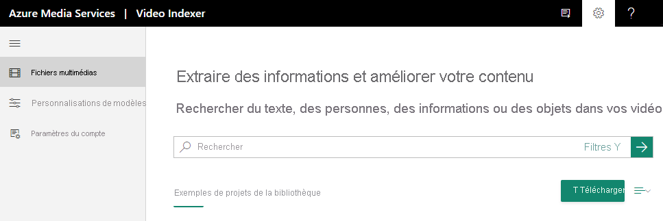

# Tutoriel : Comment s’inscrire et charger votre première vidéo

Ce tutoriel de démarrage vous montre comment vous connecter au site web Video Indexer et charger votre première vidéo.

Lorsque vous créez un compte Video Indexer, vous pouvez choisir un compte d’essai gratuit (où vous obtenez un certain nombre de minutes d’indexation gratuites) ou une option payante (où vous n’êtes pas limités par le quota). Avec l’essai gratuit, Video Indexer fournit jusqu’à 600 heures d’indexation gratuite aux utilisateurs du site web et jusqu’à 2 400 heures d’indexation gratuite aux utilisateurs de l’API. Avec l’option payante, vous créez un compte Video Indexer [connecté à votre abonnement Azure et un compte Azure Media Services](connect-to-azure.md). Vous payez pour les minutes indexées, ainsi que pour les frais liés au compte Azure Media Services. 

## S’inscrire à Video Indexer

Pour commencer à développer avec Video Indexer, accédez au site web [Video Indexer](https://www.videoindexer.com) et inscrivez-vous.

## Charger une vidéo à l’aide du site web Video Indexer

1. Connectez-vous au site web [Video Indexer](https://www.videoindexer.ai/).
2. Pour charger une vidéo, appuyez sur le bouton ou le lien **Charger**.

    

    Une fois votre vidéo chargée, Video Indexer démarre l’indexation et l’analyse.

     

    Une fois l’analyse terminée par Video Indexer, vous obtiendrez une notification contenant un lien vers votre vidéo et une brève description des éléments découverts dedans. Par exemple : personnes, rubriques, OCR.

## Étapes suivantes

Vous pouvez maintenant utiliser site web [Video Indexer](video-indexer-view-edit.md) ou le [Portail des développeurs Video Indexer](video-indexer-use-apis.md) pour afficher les insights de la vidéo. 

## Voir aussi

[Présentation de Video Indexer](video-indexer-overview.md)

[Commencer à utiliser des API](video-indexer-use-apis.md).

