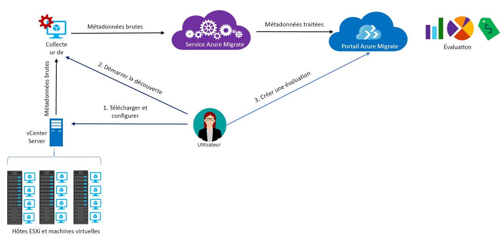

# À propos d’Azure Migrate

Le service Azure Migrate évalue les charges de travail locales pour la migration vers Azure. Le service évalue la pertinence de la migration des machines locales, effectue le dimensionnement en fonction des performances et fournit des estimations de coût pour l’exécution des ordinateurs locaux dans Azure. Si vous envisagez d’effectuer des migrations lift-and-shift ou si vous êtes dans les premières étapes de l’évaluation de la migration, ce service vous correspond. Après l’évaluation, vous pouvez utiliser des services tels [qu’Azure Site Recovery](https://docs.microsoft.com/azure/site-recovery/site-recovery-overview) et [Azure Database Migration Service](https://docs.microsoft.com/azure/dms/dms-overview), pour migrer les ordinateurs vers Azure.

## Pourquoi utiliser Azure Migrate ?

Azure Migrate vous aide à :

- **Évaluer la préparation pour Azure** : évaluer si vos ordinateurs locaux sont appropriés pour l’exécution dans Azure.
- **Obtenir des recommandations sur la taille** : obtenir des recommandations de taille pour des machines virtuelles Azure, en fonction de l’historique des performances des machines virtuelles locales.
- **Estimer les coûts mensuels** : obtenir les coûts estimés pour l’exécution d’ordinateurs locaux dans Azure.  
- **Migrer en toute confiance** : visualiser les dépendances des machines locales pour créer des groupes d’ordinateurs que vous pourrez évaluer et migrer en même temps.

## Limitations actuelles

- Vous pouvez seulement évaluer les machines virtuelles VMware locales pour la migration vers les machines virtuelles Azure. Les machines virtuelles VMware doivent être gérées par vCenter Server (version 5.5, 6.0 ou 6.5).
- Si vous souhaitez évaluer des machines virtuelles Hyper et des serveurs physiques, utilisez le [Planificateur de déploiement Azure Site Recovery](http://aka.ms/asr-dp-hyperv-doc) pour Hyper-V et nos [outils partenaires](https://azure.microsoft.com/migration/partners/) pour les machines physiques.
- Vous pouvez détecter jusqu’à 1500 machines virtuelles par détection et jusqu’à 1500 machines virtuelles par projet. En outre, vous pouvez évaluer jusqu’à 1500 machines virtuelles par évaluation.
- Si vous voulez découvrir un environnement plus grand, vous pouvez séparer la découverte et créer plusieurs projets. [Plus d’informations](how-to-scale-assessment.md) Azure Migrate prend en charge jusqu’à 20 projets par abonnement.
- Azure Migrate prend uniquement en charge les disques managés pour l’évaluation de la migration.
-  Vous ne pouvez créer un projet Azure Migrate que dans la zone géographique États-Unis. Toutefois, vous pouvez planifier une migration vers n’importe quel emplacement Azure cible.
    - Seules les métadonnées détectées à partir de l’environnement local sont stockées dans la région du projet de migration.
    - Les métadonnées sont stockées dans une des régions de la zone géographique : USA Centre-Ouest/USA Est.
    - Si vous utilisez la visualisation des dépendances avec un espace de travail Log Analytics, il est créé dans la même région que le projet.

## Pour quoi dois-je payer ?

[En savoir plus](https://azure.microsoft.com/pricing/details/azure-migrate/) sur la tarification Azure Migrate.

## Que comprend une évaluation ?

Les paramètres d’évaluation peuvent être personnalisés selon vos besoins. Les propriétés d’évaluation sont récapitulées dans le tableau ci-dessous.

**Propriété** | **Détails**
--- | ---
**Emplacement cible** | Emplacement Azure vers lequel vous souhaitez migrer.  Azure Migrate prend actuellement en charge 30 régions. [Vérifier les régions](https://azure.microsoft.com/global-infrastructure/services/). USA Ouest 2 est la région cible par défaut.
**Type de stockage** | le type de disques que vous souhaitez allouer dans Azure. Elle s’applique lorsque le critère de dimensionnement est **en local**. Vous spécifiez le type de disque cible en tant que disques managés Premium (par défaut) ou Standard. Pour le dimensionnement basé sur les performances, la suggestion de dimensionnement du disque est automatiquement effectuée selon les données de performances des machines virtuelles.
**Critère de dimensionnement** | Le dimensionnement peut être basé sur **l’historique des performances** des machines virtuelles locales, ou **localement** (par défaut) sans tenir compte de l’historique des performances.
**Offre Azure** | L’[offre Azure](https://azure.microsoft.com/support/legal/offer-details/) à laquelle vous êtes inscrit. Azure Migrate estime le coût en conséquence.
**Azure Hybrid Benefit** | Si vous disposez de Software Assurance et que vous êtes éligible à [Azure Hybrid Benefit](https://azure.microsoft.com/pricing/hybrid-use-benefit/) avec des réductions.
**Instances réservées** |  Si vous disposez d’[instances réservées](https://azure.microsoft.com/pricing/reserved-vm-instances/) dans Azure. Azure Migrate estime le coût en conséquence.
**Durée de fonctionnement de la machine virtuelle** | La durée pendant laquelle les machines virtuelles seront exécutées dans Azure. Les estimations de coût sont effectuées en conséquence.
**Niveau tarifaire** | Le [niveau tarifaire (de base/standard)](../virtual-machines/windows/sizes-general.md) des machines virtuelles Azure cibles. Par exemple, si vous envisagez de migrer un environnement de production, vous pouvez prendre en compte le niveau Standard, qui fournit des machines virtuelles avec une faible latence, mais est sans doute plus coûteux. En revanche, dans un environnement de test, vous pouvez utiliser le niveau de base avec une latence plus élevée et des coûts plus faibles. Par défaut le niveau [standard](../virtual-machines/windows/sizes-general.md) est utilisé.
**Historique des performances** | Par défaut, Azure Migrate évalue les performances des machines locales à l’aide de l’historique des performances du dernier jour, avec une valeur de centile de 95 %.
**Séries de machine virtuelle** | Les séries de machine virtuelle utilisées pour les estimations de taille. Par exemple, si vous disposez d’un environnement de production que vous ne souhaitez pas migrer vers des machines virtuelles de série A dans Azure, vous pouvez exclure la série A de la liste ou des séries. Le dimensionnement est uniquement basé sur les séries sélectionnées.   
**Facteur de confort** | Azure Migrate considère une mémoire tampon (facteur de confort) au cours de l’évaluation. Cette mémoire tampon est appliquée sur des données d’utilisation de l’ordinateur pour les machines virtuelles (processeur, mémoire, disque et réseau). Le facteur de confort prend en compte les problèmes, tels que l’utilisation saisonnière, l’historique des performances de courte durée et l’augmentation probable de l’utilisation future.   Par exemple, une machine virtuelle de 10 cœurs avec 20 % d’utilisation correspond normalement à une machine virtuelle à 2 cœurs. Toutefois, avec un facteur de confort de 2.0x, le résultat est une machine virtuelle de 4 cœurs. Le paramètre de confort par défaut est 1.3x.

## Comment fonctionne Azure Migrate ?

1.  Lorsque vous créez un projet Azure Migrate.
2.  Azure Migrate utilise une machine virtuelle locale appelée l’appliance collecteur, pour détecter des informations sur vos machines locales. Pour créer l’appliance, vous devez télécharger un fichier d’installation au format Open Virtualization Appliance (.ova) et l’importer en tant que machine virtuelle sur votre vCenter Server local.
3. Vous vous connectez à la machine virtuelle à partir du serveur vCenter et lui attribuer un nouveau mot de passe lors de la connexion.
4. Vous exécutez le collecteur sur la machine virtuelle pour initier la découverte.
5. Le collecteur collecte les métadonnées de machine virtuelle à l’aide des applets de commande VMware PowerCLI. La détection se fait sans agent et n’installe rien sur les ordinateurs hôtes VMware ou les machines virtuelles. Les métadonnées collectées incluent des informations sur les machines virtuelles (cœurs, mémoire, disques, tailles de disque et cartes réseau). Elle collecte également les données de performances des machines virtuelles, notamment concernant le processeur et la mémoire, les IOPS du disque, le débit de disque (Mbits/s) et la sortie du réseau (Mbits/s).
5.  Les métadonnées sont ajoutées au projet Azure Migrate. Vous pouvez les afficher dans le portail Azure.
6.  Dans le cadre de l’évaluation, vous pouvez regrouper les machines virtuelles découvertes. Par exemple, vous pouvez regrouper les machines virtuelles qui exécutent la même application. Pour un regroupement plus précis, vous pouvez utiliser la visualisation des dépendances pour afficher les dépendances d’une machine spécifique ou de toutes les machines d’un groupe et affiner le groupe.
7.  Après avoir défini un groupe, vous créez une évaluation pour lui.
8.  Une fois l’évaluation terminée, vous pouvez l’afficher dans le portail ou la télécharger au format Excel.

  

## Quelles sont les exigences de port ?

Le tableau récapitule les ports nécessaires pour les communications d’Azure Migrate.

Composant | Communique avec |  Détails
--- | --- |---
Collecteur  | Service Azure Migrate | Le collecteur se connecte au service via le port SSL 443.
Collecteur | Serveur vCenter | Par défaut, le collecteur se connecte au serveur vCenter via le port 443. Si le serveur écoute sur un port différent, configurez-le comme port sortant sur le collecteur de machine virtuelle.
Machine virtuelle locale | Espace de travail Log Analytics | [TCP 443] | [Microsoft Monitoring Agent (MMA)](../log-analytics/log-analytics-windows-agent.md) utilise le port TCP 443 pour se connecter à Log Analytics. Vous avez besoin de ce port uniquement si vous utilisez la fonctionnalité de visualisation des dépendances nécessitant l’agent MMA.

## Que se passe-t-il après l’évaluation ?

Une fois que vous avez évalué des machines locales, vous pouvez utiliser deux outils pour effectuer la migration :

- **Azure Site Recovery** : vous pouvez utiliser Azure Site Recovery pour migrer vers Azure. Pour ce faire, vous [préparez les composants Azure](../site-recovery/tutorial-prepare-azure.md) dont vous avez besoin, y compris un compte de stockage et un réseau virtuel. En local, vous [préparez votre environnement VMware](../site-recovery/vmware-azure-tutorial-prepare-on-premises.md). Lorsque tout est prêt, vous configurez et activez la réplication vers Azure et vous migrez les machines virtuelles. [Plus d’informations](../site-recovery/vmware-azure-tutorial.md)
- **Azure Database Migration**: si des machines locales sont en cours d’exécution sur une base de données telle que SQL Server, MySQL ou Oracle, vous pouvez utiliser [Azure Database Migration Service](../dms/dms-overview.md) pour les migrer vers Azure.

## Étapes suivantes

- [Suivre le didacticiel](tutorial-assessment-vmware.md) pour créer une évaluation pour une machine virtuelle VMware locale.
- [Revoir les questions fréquemment posées](resources-faq.md) sur Azure Migrate.
