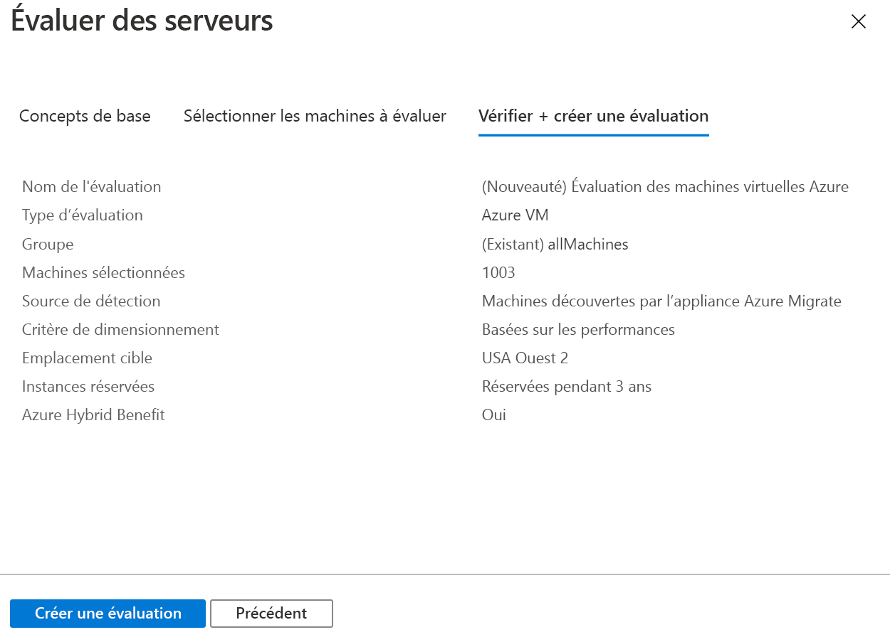

# <a name="assess-vmware-vms-by-using-azure-migrate-server-assessment"></a>Évaluer des machines virtuelles VMware à l’aide d’Azure Migrate Server Assessment

Cet article vous explique comment évaluer des machines virtuelles VMware locales à l’aide de l’outil Server Assessment dans Azure Migrate.

[Azure Migrate](migrate-services-overview.md) fournit un hub d’outils qui vous permettent de découvrir, d’évaluer et de migrer des applications, une infrastructure et des charges de travail vers Microsoft Azure. Le hub comprend des outils Azure Migrate et des offres d’ISV (fournisseurs de logiciels indépendants) partenaires de Microsoft.

Ce tutoriel est le deuxième d’une série qui explique comment évaluer et migrer des machines virtuelles VMware vers Azure. Dans ce tutoriel, vous allez apprendre à :
> [!div class="checklist"]
> * Configurer un projet Azure Migrate.
> * Configurer une appliance Azure Migrate qui s’exécute localement pour évaluer les machines virtuelles.
> * Démarrer la découverte continue des machines virtuelles locales. L’appliance envoie les données de configuration et de performances des machines virtuelles découvertes à Azure.
> * Regrouper les machines virtuelles découvertes, et évaluer le groupe de machines virtuelles.
> * Passer en revue l’évaluation.

> [!NOTE]
> Les tutoriels vous montrent le chemin de déploiement le plus simple pour un scénario donné afin que vous puissiez configurer rapidement une preuve de concept. Ils utilisent des options par défaut, le cas échéant, et ne montrent pas tous les paramètres et chemins possibles. Pour obtenir des instructions détaillées, consultez les articles sur les procédures.

Si vous n’avez pas d’abonnement Azure, créez un [compte gratuit](https://azure.microsoft.com/pricing/free-trial/) avant de commencer.

## <a name="prerequisites"></a>Conditions préalables requises

[Suivez le premier tutoriel](tutorial-prepare-vmware.md) de cette série. Si vous ne le faites pas, les instructions de ce tutoriel ne fonctionneront pas.

Voici ce que vous avez dû faire dans le premier tutoriel :

- [Configurer des autorisations Azure](tutorial-prepare-vmware.md#prepare-azure) pour Azure Migrate.
- [Préparer VMware](tutorial-prepare-vmware.md#prepare-for-vmware-vm-assessment) à l’évaluation :
   - [Vérifier](migrate-support-matrix-vmware.md#vmware-requirements) les paramètres VMware.
   - Configurer des autorisations dans VMware pour créer une machine virtuelle VMware avec un modèle OVA.
   - Configurer un [compte pour la détection de machine virtuelle](migrate-support-matrix-vmware.md#vmware-requirements). 
   - Rendre les [ports nécessaires](migrate-support-matrix-vmware.md#port-access) disponibles.
   - Tenir compte des [URL nécessaires](migrate-replication-appliance.md#url-access) à l’accès à Azure.

## <a name="set-up-an-azure-migrate-project"></a>Configurer un projet Azure Migrate

Configurez un nouveau projet Azure Migrate comme suit :

1. Dans le portail Azure, sélectionnez **Tous les services**, puis recherchez **Azure Migrate**.
1. Sous **Services**, sélectionnez **Azure Migrate**.
1. Dans **Vue d’ensemble**, sous **Découvrir, évaluer et migrer des serveurs**, sélectionnez **Évaluer et migrer des serveurs**.

   

1. Dans **Mise en route**, sélectionnez **Ajouter des outils**.
1. Dans **Projet de migration**, sélectionnez votre abonnement Azure, puis créez un groupe de ressources si vous n’en avez pas.     
1. Dans **Détails du projet**, spécifiez le nom du projet ainsi que la zone géographique où vous souhaitez le créer. Asie, Europe, Royaume-Uni et États-Unis sont pris en charge.

   La géographie du projet sert uniquement à stocker les métadonnées rassemblées à partir des machines virtuelles locales. Vous pouvez sélectionner n’importe quelle région cible quand vous exécutez une migration.

   

1. Sélectionnez **Suivant**.
1. Dans **Sélectionner un outil d’évaluation**, sélectionnez **Azure Migrate : Server Assessment** > **Suivant**.

   

1. Dans **Sélectionner un outil de migration**, sélectionnez **Ignorer l’ajout d’un outil de migration pour l’instant** > **Suivant**.
1. Dans **Vérifier + ajouter des outils**, passez en revue les paramètres, puis sélectionnez **Ajouter des outils**.
1. Attendez quelques minutes, le temps nécessaire au déploiement du projet Azure Migrate. Vous êtes dirigé vers la page du projet. Si vous ne voyez pas le projet, vous pouvez y accéder à partir de **Serveurs** dans le tableau de bord Azure Migrate.

## <a name="set-up-the-appliance-vm"></a>Configurer la machine virtuelle de l’appliance

Azure Migrate Server Assessment exécute une appliance de machine virtuelle VMware légère. Cette appliance effectue la découverte des machines virtuelles et rassemble les métadonnées et les données de performances des machines virtuelles.

Pour configurer l’appliance :

- Téléchargez un fichier de modèle OVA, puis importez-le dans vCenter Server.
- Créez l’appliance et vérifiez qu’elle peut se connecter à Azure Migrate Server Assessment.
- Configurez l’appliance pour la première fois, puis inscrivez-la auprès du projet Azure Migrate.

Vous pouvez configurer plusieurs appliances pour un seul projet Azure Migrate. Sur toutes les appliances, Server Assessment prend en charge la découverte d’un maximum de 35 000 machines virtuelles. Un maximum de 10 000 serveurs par appliance peut être découvert.

### <a name="download-the-ova-template"></a>Télécharger le modèle OVA

1. Dans **Objectifs de migration** > **Serveurs** > **Azure Migrate : Server Assessment**, sélectionnez **Découvrir**.
1. Dans **Découvrir des machines** > **Vos machines sont-elles virtualisées ?** , sélectionnez **Oui, avec l’hyperviseur vSphere VMWare**.
1. Sélectionnez **Télécharger** pour télécharger le fichier de modèle OVA.

   

### <a name="verify-security"></a>Vérifier la sécurité

Vérifiez que le fichier OVA est sécurisé avant de le déployer :

1. Sur l’ordinateur où vous avez téléchargé le fichier, ouvrez une fenêtre de commande d’administrateur.
1. Exécutez la commande suivante pour générer le code de hachage du fichier OVA :
  
   ```C:\>CertUtil -HashFile <file_location> [Hashing Algorithm]```
   
   Exemple d’utilisation : ```C:\>CertUtil -HashFile C:\AzureMigrate\AzureMigrate.ova SHA256```

Pour la version 2.19.07.30, le code de hachage généré doit correspondre à ces valeurs :

**Algorithme** | **Valeur de hachage**
--- | ---
MD5 | c06ac2a2c0f870d3b274a0b7a73b78b1
SHA256 | 4ce4faa3a78189a09a26bfa5b817c7afcf5b555eb46999c2fad9d2ebc808540c

### <a name="create-the-appliance-vm"></a>Créer la machine virtuelle de l’appliance

Importez le fichier téléchargé, puis créez une machine virtuelle :

1. Dans la console du client vSphere, sélectionnez **File** (Fichier) > **Deploy OVF Template** (Déployer le modèle OVF).

   

1. Dans l’Assistant de déploiement du modèle OVF > **Source**, spécifiez l’emplacement du fichier .OVA.
1. Dans **Name** (Nom) et **Location** (Emplacement), spécifiez un nom convivial pour la machine virtuelle. Sélectionnez l’objet d’inventaire dans lequel la machine virtuelle doit être hébergée.
1. Dans **Host/Cluster** (Hôte/Cluster), spécifiez l’hôte ou le cluster sur lequel s’exécute la machine virtuelle.
1. Dans **Storage** (Stockage), spécifiez la destination du stockage de la machine virtuelle.
1. Dans **Disk Format** (Format de disque), spécifiez le type de disque et la taille.
1. Dans **Network Mapping** (Mappage réseau), spécifiez le réseau auquel se connectera la machine virtuelle. Le réseau a besoin d’une connexion à Internet pour envoyer des métadonnées à Azure Migrate Server Assessment.
1. Validez les paramètres, puis sélectionnez **Finish (Terminer)** .

### <a name="verify-appliance-access-to-azure"></a>Vérifier l’accès de l’appliance à Azure

Vérifiez que la machine virtuelle de l’appliance peut se connecter aux [URL Azure](migrate-appliance.md#url-access).

### <a name="configure-the-appliance"></a>Configurer l’appliance

Configurez l’appliance en suivant ces étapes :

1. Dans la console du client vSphere, cliquez avec le bouton droit sur la machine virtuelle, puis sélectionnez **Open Console** (Ouvrir la console).
1. Spécifiez la langue, le fuseau horaire et le mot de passe pour l’appliance.
1. Ouvrez un navigateur sur une machine qui peut se connecter à la machine virtuelle, puis ouvrez l’URL de l’application web de l’appliance : **https://*nom ou adresse IP de l’appliance* : 44368**.

   Vous pouvez aussi ouvrir l’application à partir du Bureau de l’appliance en sélectionnant le raccourci de l’application.
1. Dans l’application web > **Configurer les prérequis**, procédez comme suit :
   - **Licence** : Acceptez les termes de licence et lisez les informations relatives aux tiers.
   - **Connectivité** : L’application vérifie que la machine virtuelle a accès à Internet. Si la machine virtuelle utilise un proxy :
     - Sélectionnez **Paramètres du proxy** et spécifiez l’adresse du proxy et le port d’écoute sous la forme http://ProxyIPAddress ou http://ProxyFQDN.
     - Spécifiez les informations d’identification si le proxy nécessite une authentification.
     - Notez que seul le proxy HTTP est pris en charge.
   - **Synchronisation de l’heure** : L’heure de l’appliance doit être synchronisée avec l’heure Internet pour que la découverte fonctionne correctement.
   - **Installer les mises à jour** : L’appliance vérifie que les dernières mises à jour sont installées.
   - **Installer VDDK** : L’appliance vérifie que VDDK (VMWare vSphere Virtual Disk Development Kit) est installé. S’il n’est pas installé, téléchargez VDDK 6.7 à partir de VMware, puis extrayez le contenu du fichier zip téléchargé à l’emplacement spécifié sur l’appliance.

     Azure Migrate Server Migration utilise VDDK pour répliquer les machines durant la migration vers Azure.       

### <a name="register-the-appliance-with-azure-migrate"></a>Inscrire l’appliance auprès d’Azure Migrate

1. Sélectionnez **Connexion**. S’il n’apparaît pas, vérifiez que vous avez désactivé le bloqueur de fenêtres publicitaires dans le navigateur.
1. Sous le nouvel onglet, connectez-vous avec votre nom d’utilisateur et votre mot de passe Azure.
   
   La connexion avec un code PIN n’est pas prise en charge.
1. Une fois la connexion réussie, revenez à l’application web.
1. Sélectionnez l’abonnement dans lequel le projet Azure Migrate a été créé, puis sélectionnez le projet.
1. Spécifiez un nom pour l’appliance. Le nom doit être alphanumérique et comporter 14 caractères au maximum.
1. Sélectionnez **Inscription**.

## <a name="start-continuous-discovery"></a>Démarrer la découverte en continu

L’appliance doit se connecter à vCenter Server pour découvrir les données de configuration et de performances des machines virtuelles.

### <a name="specify-vcenter-server-details"></a>Spécifier les détails vCenter Server
1. Dans **Spécifier les détails vCenter Server**, spécifiez le nom (FQDN) ou l’adresse IP de l’instance du serveur vCenter Server. Vous pouvez laisser le port par défaut ou spécifier un port personnalisé sur lequel votre serveur vCenter Server est à l’écoute.
1. Dans **Nom d’utilisateur** et **Mot de passe**, spécifiez les informations d’identification du compte vCenter Server que l’appliance doit utiliser pour découvrir les machines virtuelles sur l’instance vCenter Server. 

   Vérifiez que le compte dispose des [autorisations nécessaires pour la découverte](migrate-support-matrix-vmware.md#vmware-requirements). Vous pouvez [définir l’étendre de la détection](tutorial-assess-vmware.md#set-the-scope-of-discovery) en limitant l’accès au compte vCenter.
1. Sélectionnez **Valider la connexion** pour vérifier que l’appliance peut se connecter à vCenter Server.

### <a name="specify-vm-credentials"></a>Spécifier des informations d’identification de machine virtuelle
Pour la découverte des applications, des rôles et des fonctionnalités, et pour la visualisation des dépendances des machines virtuelles, vous pouvez fournir des informations d’identification de machine virtuelle qui permettent d’accéder aux machines virtuelles VMware. Vous pouvez ajouter des informations d’identification pour les machines virtuelles Windows et d’autres pour les machines virtuelles Linux. [Découvrez-en plus](https://docs.microsoft.com/azure/migrate/migrate-support-matrix-vmware#assessment-vcenter-server-permissions) sur les autorisations d’accès nécessaires.

> [!NOTE]
> Cette entrée est facultative. Mais vous en avez besoin si vous voulez activer la découverte des applications et visualiser les dépendances sans agent.

1. Dans **Découvrir les applications et les dépendances sur les machines virtuelles**, sélectionnez **Ajouter les informations d’identification**.
1. Effectuez une sélection pour **Système d’exploitation**.
1. Fournissez un nom convivial pour les informations d’identification.
1. Dans **Nom d’utilisateur** et **Mot de passe**, spécifiez un compte disposant au moins d’un accès invité sur les machines virtuelles.
1. Sélectionnez **Ajouter**.

Une fois que vous avez spécifié l’instance vCenter Server et les informations d’identification de la machine virtuelle (facultatif), sélectionnez **Enregistrer et démarrer la découverte** pour démarrer la découverte de l’environnement local.

Environ 15 minutes sont nécessaires pour que les métadonnées des machines virtuelles découvertes apparaissent dans le portail. La découverte des applications, rôles et fonctionnalités installés prend un certain temps. Sa durée dépend du nombre de machines virtuelles découvertes. Pour 500 machines virtuelles, il faut environ 1 heure pour que l’inventaire des applications s’affiche dans le portail Azure Migrate.

### <a name="set-the-scope-of-discovery"></a>Définir l’étendue de la découverte

Vous pouvez définir l’étendue de la découverte en limitant l’accès du compte vCenter utilisé à cet effet. Vous pouvez définir une étendue et l’appliquer à des centres de données, des clusters, un dossier de clusters, des hôtes, un dossier d’hôtes ou des machines virtuelles individuelles vCenter Server.

Pour définir l’étendue, effectuez les procédures suivantes.

#### <a name="1-create-a-vcenter-user-account"></a>1. Créer un compte d’utilisateur vCenter
1.  Connectez-vous au client web vSphere en tant qu’administrateur de serveur vCenter.
1.  Sélectionnez **Administration** > **Utilisateurs SSO et groupes**, puis sélectionnez l’onglet **Utilisateurs**.
1.  Sélectionnez l’icône **Nouvel utilisateur**.
1.  Renseignez les informations requises pour créer un utilisateur, puis sélectionnez **OK**.

#### <a name="2-define-a-new-role-with-required-permission"></a>2. Définissez un nouveau rôle avec l’autorisation nécessaire.
Cette procédure est obligatoire pour la migration de serveur sans agent.
1.  Connectez-vous au client web vSphere en tant qu’administrateur de serveur vCenter.
1.  Accédez à **Administration** > **Gestionnaire de rôles**.
1.  Sélectionnez votre instance vCenter Server dans le menu déroulant.
1.  Sélectionnez **Create role**.
1.  Entrez un nom pour le nouveau rôle (par exemple, <em>Azure_Migrate</em>).
1.  Attribuez des [autorisations](https://docs.microsoft.com/azure/migrate/migrate-support-matrix-vmware#agentless-migration-vcenter-server-permissions) au rôle qui vient d’être défini.
1.  Sélectionnez **OK**.

#### <a name="3-assign-permissions-on-vcenter-objects"></a>3. Affecter des autorisations sur les objets vCenter

Il existe deux approches pour affecter des autorisations sur des objets d’inventaire dans vCenter au compte d’utilisateur vCenter avec un rôle qui lui est affecté.

Pour l’évaluation de serveur, vous devez appliquer le rôle en **lecture seule** au compte d’utilisateur vCenter pour tous les objets parents sur lesquels les machines virtuelles à découvrir sont hébergées. Tous les objets parents sont inclus : hôte, dossier des hôtes, cluster, dossier des clusters dans la hiérarchie jusqu’au centre de données. Ces autorisations sont propagées aux objets enfants dans la hiérarchie.

De même que pour la migration du serveur, vous devez appliquer un rôle défini par l’utilisateur avec des [autorisations](https://docs.microsoft.com/azure/migrate/migrate-support-matrix-vmware#agentless-migration-vcenter-server-permissions) d’accès au compte d’utilisateur vCenter pour tous les objets parents sur lesquels les machines virtuelles à migrer sont hébergées. Ce rôle peut être nommé <em>Azure_Migrate</em>.


L’approche alternative consiste à affecter le compte d’utilisateur et le rôle au niveau du centre de données et à les propager aux objets enfants. Attribuez ensuite au compte un rôle **Aucun accès** pour chaque objet (comme une machine virtuelle) que vous ne souhaitez pas découvrir/migrer. 

Cette configuration alternative est lourde. Elle entraîne des contrôles d’accès accidentels, car chaque nouvel objet enfant créé hérite automatiquement de l’accès de son parent. Nous vous recommandons donc d’utiliser la première approche.

> [!NOTE]
> Actuellement, Server Assessment ne peut pas découvrir les machines virtuelles si le compte vCenter s’est vu octroyer un accès au niveau du dossier de machine virtuelle vCenter. Si vous souhaitez définir l’étendue de votre découverte aux dossiers de machine virtuelle, vous pouvez le faire à l’aide de la procédure suivante. Elle garantit que l’accès en lecture seule du compte vCenter est attribué au niveau de la machine virtuelle.
>
> 1. Attribuez des autorisations en lecture seule à toutes les machines virtuelles des dossiers de machines virtuelles représentant l’étendue de la découverte.
> 1. Octroyez un accès en lecture seule à tous les objets parents où les machines virtuelles sont hébergées. Tous les objets parents (hôte, dossier des hôtes, cluster, dossier des clusters) de la hiérarchie jusqu’au centre de données sont inclus. Vous n’avez pas besoin de propager les autorisations à tous les objets enfants.
> 1. Utilisez les informations d’identification pour la détection en sélectionnant le centre de données en tant qu’**étendue de collection**. Le contrôle d’accès en fonction du rôle qui est configuré garantit que l’utilisateur vCenter correspondant aura accès uniquement aux machines virtuelles spécifiques d’un locataire.
>
> Notez que les dossiers des hôtes et clusters sont pris en charge.

### <a name="verify-vms-in-the-portal"></a>Vérifier les machines virtuelles dans le portail

Une fois la découverte effectuée, vous pouvez vérifier que les machines virtuelles apparaissent dans le portail Azure :

1. Ouvrez le tableau de bord Azure Migrate.
1. Dans la page **Azure Migrate - Serveurs** > **Azure Migrate : Server Assessment**, sélectionnez l’icône qui affiche le nombre de **serveurs découverts**.

## <a name="set-up-an-assessment"></a>Configurer une évaluation

Vous pouvez créer deux types d’évaluations avec Azure Migrate Server Assessment :

**Évaluation** | **Détails** | **Données**
--- | --- | ---
**Basée sur les performances** | Évaluations basées sur les données de performances collectées | **Taille de machine virtuelle recommandée** : En fonction des données d’utilisation du processeur et de la mémoire.<br/><br/> **Type de disque recommandé (disque managé Standard ou Premium)**  : En fonction des IOPS et du débit des disques locaux.
**Localement** | Évaluations basées sur le dimensionnement local | **Taille de machine virtuelle recommandée** : En fonction de la taille de machine virtuelle locale.<br/><br> **Type de disque recommandé** : En fonction du paramètre de type de stockage que vous sélectionnez pour l’évaluation.

## <a name="run-an-assessment"></a>Exécuter une évaluation

Exécutez une évaluation comme suit :

1. Passez en revue les [meilleures pratiques](best-practices-assessment.md) liées à la création d’évaluations.
1. Sous l’onglet **Serveurs**, dans la vignette **Azure Migrate : Server Assessment**, sélectionnez **Évaluer**.

   

1. Dans **Évaluer les serveurs**, spécifiez un nom pour l’évaluation.
1. Sélectionnez **Afficher tout**, puis passez en revue les propriétés d’évaluation.

   

1. Dans **Sélectionner ou créer un groupe**, sélectionnez **Créer**, puis spécifiez un nom de groupe. Un groupe rassemble une ou plusieurs machines virtuelles à évaluer.
1. Dans **Ajouter des machines au groupe**, sélectionnez les machines virtuelles à ajouter au groupe.
1. Sélectionnez **Créer une évaluation** pour créer le groupe, puis exécutez l’évaluation.

   

1. Une fois l’évaluation créée, vous pouvez la voir dans **Serveurs** > **Azure Migrate : Server Assessment** > **Évaluations**.
1. Sélectionnez **Exporter l’évaluation** pour la télécharger sous la forme d’un fichier Excel.

## <a name="review-an-assessment"></a>Réviser une évaluation

Une évaluation décrit les éléments suivants :

- **Préparé pour Azure** : Indique si les machines virtuelles peuvent faire l’objet d’une migration vers Azure.
- **Estimation des coûts mensuels** : Coûts mensuels de calcul et de stockage estimés pour l’exécution des machines virtuelles dans Azure.
- **Estimation des coûts de stockage mensuels** : Coûts estimés pour le stockage sur disque après la migration.

Pour voir une évaluation :

1. Dans **Objectifs de migration** > **Serveurs**, sélectionnez **Évaluations** dans **Azure Migrate : Évaluation de serveur**.
1. Dans **Évaluations**, sélectionnez une évaluation pour l’ouvrir.

   

### <a name="review-azure-readiness"></a>Examiner la préparation pour Azure

1. Dans **Préparé pour Azure**, vérifiez si les machines virtuelles sont prêtes pour la migration vers Azure.
1. Passez en revue l’état des machines virtuelles :
    - **Disponible pour Azure** : Utilisé quand Azure Migrate recommande une taille de machine virtuelle et donne des estimations de coût pour les machines virtuelles de l’évaluation.
    - **Disponible sous conditions** : Montre des problèmes et leur correction suggérée.
    - **Non disponible pour Azure** : Montre des problèmes et leur correction suggérée.
    - **État de la préparation inconnu** : Utilisé quand Azure Migrate ne peut pas évaluer la préparation en raison de problèmes de disponibilité des données.

1. Sélectionnez un état **Préparé pour Azure**. Vous pouvez voir les détails de la préparation de la machine virtuelle. Vous pouvez également consulter les détails de la machine virtuelle, notamment les paramètres de calcul, de stockage et de réseau.

### <a name="review-cost-details"></a>Passer en revue les détails des coûts

Ce résumé d’évaluation montre une estimation des coûts de calcul et de stockage liés à l’exécution des machines virtuelles dans Azure. Les coûts sont agrégés pour toutes les machines virtuelles du groupe évalué. Vous pouvez consulter le détail des coûts de machines virtuelles spécifiques.

> [!NOTE]
> Les estimations des coûts sont basées sur les suggestions de taille d’une machine, ses disques et ses propriétés. Les estimations concernent l’exécution des machines virtuelles locales en tant que machines virtuelles IaaS. Azure Migrate Server Assessment ne prend pas en compte les coûts PaaS ou SaaS.

Les coûts de stockage agrégés pour le groupe évalué sont répartis selon différents types de disque de stockage. 

### <a name="review-confidence-rating"></a>Examiner le niveau de confiance

Azure Migrate Server Assessment attribue un niveau de confiance à une évaluation basée sur les performances, qui va de 1 étoile (le plus faible) à 5 étoiles (le plus élevé).


Le niveau de confiance vous aide à estimer la fiabilité des suggestions de taille fournies par l’évaluation. Le niveau de confiance est basé sur la disponibilité des points de données nécessaires pour calculer l’évaluation :

**Disponibilité des points de données** | **Niveau de confiance**
--- | ---
0 %-20 % | 1 étoile
21 %-40 % | 2 étoiles
41 %-60 % | 3 étoiles
61 %-80 % | 4 étoiles
81 %-100 % | 5 étoiles

[Découvrez les bonnes pratiques](best-practices-assessment.md#best-practices-for-confidence-ratings) relatives aux niveaux de confiance.

## <a name="next-steps"></a>Étapes suivantes

Dans ce tutoriel, vous avez configuré une appliance Azure Migrate. Vous avez aussi créé et passé en revue une évaluation.

Pour apprendre à migrer des machines virtuelles VMware vers Azure avec Azure Migrate Server Migration, passez au troisième tutoriel de la série :

> [!div class="nextstepaction"]
> [Migrer des machines virtuelles VMware](./tutorial-migrate-vmware.md)
