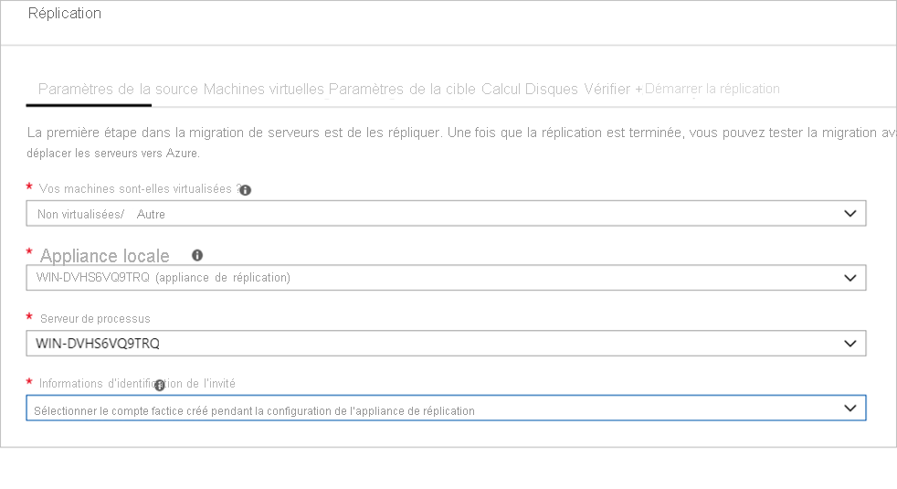

# <a name="discover-assess-and-migrate-amazon-web-services-aws-vms-to-azure"></a>Découvrir, évaluer et migrer des machines virtuelles Amazon Web Services (AWS) vers Azure

Ce tutoriel vous montre comment découvrir, évaluer et migrer des machines virtuelles Amazon Web Services (AWS) vers des machines virtuelles Azure à l’aide d’Azure Migrate : Server Assessment et Azure Migrate : Outils de migration de serveur

> [!NOTE]
> Vous migrez des machines virtuelles AWS vers Azure en les traitant comme des serveurs physiques.

Dans ce didacticiel, vous apprendrez à :
> [!div class="checklist"]
>
> * Vérifier les prérequis pour la migration.
> * Préparer les ressources Azure avec Azure Migrate : Server Migration. Configurez des autorisations pour permettre à votre compte et vos ressources Azure de fonctionner avec Azure Migrate.
> * Préparer les instances AWS EC2 pour la migration.
> * Ajouter l’outil Azure Migrate : Server Migration au hub Azure Migrate.
> * Configurer l’appliance de réplication et déployer le serveur de configuration.
> * Installer le service Mobility sur chaque machine virtuelle AWS à migrer.
> * Activez la réplication des machines virtuelles.
> * Suivre et superviser l’état de la réplication.
> * Exécuter une migration de test pour vérifier que tout fonctionne comme prévu.
> * Exécuter une migration complète vers Azure.

Si vous n’avez pas d’abonnement Azure, créez un [compte gratuit](https://azure.microsoft.com/pricing/free-trial/) avant de commencer.

## <a name="discover-and-assess"></a>Découvrir et évaluer

Avant de migrer vers Azure, nous vous recommandons d’effectuer une évaluation de la découverte et de la migration des machines virtuelles. Cette évaluation permet de dimensionner de façon appropriée vos machines virtuelles AWS pour la migration vers Azure et d’estimer les coûts d’exécution potentiels d’Azure.

Configurez une évaluation comme suit :

1. Suivez le [tutoriel](./tutorial-discover-physical.md) pour configurer Azure et préparer vos machines virtuelles AWS à une évaluation. Notez les points suivants :

    - Azure Migrate utilise l’authentification par mot de passe lors de la découverte des instances AWS. Les instances AWS ne prennent pas en charge l’authentification par mot de passe par défaut. Avant de pouvoir découvrir l’instance, vous devez activer l’authentification par mot de passe.
        - Pour les machines Windows, autorisez le port WinRM 5985 (HTTP). Cela permet les appels WMI distants.
        - Pour les machines Linux :
            1. Connectez-vous à chaque machine Linux.
            2. Ouvrez le fichier sshd_config : vi /etc/ssh/sshd_config
            3. Dans le fichier, localisez la ligne **PasswordAuthentication**, puis remplacez la valeur par **Oui**.
            4. Enregistrez le fichier et fermez-le. Redémarrez le service ssh.
    - Si vous vous servez d’un utilisateur racine pour découvrir vos machines virtuelles Linux, assurez-vous que la connexion racine est autorisée sur les machines virtuelles.
        1. Connectez-vous à chaque machine Linux.
        2. Ouvrez le fichier sshd_config : vi /etc/ssh/sshd_config
        3. Dans le fichier, repérez la ligne **PermitRootLogin**, puis remplacez la valeur par **yes**.
        4. Enregistrez le fichier et fermez-le. Redémarrez le service ssh.

2. Ensuite, suivez ce [tutoriel](./tutorial-assess-physical.md) pour configurer un projet et une appliance Azure Migrate afin de découvrir et d’évaluer vos machines virtuelles AWS.

Même si nous vous conseillons d’effectuer une évaluation, celle-ci n’est pas une étape obligatoire pour pouvoir migrer des machines virtuelles.


## <a name="prerequisites"></a>Prérequis

- Vérifiez que les machines virtuelles AWS que vous voulez migrer exécutent une version du système d’exploitation prise en charge. Les machines virtuelles AWS sont traitées comme des machines physiques dans le cadre de la migration. Passez en revue les [systèmes d’exploitation et versions de noyau pris en charge](../site-recovery/vmware-physical-azure-support-matrix.md#replicated-machines) pour le workflow de migration de serveurs physiques. Vous pouvez utiliser des commandes standard comme *hostnamectl* ou *uname-a* pour vérifier les versions de noyau et de système d’exploitation de vos machines virtuelles Linux.  Nous vous recommandons d’effectuer un test de migration (test de basculement) pour vérifier si la machine virtuelle fonctionne comme prévu avant de procéder à la migration réelle.
- Vérifiez que vos machines virtuelles AWS sont conformes aux [configurations prises en charge](./migrate-support-matrix-physical-migration.md#physical-server-requirements) pour la migration vers Azure.
- Vérifiez que les machines virtuelles AWS que vous répliquez sur Azure respectent les [exigences des machines virtuelles Azure](./migrate-support-matrix-physical-migration.md#azure-vm-requirements).
- Certaines modifications doivent être apportées aux machines virtuelles pour pouvoir les migrer vers Azure.
    - Pour certains systèmes d’exploitation, Azure Migrate effectue ces modifications automatiquement.
    - Il est important d’effectuer ces modifications avant de commencer la migration. Si vous migrez la machine virtuelle avant d’effectuer la modification, elle risque de ne pas démarrer dans Azure.
Examinez les modifications à apporter aux machines [Windows](prepare-for-migration.md#windows-machines) et [Linux](prepare-for-migration.md#linux-machines).

### <a name="prepare-azure-resources-for-migration"></a>Préparer les ressources Azure à la migration

Préparez Azure à la migration avec l’outil Server Migration d’Azure Migrate.

**Tâche** | **Détails**
--- | ---
**Créer un projet Azure Migrate** | Votre compte Azure doit disposer d’autorisations Contributeur ou Propriétaire pour [créer un projet](./create-manage-projects.md).
**Vérifier les autorisations pour votre compte Azure** | Votre compte Azure a besoin d’autorisations pour créer une machine virtuelle et écrire sur un disque managé Azure.

### <a name="assign-permissions-to-create-project"></a>Attribuer des autorisations pour créer un projet

1. Dans le portail Azure, ouvrez l’abonnement, puis sélectionnez **Contrôle d’accès (IAM)** .
2. Dans **Vérifier l’accès**, recherchez le compte approprié, puis cliquez dessus pour voir les autorisations correspondantes.
3. Vous devez disposer des autorisations de **Contributeur** ou de **Propriétaire**.
    - Si vous venez de créer un compte Azure gratuit, vous êtes le propriétaire de votre abonnement.
    - Si vous n’êtes pas le propriétaire de l’abonnement, demandez au propriétaire de vous attribuer le rôle.

### <a name="assign-azure-account-permissions"></a>Affecter des autorisations de compte Azure

Affectez le rôle Contributeur de machines virtuelles au compte Azure. Cela permet d’effectuer les opérations suivantes :

- Créer une machine virtuelle dans le groupe de ressources sélectionné
- Créer une machine virtuelle dans le réseau virtuel sélectionné
- Écrire sur un disque managé Azure.

### <a name="create-an-azure-network"></a>Créer un réseau Azure

[Configurez](../virtual-network/manage-virtual-network.md#create-a-virtual-network) un réseau virtuel Azure. Quand vous effectuez une réplication sur Azure, les machines virtuelles Azure créées sont jointes au réseau virtuel Azure que vous avez spécifié lors de la configuration de la migration.

## <a name="prepare-aws-instances-for-migration"></a>Préparer les instances AWS à la migration

Pour préparer AWS à la migration Azure, vous devez préparer et déployer une appliance de réplication pour la migration.

### <a name="prepare-a-machine-for-the-replication-appliance"></a>Préparer une machine pour l’appliance de réplication

Azure Migrate : Server Migration utilise une appliance de réplication pour répliquer les machines sur Azure. L’appliance de réplication exécute les composants suivants :

- **Serveur de configuration** : Le serveur de configuration coordonne la communication entre l’environnement AWS et Azure, puis gère la réplication des données.
- **Serveur de traitement**: Le serveur de processus fait office de passerelle de réplication. Il reçoit les données de réplication, les optimise grâce à une mise en cache, une compression et un chiffrement, puis les envoie à un compte de stockage de cache dans Azure.

Préparez le déploiement de l’appliance comme suit :

- Configurez une machine virtuelle EC2 distincte pour héberger l’appliance de réplication. Cette instance doit exécuter Windows Server 2012 R2 ou Windows Server 2016. [Passez en revue](./migrate-replication-appliance.md#appliance-requirements) la configuration matérielle, logicielle et réseau nécessaire pour l’appliance.
- L’appliance ne doit pas être installée sur une machine virtuelle source que vous souhaitez répliquer, ou sur l’appliance de découverte et d’évaluation Azure Migrate que vous avez peut-être déjà installée. Elle doit plutôt être déployée sur une autre machine virtuelle.
- Les machines virtuelles AWS sources à migrer doivent avoir l’appliance de réplication en ligne de mire. Configurez les règles de groupe de sécurité nécessaires à cette fin. Il est recommandé de déployer l’appliance de réplication sur le même VPC que les machines virtuelles sources à migrer. Si l’appliance de réplication a besoin de se trouver dans un autre VPC, les VPC doivent être connectés par peering VPC.
- Les machines virtuelles AWS sources communiquent avec l’appliance de réplication sur les ports HTTPS 443 (orchestration du canal de contrôle) et TCP 9443 (transport de données) entrants pour la gestion de la réplication et le transfert des données de réplication. L’appliance de réplication à son tour orchestre et envoie les données de réplication à Azure sur le port HTTPS 443 sortant. Pour configurer ces règles, modifiez les règles de trafic entrant/sortant du groupe de sécurité avec les ports et les informations d’adressage IP source appropriés.

   


   

- L’appliance de réplication utilise MySQL. Passez en revue les [options](migrate-replication-appliance.md#mysql-installation) d’installation de MySQL sur l’appliance.
- Passez en revue les URL Azure nécessaires à l’appliance de réplication pour accéder aux clouds [publics](migrate-replication-appliance.md#url-access) et du [secteur public](migrate-replication-appliance.md#azure-government-url-access).

## <a name="set-up-the-replication-appliance"></a>Configurer l’appliance de réplication

La première étape de la migration consiste à configurer l’appliance de réplication. Pour configurer l’appliance pour la migration des machines virtuelles AWS, vous devez télécharger le fichier d’installation de l’appliance, puis l’exécuter sur la [machine virtuelle que vous avez préparée](#prepare-a-machine-for-the-replication-appliance).

### <a name="download-the-replication-appliance-installer"></a>Télécharger le programme d’installation de l’appliance de réplication

1. Dans le projet Azure Migrate > **Serveurs**, dans **Azure Migrate : Server Migration**, cliquez sur **Découvrir**.

    

2. Dans **Découvrir des machines** > **Vos machines sont-elles virtualisées ?** , cliquez sur **Non virtualisé/autre**.
3. Dans **Région cible**, sélectionnez la région Azure vers laquelle vous souhaitez migrer les machines.
4. Sélectionnez **Confirmer que la région cible pour la migration est <nom_région>** .
5. Cliquez sur **Créer des ressources**. Un coffre Azure Site Recovery est créé en arrière-plan.
    - Si vous avez déjà configuré la migration avec Azure Migrate Server Migration, l’option Cible ne peut pas être configurée, car les ressources ont déjà été configurées.
    - Après avoir cliqué sur ce bouton, vous ne pouvez plus changer la région cible de ce projet.
    - Pour migrer vos machines virtuelles vers une autre région, vous devez créer un projet Azure Migrate différent.  
    > [!NOTE]
    > Si vous avez sélectionné « Point de terminaison privé » comme méthode de connectivité pour le projet Azure Migrate lors de sa création, le coffre Recovery Services est également configuré pour la connectivité de point de terminaison privé. Vérifiez que les points de terminaison privés sont accessibles depuis l’appliance de réplication. [**En savoir plus**](troubleshoot-network-connectivity.md)

6. Dans **Voulez-vous installer une nouvelle appliance de réplication ?** , sélectionnez **Installer une appliance de réplication**.
7. Dans **Télécharger et installer le logiciel de l’appliance de réplication**, téléchargez le programme d’installation de l’appliance et la clé d’inscription. Vous avez besoin de la clé pour inscrire l’appliance. Une fois téléchargée, la clé reste valide pendant 5 jours.

    

8. Copiez le fichier de configuration et le fichier de clé de l’appliance sur la machine virtuelle AWS Windows Server 2016 ou Windows Server 2012 que vous avez créée pour l’appliance de réplication.
9. Exécutez le fichier de configuration de l’appliance de réplication en suivant la procédure ci-dessous.  
    9.1. Dans **Avant de commencer**, sélectionnez **Installer le serveur de configuration et le serveur de processus**, puis sélectionnez **Suivant**.   
    9.2 Dans **Licence de logiciel tiers**, sélectionnez **J’accepte le contrat de licence tiers**, puis **Suivant**.   
    9.3 Dans **Inscription**, sélectionnez **Parcourir** et accédez à l’endroit où vous avez placé le fichier de clé d’inscription du coffre. Sélectionnez **Suivant**.  
    9.4 Dans **Paramètres Internet**, sélectionnez **Se connecter directement à Azure Site Recovery sans serveur proxy**, puis cliquez sur **Suivant**.  
    9.5 La page **Vérification de la configuration requise** effectue des vérifications pour plusieurs éléments. Quand cela est terminé, cliquez sur **Suivant**.  
    9.6 Dans **Configuration MySQL**, indiquez un mot de passe pour la base de données MySQL, puis sélectionnez **Suivant**.  
    9.7 Dans la page **Détails de l’environnement**, sélectionnez **Non**. Vous n’avez pas besoin de protéger vos machines virtuelles. Ensuite, sélectionnez **Suivant**.  
    9.8 Dans **Emplacement d’installation**, cliquez sur **Suivant** pour accepter la valeur par défaut.  
    9.9 Dans **Sélection du réseau**, cliquez sur **Suivant** pour accepter la valeur par défaut.  
    9.10 Dans **Résumé**, sélectionnez **Installer**.   
    9.11 **Progression de l’installation** vous montre des informations sur le processus d’installation. Quand cela est terminé, cliquez sur **Terminer**. Une fenêtre affiche un message concernant un redémarrage. Sélectionnez **OK**.   
    9.12 Ensuite, une fenêtre affiche un message concernant la phrase secrète de la connexion du serveur de configuration. Copiez la phrase secrète dans le Presse-papiers et enregistrez-la dans un fichier texte temporaire sur les machines virtuelles sources. Vous aurez besoin de cette phrase secrète plus tard, pendant le processus d’installation du service Mobility.

10. Une fois l’installation terminée, l’Assistant Configuration de l’appliance démarre automatiquement (vous pouvez également le lancer manuellement à l’aide du raccourci cspsconfigtool créé sur le Bureau de l’appliance). Dans ce tutoriel, nous allons installer manuellement le service Mobility sur les machines virtuelles sources à répliquer. Avant de continuer, vous devez donc créer un compte factice. Vous pouvez spécifier les informations suivantes pour créer le compte factice : « guest » comme nom convivial, « username » comme nom d’utilisateur et « password » comme mot de passe de compte. Vous utiliserez ce compte factice à l’étape Activer la réplication.

11. Une fois l’appliance installée et redémarrée, dans **Découvrir des machines**, sélectionnez la nouvelle appliance dans **Sélectionner un serveur de configuration**, puis cliquez sur **Finaliser l’inscription**. L’option Finaliser l’inscription exécute quelques tâches finales pour préparer l’appliance de réplication.

    

## <a name="install-the-mobility-service"></a>Installer le service Mobilité

Un agent du service Mobility doit être installé sur les machines virtuelles AWS sources à migrer. Les programmes d’installation de l’agent sont disponibles dans l’appliance de réplication. Recherchez le programme d’installation qui convient, puis installez l’agent sur chaque machine devant faire l’objet d’une migration. Effectuez les étapes suivantes :

1. Connectez-vous à l’appliance de réplication.
2. Accédez au dossier **%ProgramData%\ASR\home\svsystems\pushinstallsvc\repository**.
3. Recherchez le programme d’installation correspondant à la version du système d’exploitation des machines virtuelles AWS. Vérifiez quels sont les [systèmes d’exploitation pris en charge](../site-recovery/vmware-physical-azure-support-matrix.md#replicated-machines).
4. Copiez le fichier du programme d’installation sur la machine virtuelle AWS qui doit faire l’objet d’une migration.
5. Vérifiez que vous avez bien le fichier texte de la phrase secrète créé lors de l’installation de l’appliance de réplication.
    - Si vous avez oublié d’enregistrer cette phrase secrète, vous pouvez l’afficher sur l’appliance de réplication en suivant cette étape. Sur la ligne de commande, exécutez **C:\ProgramData\ASR\home\svsystems\bin\genpassphrase.exe -v** pour afficher la phrase secrète.
    - Maintenant, copiez cette phrase secrète dans le Presse-papiers et enregistrez-la dans un fichier texte temporaire sur les machines virtuelles sources.

### <a name="installation-guide-for-windows-aws-vms"></a>Guide d’installation pour les machines virtuelles AWS Windows

1. Procédez de la façon suivante pour extraire le contenu du fichier du programme d’installation dans un dossier local (par exemple, C:\Temp) de la machine virtuelle AWS :

    ```
    ren Microsoft-ASR_UA*Windows*release.exe MobilityServiceInstaller.exe
    MobilityServiceInstaller.exe /q /x:C:\Temp\Extracted
    cd C:\Temp\Extracted
    ```  

2. Exécutez le programme d’installation de Mobility Service :
    ```
   UnifiedAgent.exe /Role "MS" /Silent
    ```  

3. Inscrivez l’agent auprès de l’appliance de réplication :
    ```
    cd C:\Program Files (x86)\Microsoft Azure Site Recovery\agent
    UnifiedAgentConfigurator.exe  /CSEndPoint <replication appliance IP address> /PassphraseFilePath <Passphrase File Path>
    ```

### <a name="installation-guide-for-linux-aws-vms"></a>Guide d’installation pour les machines virtuelles AWS Linux

1. Procédez de la façon suivante pour extraire le contenu du tarball du programme d’installation dans un dossier local (par exemple, /tmp/MobSvcInstaller) de la machine virtuelle AWS :
    ```
    mkdir /tmp/MobSvcInstaller
    tar -C /tmp/MobSvcInstaller -xvf <Installer tarball>
    cd /tmp/MobSvcInstaller
    ```  

2. Exécutez le script du programme d’installation :
    ```
    sudo ./install -r MS -q
    ```  

3. Inscrivez l’agent auprès de l’appliance de réplication :
    ```
    /usr/local/ASR/Vx/bin/UnifiedAgentConfigurator.sh -i <replication appliance IP address> -P <Passphrase File Path>
    ```

## <a name="enable-replication-for-aws-vms"></a>Activer la réplication pour les machines virtuelles AWS

> [!NOTE]
> Par le biais du portail, vous pouvez ajouter jusqu’à 10 machines virtuelles à répliquer en même temps. Pour en répliquer davantage simultanément, vous pouvez les ajouter par lots de 10.

1. Dans le projet Azure Migrate > **Serveurs**, **Azure Migrate : Server Migration**, cliquez sur **Répliquer**.

    

2. Dans **Répliquer** > **Paramètres de la source** > **Vos machines sont-elles virtualisées ?** , sélectionnez **Non virtualisé/autre**.
3. Dans **Appliance locale**, sélectionnez le nom de l’appliance Azure Migrate que vous avez configurée.
4. Dans **Process Server**, sélectionnez le nom de l’appliance de réplication.
5. Sous **Informations d’identification de l’invité**, sélectionnez le compte factice créé durant l’[installation de l’appliance de réplication](#download-the-replication-appliance-installer) pour installer manuellement le service Mobility (l’installation push n’est pas prise en charge). Cliquez ensuite sur **Suivant : Machines virtuelles**.   

    
6. Dans **Machines virtuelles**, dans **Importer les paramètres de migration à partir d’une évaluation ?** , conservez le paramètre par défaut **Non, je vais spécifier les paramètres de migration manuellement**.
7. Cochez chaque machine virtuelle devant faire l’objet d’une migration. Cliquez ensuite sur **Suivant : Paramètres de la cible**.

    

8. Dans **Paramètres de la cible**, sélectionnez l’abonnement et la région cible vers laquelle vous allez migrer, puis spécifiez le groupe de ressources dans lequel les machines virtuelles Azure résideront après la migration.
9. Dans **Réseau virtuel**, sélectionnez le réseau virtuel/sous-réseau Azure auquel les machines virtuelles Azure seront jointes après la migration.  
10. Dans **Compte de stockage de cache**, conservez l’option par défaut pour utiliser le compte de stockage de cache créé automatiquement pour le projet. Utilisez la liste déroulante si vous voulez spécifier un autre compte de stockage à utiliser comme compte de stockage de cache pour la réplication. <br/>
    > [!NOTE]
    >
    > - Si vous avez sélectionné « Point de terminaison privé » comme méthode de connectivité pour le projet Azure Migrate, accordez au coffre Recovery Services l’accès au compte de stockage de cache. [**En savoir plus**](how-to-use-azure-migrate-with-private-endpoints.md#grant-access-permissions-to-the-recovery-services-vault)
    > - Pour répliquer en utilisant ExpressRoute avec le peering privé, créez un point de terminaison privé pour le compte de stockage de cache. [**En savoir plus**](how-to-use-azure-migrate-with-private-endpoints.md#create-a-private-endpoint-for-the-storage-account-optional)
11. Dans **Options de disponibilité**, sélectionnez :
    -  Zone de disponibilité pour épingler la machine migrée à une Zone de disponibilité spécifique dans la région. Utilisez cette option pour distribuer les serveurs qui forment une couche Application à plusieurs nœuds entre des Zones de disponibilité. Si vous sélectionnez cette option, vous devez spécifier la Zone de disponibilité à utiliser pour chaque machine sélectionnée dans l’onglet Calcul. Cette option est disponible uniquement si la région cible sélectionnée pour la migration prend en charge les Zones de disponibilité
    -  Groupe à haute disponibilité pour placer la machine migrée dans un groupe à haute disponibilité. Pour utiliser cette option, le groupe de ressources cible qui a été sélectionné doit avoir un ou plusieurs groupes à haute disponibilité.
    - Aucune option de redondance de l’infrastructure n’est requise si vous n’avez pas besoin de ces configurations de disponibilité pour les machines migrées.

12. Dans **Type de chiffrement de disque**, sélectionnez :
    - Chiffrement au repos avec une clé gérée par la plateforme
    - Chiffrement au repos avec une clé gérée par le client
    - Chiffrement double avec des clés gérées par la plateforme et des clés gérées par le client

   > [!NOTE]
   > Pour répliquer des machines virtuelles avec une clé gérée par le client, vous devez [créer un jeu de chiffrement de disque](../virtual-machines/disks-enable-customer-managed-keys-portal.md#set-up-your-disk-encryption-set) sous le groupe de ressources cible. Un objet de jeu de chiffrement de disque mappe les disques managés à un coffre de clés contenant les clés gérées par le client à utiliser pour le chiffrement côté serveur.

13. Dans **Azure Hybrid Benefit** :

    - Sélectionnez **Non** si vous ne souhaitez pas appliquer Azure Hybrid Benefit. Cliquez ensuite sur **Suivant**.
    - Sélectionnez **Oui** si vous avez des machines Windows Server couvertes par des abonnements Software Assurance ou Windows Server actifs et que vous souhaitez appliquer l’avantage aux machines que vous migrez. Cliquez ensuite sur **Suivant**.

    

14. Dans **Calcul**, vérifiez le nom de la machine virtuelle, sa taille, le type de disque du système d’exploitation et la configuration de la disponibilité (si elle a été sélectionnée à l’étape précédente). Les machines virtuelles doivent satisfaire aux [exigences d’Azure](migrate-support-matrix-physical-migration.md#azure-vm-requirements).

    - **Taille de la machine virtuelle** : si vous suivez les recommandations de l’évaluation, la liste déroulante Taille de la machine virtuelle affiche la taille recommandée. Sinon, Azure Migrate choisit une taille qui correspond à la taille la plus proche dans l’abonnement Azure. Vous pouvez également choisir une taille manuelle dans **Taille de la machine virtuelle Azure**.
    - **Disque de système d’exploitation** : spécifiez le disque du système d’exploitation (démarrage) pour la machine virtuelle. Le disque du système d’exploitation est le disque qui contient le chargeur de démarrage et le programme d’installation du système d’exploitation.
    - **Zone de disponibilité** : Spécifiez la zone de disponibilité à utiliser.
    - **Groupe à haute disponibilité** : Spécifiez le groupe à haute disponibilité à utiliser.


15. Dans **Disques**, indiquez si les disques de machine virtuelle doivent être répliqués sur Azure, puis sélectionnez le type de disque (SSD/HDD standard ou disques managés Premium) dans Azure. Cliquez ensuite sur **Suivant**.
    - Vous pouvez exclure des disques de la réplication.
    - Si vous excluez des disques, ils ne seront pas présents sur la machine virtuelle Azure après la migration.

    

16. Dans **Passer en revue et démarrer la réplication**, passez en revue les paramètres, puis cliquez sur **Répliquer** pour démarrer la réplication initiale pour les serveurs.

> [!NOTE]
> Vous pouvez mettre à jour les paramètres de réplication à tout moment avant le démarrage de la réplication (**Gérer** > **Réplication des machines**). Vous ne pouvez pas changer les paramètres après le démarrage de la réplication.

## <a name="track-and-monitor-replication-status"></a>Suivre et superviser l’état de la réplication

- Quand vous cliquez sur **Répliquer**, un travail Démarrer la réplication commence.
- Une fois le travail Démarrer la réplication terminé, les machines virtuelles commencent leur réplication initiale vers Azure.
- Au terme de la réplication initiale, la réplication différentielle commence. Les modifications incrémentielles apportées aux disques des machines virtuelles AWS sont répliquées régulièrement sur les disques de réplica dans Azure.

Vous pouvez suivre l’état du travail dans les notifications du portail.

Vous pouvez superviser l’état de la réplication en cliquant sur **Réplication de serveurs** dans **Azure Migrate : Server Migration**.  


## <a name="run-a-test-migration"></a>Exécuter un test de migration

Quand la réplication différentielle commence, vous pouvez exécuter une migration de test avec les machines virtuelles avant d’exécuter une migration complète vers Azure. Un test de migration est fortement recommandé car il offre la possibilité de détecter tous les problèmes éventuels et de les résoudre avant de procéder à la migration réelle. Il est recommandé de faire ce test au moins une fois pour chaque machine virtuelle avant de la migrer.

- L’exécution d’un test de migration permet de vérifier que la migration fonctionne comme prévu, sans impact sur les machines virtuelles AWS qui restent opérationnelles et poursuivent la réplication.
- Une migration de test simule la migration en créant une machine virtuelle Azure à l’aide de données répliquées (il s’agit en général d’une migration vers un réseau virtuel hors production dans votre abonnement Azure).
- Vous pouvez utiliser la machine virtuelle Azure de test répliquée pour valider la migration, effectuer des tests d’applications et résoudre les éventuels problèmes avant la migration complète.

Effectuez une migration de test de la façon suivante :

1. Dans **Objectifs de migration** > **Serveurs** > **Azure Migrate : Server Migration**, cliquez sur **Tester les serveurs migrés**.

     

2. Cliquez avec le bouton droit sur la machine virtuelle à tester, puis cliquez sur **Migration de test**.

    

3. Dans **Migration de test**, sélectionnez le réseau virtuel Azure dans lequel la machine virtuelle Azure se trouvera après la migration. Nous vous recommandons d’utiliser un réseau virtuel hors production.
4. Le travail **Migration de test** démarre. Supervisez le travail dans les notifications du portail.
5. Une fois la migration terminée, affichez la machine virtuelle Azure migrée dans **Machines virtuelles** dans le portail Azure. Le nom de la machine a le suffixe **-Test**.
6. Une fois le test terminé, cliquez avec le bouton droit sur la machine virtuelle Azure dans **Réplication des machines**, puis cliquez sur **Nettoyer la migration de test**.

    

    > [!NOTE]
    > Vous pouvez désormais inscrire vos serveurs exécutant SQL Server auprès du fournisseur de ressources SQL Server sur des machines virtuelles Azure pour bénéficier de la mise à jour corrective automatisée, de la sauvegarde automatisée et de la gestion simplifiée des licences à l’aide de l’extension SQL IaaS Agent.
    >- Sélectionnez **Gérer** > **Réplication de serveurs** > **Machine contenant SQL Server** > **Calcul et réseau**, puis sélectionnez **oui** pour effectuer l’inscription auprès du fournisseur de ressources SQL Server sur des machines virtuelles Azure.
    >- Sélectionnez Azure Hybrid Benefit pour SQL Server si vous disposez d’instances de SQL Server couvertes par des abonnements Software Assurance ou SQL Server actifs, et si vous souhaitez appliquer cet avantage aux machines que vous migrez.

## <a name="migrate-aws-vms"></a>Migrer des machines virtuelles AWS

Après avoir vérifié que le test de migration fonctionne comme prévu, vous pouvez migrer les machines virtuelles AWS.

1. Dans le projet Azure Migrate > **Serveurs** > **Azure Migrate : Server Migration**, cliquez sur **Réplication de serveurs**.

    

2. Dans **Réplication des machines**, cliquez avec le bouton droit sur la machine virtuelle > **Migrer**.
3. Dans **Migrer** > **Arrêter les machines virtuelles et effectuer une migration planifiée sans perte de données**, sélectionnez **Oui** > **OK**.
    - Si vous ne souhaitez pas arrêter la machine virtuelle, sélectionnez **Non**.
4. Un travail de migration démarre pour la machine virtuelle. Vous pouvez afficher l’état du travail en cliquant sur l’icône de notification en forme de cloche située en haut à droite de la page du portail ou en accédant à la page des travaux de l’outil Server Migration (cliquez sur Vue d’ensemble dans la vignette de l’outil > sélectionnez Travaux dans le menu de gauche).
5. Une fois le travail terminé, vous pouvez afficher et gérer la machine virtuelle à partir de la page Machines virtuelles.

### <a name="complete-the-migration"></a>Effectuer la migration

1. Une fois la migration terminée, cliquez avec le bouton droit sur la machine virtuelle > **Arrêter la migration**. Cette opération effectue les actions suivantes :
    - Arrête la réplication de la machine virtuelle AWS.
    - Supprime la machine virtuelle AWS du nombre **Réplication de serveurs** dans Azure Migrate : Server Migration.
    - Nettoie les informations d’état de réplication pour la machine virtuelle.
2. Installez l’agent [Linux](../virtual-machines/extensions/agent-linux.md) sur les machines migrées. L’agent Windows de machine virtuelle Azure est préinstallé au cours du processus de migration.
3. Effectuez les éventuels ajustements post-migration de l’application, comme la mise à jour des chaînes de connexion de base de données et les configurations du serveur web.
4. Effectuez les tests finaux de réception de l’application et de la migration sur l’application migrée qui s’exécute maintenant dans Azure.
5. Réduisez le trafic vers l’instance de machine virtuelle Azure migrée.
6. Mettez à jour la documentation interne en y mentionnant le nouvel emplacement et la nouvelle adresse IP des machines virtuelles Azure.


## <a name="post-migration-best-practices"></a>Bonnes pratiques après la migration

- Pour une meilleure résilience :
    - Sécurisez les données en sauvegardant les machines virtuelles Azure avec le service Sauvegarde Azure. [Plus d’informations](../backup/quick-backup-vm-portal.md)
    - Conservez les charges de travail en cours d’exécution et disponibles en continu en répliquant des machines virtuelles Azure vers une région secondaire avec Site Recovery. [Plus d’informations](../site-recovery/azure-to-azure-tutorial-enable-replication.md)
- Pour renforcer la sécurité :
    - Verrouillez et limitez l’accès du trafic entrant avec l’[administration juste-à-temps d’Azure Security Center](../security-center/security-center-just-in-time.md).
    - Limitez le trafic réseau vers les points de terminaison de gestion avec des [groupes de sécurité réseau](../virtual-network/network-security-groups-overview.md).
    - Déployez [Azure Disk Encryption](../security/fundamentals/azure-disk-encryption-vms-vmss.md) pour sécuriser les disques, et protégez les données contre le vol et les accès non autorisés.
    - Découvrez plus d’informations sur la [sécurisation des ressources IaaS](https://azure.microsoft.com/services/virtual-machines/secure-well-managed-iaas/) et visitez [Azure Security Center](https://azure.microsoft.com/services/security-center/).
- Pour la surveillance et la gestion :
    - Envisagez de déployer [Azure Cost Management](../cost-management-billing/cost-management-billing-overview.md) pour surveiller l’utilisation et les coûts des ressources.


## <a name="troubleshooting--tips"></a>Résolution des problèmes/Conseils

**Question :** Je ne vois pas ma machine virtuelle AWS dans la liste des serveurs découverts pour la migration.   
**Réponse :** Vérifiez si votre appliance de réplication respecte les exigences. Vérifiez que l’agent Mobility est installé sur la machine virtuelle source à migrer et qu’il est inscrit sur le serveur de configuration. Vérifiez les paramètres réseau et les règles de pare-feu pour autoriser un chemin réseau entre l’appliance de réplication et les machines virtuelles AWS sources.  

**Question :** Comment puis-je savoir si la migration de ma machine virtuelle s’est correctement effectuée ?   
**Réponse :** Après la migration, vous pouvez afficher et gérer la machine virtuelle à partir de la page Machines virtuelles. Connectez-vous à la machine virtuelle migrée pour le vérifier.  

**Question :** Je ne parviens pas à importer des machines virtuelles à des fins de migration à partir de mes résultats Server Assessment précédemment créés.   
**Réponse :** Actuellement, nous ne prenons pas en charge l’importation de l’évaluation pour ce workflow. En guise de solution de contournement, vous pouvez exporter l’évaluation, puis sélectionner manuellement la recommandation pendant l’étape Activer la réplication.

**Question :** J’obtiens l’erreur « Impossible de récupérer le GUID du BIOS » quand j’essaie de découvrir mes machines virtuelles AWS.   
**Réponse :** Utilisez toujours la connexion racine pour l’authentification, et non un pseudo utilisateur. De même, vérifiez quels sont les systèmes d’exploitation pris en charge pour les machines virtuelles AWS.  

**Question :** Mon état de réplication ne progresse pas.   
**Réponse :** Vérifiez si votre appliance de réplication respecte les exigences. Vérifiez que vous avez activé les ports nécessaires sur votre appliance de réplication : port TCP 9443 et HTTPS 443 pour le transport de données. Vérifiez qu’il n’existe aucune version en double obsolète de l’appliance de réplication connectée au même projet.   

**Question :** Je ne parviens pas à découvrir des instances AWS à l’aide d’Azure Migrate en raison du code d’état HTTP 504 du service de gestion Windows distant.    
**Réponse :** Consultez les exigences applicables à l’appliance Azure Migrate et les besoins d’accès URL. Vérifiez qu’aucun paramètre de proxy ne bloque l’inscription de l’appliance.

**Question :** Dois-je apporter des modifications avant de migrer mes machines virtuelles AWS vers Azure ?   
**Réponse :** Vous devrez peut-être apporter ces modifications avant de migrer vos machines virtuelles EC2 vers Azure :

- Si vous utilisez cloud-init pour le provisionnement de vos machines virtuelles, vous avez la possibilité de le désactiver sur la machine virtuelle avant de la répliquer sur Azure. Les étapes de provisionnement effectuées par cloud-init sur la machine virtuelle peuvent être propres à AWS ; elles ne seront pas valides après la migration vers Azure. 
- S’il s’agit d’une machine virtuelle PV (para-virtualisée) et non d’une machine virtuelle HVM, il n’est pas toujours possible de l’exécuter telle quelle sur Azure, car les machines virtuelles para-virtualisées utilisent une séquence de démarrage personnalisée dans AWS. Vous pourrez peut-être surmonter ce problème en désinstallant les pilotes PV avant d’effectuer une migration vers Azure.  
- Nous vous recommandons de toujours exécuter une migration de test avant la migration finale.  


**Question :** Puis-je migrer des machines virtuelles AWS exécutant le système d’exploitation Amazon Linux ?  
**Réponse :** Il n’est pas possible de migrer les machines virtuelles qui exécutent Amazon Linux, car ce système d’exploitation n’est pris en charge que sur AWS.
Pour migrer des charges de travail s’exécutant sur Amazon Linux, vous pouvez créer une machine virtuelle CentOS/RHEL dans Azure et migrer la charge de travail s’exécutant sur la machine Linux AWS suivant une approche appropriée de migration des charges de travail. Pour certaines charges de travail, il peut exister des outils propres à la charge de travail qui facilitent la migration, par exemple pour les bases de données ou les outils de déploiement dans le cas de serveurs web.

## <a name="next-steps"></a>Étapes suivantes

Examinez le [parcours de migration cloud](/azure/architecture/cloud-adoption/getting-started/migrate) dans le framework d’adoption du cloud Azure.
