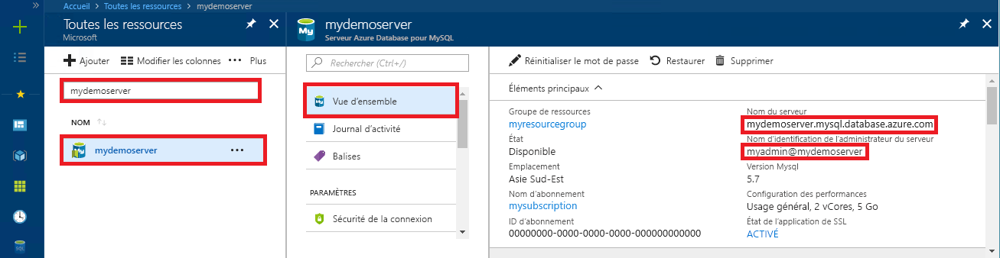

# <a name="quickstart-use-java-to-connect-to-and-query-data-in-azure-database-for-mysql"></a>Démarrage rapide : Utiliser Java pour se connecter à Azure Database pour MySQL et interroger les données

Dans ce guide de démarrage rapide, vous vous connectez à une base de données Azure Database pour MySQL en utilisant une application Java et le pilote JDBC MariaDB Connector/J. Vous utilisez ensuite des instructions SQL pour interroger, insérer, mettre à jour et supprimer des données dans la base de données depuis des plateformes Mac, Ubuntu Linux et Windows. 

Cette rubrique part du principe que vous connaissez les bases du développement Java, mais que vous débutez dans l’utilisation d’Azure Database pour MySQL.

## <a name="prerequisites"></a>Prérequis

- Compte Azure avec un abonnement actif. [Créez un compte gratuitement](https://azure.microsoft.com/free/?ref=microsoft.com&utm_source=microsoft.com&utm_medium=docs&utm_campaign=visualstudio).
- Un serveur Azure Database pour MySQL. [Créer un serveur Azure Database pour MySQL avec le portail Azure](quickstart-create-mysql-server-database-using-azure-portal.md) ou [Créer un serveur Azure Database pour MySQL avec Azure CLI](quickstart-create-mysql-server-database-using-azure-cli.md).
- La sécurité de la connexion à Azure Database pour MySQL est configurée avec le pare-feu ouvert et les paramètres de connexion SSL configurés pour votre application.

## <a name="obtain-the-mariadb-connector"></a>Obtenir le connecteur MariaDB

Obtenez le connecteur [MariaDB Connector/J](https://mariadb.com/kb/en/library/mariadb-connector-j/) en utilisant une des approches suivantes :
   - Utilisez le package Maven [mariadb-java-client](https://search.maven.org/search?q=a:mariadb-java-client) pour inclure la [dépendance mariadb-java-client](https://mvnrepository.com/artifact/org.mariadb.jdbc/mariadb-java-client) dans le fichier POM de votre projet.
   - Téléchargez le pilote JDBC [MariaDB Connector/J](https://downloads.mariadb.org/connector-java/) et incluez le fichier jar JDBC (par exemple mariadb-java-client-2.4.3.jar) dans le chemin de classes de votre application. Consultez la documentation de votre environnement pour obtenir des détails sur le chemin de classes, comme [Apache Tomcat](https://tomcat.apache.org/tomcat-7.0-doc/class-loader-howto.html) ou [Java SE](https://docs.oracle.com/javase/7/docs/technotes/tools/windows/classpath.html)

## <a name="get-connection-information"></a>Obtenir des informations de connexion

Obtenez les informations requises pour vous connecter à la base de données Azure pour MySQL. Vous devez disposer du nom de serveur complet et des informations d’identification.

1. Connectez-vous au [portail Azure](https://portal.azure.com/).
2. Dans le menu de gauche du portail Azure, sélectionnez **Toutes les ressources**, puis recherchez le serveur que vous venez de créer, par exemple **mydemoserver**.
3. Sélectionnez le nom du serveur.
4. Dans le panneau **Vue d’ensemble** du serveur, notez le **nom du serveur** et le **nom de connexion de l’administrateur du serveur**. Si vous oubliez votre mot de passe, vous pouvez également le réinitialiser dans ce panneau.
 

## <a name="connect-create-table-and-insert-data"></a>Se connecter, créer des tables et insérer des données

Utilisez le code suivant pour vous connecter et charger les données à l’aide d’une instruction SQL **INSERT**. La méthode [getConnection()](https://mariadb.com/kb/en/library/about-mariadb-connector-j/#using-drivermanager) permet de se connecter à MySQL. Les méthodes [createStatement()](https://mariadb.com/kb/en/library/about-mariadb-connector-j/#creating-a-table-on-a-mariadb-or-mysql-server) et execute() permettent de supprimer et de créer la table. L’objet prepareStatement permet de générer les commandes d’insertion, en se servant des méthodes setString() et setInt() pour lier les valeurs des paramètres. La méthode executeUpdate() exécute la commande pour chaque ensemble de paramètres afin d’insérer les valeurs. 

Remplacez les paramètres d’hôte, de la base de données, d’utilisateur et du mot de passe par les valeurs spécifiées lors de la création de votre serveur et de votre base de données.

```java
import java.sql.*;
import java.util.Properties;

public class CreateTableInsertRows {

    public static void main (String[] args)  throws Exception
    {
        // Initialize connection variables. 
        String host = "mydemoserver.mysql.database.azure.com";
        String database = "quickstartdb";
        String user = "myadmin@mydemoserver";
        String password = "<server_admin_password>";

        Connection connection = null;

        // Initialize connection object
        try
        {
            String url = String.format("jdbc:mariadb://%s/%s", host, database);

            // Set connection properties.
            Properties properties = new Properties();
            properties.setProperty("user", user);
            properties.setProperty("password", password);
            properties.setProperty("useSSL", "true");
            properties.setProperty("verifyServerCertificate", "true");
            properties.setProperty("requireSSL", "false");

            // get connection
            connection = DriverManager.getConnection(url, properties);
        }
        catch (SQLException e)
        {
            throw new SQLException("Failed to create connection to database.", e);
        }
        if (connection != null) 
        { 
            System.out.println("Successfully created connection to database.");
        
            // Perform some SQL queries over the connection.
            try
            {
                // Drop previous table of same name if one exists.
                Statement statement = connection.createStatement();
                statement.execute("DROP TABLE IF EXISTS inventory;");
                System.out.println("Finished dropping table (if existed).");
    
                // Create table.
                statement.execute("CREATE TABLE inventory (id serial PRIMARY KEY, name VARCHAR(50), quantity INTEGER);");
                System.out.println("Created table.");
                
                // Insert some data into table.
                int nRowsInserted = 0;
                PreparedStatement preparedStatement = connection.prepareStatement("INSERT INTO inventory (name, quantity) VALUES (?, ?);");
                preparedStatement.setString(1, "banana");
                preparedStatement.setInt(2, 150);
                nRowsInserted += preparedStatement.executeUpdate();

                preparedStatement.setString(1, "orange");
                preparedStatement.setInt(2, 154);
                nRowsInserted += preparedStatement.executeUpdate();

                preparedStatement.setString(1, "apple");
                preparedStatement.setInt(2, 100);
                nRowsInserted += preparedStatement.executeUpdate();
                System.out.println(String.format("Inserted %d row(s) of data.", nRowsInserted));
    
                // NOTE No need to commit all changes to database, as auto-commit is enabled by default.
    
            }
            catch (SQLException e)
            {
                throw new SQLException("Encountered an error when executing given sql statement.", e);
            }       
        }
        else {
            System.out.println("Failed to create connection to database.");
        }
        System.out.println("Execution finished.");
    }
}

```

## <a name="read-data"></a>Lire les données

Utilisez le code suivant pour lire des données à l’aide d’une instruction SQL **SELECT**. La méthode [getConnection()](https://mariadb.com/kb/en/library/about-mariadb-connector-j/#using-drivermanager) permet de se connecter à MySQL. Les méthodes [createStatement()](https://mariadb.com/kb/en/library/about-mariadb-connector-j/#creating-a-table-on-a-mariadb-or-mysql-server) et executeQuery() permettent de se connecter et d’exécuter l’instruction sélectionnée. Les résultats sont traités à l’aide de l’objet ResultSet. 

Remplacez les paramètres d’hôte, de la base de données, d’utilisateur et du mot de passe par les valeurs spécifiées lors de la création de votre serveur et de votre base de données.

```java
import java.sql.*;
import java.util.Properties;

public class ReadTable {

    public static void main (String[] args)  throws Exception
    {
        // Initialize connection variables.
        String host = "mydemoserver.mysql.database.azure.com";
        String database = "quickstartdb";
        String user = "myadmin@mydemoserver";
        String password = "<server_admin_password>";

        Connection connection = null;

        // Initialize connection object
        try
        {
            String url = String.format("jdbc:mariadb://%s/%s", host, database);

            // Set connection properties.
            Properties properties = new Properties();
            properties.setProperty("user", user);
            properties.setProperty("password", password);
            properties.setProperty("useSSL", "true");
            properties.setProperty("verifyServerCertificate", "true");
            properties.setProperty("requireSSL", "false");
            
            // get connection
            connection = DriverManager.getConnection(url, properties);
        }
        catch (SQLException e)
        {
            throw new SQLException("Failed to create connection to database", e);
        }
        if (connection != null) 
        { 
            System.out.println("Successfully created connection to database.");
        
            // Perform some SQL queries over the connection.
            try
            {
    
                Statement statement = connection.createStatement();
                ResultSet results = statement.executeQuery("SELECT * from inventory;");
                while (results.next())
                {
                    String outputString = 
                        String.format(
                            "Data row = (%s, %s, %s)",
                            results.getString(1),
                            results.getString(2),
                            results.getString(3));
                    System.out.println(outputString);
                }
            }
            catch (SQLException e)
            {
                throw new SQLException("Encountered an error when executing given sql statement", e);
            }       
        }
        else {
            System.out.println("Failed to create connection to database."); 
        }
        System.out.println("Execution finished.");
    }
}
```

## <a name="update-data"></a>Mettre à jour des données

Utilisez le code suivant pour modifier les données à l’aide d’une instruction SQL **UPDATE**. La méthode [getConnection()](https://mariadb.com/kb/en/library/about-mariadb-connector-j/#using-drivermanager) permet de se connecter à MySQL. Les méthodes [prepareStatement()](https://docs.oracle.com/javase/tutorial/jdbc/basics/prepared.html) et executeUpdate() permettent de préparer et d’exécuter l’instruction de mise à jour. 

Remplacez les paramètres d’hôte, de la base de données, d’utilisateur et du mot de passe par les valeurs spécifiées lors de la création de votre serveur et de votre base de données.

```java
import java.sql.*;
import java.util.Properties;

public class UpdateTable {
    public static void main (String[] args)  throws Exception
    {
        // Initialize connection variables. 
        String host = "mydemoserver.mysql.database.azure.com";
        String database = "quickstartdb";
        String user = "myadmin@mydemoserver";
        String password = "<server_admin_password>";

        Connection connection = null;

        // Initialize connection object
        try
        {
            String url = String.format("jdbc:mariadb://%s/%s", host, database);
            
            // set up the connection properties
            Properties properties = new Properties();
            properties.setProperty("user", user);
            properties.setProperty("password", password);
            properties.setProperty("useSSL", "true");
            properties.setProperty("verifyServerCertificate", "true");
            properties.setProperty("requireSSL", "false");

            // get connection
            connection = DriverManager.getConnection(url, properties);
        }
        catch (SQLException e)
        {
            throw new SQLException("Failed to create connection to database.", e);
        }
        if (connection != null) 
        { 
            System.out.println("Successfully created connection to database.");
        
            // Perform some SQL queries over the connection.
            try
            {
                // Modify some data in table.
                int nRowsUpdated = 0;
                PreparedStatement preparedStatement = connection.prepareStatement("UPDATE inventory SET quantity = ? WHERE name = ?;");
                preparedStatement.setInt(1, 200);
                preparedStatement.setString(2, "banana");
                nRowsUpdated += preparedStatement.executeUpdate();
                System.out.println(String.format("Updated %d row(s) of data.", nRowsUpdated));
    
                // NOTE No need to commit all changes to database, as auto-commit is enabled by default.
            }
            catch (SQLException e)
            {
                throw new SQLException("Encountered an error when executing given sql statement.", e);
            }       
        }
        else {
            System.out.println("Failed to create connection to database.");
        }
        System.out.println("Execution finished.");
    }
}
```

## <a name="delete-data"></a>Suppression de données

Utilisez le code suivant pour supprimer des données à l’aide d’une instruction SQL **DELETE**. La méthode [getConnection()](https://mariadb.com/kb/en/library/about-mariadb-connector-j/#using-drivermanager) permet de se connecter à MySQL.  Les méthodes [prepareStatement()](https://docs.oracle.com/javase/tutorial/jdbc/basics/prepared.html) et executeUpdate() permettent de préparer et d’exécuter l’instruction de suppression. 

Remplacez les paramètres d’hôte, de la base de données, d’utilisateur et du mot de passe par les valeurs spécifiées lors de la création de votre serveur et de votre base de données.

```java
import java.sql.*;
import java.util.Properties;

public class DeleteTable {
    public static void main (String[] args)  throws Exception
    {
        // Initialize connection variables.
        String host = "mydemoserver.mysql.database.azure.com";
        String database = "quickstartdb";
        String user = "myadmin@mydemoserver";
        String password = "<server_admin_password>";

        Connection connection = null;

        // Initialize connection object
        try
        {
            String url = String.format("jdbc:mariadb://%s/%s", host, database);
            
            // set up the connection properties
            Properties properties = new Properties();
            properties.setProperty("user", user);
            properties.setProperty("password", password);
            properties.setProperty("useSSL", "true");
            properties.setProperty("verifyServerCertificate", "true");
            properties.setProperty("requireSSL", "false");
            
            // get connection
            connection = DriverManager.getConnection(url, properties);
        }
        catch (SQLException e)
        {
            throw new SQLException("Failed to create connection to database", e);
        }
        if (connection != null) 
        { 
            System.out.println("Successfully created connection to database.");
        
            // Perform some SQL queries over the connection.
            try
            {
                // Delete some data from table.
                int nRowsDeleted = 0;
                PreparedStatement preparedStatement = connection.prepareStatement("DELETE FROM inventory WHERE name = ?;");
                preparedStatement.setString(1, "orange");
                nRowsDeleted += preparedStatement.executeUpdate();
                System.out.println(String.format("Deleted %d row(s) of data.", nRowsDeleted));
    
                // NOTE No need to commit all changes to database, as auto-commit is enabled by default.
            }
            catch (SQLException e)
            {
                throw new SQLException("Encountered an error when executing given sql statement.", e);
            }       
        }
        else {
            System.out.println("Failed to create connection to database.");
        }
        System.out.println("Execution finished.");
    }
}
```

## <a name="next-steps"></a>Étapes suivantes

> [!div class="nextstepaction"]
> [Migrer une base de données MySQL vers une base de données Azure pour MySQL à l’aide des images mémoire et de la restauration](concepts-migrate-dump-restore.md)
