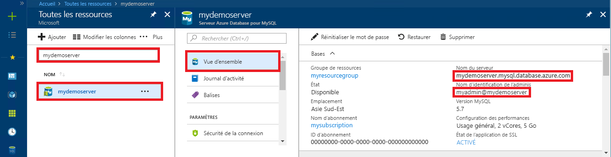

# <a name="quickstart-use-nodejs-to-connect-and-query-data-in-azure-database-for-mysql"></a>Démarrage rapide : Utilisation de Node.js pour vous connecter et interroger des données dans Azure Database pour MySQL

Dans ce guide de démarrage rapide, vous vous connectez à Azure Database pour MySQL avec Node.js. Vous utilisez ensuite des instructions SQL pour interroger, insérer, mettre à jour et supprimer des données dans la base de données depuis des plateformes Mac, Ubuntu Linux et Windows. 

Cette rubrique part du principe que vous connaissez les bases du développement Node.js, mais que vous commencez juste à utiliser Azure Database pour MySQL.

## <a name="prerequisites"></a>Prérequis

- Compte Azure avec un abonnement actif. [Créez un compte gratuitement](https://azure.microsoft.com/free/?ref=microsoft.com&utm_source=microsoft.com&utm_medium=docs&utm_campaign=visualstudio).
- Un serveur Azure Database pour MySQL. [Créer un serveur Azure Database pour MySQL avec le portail Azure](quickstart-create-mysql-server-database-using-azure-portal.md) ou [Créer un serveur Azure Database pour MySQL avec Azure CLI](quickstart-create-mysql-server-database-using-azure-cli.md).

## <a name="install-nodejs-and-the-mysql-connector"></a>Installer Node.js et le connecteur MySQL

Selon votre plateforme, suivez les instructions de la section appropriée pour installer [Node.js](https://nodejs.org). Utilisez npm pour installer le package [mysql](https://www.npmjs.com/package/mysql) et ses dépendances dans votre dossier de projet.

### <a name="windows"></a>**Windows**

1. Visitez la [page des téléchargements Node.js](https://nodejs.org/en/download/) et sélectionnez l’option souhaitée pour le programme d’installation de Windows.
2. Créez un dossier de projet local, tel que `nodejsmysql`. 
3. Ouvrez l’invite de commandes, puis changez de répertoire dans le dossier du projet, tel que `cd c:\nodejsmysql\`
4. Exécutez l’outil NPM pour installer la bibliothèque mysql dans le dossier du projet.

   ```cmd
   cd c:\nodejsmysql\
   "C:\Program Files\nodejs\npm" install mysql
   "C:\Program Files\nodejs\npm" list
   ```

5. Vérifiez l’installation en consultant le texte de sortie `npm list`. Le numéro de version peut varier étant donné que de nouveaux correctifs sont publiés.

### <a name="linux-ubuntu"></a>**Linux (Ubuntu)**

1. Exécutez les commandes suivantes pour installer **Node.js** et **npm**, le gestionnaire de package pour Node.js.

   ```bash
   sudo apt-get install -y nodejs npm
   ```

2. Exécutez les commandes suivantes pour créer un dossier de projet `mysqlnodejs` et installer le package mysql dans ce dossier.

   ```bash
   mkdir nodejsmysql
   cd nodejsmysql
   npm install --save mysql
   npm list
   ```
3. Vérifiez l’installation en consultant le texte de sortie de liste npm. Le numéro de version peut varier étant donné que de nouveaux correctifs sont publiés.

### <a name="mac-os"></a>**Mac OS**

1. Entrez les commandes suivantes pour installer **brew**, un gestionnaire de package facile à utiliser pour Mac OS X et **Node.js**.

   ```bash
   ruby -e "$(curl -fsSL https://raw.githubusercontent.com/Homebrew/install/master/install)"
   brew install node
   ```
2. Exécutez les commandes suivantes pour créer un dossier de projet `mysqlnodejs` et installer le package mysql dans ce dossier.

   ```bash
   mkdir nodejsmysql
   cd nodejsmysql
   npm install --save mysql
   npm list
   ```

3. Vérifiez l’installation en consultant le texte de sortie `npm list`. Le numéro de version peut varier étant donné que de nouveaux correctifs sont publiés.

## <a name="get-connection-information"></a>Obtenir des informations de connexion

Obtenez les informations requises pour vous connecter à la base de données Azure pour MySQL. Vous devez disposer du nom de serveur complet et des informations d’identification.

1. Connectez-vous au [portail Azure](https://portal.azure.com/).
2. Dans le menu de gauche du portail Azure, sélectionnez **Toutes les ressources**, puis recherchez le serveur que vous venez de créer, par exemple **mydemoserver**.
3. Sélectionnez le nom du serveur.
4. Dans le panneau **Vue d’ensemble** du serveur, notez le **nom du serveur** et le **nom de connexion de l’administrateur du serveur**. Si vous oubliez votre mot de passe, vous pouvez également le réinitialiser dans ce panneau.
 

## <a name="running-the-javascript-code-in-nodejs"></a>Exécution du code JavaScript dans Node.js

1. Collez le code JavaScript dans des fichiers textes, puis enregistrez-le dans un dossier de projet avec l’extension de fichier .js (par exemple C:\nodejsmysql\createtable.js ou /home/username/nodejsmysql/createtable.js).
2. Ouvrez l’invite de commande ou l’interpréteur de commandes Bash, puis changez de répertoire dans votre dossier de projet `cd nodejsmysql`.
3. Pour exécuter l’application, tapez la commande de nœud suivie du nom de fichier, tel que `node createtable.js`.
4. Sous Windows, si l’application de nœud n’est pas dans votre chemin d’accès de variable d’environnement, vous devrez peut-être utiliser le chemin d’accès complet pour lancer l’application de nœud, tel que `"C:\Program Files\nodejs\node.exe" createtable.js`.

## <a name="connect-create-table-and-insert-data"></a>Se connecter, créer des tables et insérer des données

Utilisez le code suivant pour vous connecter et charger les données à l’aide d’instructions SQL **CREATE TABLE** et **INSERT INTO**.

La méthode [mysql.createConnection()](https://github.com/mysqljs/mysql#establishing-connections) est utilisée pour interagir avec le serveur MySQL. La fonction [connect()](https://github.com/mysqljs/mysql#establishing-connections) est utilisée pour établir la connexion avec le serveur. La fonction [query()](https://github.com/mysqljs/mysql#performing-queries) est utilisée pour exécuter la requête SQL sur la base de données MySQL. 

Remplacez les paramètres `host`, `user`, `password` et `database` par les valeurs que vous avez spécifiées lorsque vous avez créé le serveur et la base de données.

```javascript
const mysql = require('mysql');

var config =
{
    host: 'mydemoserver.mysql.database.azure.com',
    user: 'myadmin@mydemoserver',
    password: 'your_password',
    database: 'quickstartdb',
    port: 3306,
    ssl: true
};

const conn = new mysql.createConnection(config);

conn.connect(
    function (err) { 
    if (err) { 
        console.log("!!! Cannot connect !!! Error:");
        throw err;
    }
    else
    {
       console.log("Connection established.");
           queryDatabase();
    }   
});

function queryDatabase(){
       conn.query('DROP TABLE IF EXISTS inventory;', function (err, results, fields) { 
            if (err) throw err; 
            console.log('Dropped inventory table if existed.');
        })
       conn.query('CREATE TABLE inventory (id serial PRIMARY KEY, name VARCHAR(50), quantity INTEGER);', 
            function (err, results, fields) {
                if (err) throw err;
            console.log('Created inventory table.');
        })
       conn.query('INSERT INTO inventory (name, quantity) VALUES (?, ?);', ['banana', 150], 
            function (err, results, fields) {
                if (err) throw err;
            else console.log('Inserted ' + results.affectedRows + ' row(s).');
        })
       conn.query('INSERT INTO inventory (name, quantity) VALUES (?, ?);', ['orange', 154], 
            function (err, results, fields) {
                if (err) throw err;
            console.log('Inserted ' + results.affectedRows + ' row(s).');
        })
       conn.query('INSERT INTO inventory (name, quantity) VALUES (?, ?);', ['apple', 100], 
        function (err, results, fields) {
                if (err) throw err;
            console.log('Inserted ' + results.affectedRows + ' row(s).');
        })
       conn.end(function (err) { 
        if (err) throw err;
        else  console.log('Done.') 
        });
};
```

## <a name="read-data"></a>Lire les données

Utilisez le code suivant pour vous connecter et lire des données à l’aide d’une instruction SQL **SELECT**. 

La méthode [mysql.createConnection()](https://github.com/mysqljs/mysql#establishing-connections) est utilisée pour interagir avec le serveur MySQL. La méthode [connect()](https://github.com/mysqljs/mysql#establishing-connections) est utilisée pour établir la connexion avec le serveur. La méthode [query()](https://github.com/mysqljs/mysql#performing-queries) est utilisée pour exécuter la requête SQL sur la base de données MySQL. Le tableau de résultats est utilisé pour contenir les résultats de la requête.

Remplacez les paramètres `host`, `user`, `password` et `database` par les valeurs que vous avez spécifiées lorsque vous avez créé le serveur et la base de données.

```javascript
const mysql = require('mysql');

var config =
{
    host: 'mydemoserver.mysql.database.azure.com',
    user: 'myadmin@mydemoserver',
    password: 'your_password',
    database: 'quickstartdb',
    port: 3306,
    ssl: true
};

const conn = new mysql.createConnection(config);

conn.connect(
    function (err) { 
        if (err) { 
            console.log("!!! Cannot connect !!! Error:");
            throw err;
        }
        else {
            console.log("Connection established.");
            readData();
        }   
    });

function readData(){
        conn.query('SELECT * FROM inventory', 
            function (err, results, fields) {
                if (err) throw err;
                else console.log('Selected ' + results.length + ' row(s).');
                for (i = 0; i < results.length; i++) {
                    console.log('Row: ' + JSON.stringify(results[i]));
                }
                console.log('Done.');
            })
       conn.end(
           function (err) { 
                if (err) throw err;
                else  console.log('Closing connection.') 
        });
};
```

## <a name="update-data"></a>Mettre à jour des données

Utilisez le code suivant pour vous connecter et lire les données à l’aide d’une instruction SQL **UPDATE**. 

La méthode [mysql.createConnection()](https://github.com/mysqljs/mysql#establishing-connections) est utilisée pour interagir avec le serveur MySQL. La méthode [connect()](https://github.com/mysqljs/mysql#establishing-connections) est utilisée pour établir la connexion avec le serveur. La méthode [query()](https://github.com/mysqljs/mysql#performing-queries) est utilisée pour exécuter la requête SQL sur la base de données MySQL. 

Remplacez les paramètres `host`, `user`, `password` et `database` par les valeurs que vous avez spécifiées lorsque vous avez créé le serveur et la base de données.

```javascript
const mysql = require('mysql');

var config =
{
    host: 'mydemoserver.mysql.database.azure.com',
    user: 'myadmin@mydemoserver',
    password: 'your_password',
    database: 'quickstartdb',
    port: 3306,
    ssl: true
};

const conn = new mysql.createConnection(config);

conn.connect(
    function (err) { 
        if (err) { 
            console.log("!!! Cannot connect !!! Error:");
            throw err;
        }
        else {
            console.log("Connection established.");
            updateData();
        }   
    });

function updateData(){
       conn.query('UPDATE inventory SET quantity = ? WHERE name = ?', [200, 'banana'], 
            function (err, results, fields) {
                if (err) throw err;
                else console.log('Updated ' + results.affectedRows + ' row(s).');
        })
       conn.end(
           function (err) { 
                if (err) throw err;
                else  console.log('Done.') 
        });
};
```

## <a name="delete-data"></a>Suppression de données

Utilisez le code suivant pour vous connecter et lire les données à l’aide d’une instruction SQL **DELETE**. 

La méthode [mysql.createConnection()](https://github.com/mysqljs/mysql#establishing-connections) est utilisée pour interagir avec le serveur MySQL. La méthode [connect()](https://github.com/mysqljs/mysql#establishing-connections) est utilisée pour établir la connexion avec le serveur. La méthode [query()](https://github.com/mysqljs/mysql#performing-queries) est utilisée pour exécuter la requête SQL sur la base de données MySQL. 

Remplacez les paramètres `host`, `user`, `password` et `database` par les valeurs que vous avez spécifiées lorsque vous avez créé le serveur et la base de données.

```javascript
const mysql = require('mysql');

var config =
{
    host: 'mydemoserver.mysql.database.azure.com',
    user: 'myadmin@mydemoserver',
    password: 'your_password',
    database: 'quickstartdb',
    port: 3306,
    ssl: true
};

const conn = new mysql.createConnection(config);

conn.connect(
    function (err) { 
        if (err) { 
            console.log("!!! Cannot connect !!! Error:");
            throw err;
        }
        else {
            console.log("Connection established.");
            deleteData();
        }   
    });

function deleteData(){
       conn.query('DELETE FROM inventory WHERE name = ?', ['orange'], 
            function (err, results, fields) {
                if (err) throw err;
                else console.log('Deleted ' + results.affectedRows + ' row(s).');
        })
       conn.end(
           function (err) { 
                if (err) throw err;
                else  console.log('Done.') 
        });
};
```

## <a name="next-steps"></a>Étapes suivantes

> [!div class="nextstepaction"]
> [Migration de votre base de données PostgreSQL par exportation et importation](./concepts-migrate-import-export.md)
