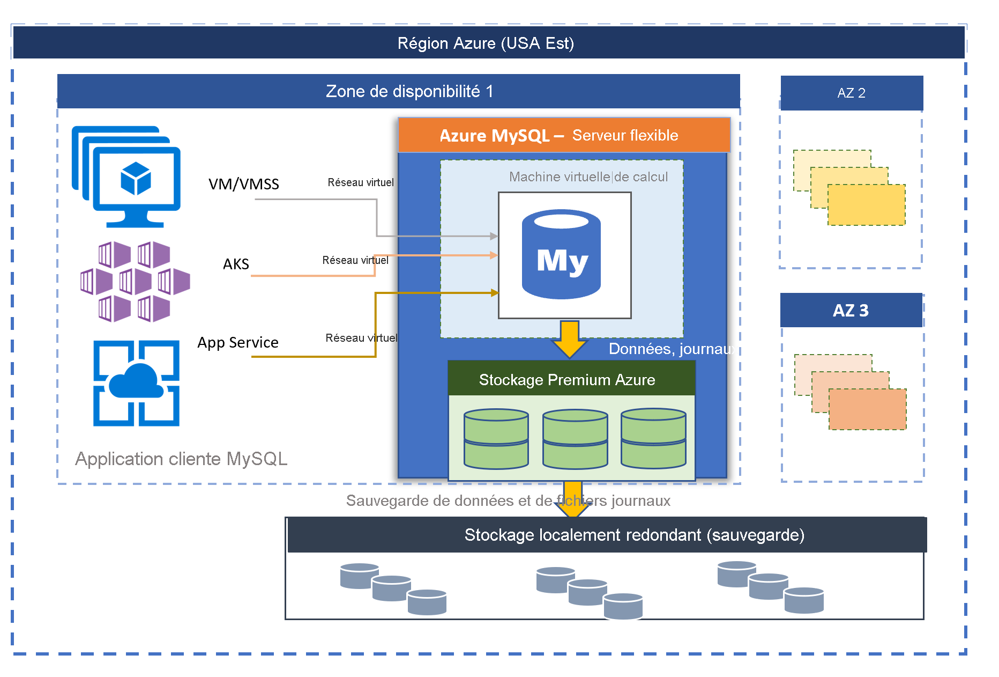

# Azure Database pour MySQL - Serveur flexible (préversion)

Deux modes de déploiement sont disponibles pour Azure Database pour MySQL optimisé par MySQL Community Edition :
- Serveur unique 
- Serveur flexible (préversion)

Cet article contient une vue d'ensemble et une présentation des concepts de base du modèle de déploiement de serveur unique. Pour plus d’informations sur la façon de déterminer l’option de déploiement qui convient à votre charge de travail, consultez [choix de l’option de serveur MySQL appropriée dans Azure](./../select-right-deployment-type.md).

## Vue d’ensemble

Azure Database pour MySQL - Serveur flexible est un service de base de données entièrement géré conçu pour offrir un contrôle et une flexibilité plus granulaires des fonctions de gestion de base de données et des paramètres de configuration. En général, le service fournit des personnalisations en termes de flexibilité et configuration de serveur suivant les besoins de l’utilisateur. L’architecture de serveur flexible permet aux utilisateurs d’opter pour une haute disponibilité au sein d’une même zone de disponibilité et dans plusieurs zones de disponibilité. Les serveurs flexibles offrent également de meilleurs contrôles d’optimisation des coûts grâce à la possibilité de d’arrêter/de démarrer votre serveur et vos références (SKU) expansibles, idéales pour les charges de travail qui n’ont pas besoin en permanence d’une capacité de calcul complète. Le service prend actuellement en charge la version de la communauté de MySQL 5.7. Le service, en préversion, est aujourd'hui généralement disponible dans un grand nombre de [régions Azure](https://azure.microsoft.com/global-infrastructure/services/).

Les serveurs flexibles sont adaptés de façon optimale pour ce qui suit : 
- Développement d’applications nécessitant un meilleur contrôle et des personnalisations.
- Haute disponibilité redondante interzone.
- Fenêtres de maintenance managées.

 

## Haute disponibilité à l’intérieur de zones de disponibilité et entre elles

Le modèle de déploiement de serveur flexible est conçu pour prendre en charge une haute disponibilité au sein d’une même zone de disponibilité et dans plusieurs zones de disponibilité. L'architecture distingue le calcul du stockage. Le moteur de base de données s'exécute sur une machine virtuelle, tandis que les fichiers de données résident sur le stockage Azure. Le stockage gère trois copies synchrones localement redondantes des fichiers de base de données, ce qui garantit la durabilité des données en permanence. 

Au sein d’une zone de disponibilité unique, si le serveur tombe en panne en raison d’événements planifiés ou non, le service maintient la haute disponibilité des serveurs grâce à la procédure automatisée suivante :

1. Une nouvelle machine virtuelle de calcul est approvisionnée.
2. Le stockage contenant les fichiers de données est mappé avec la machine virtuelle.
3. Le moteur de base de données MySQL est mis en ligne sur le nouvelle machine virtuelle.
4. Les applications clientes peuvent se reconnecter une fois le serveur prêt à accepter les connexions.
   
:::image type="content" source="media/overview/2-flexible-server-architecture.png" alt-text="Schéma conceptuel de haute disponibilité à zone unique"::: 

Si la haute disponibilité redondante interzone est configurée, le service approvisionne et gère un serveur de secours dans la zone de disponibilité, au sein de la même région Azure. Les modifications apportées aux données sur le serveur source sont répliquées de façon synchrone sur le serveur de secours pour éviter toute perte de données. Avec la haute disponibilité redondante interzone, une fois l’événement de basculement planifié ou non planifié déclenché, le serveur de secours est immédiatement mis en ligne et disponible pour traiter les transactions entrantes. Le temps de basculement standard est compris entre 60 et 120 secondes. Cela permet au service de prendre en charge la haute disponibilité et d’améliorer la résilience grâce à la tolérance en cas de défaillances de zone de disponibilité uniques dans une région Azure donnée. 

Pour plus d’informations, consultez [Concepts de haute disponibilité](concepts-high-availability.md).

:::image type="content" source="media/overview/3-flexible-server-overview-zone-redundant-ha.png" alt-text="Schéma conceptuel de haute disponibilité redondante interzone"::: 

## Mise à jour corrective automatisée avec fenêtre de maintenance gérée

Le service effectue une mise à jour corrective automatisée du matériel, du système d’exploitation et du moteur de base de données sous-jacents. Le correctif comprend les mises à jour de sécurité et de logiciel. Pour le moteur MySQL, les mises à niveau de version mineure sont également incluses dans le cadre de la publication de maintenance planifiée. Les utilisateurs peuvent configurer la planification de la mise à jour corrective pour qu’elle soit gérée par le système, ou définir leur planification personnalisés. Pendant la planification de la maintenance, le correctif est appliqué et le serveur peut nécessiter un redémarrage dans le cadre du processus de mise à jour corrective pour achever la mise à jour. Avec la planification personnalisée, les utilisateurs peuvent rendre leur cycle de mise à jour prévisible, et choisir une fenêtre de maintenance avec un impact minimal sur l’activité. En général, le service suit un calendrier de publication mensuel dans le cadre de l’intégration et de la publication continues.

Pour plus d’informations, consultez [Maintenance planifiée](concepts-maintenance.md). 

## Sauvegardes automatiques

Le service à serveur flexible crée automatiquement des sauvegardes de serveur et les conserve sur un stockage géoredondant ou redondant localement configuré par l'utilisateur. Les sauvegardes peuvent être utilisées pour restaurer votre serveur à n'importe quel point dans le temps au cours de la période de rétention des sauvegardes. La période de rétention de sauvegarde par défaut est de sept jours. La rétention peut être configurée sur une durée maximum de 35 jours. Toutes les sauvegardes sont chiffrées à l’aide du chiffrement AES de 256 bits. 

Pour plus d’informations, consultez [Concepts de sauvegarde](concepts-backup-restore.md) .

## Isolement réseau

Vous avez deux possibilités de mise en réseau pour connecter votre serveur flexible Azure Database pour MySQL. Il s’agit de l’**accès privé (intégration au réseau virtuel)** et de l’**accès public (adresses IP autorisées)** . 

* **Accès privé (intégration au réseau virtuel)**  : vous pouvez déployer votre serveur flexible sur votre [réseau virtuel Azure](../../virtual-network/virtual-networks-overview.md). Les réseaux virtuels Azure offrent des communications réseau privées et sécurisées. Les ressources incluses sur un réseau virtuel peuvent communiquer par le biais d’adresses IP privées.

   Choisissez l’option d’intégration au réseau virtuel si vous voulez avoir les capacités suivantes :
   * Connexion à partir de ressources Azure du même réseau virtuel à votre serveur flexible à l’aide d’adresses IP privées
   * Utilisation d’un VPN ou du service ExpressRoute pour vous connecter à partir de ressources non-Azure à votre serveur flexible
   * Aucun point de terminaison public

* **Accès public (adresses IP autorisées)**  : vous pouvez déployer votre serveur flexible avec un point de terminaison public. Le point de terminaison public est une adresse DNS résolvable publiquement. L’expression « adresses IP autorisées » fait référence à une plage d’adresses IP que vous choisissez d’autoriser à accéder à votre serveur. Ces autorisations sont appelées **règles de pare-feu**.

Pour en savoir plus, consultez [Concepts de mise en réseau](concepts-networking.md).

## Ajustez les performances et la mise à l’échelle en quelques secondes

Trois références SKU sont disponibles pour le service à serveur flexible : Expansible, Usage général et À mémoire optimisée. Le niveau Expansible est idéalement adapté aux charges de travail de développement à faible coût et faible concurrence ne nécessitant pas en permanence une capacité de calcul complète. Les niveaux Usage général et À mémoire optimisée conviendront quant à eux aux charges de travail de production nécessitant une simultanéité et une mise à l'échelle de haut niveau, ainsi que des performances prévisibles. Vous pouvez créer votre première application sur une petite base de données pour un faible coût mensuel, puis adapter l’échelle en toute transparence aux besoins de votre solution. La mise à l'échelle du stockage s'effectue en ligne et prend en charge la croissance automatique du stockage. L’évolutivité dynamique permet de répondre en toute transparence à l’évolution rapide des besoins en ressources de votre base de données. Vous ne payez que pour les ressources que vous consommez. 

Pour plus d’informations, consultez [Concepts de calcul et de stockage](concepts-compute-storage.md).

## Effectuer un scale-out de la charge de travail en lecture pour utiliser jusqu’à dix réplicas en lecture

MySQL est l’un des moteurs de base de données couramment utilisés pour exécuter des applications web et mobiles à l’échelle d’Internet. La plupart de nos clients s’en servent pour leurs services de formation en ligne, services de diffusion vidéo, solutions de paiement numérique, plateformes de commerce électronique, services de jeux, portails d’actualité, administrations publiques et sites web de santé. Ces services sont requis à des fins de mise à l’échelle à mesure que le trafic sur l’application web ou mobile augmente.

Du côté des applications, l’application est généralement développée en Java ou PHP et migrée pour s’exécuter sur des  [groupes de machines virtuelles identiques Azure](../../virtual-machine-scale-sets/overview.md) , [Azure App Services](../../app-service/overview.md) ou en conteneur sur  [Azure Kubernetes Service (AKS)](../../aks/intro-kubernetes.md). Avec un groupe de machines virtuelles identiques, App Service ou AKS en tant qu’infrastructure sous-jacente, la mise à l’échelle des applications est simplifiée grâce à l’approvisionnement instantané de nouvelles machines virtuelles et à la réplication des composants sans état des applications pour répondre aux demandes, mais souvent, la base de données finit par constituer un goulot d’étranglement comme composant avec état centralisé.

La fonctionnalité de réplica en lecture vous permet de répliquer les données d’un serveur flexible Azure Database pour MySQL sur un serveur en lecture seule. Vous pouvez effectuer la réplication à partir du serveur source vers **dix réplicas au maximum**. Les réplicas sont mis à jour de manière asynchrone à l’aide de la [technologie de réplication selon la position du fichier journal binaire (binlog)](https://dev.mysql.com/doc/refman/5.7/en/replication-features.html) native au moteur MySQL. Vous pouvez utiliser une solution de proxy d’équilibrage de charge comme [ProxySQL](https://techcommunity.microsoft.com/t5/azure-database-for-mysql/load-balance-read-replicas-using-proxysql-in-azure-database-for/ba-p/880042) pour faire un scale-out transparent de la charge de travail de votre application vers des réplicas en lecture sans coût de refactorisation de l’application. 

Pour en savoir plus, reportez-vous aux [concepts des réplicas en lecture](concepts-read-replicas.md). 

## Arrêter/démarrer le serveur pour optimiser les coûts

Le service de serveur flexible vous permet d’arrêter et de démarrer le serveur à la demande pour optimiser les coûts. La facturation du niveau de calcul est immédiatement arrêtée lorsque le serveur est arrêté. Cela peut vous permettre de réaliser des économies significatives en termes de développement, de test et de charges de travail de production prévisibles liées au temps. Le serveur reste à l’état arrêté pendant sept jours, sauf si le redémarrage intervient plus tôt. 

Pour plus d’informations, consultez [Concepts liés aux serveurs](concept-servers.md). 

## Sécurité de qualité professionnelle et confidentialité

Le service à serveur flexible utilise le module de chiffrement conforme à la norme FIPS 140-2 pour chiffrer le stockage des données au repos. Toutes les données sont chiffrées, y compris les sauvegardes et les fichiers temporaires créés lors de l'exécution des requêtes. Le service utilise le chiffrement AES 256 bits inclus dans le chiffrement de stockage Azure, et les clés peuvent être gérées par le système (par défaut). 

Le service chiffre les données en mouvement avec le protocole TLS appliqué par défaut. Le serveur flexible prend uniquement en charge les connexions chiffrées à l’aide du protocole TLS (Transport Layer Security) 1.2 et toutes les connexions entrantes qui utilisent les protocoles TLS 1.0 et TLS 1.1 sont refusées. 

Pour plus d’informations, consultez [Utiliser les connexions chiffrées sur des serveurs flexibles](https://docs.mongodb.com/manual/tutorial/configure-ssl).

Les serveurs flexibles permettent un accès privé complet aux serveurs à l’aide du [réseau virtuel Azure](../../virtual-network/virtual-networks-overview.md) (intégration au réseau virtuel). Les serveurs du réseau virtuel Azure sont uniquement accessibles et connectés via des adresses IP privées. Avec l’intégration au réseau virtuel, l’accès public est refusé et les serveurs ne sont pas accessibles à l’aide de points de terminaison publics. 

Pour en savoir plus, consultez [Concepts de mise en réseau](concepts-networking.md).

## Surveillance et alerte

Le service à serveur flexible est équipé de fonctionnalités intégrées d'analyse des performances et d'alerte. Toutes les métriques Azure présentent une fréquence d’une minute et chaque métrique fournit 30 jours d’historique. Vous pouvez configurer des alertes basées sur les métriques. Le service expose les métriques du serveur hôte pour surveiller l’utilisation des ressources et permet de configurer les journaux des requêtes lentes. Grâce à ces outils, vous pouvez rapidement optimiser vos charges de travail et configurer votre serveur pour bénéficier de performances optimales. 

Pour plus d’informations, consultez [Concepts de mise en réseau](concepts-monitoring.md).

## Migration

Le service exécute la version de la communauté de MySQL. Cela permet une compatibilité totale des applications et requiert un coût de refactorisation minimal pour migrer une application existante développée sur le moteur MySQL vers un service à serveur unique. La migration vers le serveur unique peut être effectuée à l'aide de l'une des options suivantes :

- **Image mémoire et restauration** : pour les migrations hors connexion, au cours desquelles les utilisateurs peuvent se permettre des temps d'arrêt, l'image mémoire et la restauration à l'aide d'outils communautaires tels que mysqldump/mydumper peuvent constituer la méthode de migration la plus rapide. Pour plus d'informations, consultez Migrer à l'aide de l'image mémoire et de la restauration. 
- **Azure Database Migration Service** : pour les migrations transparentes et simplifiées vers un serveur unique avec temps d'arrêt minimal, [Azure Database Migration Service](../../dms/tutorial-mysql-azure-mysql-online.md) peut être utilisé. 

## Régions Azure

L’un des avantages de l’exécution de votre charge de travail dans Azure est sa portée mondiale. Le serveur flexible pour Azure Database pour MySQL est disponible aujourd’hui dans les régions Azure suivantes :

| Region | Disponibilité | Haute disponibilité redondante interzone | 
| --- | --- | --- |
| Europe Ouest | :heavy_check_mark: | :heavy_check_mark: |
| Europe Nord | :heavy_check_mark: | :heavy_check_mark: |
| Sud du Royaume-Uni | :heavy_check_mark: | :x: | 
| USA Est 2 | :heavy_check_mark: | :heavy_check_mark: |
| USA Ouest 2 | :heavy_check_mark: | :heavy_check_mark: |
| USA Centre | :heavy_check_mark: | :x: | 
| USA Est | :heavy_check_mark: | :heavy_check_mark: |
| Centre du Canada | :heavy_check_mark: | :x: | 
| Asie Sud-Est | :heavy_check_mark: | :heavy_check_mark: |
| Centre de la Corée | :heavy_check_mark: | :x: | 
| Japon Est | :heavy_check_mark: | :x: | 
| Australie Est | :heavy_check_mark: | :heavy_check_mark: |

Nous travaillons à l’ajout de nouvelles régions d’ici peu.

## Contacts
Pour toute question ou suggestion au sujet du serveur flexible d’Azure Database pour MySQL, envoyez un e-mail à l’équipe Azure Database pour MySQL ([@Ask Azure DB pour MySQL](mailto:AskAzureDBforMySQL@service.microsoft.com)). Cette adresse e-mail n’est pas un alias de support technique.

En outre, tenez compte des points de contact suivants le cas échéant :

- Pour contacter le support technique Azure, [émettez un ticket à partir du Portail Azure](https://portal.azure.com/?#blade/Microsoft_Azure_Support/HelpAndSupportBlade).
- Pour résoudre un problème relatif à votre compte, enregistrez une [demande de support](https://ms.portal.azure.com/#blade/Microsoft_Azure_Support/HelpAndSupportBlade/newsupportrequest) sur le portail Azure.
- Pour donner votre avis ou demander de nouvelles fonctionnalités, créez une entrée via [UserVoice](https://feedback.azure.com/forums/597982-azure-database-for-mysql).

## Étapes suivantes
Maintenant que vous avez lu l'introduction au mode de déploiement Azure Database pour MySQL - Serveur unique, vous êtes prêt à :

- Créer votre premier serveur 
  - [Créer un serveur flexible Azure Database pour MySQL à l'aide du portail Azure](quickstart-create-server-portal.md)
  - [Créer un serveur flexible Azure Database pour MySQL à l'aide d'Azure CLI](quickstart-create-server-cli.md)
  - [Gérer un serveur flexible Azure Database pour MySQL à l'aide d'Azure CLI](how-to-manage-server-portal.md)

- Générez votre première application à l’aide de votre langage préféré :
  - [Python](connect-python.md)
  - [Php](connect-php.md)
