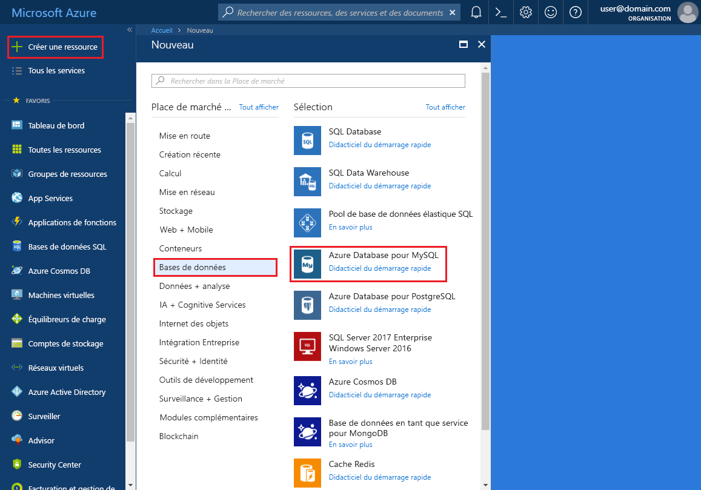
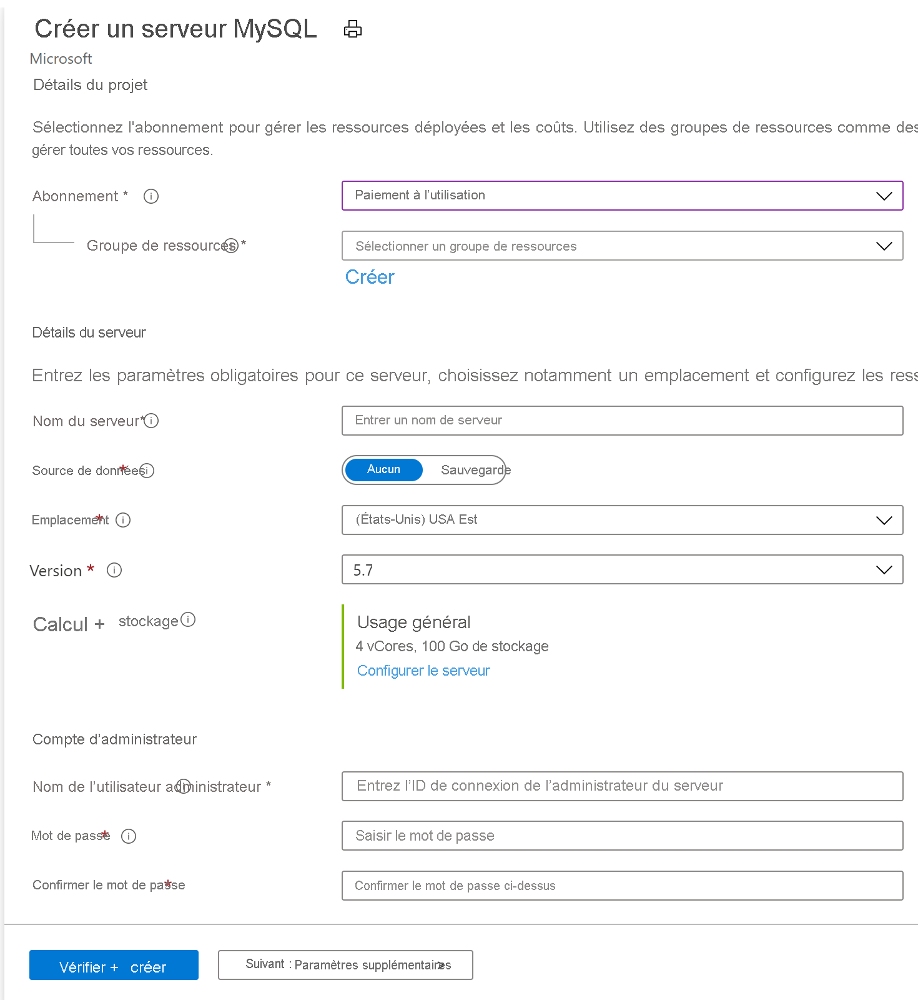
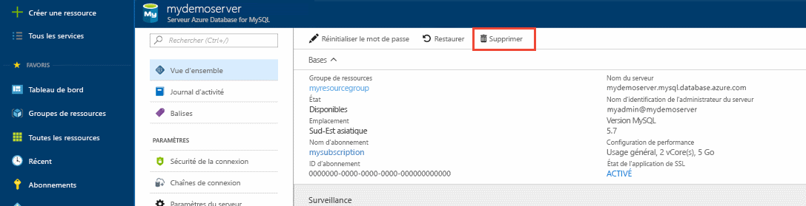

# <a name="quickstart-create-an-azure-database-for-mysql-server-in-the-azure-portal"></a>Démarrage rapide : Créer un serveur Azure Database pour MySQL via le portail Azure

Azure Database pour MySQL est un service géré qui vous permet d’exécuter, de gérer et de mettre à l’échelle des bases de données MySQL hautement disponibles dans le cloud. Ce démarrage rapide vous montre comment créer en quelques minutes un serveur Azure Database pour MySQL à l’aide du portail Azure.  

Si vous n’avez pas d’abonnement Azure, créez un [compte Azure gratuit](https://azure.microsoft.com/free/) avant de commencer.

## <a name="sign-in-to-the-azure-portal"></a>Connectez-vous au portail Azure.
Ouvrez votre navigateur Web, puis accédez au [portail Azure](https://portal.azure.com/). Entrez vos informations d’identification pour vous connecter au portail. Il s’ouvre par défaut sur le tableau de bord des services.

## <a name="create-an-azure-database-for-mysql-server"></a>Création d’un serveur Azure Database pour MySQL
Vous créez un serveur Azure Database pour MySQL avec un ensemble défini de [ressources de calcul et de stockage](./concepts-compute-unit-and-storage.md). Vous créez ce serveur dans un [groupe de ressources Azure](../azure-resource-manager/management/overview.md).

Pour créer un serveur de base de données Azure pour MySQL, suivez les étapes ci-après :

1. Sélectionnez **Créer une ressource** (+) dans l’angle supérieur gauche du portail.

2. Sélectionnez **Bases de données** > **Azure Database pour MySQL**. Vous pouvez également entrer **MySQL** dans la zone de recherche pour localiser le service.

  
>[!div class="mx-imgBorder"]
> 

3. Remplissez le formulaire de détails du nouveau serveur avec les informations suivantes :
    
>[!div class="mx-imgBorder"]
> 

**Paramètre** | **Valeur suggérée** | **Description du champ** 
---|---|---
Abonnement | Votre abonnement | Sélectionnez l’abonnement Azure que vous souhaitez utiliser pour votre serveur. Si vous avez plusieurs abonnements, sélectionnez l’abonnement dans lequel la ressource est facturée.
Resource group | *myresourcegroup* | Spécifiez un nom de groupe de ressources nouveau ou existant. Vous pouvez utiliser un groupe de ressources pour organiser vos dépendances appartenant à un projet unique.
Nom du serveur | Nom de serveur unique | Entrez un nom unique qui identifie votre serveur Azure Database pour MySQL. Par exemple, « mysqldbserver ». Le nom de serveur ne peut contenir que des lettres minuscules, des chiffres et le caractère de trait d’union (-). Il doit inclure entre 3 et 63 caractères.
Source de données |*Aucun* | Sélectionnez *Aucun* pour créer un serveur en partant de zéro. (Vous sélectionneriez *Sauvegarde* si vous créiez un serveur à partir d’une sauvegarde géographique d’un serveur Azure Database pour MySQL existant).
Connexion d’administrateur serveur | myadmin | Entrez un nom d’utilisateur pour votre administrateur de serveur. Vous ne pouvez pas utiliser **azure_superuser**, **admin**, **administrator**, **root**, **guest** ou **public** comme nom d’utilisateur pour l’administrateur.
Mot de passe | *Votre choix* | Spécifiez un mot de passe pour le compte Administrateur du serveur. Le mot de passe doit comprendre entre 8 et 128 caractères, avec une combinaison de lettres majuscules ou minuscules, de chiffres et de caractères non alphanumériques ( !, $, #,%, etc.).
Confirmer le mot de passe | *Votre choix*| Confirmez le mot de passe du compte d’administrateur.
Emplacement | *La région la plus proche de vos utilisateurs*| Choisissez l’emplacement le plus proche de vos utilisateurs ou de vos autres applications Azure.
Version | *La version principale la plus récente*| La version principale la plus récente (sauf si vous avez des exigences spécifiques).
Calcul + Stockage | **Usage général**, **Gen 5**, **2 vCores**, **5 Go**, **7 jours**, **Géoredondant** |Les configurations de calcul, de stockage et de sauvegarde pour votre nouveau serveur. Sélectionnez **Configurer le serveur**. Sélectionnez ensuite le niveau tarifaire approprié. Pour plus d’informations, consultez la [page relative à la tarification](https://azure.microsoft.com/pricing/details/mysql/). Pour activer les sauvegardes de votre serveur dans le stockage géo-redondant, sélectionnez **Géographiquement redondant** dans les **Options de redondance de sauvegarde**. Sélectionnez **OK**.

   > [!NOTE]
   > Choisissez le niveau tarifaire De base si votre charge de travail n’a pas besoin d’une grande capacité de calcul et d’E/S. Notez que les serveurs créés avec le niveau tarifaire De base ne peuvent plus ensuite être mis à l’échelle vers le niveau Usage général ou Mémoire optimisée. 

4. Sélectionnez **Vérifier + créer** pour provisionner le serveur. L’approvisionnement peut durer jusqu’à 20 minutes.
   
5. Dans la barre d’outils, sélectionnez **Notifications** (icône de cloche) pour surveiller le processus de déploiement.
   
Par défaut, les bases de données suivantes sont créées sous votre serveur : **information_schema**, **mysql**, **performance_schema**, et **sys**.

## <a name="configure-a-server-level-firewall-rule"></a>Configurer une règle de pare-feu au niveau du serveur
Par défaut, le serveur créé est protégé par un pare-feu et n’est pas accessible publiquement. Pour accorder l’accès à votre adresse IP, accédez à votre ressource de serveur dans le portail Azure, puis sélectionnez **Sécurité de la connexion** dans le menu de gauche de votre ressource de serveur. Si vous ne savez pas comment trouver votre ressource, consultez [Guide pratique pour ouvrir une ressource](https://docs.microsoft.com/azure/azure-resource-manager/management/manage-resources-portal#open-resources).

>[!div class="mx-imgBorder"]
> 
   
Sélectionnez à présent **Ajouter l’adresse IP actuelle du client**, puis sélectionnez **Enregistrer**. Vous pouvez ajouter des adresses IP supplémentaires ou fournir une plage d’adresses IP pour permettre la connexion à votre serveur à partir de ces adresses IP. Pour plus d’informations, consultez [Comment gérer les règles de pare-feu sur un serveur Azure Database pour MySQL](./concepts-firewall-rules.md).

> [!NOTE]
> Vérifiez si votre réseau autorise le trafic sortant sur le port 3306 qu’Azure Database pour MySQL utilise afin d’éviter des problèmes de connectivité.  

## <a name="connect-to-azure-database-for-mysql-server-using-mysql-command-line-client"></a>Se connecter au serveur Azure Database pour MySQL à l’aide du client de ligne de commande mysql
Vous pouvez choisir [mysql.exe](https://dev.mysql.com/doc/refman/8.0/en/mysql.html) ou [MySQL Workbench](./connect-workbench.md) pour vous connecter au serveur à partir de votre environnement local. Dans ce démarrage rapide, nous allons exécuter **mysql.exe** dans [Azure Cloud Shell](https://docs.microsoft.com/azure/cloud-shell/overview) pour la connexion au serveur.

1. Lancez Azure Cloud Shell dans le portail en cliquant sur l’icône en surbrillance en haut à gauche. Notez le nom de votre serveur, le nom de connexion de l’administrateur de serveur, ainsi que le mot de passe et l’abonnement du serveur venant d’être créé dans la section **Vue d’ensemble**, comme illustré dans l’image ci-dessous.

    >[!NOTE]
    >Si vous lancez Cloud Shell pour la première fois, vous voyez s’afficher une invite permettant de créer un groupe de ressources et un compte de stockage. Il s’agit d’une étape unique qui sera automatiquement associée à toutes les sessions. 

   >[!div class="mx-imgBorder"]
   > 
2. Exécutez cette commande sur le terminal Azure Cloud Shell. Remplacez les valeurs par le nom réel du serveur et le nom réel de la connexion d’utilisateur administrateur. Le nom d’utilisateur de l’administrateur requiert « @\<servername> », comme indiqué ci-dessous pour Azure Database pour MySQL.  

  ```azurecli-interactive
  mysql --host=mydemoserver.mysql.database.azure.com --user=myadmin@mydemoserver -p 
  ```

  Voici comment se présente l’expérience utilisateur dans le terminal Cloud Shell
  ```
  Requesting a Cloud Shell.Succeeded.
  Connecting terminal...

  Welcome to Azure Cloud Shell

  Type "az" to use Azure CLI
  Type "help" to learn about Cloud Shell

  user@Azure:~$mysql -h mydemoserver.mysql.database.azure.com -u myadmin@mydemoserver -p
  Enter password:
  Welcome to the MySQL monitor.  Commands end with ; or \g.
  Your MySQL connection id is 64796
  Server version: 5.6.42.0 Source distribution

  Copyright (c) 2000, 2020, Oracle and/or its affiliates. All rights reserved.

  Oracle is a registered trademark of Oracle Corporation and/or its
  affiliates. Other names may be trademarks of their respective
  owners.

  Type 'help;' or '\h' for help. Type '\c' to clear the current input statement.
  mysql>
  ```
3. Dans le même terminal Azure Cloud Shell, créez un **invité** de base de données. 
  ```
  mysql> CREATE DATABASE guest;
  Query OK, 1 row affected (0.27 sec)
  ```
4. Basculez vers la base de données **invité**.
  ```
  mysql> USE guest;
  Database changed 
  ```
5. Tapez ```quit```, puis sélectionnez sur la touche Entrée pour quitter mysql.   

## <a name="clean-up-resources"></a>Nettoyer les ressources
Vous avez réussi à créer un serveur Azure Database pour MySQL dans un groupe de ressources.  Si vous ne pensez pas avoir besoin de ces ressources à l’avenir, vous pouvez les supprimer en supprimant le groupe de ressources ou en supprimant simplement le serveur MySQL. Pour supprimer le groupe de ressources, suivez ces étapes :
1. Depuis le portail Azure, recherchez et sélectionnez **Groupes de ressources**. 
2. Dans la liste des groupes de ressources, choisissez le nom de votre groupe de ressources.
3. Dans la page Vue d’ensemble de votre groupe de ressources, sélectionnez **Supprimer le groupe de ressources**.
4. Dans la boîte de dialogue de confirmation, entrez le nom de votre groupe de ressources, puis sélectionnez **Supprimer**.

Pour supprimer le serveur, vous pouvez cliquer sur le bouton **Supprimer** dans la page **Vue d’ensemble** de votre serveur, comme indiqué ci-dessous :
> [!div class="mx-imgBorder"]
> 

## <a name="next-steps"></a>Étapes suivantes
> [!div class="nextstepaction"]
>[Créer une application PHP sur Windows avec MySQL](../app-service/app-service-web-tutorial-php-mysql.md)
>[Créer une application PHP sur Linux avec MySQL](../app-service/containers/tutorial-php-mysql-app.md)
>[Créer une application Spring basée sur Java avec MySQL](https://docs.microsoft.com/azure/developer/java/spring-framework/spring-app-service-e2e?tabs=bash)
