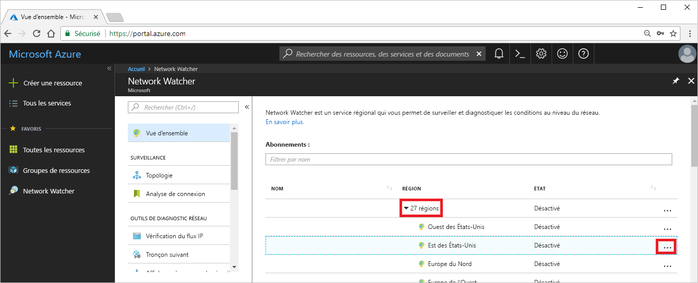
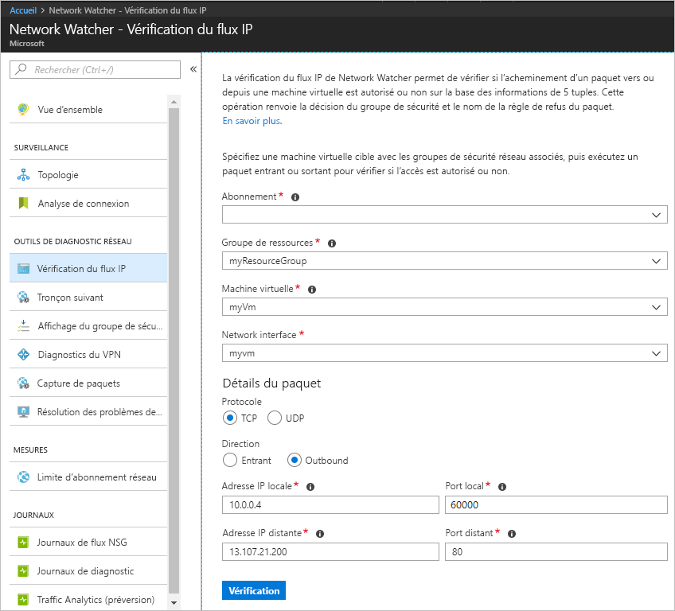
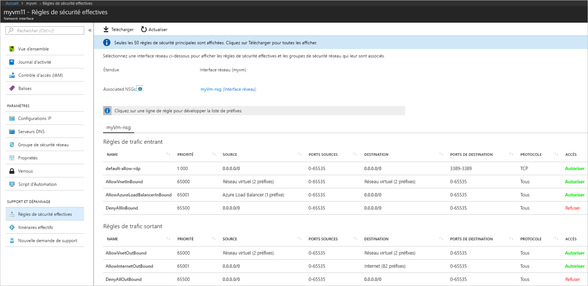

# Démarrage rapide : diagnostiquer un problème de filtre de trafic réseau d’une machine virtuelle en utilisant le portail Azure

Dans ce guide de démarrage rapide, vous déployez une machine virtuelle, puis vous vérifiez les communications vers une adresse IP et une URL et à partir d’une adresse IP. Vous déterminez la cause d’un échec de communication et la façon de le résoudre.

Si vous n’avez pas d’abonnement Azure, créez un [compte gratuit](https://azure.microsoft.com/free/?WT.mc_id=A261C142F) avant de commencer.

## Connexion à Azure

Connectez-vous au portail Azure sur https://portal.azure.com.

## Créer une machine virtuelle

1. Sélectionnez **+ Créer une ressource** en haut à gauche du portail Azure.
2. Sélectionnez **Calcul**, puis **Windows Server 2016 Datacenter** ou une version d’**Ubuntu Server**.
3. Entrez ou sélectionnez les informations suivantes, acceptez les valeurs par défaut pour les autres paramètres, puis cliquez sur **OK** :

    |Paramètre|Valeur|
    |---|---|
    |Nom|myVm|
    |Nom d'utilisateur| Entrez un nom d’utilisateur de votre choix.|
    |Mot de passe| Entrez un mot de passe de votre choix. Le mot de passe doit contenir au moins 12 caractères et satisfaire aux exigences de complexité définies.|
    |Abonnement| Sélectionnez votre abonnement.|
    |Resource group| Sélectionnez **Créer** et entrez **myResourceGroup**.|
    |Emplacement| Sélectionnez **USA Est**.|

4. Choisissez une taille de machine virtuelle, puis cliquez sur **Sélectionner**.
5. Sous **Paramètres**, acceptez toutes les valeurs par défaut, puis cliquez sur **OK**.
6. Sous **Créer** dans le **résumé**, sélectionnez **Créer** pour démarrer le déploiement de la machine virtuelle. Le déploiement de la machine virtuelle ne nécessite que quelques minutes. Attendez la fin du déploiement de la machine virtuelle avant d’effectuer les étapes restantes.

## Tester la communication réseau

Pour tester une communication réseau avec Network Watcher, commencez par activer un observateur réseau pour au moins une région Azure, puis utilisez la capacité de vérification de flux IP de Network Watcher.

### Activer Network Watcher

Si vous avez déjà un observateur réseau activé dans au moins une région, passez à l’étape [Utiliser la vérification du flux IP](#use-ip-flow-verify).

1. Dans le portail Azure, sélectionnez **Tous les services**. Dans la zone **Filtre**, entrez *Network Watcher*. Quand la mention **Network Watcher** apparaît dans les résultats, sélectionnez-la.
2. Activez un observateur réseau dans la région USA Est, car il s’agit de la région de la machine virtuelle déployée à l’étape précédente. Sélectionnez la zone **Régions** pour la développer, puis sélectionnez **...** à droite de la région **USA Est**, comme illustré dans l’image suivante :

    

3. Sélectionnez **Activer Network Watcher**.

### Utiliser la vérification des flux IP

Lorsque vous créez une machine virtuelle, Azure autorise et refuse le trafic réseau à destination et en provenance de la machine virtuelle, par défaut. Vous pourrez ultérieurement remplacer des valeurs Azure par défaut, en autorisant ou en refusant d’autres types de trafic.

1. Dans le portail Azure, sélectionnez **Tous les services**. Dans la zone de *filtre* **Tous les services**, entrez *Network Watcher*. Quand la mention **Network Watcher** apparaît dans les résultats, sélectionnez-la.
2. Sélectionnez **Vérifier le flux IP**, sous **OUTILS DE DIAGNOSTIC RÉSEAU**.
3. Sélectionnez votre abonnement, entrez ou sélectionnez les valeurs suivantes, puis sélectionnez **Vérifier**, comme illustré dans l’image qui suit :

    |Paramètre            |Valeur                                                                                              |
    |---------          |---------                                                                                          |
    | Resource group    | Sélectionner myResourceGroup                                                                            |
    | Machine virtuelle   | Sélectionner myVm                                                                                       |
    | interface réseau | myvm - le nom de l’interface réseau créée par le portail lorsque vous avez créé la machine virtuelle est différent. |
    | Protocol          | TCP                                                                                               |
    | Direction         | Règle de trafic sortant                                                                                          |
    | Adresse IP locale  | 10.0.0.4                                                                                          |
    | Port local      | 60000                                                                                                |
    | Adresse IP distante | 13.107.21.200 : l’une des adresses de <www.bing.com>.                                             |
    | Port distant       | 80                                                                                                |

    

    Après quelques secondes, le résultat retourné vous informe que l’accès est autorisé par une règle de sécurité nommée **AllowInternetOutbound**. Lorsque vous avez exécuté la vérification, Network Watcher a automatiquement créé un observateur réseau dans la région USA Est, si vous aviez un observateur réseau dans une autre région avant l’exécution de la vérification.
4. Effectuez de nouveau l’étape 3, mais modifiez l’**adresse IP distante** par **172.31.0.100**. Le résultat retourné vous informe que l’accès est refusé par une règle de sécurité nommée **DefaultOutboundDenyAll**.
5. Effectuez à nouveau l’étape 3, mais configurez la **Direction** sur **Entrant**, le **port local** sur **80** et le **port distant** sur **60000**. Le résultat retourné vous informe que l’accès est refusé par une règle de sécurité nommée **DefaultInboundDenyAll**.

À présent que vous savez quelles règles de sécurité autorisent ou refusent le trafic à destination ou en provenance d’une machine virtuelle, vous pouvez déterminer comment résoudre les problèmes.

## Voir les détails d’une règle de sécurité

1. Pour déterminer la raison pour laquelle les règles dans les étapes 3 à 5 de **Utiliser la vérification du flux IP** autorisent ou refusent la communication, passez en revue les règles de sécurité effectives pour l’interface réseau de la machine virtuelle. Dans la zone de recherche située en haut du portail, entrez *myvm*. Lorsque l’interface réseau **myvm** (ou le nom de votre interface réseau) s’affiche dans les résultats de recherche, sélectionnez-la.
2. Sélectionnez **Règles de sécurité effectives** sous **SUPPORT + DÉPANNAGE**, comme indiqué dans l’image suivante :

    

    Dans l’étape 3 de **Utiliser la vérification du flux IP**, vous avez appris que l’autorisation de la communication vient de la règle **AllowInternetOutbound**. Vous pouvez voir dans l’image précédente que la **DESTINATION** pour la règle est **Internet**. Pourtant, 13.107.21.200, l’adresse que vous avez testée à l’étape 3 de **Utiliser la vérification de flux IP**, n’est pas clairement liée à **Internet**.
3. Sélectionnez la règle **AllowInternetOutBound**, puis sélectionnez **Destination**, comme illustré dans l’image suivante :

    

    L’un des préfixes de la liste est **12.0.0.0/6**, ce qui englobe la plage d’adresses IP 12.0.0.1-15.255.255.254. Étant donné que l’adresse 13.107.21.200 se trouve dans cette plage d’adresses, la règle **AllowInternetOutBound** autorise le trafic sortant. En outre, il n’y a aucune règle de priorité supérieure (numéro inférieur) indiquée dans l’image à l’étape 2, qui remplace cette règle. Fermez la zone **Préfixes d’adresse**. Pour refuser les communications sortantes vers 13.107.21.200, vous pouvez ajouter une règle de sécurité avec une priorité plus élevée, ce qui empêche la sortie du port 80 vers l’adresse IP.
4. Lorsque vous avez exécuté la vérification de sortie vers l’adresse 172.131.0.100 à l’étape 4 de **Utiliser la vérification de flux IP**, vous avez appris que la règle **DefaultOutboundDenyAll** a refusé la communication. Cette règle équivaut à la règle **DenyAllOutBound** indiquée dans l’image à l’étape 2 qui spécifie **0.0.0.0/0** comme **DESTINATION**. Cette règle refuse les communications sortantes vers l’adresse 172.131.0.100, car l’adresse ne se trouve pas dans le même **DESTINATION** que toutes les autres **règles de trafic sortant** indiquées dans l’image. Pour autoriser les communications sortantes, vous pouvez ajouter une règle de sécurité avec une priorité plus élevée, ce qui autorise le trafic sortant vers le port 80 pour l’adresse 172.131.0.100.
5. Lorsque vous avez exécuté la vérification d’entrée vers l’adresse 172.131.0.100 à l’étape 5 de **Utiliser la vérification de flux IP**, vous avez appris que la règle **DefaultIntboundDenyAll** a refusé la communication. Cette règle équivaut à la règle **DenyAllInBound** indiquée dans l’image à l’étape 2. La règle **DenyAllInBound** est appliquée, car aucune autre règle de priorité plus élevée n’existe pour autoriser l’entrée par le port 80 vers la machine virtuelle à partir de l’adresse 172.31.0.100. Pour autoriser les communications entrantes, vous pouvez ajouter une règle de sécurité avec une priorité plus élevée, ce qui autorise le trafic entrant vers le port 80 à partir de l’adresse 172.31.0.100.

Les vérifications de ce guide de démarrage rapide ont permis de tester la configuration Azure. Si les vérifications effectuées retournent les résultats attendus alors que vous rencontrez toujours des problèmes réseau, vérifiez qu’il n’y a aucun pare-feu entre votre machine virtuelle et le point de terminaison avec lequel vous communiquez, et que le système d’exploitation dans votre machine virtuelle n’a pas de pare-feu qui autorise ou refuse les communications.

## Nettoyer les ressources

Quand vous n’avez plus besoin du groupe de ressources, supprimez-le, ainsi que toutes les ressources qu’il contient :

1. Entrez *myResourceGroup* dans le champ **Recherche** en haut du portail. Quand **myResourceGroup** apparaît dans les résultats de la recherche, sélectionnez-le.
2. Sélectionnez **Supprimer le groupe de ressources**.
3. Entrez *myResourceGroup* dans **TAPER NOM DU GROUPE DE RESSOURCES :** puis sélectionnez **Supprimer**.

## Étapes suivantes

Dans ce guide de démarrage rapide, vous avez créé une machine virtuelle et diagnostiqué des filtres de trafic réseau entrant et sortant. Vous avez appris que les règles de groupe de sécurité réseau autorisent ou refusent le trafic à destination et en provenance d’une machine virtuelle. En savoir plus sur les [règles de sécurité](../virtual-network/network-security-groups-overview.md?toc=%2fazure%2fnetwork-watcher%2ftoc.json) et la [création des règles de sécurité](../virtual-network/manage-network-security-group.md?toc=%2fazure%2fnetwork-watcher%2ftoc.json#create-a-security-rule).

Même avec des filtres de trafic réseau adaptés, les communications vers une machine virtuelle peuvent échouer en raison d’une configuration de routage. Pour savoir comment diagnostiquer les problèmes de routage réseau d’une machine virtuelle, consultez [Diagnostiquer des problèmes de routage sur une machine virtuelle](diagnose-vm-network-routing-problem.md) ou, pour diagnostiquer les problèmes liés au routage sortant, à la latence et au filtrage de trafic, avec un outil, consultez [Résoudre les problèmes de connexion](network-watcher-connectivity-portal.md).
