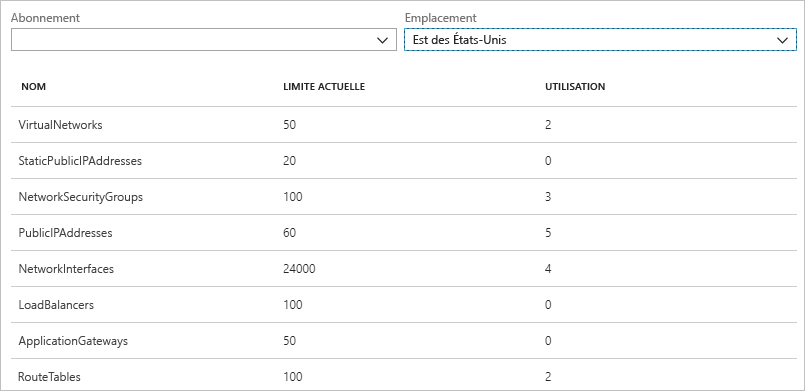
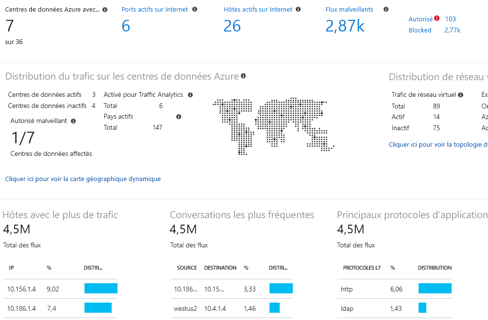

# Présentation d’Azure Network Watcher

Azure Network Watcher offre des outils permettant d’effectuer un monitoring et des diagnostics, d’afficher les métriques et d’activer et de désactiver les journaux d’activité pour les ressources se trouvant sur un réseau virtuel Azure. Network Watcher est conçu pour superviser et réparer l’intégrité réseau des produits IaaS (infrastructure as a service), y compris les machines virtuelles, les réseaux virtuels, les passerelles d’application, les équilibreurs de charge, etc. Remarque : il n’est ni conçu ni utilisable pour la supervision PaaS ou l’analytique web. 

## Surveillance

### Effectuer le monitoring de la communication entre une machine virtuelle et un point de terminaison

Les points de terminaison peuvent être une autre machine virtuelle, un nom de domaine complet (FQDN), un identificateur Uniform Resource Identifier (URI) ou une adresse IPv4. La fonctionnalité de *contrôle de la connexion* surveille les communications à intervalles réguliers et vous informe des évolutions de l’accessibilité, de la latence et de la topologie de réseau entre la machine virtuelle et le point de terminaison. Prenons l’exemple d’une machine virtuelle de type serveur web qui communique avec une machine virtuelle de type serveur de base de données. Une personne de votre organisation pourrait, à votre insu, appliquer une règle de sécurité réseau ou un itinéraire personnalisé au sous-réseau ou à la machine virtuelle de type serveur web ou serveur de base de données.

Si un point de terminaison devient inaccessible, l’outil de résolution des problèmes de connexion vous en communique la raison. Il peut s’agir d’un problème de résolution de noms DNS, de processeur, de mémoire ou de pare-feu dans le système d’exploitation d’une des machines virtuelles, ou bien d’une erreur de type de tronçon d’un itinéraire personnalisé ou de règle de sécurité de la machine virtuelle ou du sous-réseau de la connexion sortante. Pour plus d’informations, voir [Règles de sécurité](../virtual-network/network-security-groups-overview.md?toc=%2fazure%2fnetwork-watcher%2ftoc.json#security-rules) et [Types de tronçon d’itinéraires](../virtual-network/virtual-networks-udr-overview.md?toc=%2fazure%2fnetwork-watcher%2ftoc.json) dans Azure.

Le contrôle de la connexion indique également la latence minimale, maximale et moyenne observée au fil du temps. Après en avoir pris connaissance, vous trouverez peut-être des moyens de réduire la latence en déplaçant vos ressources Azure dans différentes régions Azure. Découvrez comment déterminer les [latences relatives entre les régions Azure et les fournisseurs de services Internet](#determine-relative-latencies-between-azure-regions-and-internet-service-providers) et comment effectuer le monitoring de la communication entre une machine virtuelle et un point de terminaison avec le [contrôle de la connexion](connection-monitor.md). Si vous préférez tester une connexion à un moment donné, plutôt que d’effectuer le monitoring de la connexion au fil du temps, comme avec le contrôle de la connexion, utilisez la fonctionnalité de [résolution des problèmes de connexion](#connection-troubleshoot).

Network Performance Monitor est une solution de supervision réseau hybride basé sur le cloud qui vous permet d’analyser les performances du réseau entre différents points de votre infrastructure réseau. Vous pouvez également analyser la connectivité réseau avec le service et les points de terminaison d’application ainsi que les performances d’Azure ExpressRoute. Network Performance Monitor détecte les problèmes réseau comme le blocage du trafic, les erreurs de routage et autres problèmes que les méthodes d’analyse réseau classiques ne sont pas capables de détecter. La solution génère des alertes et vous informe en cas de dépassement d’un seuil pour une liaison réseau. Il assure également la détection en temps opportun des problèmes de performances réseau et en localise la source en identifiant un segment ou un appareil réseau particuliers. En savoir plus sur le [moniteur de performances réseau](../azure-monitor/insights/network-performance-monitor.md?toc=%2fazure%2fnetwork-watcher%2ftoc.json).

### Afficher les ressources se trouvant sur un réseau virtuel et leurs relations

Plus les ressources s’accumulent sur un réseau virtuel, plus il peut devenir difficile de comprendre quelles ressources s’y trouvent et comment elles sont reliées. La fonctionnalité de *topologie* permet de générer un diagramme visuel des ressources se trouvant sur un réseau virtuel et des relations qu’elles entretiennent. L’illustration suivante montre un exemple de diagramme de topologie pour un réseau virtuel possédant trois sous-réseaux, deux machines virtuelles, des interfaces réseau, des adresses IP publiques, des groupes de sécurité réseau et des tables d’itinéraires, et indique les relations entre les ressources :

Vous pouvez télécharger une version modifiable de l’image au format SVG. Pour plus d’informations, voir [Affichage de la topologie](view-network-topology.md).

## Diagnostics

### Diagnostiquer les problèmes de filtrage du trafic réseau à destination ou en provenance d’une machine virtuelle

Lors du déploiement d’une machine virtuelle, Azure y applique plusieurs règles de sécurité par défaut, qui autorisent ou refusent le trafic à destination ou en provenance de cette machine virtuelle. Vous pouvez éventuellement remplacer les règles par défaut d’Azure, ou en créer d’autres. Il peut arriver qu’une machine virtuelle ne parvienne plus à communiquer avec d’autres ressources à cause d’une règle de sécurité. La fonctionnalité de *vérification du flux IP* permet de spécifier une adresse IPv4 source et de destination, un port, un protocole (TCP ou UDP) et le sens du trafic (entrant ou sortant). Elle teste alors la communication et vous informe du résultat de la connexion (succès ou échec). En cas d’échec, elle précise quelle règle de sécurité a autorisé ou refusé la communication, afin d’aider à résoudre le problème. Pour en savoir plus sur la vérification du flux IP, complétez le tutoriel [Diagnostiquer un problème de filtre de trafic réseau sur une machine virtuelle](diagnose-vm-network-traffic-filtering-problem.md).

### Diagnostiquer les problèmes de routage réseau provenant d’une machine virtuelle

Lors de la création d’un réseau virtuel, Azure crée plusieurs itinéraires sortants par défaut pour le trafic réseau. Le trafic sortant de toutes les ressources, notamment les machines virtuelles, déployées sur un réseau virtuel, est routé en fonction des itinéraires par défaut d’Azure. Vous pouvez éventuellement remplacer les itinéraires par défaut d’Azure, ou en créer d’autres. Il peut arriver qu’une machine virtuelle ne parvienne plus à communiquer avec d’autres ressources à cause d’un itinéraire en particulier. La fonctionnalité de *tronçon suivant* permet de spécifier une adresse IPv4 source et de destination. Elle teste alors la communication et indique quel type de tronçon suivant est utilisé pour router le trafic. Vous pouvez ensuite supprimer, modifier ou ajouter un itinéraire, afin de résoudre un problème de routage. Pour plus d’informations sur cette fonctionnalité, voir [Tronçon suivant](diagnose-vm-network-routing-problem.md).

### Diagnostiquer les problèmes de connexions sortantes d’une machine virtuelle

La fonctionnalité de *résolution des problèmes de connexion* permet de tester une connexion entre une machine virtuelle et une autre machine virtuelle, un nom de domaine complet, un URI ou une adresse IPv4. Le test retourne des informations similaires à celles de la fonctionnalité de [contrôle de la connexion](#connection-monitor), à ceci près qu’il teste la connexion à un moment donné au lieu d’effectuer un monitoring au fil du temps. Pour savoir plus en détail comment résoudre les problèmes de connexion, voir [Résolution des problèmes de connexion](network-watcher-connectivity-overview.md).

### Capturer des paquets à destination et en provenance d’une machine virtuelle

Les options avancées de filtrage et les contrôles précis, comme la possibilité de définir des limites de taille et de temps, sont sources de polyvalence. La capture peut être stockée dans le Stockage Azure, sur le disque de la machine virtuelle ou aux deux endroits. Pour analyser le fichier de capture, vous pouvez utiliser différents outils d’analyse de capture réseau standard. Pour plus d’informations, voir [Capture de paquets](network-watcher-packet-capture-overview.md).

### Diagnostiquer des problèmes liés à une passerelle de réseau virtuel Azure et aux connexions

Les passerelles de réseau virtuel assurent une connectivité entre les ressources locales et les réseaux virtuels Azure. L’analyse des passerelles et de leurs connexions est essentielle pour assurer la non-interruption de la communication. La fonctionnalité de *diagnostics VPN* permet de diagnostiquer les passerelles et les connexions. Elle contrôle l’intégrité de la passerelle ou de la connexion associée, et indique si une passerelle et des connexions sont disponibles. Si ce n’est pas le cas, elle précise pourquoi, afin d’aider à résoudre le problème. Pour en savoir plus sur les diagnostics VPN, complétez le tutoriel [Diagnostiquer un problème de communication entre réseaux](diagnose-communication-problem-between-networks.md).

### Déterminer les latences relatives entre les régions Azure et les fournisseurs de services Internet

Il est possible d’interroger Network Watcher pour obtenir des informations sur la latence entre les régions Azure et les différents fournisseurs de services Internet. Après en avoir pris connaissance, vous pourrez déployer des ressources Azure pour optimiser le temps de réponse. Pour plus d’informations, voir [Latences relatives](view-relative-latencies.md).

### Afficher les règles de sécurité d’une interface réseau

Les règles de sécurité effectives d’une interface réseau rassemblent toutes les règles de sécurité appliquées à l’interface réseau et au sous-réseau sur lequel celle-ci se trouve.  La fonctionnalité *d’affichage des groupes de sécurité* montre toutes les règles de sécurité qui s’appliquent à l’interface réseau, au sous-réseau dans lequel elle se trouve et aux deux. Après en avoir pris connaissance, vous pourrez ajouter, supprimer ou modifier des règles qui autorisent ou refusent le trafic. Pour plus d’informations, voir [Affichage des groupes de sécurité](network-watcher-security-group-view-overview.md).

## Mesures

Des [limites](../azure-resource-manager/management/azure-subscription-service-limits.md?toc=%2fazure%2fnetwork-watcher%2ftoc.json#azure-resource-manager-virtual-networking-limits) s’appliquent au nombre de ressources réseau créées au sein d’un abonnement Azure et d’une région. Une fois ces limites atteintes, il n’est plus possible de créer d’autres ressources dans l’abonnement ou la région. La fonctionnalité de *limite d’abonnement réseau* offre une synthèse du nombre de ressources réseau déployées dans un abonnement et une région, et indique la limite associée à chaque ressource. L’illustration suivante montre la sortie partielle associée aux ressources réseau déployées dans la région USA Est pour un exemple d’abonnement :

Ces informations sont utiles pour planifier les futurs déploiements de ressources.

## Journaux d’activité

### Analyser le trafic à destination ou en provenance d’un Groupe de sécurité réseau

Les Groupes de sécurité réseau (NSG) autorisent ou refusent le trafic entrant ou sortant vers une interface réseau dans une machine virtuelle. La fonctionnalité de *journal des flux NSG* permet de consigner l’adresse IP source et de destination, le port et le protocole, et d’indiquer si le trafic a été autorisé ou refusé par un Groupe de sécurité réseau. Pour analyser les journaux d’activité, vous pouvez utiliser différents outils, par exemple, Power BI et la fonctionnalité *d’analyse de trafic*. L’analyse de trafic offre de riches visualisations des données écrites dans les journaux de flux NSG. L’illustration suivante montre certaines des informations et des visualisations présentées par l’analyse de trafic à partir de données de journal de flux NSG :

Pour en savoir plus sur les journaux de flux NSG, complétez le tutoriel [Enregistrer le trafic réseau vers et depuis une machine virtuelle](network-watcher-nsg-flow-logging-portal.md), et découvrez comment implémenter l’[analyse du trafic](traffic-analytics.md).

### Afficher les journaux de diagnostic de ressources réseau

Il est possible d’activer la journalisation des diagnostics pour des ressources réseau Azure, par exemple, des groupes de sécurité réseau, des adresses IP publiques, des équilibreurs de charge, des passerelles de réseau virtuel et des passerelles d’application. La fonctionnalité de *journaux de diagnostic* permet d’activer et de désactiver les journaux de diagnostic de n’importe quelle ressource réseau qui en génère, au sein d’une même interface. Pour afficher les journaux de diagnostic, vous pouvez utiliser des outils comme Microsoft Power BI et les journaux Azure Monitor. Pour plus d’informations sur l’analyse des journaux de diagnostic réseau Azure, consultez [Solutions réseau Azure dans les journaux Azure Monitor](../azure-monitor/insights/azure-networking-analytics.md?toc=%2fazure%2fnetwork-watcher%2ftoc.json).

## Activation automatique de Network Watcher
Lorsque vous créez ou que vous mettez à jour un réseau virtuel dans votre abonnement, Network Watcher est activé automatiquement dans la région de votre réseau virtuel. L’activation automatique de Network Watcher n’a aucun impact sur vos ressources ni sur les coûts associés. Pour plus d’informations, consultez [Créer une instance Network Watcher](network-watcher-create.md).

## Étapes suivantes

Vous avez maintenant une vue d’ensemble d’Azure Network Watcher. Pour commencer à l’utiliser, diagnostiquez un problème de communication courant à destination et en provenance d’une machine virtuelle à l’aide de la fonctionnalité de vérification de flux IP. Pour plus d’informations à ce sujet, consultez le guide de démarrage rapide [Diagnostiquer un problème de filtre de trafic réseau sur une machine virtuelle](diagnose-vm-network-traffic-filtering-problem.md).