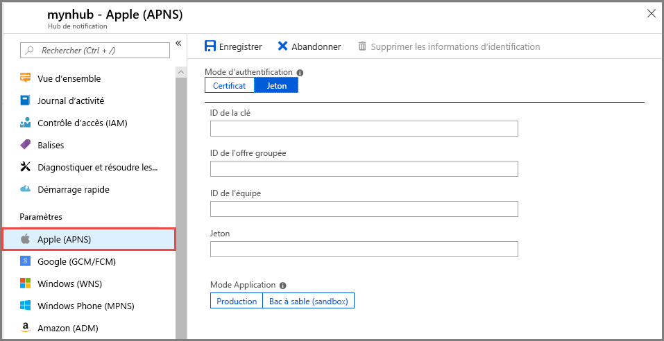
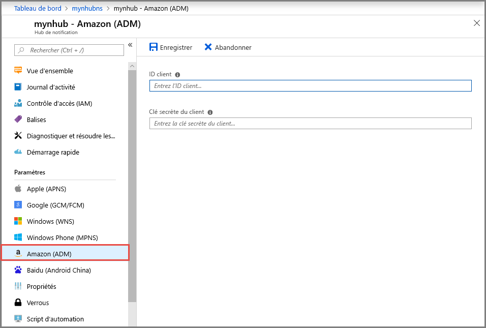

# Configurer un hub de notification Azure avec les paramètres PNS (Platform Notification System) dans le portail Azure 
Azure Notification Hubs fournit un moteur d’envoi de notifications Push facile à utiliser et à grande échelle qui vous permet d’envoyer des notifications à n’importe quelle plateforme (iOS, Android, Windows, Kindle, Baidu, etc.) à partir de n’importe quel serveur principal (cloud ou local). Pour plus d’informations sur le service, consultez [Présentation d’Azure Notification Hubs](notification-hubs-push-notification-overview.md).

[Créez un hub de notification Azure à l’aide du portail Azure](create-notification-hub-portal.md) si vous ne l’avez pas déjà fait. Dans ce guide de démarrage rapide, vous apprenez à configurer un hub de notification dans le portail Azure avec les paramètres PNS (Platform Notification System).

## Service de notifications Push Apple (APNS)
1. Dans la page **Hub de notification** du portail Azure, sélectionnez **Apple (APNS)** sous **Paramètres** dans le menu de gauche.
2. Si vous sélectionnez **Certificat**, effectuez les actions suivantes :
    1. Sélectionnez l’**icône de fichier** et le fichier **.p12** à charger. 
    2. Indiquez le **mot de passe**.
    3. Sélectionnez le mode **Bac à sable**. Utilisez uniquement **Production** si vous souhaitez envoyer des notifications Push aux utilisateurs ayant acheté votre application dans Windows Store.

        
3. Si vous sélectionnez **Jeton**, effectuez les opérations suivantes : 
    1. Entrez les valeurs pour **ID de la clé**, **ID de l’offre groupée**, **ID de l’équipe** et **Jeton**.
    2. Sélectionnez le mode **Bac à sable**. Utilisez uniquement **Production** si vous souhaitez envoyer des notifications Push aux utilisateurs ayant acheté votre application dans Windows Store.

        

Pour obtenir un tutoriel complet sur l’envoi de notifications Push aux appareils iOS à l’aide d’Azure Notification Hubs et d’APNS (Apple Push Notification Service), consultez [ce tutoriel](notification-hubs-ios-apple-push-notification-apns-get-started.md).

## Google Firebase Cloud Messaging (FCM)
1. Dans la page **Hub de notification** du portail Azure, sélectionnez **Google (GCM/FCM)** sous **Paramètres** dans le menu de gauche. 
2. Collez la **clé serveur** pour le projet FCM que vous avez enregistré précédemment. 
3. Sélectionnez **Enregistrer** dans la barre d’outils. 

    
4. Vous voyez un message dans les alertes indiquant que les hubs de notification ont bien été mis à jour. Le bouton **Enregistrer** est désactivé. 

Pour obtenir un tutoriel complet sur l’envoi de notifications Push aux appareils Android à l’aide d’Azure Notification Hubs et de Google Firebase Cloud Messaging, consultez [ce tutoriel](notification-hubs-android-push-notification-google-fcm-get-started.md).

## Services de notifications Push Windows (WNS)
1. Dans la page **Hub de notification** du portail Azure, sélectionnez **Windows (WNS)** sous **Paramètres** dans le menu de gauche.
2. Entrez des valeurs pour **SID de package** et **Clé de sécurité**.
3. Sélectionnez **Enregistrer** dans la barre d’outils.

    

Pour obtenir un tutoriel complet sur l’envoi de notifications Push à une application de plateforme Windows universelle (UWP) exécutée sur un appareil Windows, consultez [ce tutoriel](notification-hubs-windows-store-dotnet-get-started-wns-push-notification.md).

## Windows Phone - Services de notifications Push Microsoft
1. Dans la page **Hub de notification** du portail Azure, sélectionnez **Windows Phone (MPNS)** sous **Paramètres**.
2. Si vous souhaitez activer les notifications Push non authentifiées, sélectionnez **Activer les notifications Push non authentifiées**, puis **Enregistrer** dans la barre d’outils.

    
3. Si vous souhaitez utiliser les notifications Push **authentifiées**, effectuez les opérations suivantes :
    1. Sélectionnez **Charger le certificat** dans la barre d’outils.
    2. Sélectionnez l’**icône de fichier** et le fichier de certificat.
    3. Entrez le **mot de passe** du certificat. 
    4. Sélectionnez **OK** pour fermer la page **Charger le certificat**. 
    5. Dans la page **Windows Phone (MPNS)**, sélectionnez **Enregistrer** dans la barre d’outils.

Pour obtenir un tutoriel complet sur l’envoi de notifications Push à une application Windows Phone 8 à l’aide des services de notifications Push Microsoft (MPNS), consultez [ce tutoriel](notification-hubs-windows-mobile-push-notifications-mpns.md).
      
## Amazon Device Messaging (ADM)
1. Dans la page **Hub de notification** du portail Azure, sélectionnez **Amazon (ADM)** sous **Paramètres** dans le menu de gauche.
2. Entrez des valeurs pour **ID client** et **Secret client**.
3. Sélectionnez **Enregistrer** dans la barre d’outils.
    
    

Pour un tutoriel complet sur l’utilisation de notifications Push Azure Notification Hubs sur une application Kindle, consultez [ce tutoriel](notification-hubs-kindle-amazon-adm-push-notification.md).

## Baidu (Android China)
1. Dans la page **Hub de notification** du portail Azure, sélectionnez **Baidu (Android China)** sous **Paramètres** dans le menu de gauche. 
2. Entrez la **clé API** que vous avez obtenue à partir de la console Baidu dans le projet push cloud Baidu. 
3. Entrez la **clé secrète** que vous avez obtenue à partir de la console Baidu dans le projet push cloud Baidu. 
4. Sélectionnez **Enregistrer** dans la barre d’outils. 

    
4. Vous voyez un message dans les alertes indiquant que les hubs de notification ont bien été mis à jour. Le bouton **Enregistrer** est désactivé. 

Pour un tutoriel complet sur l’envoi de notifications Push à l’aide d’Azure Notification Hubs et du projet push cloud Baidu, consultez [ce tutoriel](notification-hubs-baidu-china-android-notifications-get-started.md).

## Étapes suivantes
Dans ce guide de démarrage rapide, vous avez appris à configurer différents paramètres PNS (Platform Notification System) pour un hub de notification dans le portail Azure. 

Pour des instructions pas à pas complètes sur l’envoi de notifications Push à ces différentes plateformes, consultez les tutoriels dans la section **Tutoriels**.

- [Notifications Push aux appareils iOS à l’aide d’Azure Notification Hubs et d’APNS (Apple Push Notification Service)](notification-hubs-ios-apple-push-notification-apns-get-started.md).
- [Notifications Push aux appareils Android à l’aide d’Azure Notification Hubs et de Google Firebase Cloud Messaging](notification-hubs-android-push-notification-google-fcm-get-started.md).
- [Notifications Push à une application de plateforme Windows universelle (UWP) exécutée sur un appareil Windows](notification-hubs-windows-store-dotnet-get-started-wns-push-notification.md).
- [Notifications Push à une application Windows Phone 8 à l’aide des services de notifications Push Microsoft (MPNS)](notification-hubs-windows-mobile-push-notifications-mpns.md).
- [Notifications Push à une application Kindle](notification-hubs-kindle-amazon-adm-push-notification.md).
- [Notifications Push à l’aide d’Azure Notification Hubs et du projet push cloud Baidu](notification-hubs-baidu-china-android-notifications-get-started.md).
