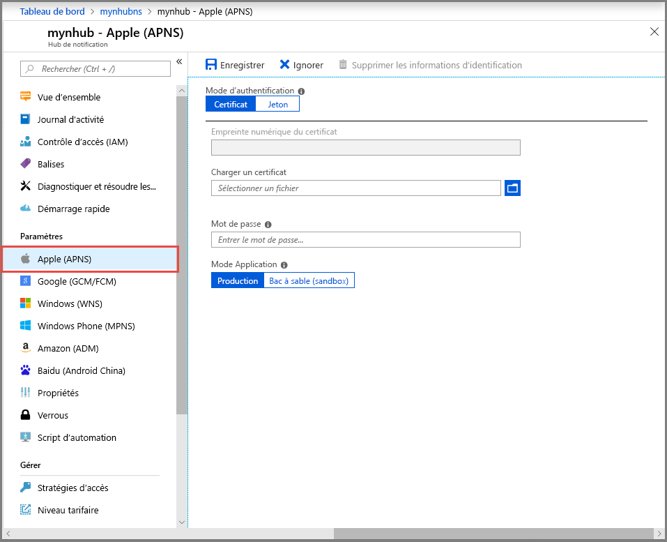
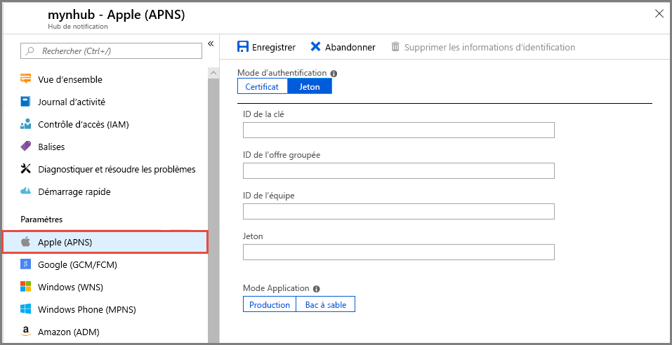
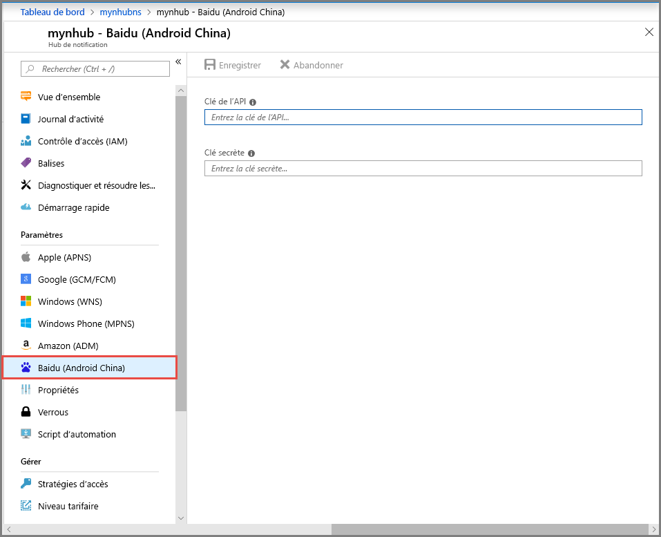

# <a name="quickstart-set-up-push-notifications-in-a-notification-hub"></a>Démarrage rapide : Configurer les notifications Push dans un hub de notification

Azure Notification Hubs propose un moteur Push facile à utiliser et à mettre à l’échelle horizontalement (« scale-out »). Utilisez Notification Hubs pour envoyer des notifications à n’importe quelle plateforme (iOS, Android, Windows, Baidu) et à partir de n’importe quel back-end (cloud ou local). Pour plus d’informations, consultez [Présentation d’Azure Notification Hubs](notification-hubs-push-notification-overview.md).

Dans ce guide de démarrage rapide, vous allez utiliser les paramètres PNS (Platform Notification System) de Notification Hubs pour configurer des notifications Push sur plusieurs plateformes. Le guide de démarrage rapide vous montre les étapes à suivre sur le portail Azure.  [Google Firebase Cloud Messaging](?tabs=azure-cli#google-firebase-cloud-messaging-fcm) contient des instructions sur l’utilisation d’Azure CLI.

Si vous n’avez pas déjà créé de hub de notification, créez-en un maintenant. Pour plus d’informations, consultez [Créer un hub de notification Azure dans le portail Azure](create-notification-hub-portal.md) ou [Créer un hub de notification Azure avec Azure CLI](create-notification-hub-azure-cli.md)

## <a name="apple-push-notification-service"></a>Apple Push Notification Service

Pour configurer Apple Push Notification Service (APNS) :

1. Dans le portail Azure, dans la page **Hub de notification**, sélectionnez **Apple (APNS)** dans le menu de gauche.

1. Pour **Mode d’authentification**, sélectionnez **Certificat** ou **Jeton**.

   a. Si vous sélectionnez **Certificat** :
   * Sélectionnez l’icône de fichier, puis sélectionnez le fichier *.p12* que vous voulez charger.
   * Entrez un mot de passe.
   * Sélectionnez le mode **Bac à sable**. Ou bien, pour envoyer des notifications Push aux utilisateurs qui ont acheté votre application sur le Store, sélectionnez le mode **Production**.

     

   b. Si vous sélectionnez **Jeton** :

   * Entrez les valeurs pour **ID de clé**, **ID d’offre groupée**, **ID de l’équipe** et **Jeton**.
   * Sélectionnez le mode **Bac à sable**. Ou bien, pour envoyer des notifications Push aux utilisateurs qui ont acheté votre application sur le Store, sélectionnez le mode **Production**.

     

Pour plus d’informations, consultez [Envoyer des notifications Push à des applications iOS avec Azure Notification Hubs](ios-sdk-get-started.md).

## <a name="google-firebase-cloud-messaging-fcm"></a>Google Firebase Cloud Messaging (FCM)

# <a name="portal"></a>[Portail](#tab/azure-portal)

Pour configurer les notifications Push pour Google FCM :

1. Dans la page **Hub de notification** du portail Azure, sélectionnez **Google (GCM/FCM)** dans le menu de gauche.
2. Collez la **Clé API** pour le projet Google FCM que vous avez enregistré précédemment.
3. Sélectionnez **Enregistrer**.

   

Une fois ces étapes terminées, une alerte indique que le hub de notification a été correctement mis à jour. Le bouton **Enregistrer** est désactivé.

# <a name="azure-cli"></a>[Azure CLI](#tab/azure-cli)

### <a name="prerequisites"></a>Prérequis

Avant de commencer la lecture cet article, vous devez disposer des éléments suivants :

* [Azure CLI](/cli/azure/install-azure-cli) version 2.0.67 ou ultérieure.

* [Extension Azure CLI pour Notification Hubs](/cli/azure/ext/notification-hub/notification-hub).
* **Clé API** pour un projet Google Firebase Cloud Messaging (FCM).

### <a name="set-up-push-notifications-for-google-fcm"></a>Configurer les notifications Push pour Google FCM

1. Utilisez la commande [az notification-hub credential gcm update](/cli/azure/ext/notification-hub/notification-hub/credential/gcm#ext-notification-hub-az-notification-hub-credential-gcm-update) pour ajouter votre clé d’API Google à votre hub de notification.

   ```azurecli
   az notification-hub credential gcm update --resource-group spnhubrg --namespace-name spnhubns    --notification-hub-name spfcmtutorial1nhub --google-api-key myKey
   ```

2. L’application Android a besoin d’une chaîne de connexion pour se connecter au hub de notification.  Utilisez la commande [az notification-hub authorization-rule list](/cli/azure/ext/notification-hub/notification-hub/authorization-rule#ext-notification-hub-az-notification-hub-authorization-rule-list) pour lister les stratégies d’accès disponibles.  Utilisez la commande [az notification-hub authorization-rule list-keys](/cli/azure/ext/notification-hub/notification-hub/authorization-rule#ext-notification-hub-az-notification-hub-authorization-rule-list-keys) pour obtenir les chaînes de connexion de la stratégie d’accès.  Spécifiez **primaryConnectionString** ou **secondaryConnectionString** dans le paramètre `--query` pour obtenir directement la chaîne de connexion principale.

   ```azurecli
   #list access policies for a notification hub
   az notification-hub authorization-rule list --resource-group spnhubrg --namespace-name spnhubns --notification-hub-name spfcmtutorial1nhub --output table

   #list keys and connection strings for a notification hub access policy
   az notification-hub authorization-rule list-keys --resource-group spnhubrg --namespace-name spnhubns --notification-hub-name spfcmtutorial1nhub --name myAccessPolicyName --output json

   #get the primaryConnectionString for an access policy
   az notification-hub authorization-rule list-keys --resource-group spnhubrg --namespace-name spnhubns --notification-hub-name spfcmtutorial1nhub --name myAccessPolicyName --query primaryConnectionString
   ```

3. Utilisez la commande [az notification-hub test-send](/cli/azure/ext/notification-hub/notification-hub#ext-notification-hub-az-notification-hub-test-send) pour tester l’envoi de messages à l’application Android.

   ```azurecli
   #test with message body
   az notification-hub test-send --resource-group spnhubrg --namespace-name spnhubns --notification-hub-name spfcmtutorial1nhub --notification-format gcm --message "my message body"

   #test with JSON string
   az notification-hub test-send --resource-group spnhubrg --namespace-name spnhubns --notification-hub-name spfcmtutorial1nhub --notification-format gcm --payload "{\"data\":{\"message\":\"my JSON string\"}}"
   ```

Obtenez les références Azure CLI pour d’autres plateformes avec la commande [az notification-hub credential](/cli/azure/ext/notification-hub/notification-hub/credential).

---

Pour plus d’informations sur l’envoi (push) de notifications à une application Android, consultez [Envoyer des notifications Push aux appareils Android à l’aide de Firebase](notification-hubs-android-push-notification-google-fcm-get-started.md).

## <a name="windows-push-notification-service"></a>Services de notifications Push Windows

Pour configurer les services de notifications Push Windows (WNS) :

1. Dans la page **Hub de notification** du portail Azure, sélectionnez **Windows (WNS)** dans le menu de gauche.
2. Entrez des valeurs pour **SID de package** et **Clé de sécurité**.
3. Sélectionnez **Enregistrer**.

   

Pour plus d’informations, consultez [Envoyer des notifications vers des applications UWP avec Azure Notification Hubs](notification-hubs-windows-store-dotnet-get-started-wns-push-notification.md).

## <a name="microsoft-push-notification-service-for-windows-phone"></a>Services de notifications Push Microsoft pour Windows Phone

Pour configurer les services de notifications Push Microsoft (MPNS) pour Windows Phone :

1. Dans la page **Hub de notification** du portail Azure, sélectionnez **Windows Phone (MPNS)** dans le menu de gauche.
1. Activez les notifications Push authentifiées ou non authentifiées :

   a. Pour activer les notifications Push non authentifiées, sélectionnez **Activer les notifications Push non authentifiées** > **Enregistrer**.

      

   b. Pour activer les notifications Push authentifiées :
      * Dans la barre d’outils, sélectionnez **Charger le certificat**.
      * Sélectionnez l’icône de fichier, puis le fichier de certificat.
      * Entrez le mot de passe du certificat.
      * Sélectionnez **OK**.
      * Dans la page **Windows Phone (MPNS)** , sélectionnez **Enregistrer**.

Pour plus d’informations, consultez [Notifications Push vers des applications Windows Phone avec Azure Notification Hubs](notification-hubs-windows-mobile-push-notifications-mpns.md).

## <a name="baidu-android-china"></a>Baidu (Android China)

Pour configurer des notifications Push pour Baidu :

1. Dans la page **Hub de notification** du portail Azure, sélectionnez **Baidu (Android China)** dans le menu de gauche.
2. Entrez la **Clé API** que vous avez obtenue à partir de la console Baidu du projet Push cloud Baidu.
3. Entrez la **Clé secrète** que vous avez obtenue à partir de la console Baidu du projet Push cloud Baidu.
4. Sélectionnez **Enregistrer**.

    

Une fois ces étapes terminées, une alerte indique que le hub de notification a été correctement mis à jour. Le bouton **Enregistrer** est désactivé.

Pour plus d’informations, consultez [Prendre en main Notification Hubs à l’aide de Baidu](notification-hubs-baidu-china-android-notifications-get-started.md).

## <a name="next-steps"></a>Étapes suivantes

Dans ce démarrage rapide, vous avez appris à configurer les paramètres PNS (Platform Notification System) pour un hub de notification sur le portail Azure.

Pour en savoir plus sur l’envoi de notifications Push vers différentes plateformes, consultez ces tutoriels :

* [Envoyer des notifications Push à des applications iOS avec Azure Notification Hubs](ios-sdk-get-started.md)
* [Envoyer des notifications à des appareils Android avec Notification Hubs et Google FCM](notification-hubs-android-push-notification-google-fcm-get-started.md)
* [Envoyer des notifications Push à une application UWP s’exécutant sur un appareil Windows](notification-hubs-windows-store-dotnet-get-started-wns-push-notification.md)
* [Envoyer des notifications Push à une application Windows Phone 8 avec MPNS](notification-hubs-windows-mobile-push-notifications-mpns.md)
* [Envoyer des notifications Push avec Notification Hubs et le push cloud Baidu](notification-hubs-baidu-china-android-notifications-get-started.md)
