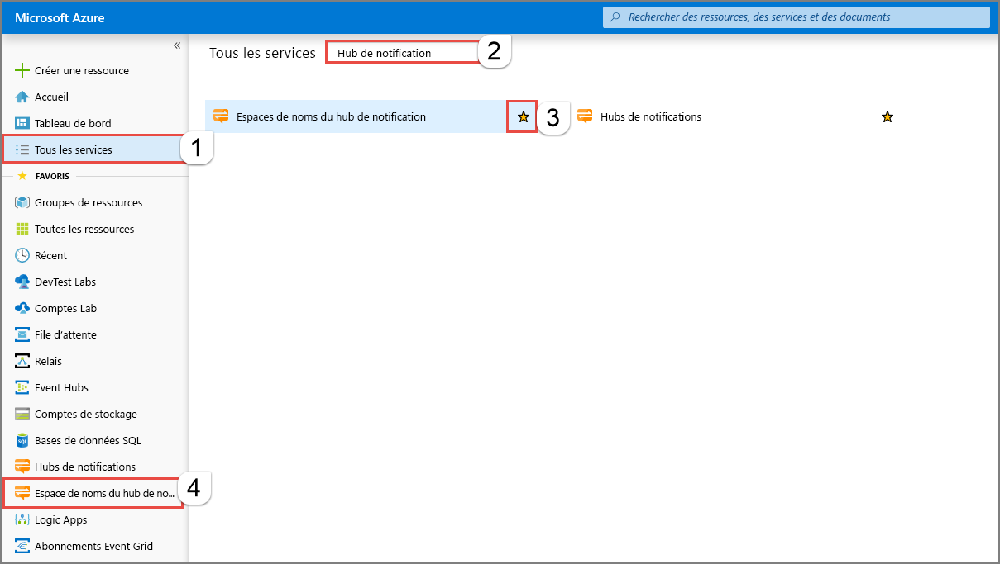
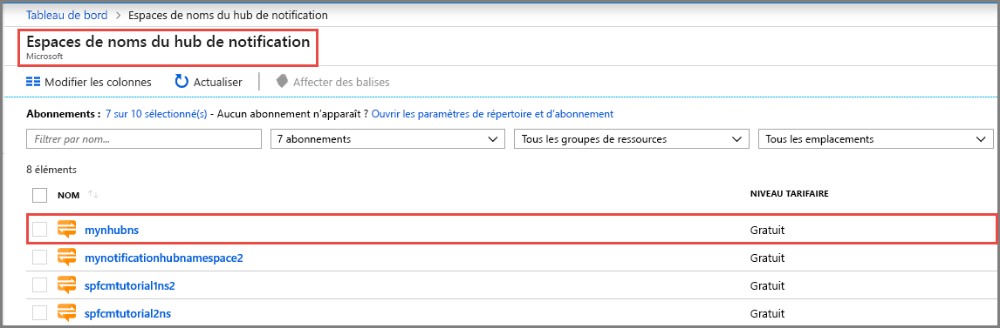
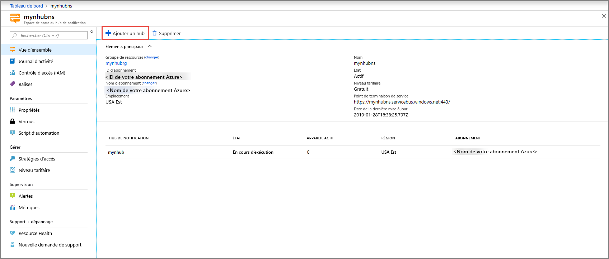
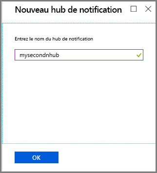
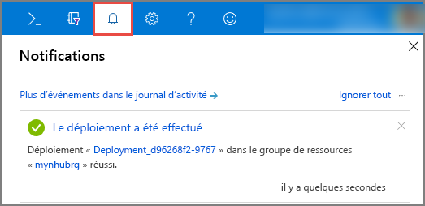
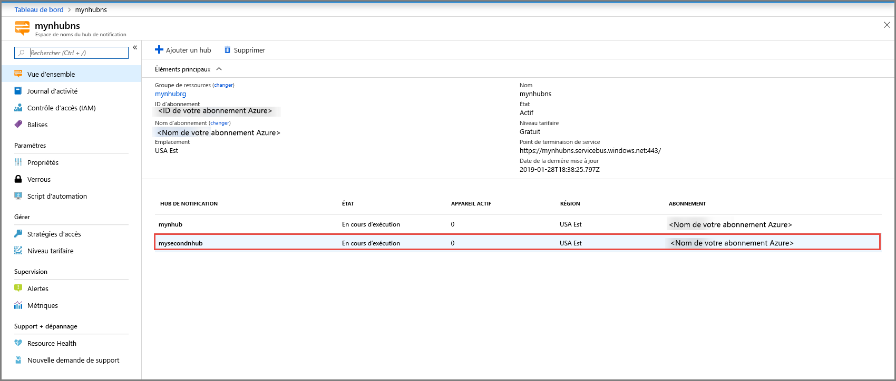
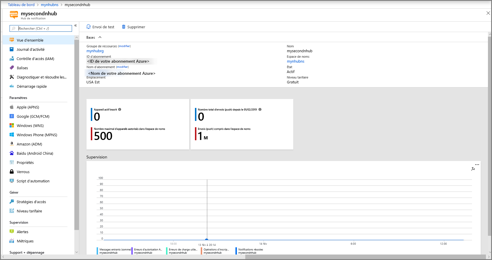

# Démarrage rapide : Créer un hub de notification Azure dans le portail Azure

Azure Notification Hubs fournit un moteur d’envoi de notifications Push facile à utiliser et à grande échelle qui vous permet d’envoyer des notifications à n’importe quelle plateforme (iOS, Android, Windows, Kindle, Baidu, etc.) à partir de n’importe quel serveur principal (cloud ou local). Pour plus d’informations sur le service, consultez [Présentation d’Azure Notification Hubs](notification-hubs-push-notification-overview.md).

Dans ce guide de démarrage rapide, vous créez un hub de notification dans le portail Azure. La première section vous présente les étapes pour créer un espace de noms Notification Hubs et un hub dans cet espace de noms. La deuxième section vous présente les étapes pour créer un hub de notification dans un espace de noms Notification Hubs existant.

## Créer un espace de noms et un hub de notification

Dans cette section, vous créez un espace de noms et un hub dans l’espace de noms.

[!INCLUDE [notification-hubs-portal-create-new-hub](../../includes/notification-hubs-portal-create-new-hub.md)]

## Créer un hub de notification dans un espace de noms existant

Dans cette section, vous créez un hub de notification dans un espace de noms existant.

1. Connectez-vous au [portail Azure](https://portal.azure.com).
2. Sélectionnez **Tous les services** dans le menu de gauche, recherchez **Hub de notification**, sélectionnez l’**étoile** (`*`) en regard d’**Espaces de noms du hub de notification** pour l’ajouter à la section **FAVORIS** dans le menu de gauche. Sélectionnez **Espaces de noms du hub de notification**.

      
3. Dans la page **Espaces de noms du hub de notification**, sélectionnez votre espace de noms dans la liste.

      
4. Dans la page **Espaces de noms du hub de notification**, sélectionnez **Ajouter un hub** dans la barre d’outils.

      
5. Dans la page **Nouveau hub de notification**, entrez un nom pour le hub de notification, puis sélectionnez **OK**.

      
6. Sélectionnez **Notifications** (icône de cloche) en haut pour voir l’état du déploiement du nouveau hub. Sélectionnez **X** dans l’angle droit pour fermer la fenêtre de notification.

      
7. Actualisez la page web **Espaces de noms du hub de notification** pour voir votre nouveau hub dans la liste.

      
8. Sélectionnez votre **hub de notification** pour afficher sa page d’accueil.

      

## Étapes suivantes

Dans ce guide de démarrage rapide, vous avez créé un hub de notification. Pour savoir comment configurer le hub avec les paramètres PNS (Platform Notification System), consultez [Configurer un hub de notification avec les paramètres PNS](configure-notification-hub-portal-pns-settings.md).
