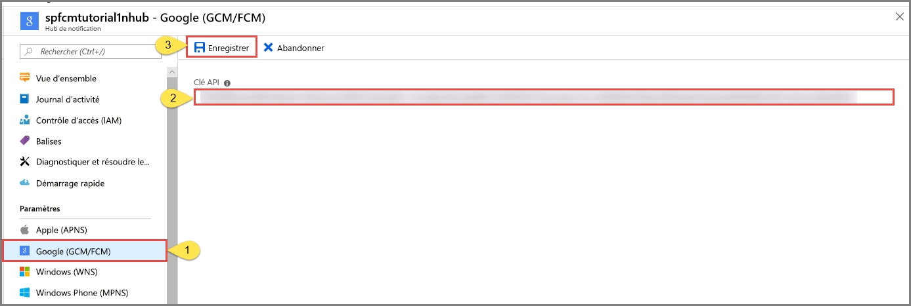

# <a name="tutorial-send-push-notifications-to-android-devices-using-firebase-sdk-version-06"></a>Tutoriel : Envoyer des notifications Push à des appareils Android à l’aide du SDK Firebase version 0.6

[!INCLUDE [notification-hubs-selector-get-started](../../includes/notification-hubs-selector-get-started.md)]

Ce tutoriel vous montre comment utiliser Azure Notification Hubs et le SDK Firebase Cloud Messaging (FCM) version 0.6 pour envoyer des notifications Push à une application Android. Dans ce didacticiel, vous allez créer une application Android vide qui reçoit des notifications Push à l’aide de Firebase Cloud Messaging (FCM).

Vous pouvez télécharger le code généré pour ce didacticiel à partir de [GitHub](https://github.com/Azure/azure-notificationhubs-android/tree/master/FCMTutorialApp).

Dans ce tutoriel, vous effectuez les étapes suivantes :

> [!div class="checklist"]
> * Créer un projet Android Studio.
> * Créer un projet qui prend en charge Firebase Cloud Messaging.
> * Créer un hub.
> * Connecter votre application au hub.
> * Tester l'application.

## <a name="prerequisites"></a>Prérequis

Pour suivre ce didacticiel, vous avez besoin d'un compte Azure actif. Si vous ne possédez pas de compte, vous pouvez créer un compte d’évaluation gratuit en quelques minutes. Pour plus d’informations, consultez [Essai gratuit Azure](https://azure.microsoft.com/free/). 

Vous devez également disposer des éléments suivants : 

* Dernière version d’[Android Studio](https://go.microsoft.com/fwlink/?LinkId=389797)
* Android 2.3 ou version ultérieure pour Firebase Cloud Messaging
* La révision 27 ou ultérieure du référentiel Google est requise pour Firebase Cloud Messaging
* Google Play Services 9.0.2 ou version ultérieure pour Firebase Cloud Messaging

Vous devez suivre ce didacticiel avant tous les autres didacticiels Notification Hubs pour les applications Android.

## <a name="create-an-android-studio-project"></a>Créer un projet Android Studio

1. Lancez Android Studio.
2. Sélectionnez **File** (Fichier), pointez sur **New** (Nouveau), puis sélectionnez **New Project** (Nouveau projet). 
2. Dans la page **Choose your project** (Choisir votre projet), sélectionnez **Empty Activity** (Activité vide), puis sélectionnez **Next** (Suivant). 
3. Dans la page **Configure your project** (Configurer votre projet), procédez comme suit : 
    1. Entrez un nom pour l’application.
    2. Spécifiez un emplacement où enregistrer les fichiers du projet. 
    3. Sélectionnez **Terminer**. 

        

## <a name="create-a-firebase-project-that-supports-fcm"></a>Créer un projet qui prend en charge FCM

[!INCLUDE [notification-hubs-enable-firebase-cloud-messaging](../../includes/notification-hubs-enable-firebase-cloud-messaging.md)]

## <a name="configure-a-hub"></a>Configurer un Hub

[!INCLUDE [notification-hubs-portal-create-new-hub](../../includes/notification-hubs-portal-create-new-hub.md)]

### <a name="configure-firebase-cloud-messaging-settings-for-the-hub"></a>Configurer les paramètres de Firebase Cloud Messaging pour le hub

1. Dans le volet gauche, sous **Settings** (Paramètres), sélectionnez **Google (GCM/FCM)** . 
2. Entrez la **clé serveur** pour le projet FCM que vous avez enregistré précédemment. 
3. Dans la barre d’outils, sélectionnez **Enregistrer**. 

    
4. Le portail Azure affiche un message dans les alertes, indiquant que le hub a bien été mis à jour. Le bouton **Enregistrer** est désactivé. 

Votre hub est désormais configuré pour fonctionner avec Firebase Cloud Messaging. Vous disposez également des chaînes de connexion nécessaires pour envoyer des notifications à un appareil et inscrire une application pour recevoir des notifications.

## <a name="connect-your-app-to-the-notification-hub"></a><a id="connecting-app"></a>Connexion de votre application au hub de notification

### <a name="add-google-play-services-to-the-project"></a>Ajout de services Google Play au projet

1. Dans Android Studio, sélectionnez **Outils** dans le menu, puis **SDK Manager**. 
2. Sélectionnez la version cible du Kit de développement logiciel (SDK) Android qui est utilisé dans votre projet. Puis sélectionnez **Afficher les détails du package**. 

    
3. Sélectionnez **API Google**, si elles ne sont pas déjà installées.

    
4. Basculez vers l’onglet **SDK Tools**. Si vous n’avez pas déjà installé un service Google Play, sélectionnez **Google Play Services** comme indiqué dans l’image suivante. Sélectionnez ensuite **Appliquer** pour procéder à l’installation. Notez le chemin du Kit de développement logiciel (SDK). Vous l’utiliserez à une étape suivante.

    
3. Si la boîte de dialogue de **confirmation de la modification** s’affiche, sélectionnez **OK**. Le programme d’installation installe les composants demandés. Sélectionnez **Terminer** une fois que les composants sont installés.
4. Sélectionnez **OK** pour fermer la boîte de dialogue **Paramètres pour les nouveaux projets**.  
1. Ouvrez le fichier AndroidManifest.xml, puis ajoutez la balise suivante à la balise *application*.

    ```xml
    <meta-data android:name="com.google.android.gms.version"
         android:value="@integer/google_play_services_version" />
    ```


### <a name="add-azure-notification-hubs-libraries"></a>Ajoutez des bibliothèques Azure Notification Hubs

1. Dans la section dependencies du fichier Build.Gradle pour l’application, ajoutez les lignes suivantes.

    ```gradle
    implementation 'com.microsoft.azure:notification-hubs-android-sdk:0.6@aar'
    ```

2. Ajoutez le référentiel suivant après la section dépendances.

    ```gradle
    repositories {
        maven {
            url "https://dl.bintray.com/microsoftazuremobile/SDK"
        }
    }
    ```

### <a name="add-google-firebase-support"></a>Ajouter la prise en charge de Google Firebase

1. Dans la section **dependencies** du fichier Build.Gradle pour l’application, ajoutez les lignes suivantes si elles n’y figurent pas. 

    ```gradle
    implementation 'com.google.firebase:firebase-core:16.0.8'
    implementation 'com.google.firebase:firebase-messaging:17.3.4'
    ```

2. Ajoutez le plug-in suivant à la fin du fichier s’il n’y figure pas encore. 

    ```gradle
    apply plugin: 'com.google.gms.google-services'
    ```
3. Sélectionnez **Synchroniser maintenant** dans la barre d’outils.

### <a name="update-the-androidmanifestxml-file"></a>Mettre à jour le fichier AndroidManifest.xml

1. Après avoir reçu votre jeton d’inscription FCM, vous l’utilisez pour vous [inscrire auprès d’Azure Notification Hub](notification-hubs-push-notification-registration-management.md). Effectuez cette inscription en arrière-plan à l’aide d’un élément `IntentService` nommé `RegistrationIntentService`. Ce service actualise également votre jeton d’inscription FCM. Vous créez également une classe nommée `FirebaseService` en tant que sous-classe de `FirebaseMessagingService` et vous substituez la méthode `onMessageReceived` pour recevoir et gérer les notifications. 

    Ajoutez la définition de service suivante au fichier AndroidManifest.xml, dans la balise `<application>` .

    ```xml
    <service
        android:name=".RegistrationIntentService"
        android:exported="false">
    </service>
    <service
        android:name=".FirebaseService"
        android:exported="false">
        <intent-filter>
            <action android:name="com.google.firebase.MESSAGING_EVENT" />
        </intent-filter>
    </service>
    ```
3. Ajoutez les autorisations nécessaires suivantes liées à FCM sous la balise `</application>`.

    ```xml
    <uses-permission android:name="android.permission.INTERNET"/>
    <uses-permission android:name="android.permission.GET_ACCOUNTS"/>
    <uses-permission android:name="com.google.android.c2dm.permission.RECEIVE" />
    ```

### <a name="add-code"></a>Ajout de code

1. Dans la vue du projet, développez **app** > **src** > **main** > **java**. Cliquez avec le bouton droit sur le dossier de votre package sous **java**, sélectionnez **Nouveau**, puis **Classe Java**. Entrez **NotificationSettings** pour le nom, puis sélectionnez **OK**.

    Veillez à mettre à jour ces trois espaces réservés dans le code suivant pour la classe `NotificationSettings` :

   * **HubListenConnectionString** : chaîne de connexion **DefaultListenAccessSignature** de votre hub. Vous pouvez copier cette chaîne de connexion en cliquant sur **Stratégies d’accès** dans votre hub sur le [Azure portal].
   * **HubName** : utilisez le nom qui s’affiche dans la page du hub sur le [Azure portal].

     `NotificationSettings` code :

        ```java
        public class NotificationSettings {
            public static String HubName = "<Your HubName>";
            public static String HubListenConnectionString = "<Enter your DefaultListenSharedAccessSignature connection string>";
        }
        ```

     > [!IMPORTANT]
     > Entrez le **nom** et la valeur **DefaultListenSharedAccessSignature** pour votre hub avant de continuer. 

2. Ajoutez à votre projet une autre nouvelle classe nommée `RegistrationIntentService`. Cette classe implémente l’interface `IntentService`. Elle gère également l’[actualisation du jeton GCM](https://developers.google.com/instance-id/guides/android-implementation#refresh_tokens) et l’[inscription auprès du hub de notification](notification-hubs-push-notification-registration-management.md).

    Utilisez le code suivant pour cette classe.

    ```java
    import android.app.IntentService;
    import android.content.Intent;
    import android.content.SharedPreferences;
    import android.preference.PreferenceManager;
    import android.util.Log;
    import com.google.android.gms.tasks.OnSuccessListener;
    import com.google.firebase.iid.FirebaseInstanceId;
    import com.google.firebase.iid.InstanceIdResult;
    import com.microsoft.windowsazure.messaging.NotificationHub;
    import java.util.concurrent.TimeUnit;

    public class RegistrationIntentService extends IntentService {

        private static final String TAG = "RegIntentService";
        String FCM_token = null;

        private NotificationHub hub;

        public RegistrationIntentService() {
            super(TAG);
        }

        @Override
        protected void onHandleIntent(Intent intent) {

            SharedPreferences sharedPreferences = PreferenceManager.getDefaultSharedPreferences(this);
            String resultString = null;
            String regID = null;
            String storedToken = null;

            try {
                FirebaseInstanceId.getInstance().getInstanceId().addOnSuccessListener(new OnSuccessListener<InstanceIdResult>() { 
                    @Override 
                    public void onSuccess(InstanceIdResult instanceIdResult) { 
                        FCM_token = instanceIdResult.getToken(); 
                        Log.d(TAG, "FCM Registration Token: " + FCM_token); 
                    } 
                }); 
                TimeUnit.SECONDS.sleep(1);

                // Storing the registration ID that indicates whether the generated token has been
                // sent to your server. If it is not stored, send the token to your server.
                // Otherwise, your server should have already received the token.
                if (((regID=sharedPreferences.getString("registrationID", null)) == null)){

                    NotificationHub hub = new NotificationHub(NotificationSettings.HubName,
                            NotificationSettings.HubListenConnectionString, this);
                    Log.d(TAG, "Attempting a new registration with NH using FCM token : " + FCM_token);
                    regID = hub.register(FCM_token).getRegistrationId();

                    // If you want to use tags...
                    // Refer to : https://azure.microsoft.com/documentation/articles/notification-hubs-routing-tag-expressions/
                    // regID = hub.register(token, "tag1,tag2").getRegistrationId();

                    resultString = "New NH Registration Successfully - RegId : " + regID;
                    Log.d(TAG, resultString);

                    sharedPreferences.edit().putString("registrationID", regID ).apply();
                    sharedPreferences.edit().putString("FCMtoken", FCM_token ).apply();
                }

                // Check to see if the token has been compromised and needs refreshing.
               else if (!(storedToken = sharedPreferences.getString("FCMtoken", "")).equals(FCM_token)) {

                    NotificationHub hub = new NotificationHub(NotificationSettings.HubName,
                            NotificationSettings.HubListenConnectionString, this);
                    Log.d(TAG, "NH Registration refreshing with token : " + FCM_token);
                    regID = hub.register(FCM_token).getRegistrationId();

                    // If you want to use tags...
                    // Refer to : https://azure.microsoft.com/documentation/articles/notification-hubs-routing-tag-expressions/
                    // regID = hub.register(token, "tag1,tag2").getRegistrationId();

                    resultString = "New NH Registration Successfully - RegId : " + regID;
                    Log.d(TAG, resultString);

                    sharedPreferences.edit().putString("registrationID", regID ).apply();
                    sharedPreferences.edit().putString("FCMtoken", FCM_token ).apply();
                }

                else {
                    resultString = "Previously Registered Successfully - RegId : " + regID;
                }
            } catch (Exception e) {
                Log.e(TAG, resultString="Failed to complete registration", e);
                // If an exception happens while fetching the new token or updating registration data
                // on a third-party server, this ensures that we'll attempt the update at a later time.
            }

            // Notify UI that registration has completed.
            if (MainActivity.isVisible) {
                MainActivity.mainActivity.ToastNotify(resultString);
            }
        }
    }
    ```

3. Dans la classe `MainActivity`, ajoutez les instructions `import` suivantes au-dessus de la déclaration de la classe.

    ```java
    import com.google.android.gms.common.ConnectionResult;
    import com.google.android.gms.common.GoogleApiAvailability;
    import android.content.Intent;
    import android.util.Log;
    import android.widget.TextView;
    import android.widget.Toast;
    ```

4. Ajoutez les membres suivants en haut de la classe. Vous utilisez ces champs pour [vérifier la disponibilité des Google Play Services comme recommandé par Google](https://developers.google.com/android/guides/setup#ensure_devices_have_the_google_play_services_apk).

    ```java
    public static MainActivity mainActivity;
    public static Boolean isVisible = false;
    private static final String TAG = "MainActivity";
    private static final int PLAY_SERVICES_RESOLUTION_REQUEST = 9000;
    ```

5. Dans la classe `MainActivity`, ajoutez la méthode suivante pour vérifier la disponibilité de Google Play Services.

    ```java
    /**
    * Check the device to make sure it has the Google Play Services APK. If
    * it doesn't, display a dialog box that enables  users to download the APK from
    * the Google Play Store or enable it in the device's system settings.
    */

    private boolean checkPlayServices() {
        GoogleApiAvailability apiAvailability = GoogleApiAvailability.getInstance();
        int resultCode = apiAvailability.isGooglePlayServicesAvailable(this);
        if (resultCode != ConnectionResult.SUCCESS) {
            if (apiAvailability.isUserResolvableError(resultCode)) {
                apiAvailability.getErrorDialog(this, resultCode, PLAY_SERVICES_RESOLUTION_REQUEST)
                        .show();
            } else {
                Log.i(TAG, "This device is not supported by Google Play Services.");
                ToastNotify("This device is not supported by Google Play Services.");
                finish();
            }
            return false;
        }
        return true;
    }
    ```

6. Dans la classe `MainActivity`, ajoutez le code suivant pour rechercher Google Play Services avant d’appeler le service `IntentService` afin d’obtenir votre jeton d’inscription FCM et de vous inscrire auprès de votre hub :

    ```java
    public void registerWithNotificationHubs()
    {
        if (checkPlayServices()) {
            // Start IntentService to register this application with FCM.
            Intent intent = new Intent(this, RegistrationIntentService.class);
            startService(intent);
        }
    }
    ```

7. Dans la méthode `OnCreate` de la classe `MainActivity`, ajoutez le code suivant pour lancer le processus d’inscription lorsque l’activité est créée :

    ```java
    @Override
    protected void onCreate(Bundle savedInstanceState) {
        super.onCreate(savedInstanceState);
        setContentView(R.layout.activity_main);

        mainActivity = this;
        registerWithNotificationHubs();
        FirebaseService.createChannelAndHandleNotifications(getApplicationContext());
    }
    ```

8. Pour vérifier l’état de l’application et afficher un rapport dans votre application, ajoutez à `MainActivity` les méthodes supplémentaires suivantes :

    ```java
    @Override
    protected void onStart() {
        super.onStart();
        isVisible = true;
    }

    @Override
    protected void onPause() {
        super.onPause();
        isVisible = false;
    }

    @Override
    protected void onResume() {
        super.onResume();
        isVisible = true;
    }

    @Override
    protected void onStop() {
        super.onStop();
        isVisible = false;
    }

    public void ToastNotify(final String notificationMessage) {
        runOnUiThread(new Runnable() {
            @Override
            public void run() {
                Toast.makeText(MainActivity.this, notificationMessage, Toast.LENGTH_LONG).show();
                TextView helloText = (TextView) findViewById(R.id.text_hello);
                helloText.setText(notificationMessage);
            }
        });
    }
    ```

9. La méthode `ToastNotify` utilise le contrôle *« Hello World »* `TextView` pour afficher en permanence un rapport d’état et des notifications dans l’application. Dans votre disposition **res** > **layout** > **activity_main.xml**, ajoutez l’ID suivant pour ce contrôle.

    ```java
    android:id="@+id/text_hello"
    ```

    

10. Ajoutez ensuite une sous-classe pour le destinataire que vous avez défini dans le fichier AndroidManifest.xml. Ajoutez à votre projet une autre nouvelle classe nommée `FirebaseService`.

11. Ajoutez les instructions d’importation suivantes au-dessus de `FirebaseService.java` :

    ```java
    import com.google.firebase.messaging.FirebaseMessagingService;
    import com.google.firebase.messaging.RemoteMessage;
    import android.util.Log;
    import android.app.NotificationChannel;
    import android.app.NotificationManager;
    import android.app.PendingIntent;
    import android.content.Context;
    import android.content.Intent;
    import android.media.RingtoneManager;
    import android.net.Uri;
    import android.os.Build;
    import android.os.Bundle;
    import androidx.core.app.NotificationCompat;
    ```

12. Ajoutez le code suivant pour la classe `FirebaseService` afin d’en faire une sous-classe de `FirebaseMessagingService`.

    Ce code substitue la méthode `onMessageReceived` et signale les notifications reçues. Il envoie également la notification Push au gestionnaire de notifications Android en utilisant la méthode `sendNotification()`. Appelez la méthode `sendNotification()` quand l’application n’est pas en cours d’exécution et qu’une notification est reçue.

    ```java
    public class FirebaseService extends FirebaseMessagingService
    {
        private String TAG = "FirebaseService";
    
        public static final String NOTIFICATION_CHANNEL_ID = "nh-demo-channel-id";
        public static final String NOTIFICATION_CHANNEL_NAME = "Notification Hubs Demo Channel";
        public static final String NOTIFICATION_CHANNEL_DESCRIPTION = "Notification Hubs Demo Channel";
    
        public static final int NOTIFICATION_ID = 1;
        private NotificationManager mNotificationManager;
        NotificationCompat.Builder builder;
        static Context ctx;
    
        @Override
        public void onMessageReceived(RemoteMessage remoteMessage) {
            // ...
    
            // TODO(developer): Handle FCM messages here.
            // Not getting messages here? See why this may be: https://goo.gl/39bRNJ
            Log.d(TAG, "From: " + remoteMessage.getFrom());
    
            String nhMessage;
            // Check if message contains a notification payload.
            if (remoteMessage.getNotification() != null) {
                Log.d(TAG, "Message Notification Body: " + remoteMessage.getNotification().getBody());
    
                nhMessage = remoteMessage.getNotification().getBody();
            }
            else {
                nhMessage = remoteMessage.getData().values().iterator().next();
            }
    
            // Also if you intend on generating your own notifications as a result of a received FCM
            // message, here is where that should be initiated. See sendNotification method below.
            if (MainActivity.isVisible) {
                MainActivity.mainActivity.ToastNotify(nhMessage);
            }
            sendNotification(nhMessage);
        }
    
        private void sendNotification(String msg) {
    
            Intent intent = new Intent(ctx, MainActivity.class);
            intent.addFlags(Intent.FLAG_ACTIVITY_CLEAR_TOP);
    
            mNotificationManager = (NotificationManager)
                    ctx.getSystemService(Context.NOTIFICATION_SERVICE);
    
            PendingIntent contentIntent = PendingIntent.getActivity(ctx, 0,
                    intent, PendingIntent.FLAG_ONE_SHOT);
    
            Uri defaultSoundUri = RingtoneManager.getDefaultUri(RingtoneManager.TYPE_NOTIFICATION);
            NotificationCompat.Builder notificationBuilder = new NotificationCompat.Builder(
                    ctx,
                    NOTIFICATION_CHANNEL_ID)
                    .setContentText(msg)
                    .setPriority(NotificationCompat.PRIORITY_HIGH)
                    .setSmallIcon(android.R.drawable.ic_popup_reminder)
                    .setBadgeIconType(NotificationCompat.BADGE_ICON_SMALL);
    
            notificationBuilder.setContentIntent(contentIntent);
            mNotificationManager.notify(NOTIFICATION_ID, notificationBuilder.build());
        }
    
        public static void createChannelAndHandleNotifications(Context context) {
            ctx = context;
    
            if (Build.VERSION.SDK_INT >= Build.VERSION_CODES.O) {
                NotificationChannel channel = new NotificationChannel(
                        NOTIFICATION_CHANNEL_ID,
                        NOTIFICATION_CHANNEL_NAME,
                        NotificationManager.IMPORTANCE_HIGH);
                channel.setDescription(NOTIFICATION_CHANNEL_DESCRIPTION);
                channel.setShowBadge(true);
    
                NotificationManager notificationManager = context.getSystemService(NotificationManager.class);
                notificationManager.createNotificationChannel(channel);
             }
        }
    }
    ```

13. Dans Android Studio, dans la barre de menus, sélectionnez **Build** > **Rebuild Project** pour vérifier que votre code ne contient pas d’erreur. Si vous recevez une erreur liée à l’icône `ic_launcher`, supprimez du fichier AndroidManifest.xml l’instruction suivante : 

    ```
        android:icon="@mipmap/ic_launcher"
    ```
14. Vérifiez que vous disposez d’un appareil virtuel pour l’exécution de l’application. Si vous n’en avez pas, ajoutez-en un de la façon suivante :
    1. 
    2. 

15. Exécutez l’application sur l’appareil de votre choix, puis vérifiez que son inscription s’est correctement effectuée auprès du hub.

    > [!NOTE]
    > L’inscription peut échouer lors du lancement initial jusqu’à ce que la méthode `onTokenRefresh()` du service d’ID d’instance soit appelée. L’actualisation doit initier une inscription réussie auprès du hub de notification.

    

## <a name="test-send-notification-from-the-notification-hub"></a>Test de l’envoi d’une notification à partir du hub de notification

Vous pouvez envoyer des notifications Push à partir du [Azure portal] en procédant comme suit :

1. Sur le portail Azure, dans la page Hub de notification de votre hub, dans la section **Dépannage**, sélectionnez **Envoi de test**.
3. Pour les **plateformes**, sélectionnez **Android**.
4. Sélectionnez **Envoyer**.  Vous ne voyez pas encore de notification sur l’appareil Android parce que vous n’avez pas exécuté l’application mobile sur celui-ci. Après avoir exécuté l’application mobile, sélectionnez de nouveau le bouton **Envoyer** pour voir le message de notification.
5. Consultez le résultat de l’opération dans la liste en bas.

    
6. Vous voyez le message de notification sur votre appareil. 

    
    

[!INCLUDE [notification-hubs-sending-notifications-from-the-portal](../../includes/notification-hubs-sending-notifications-from-the-portal.md)]

### <a name="run-the-mobile-app-on-emulator"></a>Exécuter l’application mobile sur un émulateur

Avant de tester les notifications Push dans un émulateur, vérifiez que votre image d’émulateur prend en charge le niveau d’API Google que vous avez choisi pour votre application. Si votre image ne prend pas en charge les API Google natives, il se peut que l’exception **SERVICE\_NOT\_AVAILABLE** soit levée.

Vérifiez aussi que vous avez ajouté votre compte Google à l’émulateur en cours d’exécution sous **Paramètres** > **Comptes**. Sinon, vos tentatives d’inscription auprès de FCM risquent d’entraîner la levée de l’exception **AUTHENTICATION\_FAILED**.

## <a name="next-steps"></a>Étapes suivantes

Dans ce didacticiel, vous avez utilisé Firebase Cloud Messaging pour diffuser des notifications à tous les appareils Android inscrits auprès du service. Pour savoir comment envoyer des notifications Push à des appareils spécifiques, passez au didacticiel suivant :

> [!div class="nextstepaction"]
>[Tutoriel : Notifications Push sur des appareils Android spécifiques](push-notifications-android-specific-devices-firebase-cloud-messaging.md)

<!-- Images. -->

<!-- URLs. -->
[Get started with push notifications in Mobile Services]: ../mobile-services-javascript-backend-android-get-started-push.md  
[Mobile Services Android SDK]: https://go.microsoft.com/fwLink/?LinkID=280126&clcid=0x409
[Referencing a library project]: https://go.microsoft.com/fwlink/?LinkId=389800
[Notification Hubs Guidance]: notification-hubs-push-notification-overview.md
[Azure portal]: https://portal.azure.com
