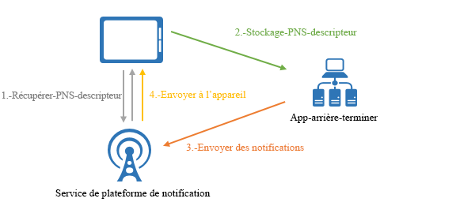
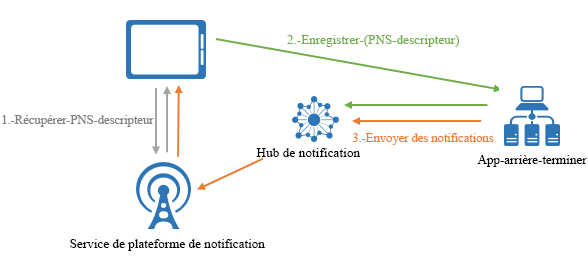

# Présentation d’Azure Notification Hubs

Azure Notification Hubs fournit un moteur d’envoi (push) simple d’utilisation et à grande échelle qui vous permet d’envoyer des notifications à n’importe quelle plateforme (iOS, Android, Windows, etc.) à partir de n’importe quel back-end (cloud ou local). Notification Hubs est parfaitement adapté lors de scénarios d’entreprise et de clients. Voici quelques exemples de scénarios :

- envoyer des notifications de dernières nouvelles à des millions de personnes avec une faible latence ;
- envoyer des coupons basés sur la localisation aux segments d’utilisateurs intéressés ;
- envoyer des notifications d’événements à des utilisateurs ou des groupes pour des applications de médias/sport/finance/jeux ;
- envoyer des notifications Push de contenu promotionnel vers les applications pour engager et toucher les clients ;
- informer les utilisateurs d’événements d’entreprise tels que des nouveaux messages et des éléments de travail ;
- envoyer des codes pour l’authentification MFA.

## Présentation des notifications Push

Les notifications Push sont une forme de communication entre l’application et l’utilisateur dans laquelle les utilisateurs d’applications mobiles sont notifiés à propos de certaines informations souhaitées, le plus souvent via une fenêtre contextuelle ou une boîte de dialogue sur un appareil mobile. Les utilisateurs choisissent généralement d’afficher ou d’ignorer le message ; s’ils choisissent de l’afficher, l’application mobile qui a transmis la notification apparaît. Certaines notifications silencieuses sont remises en arrière-plan puis traitées par l’application qui décidera de l’action à exécuter.

Les notifications Push sont essentielles pour les applications clients en vue d’augmenter l’engagement envers l’application et l’utilisation. Pour les applications d’entreprise, elles permettent de communiquer des informations commerciales à jour. Il s’agit de la meilleure méthode de communication entre l’application et l’utilisateur, car elle consomme peu d’énergie pour les appareils mobiles, elle est flexible pour les expéditeurs de notifications et disponible alors que les applications correspondantes ne sont pas actives.

> [!NOTE]
> Azure Notification Hubs ne prend pas officiellement en charge les notifications Push VoIP (Voice Over Internet Protocol). Toutefois, [cet article explique comment utiliser les notifications APNs VoIP](voip-apns.md) via Azure Notification Hubs.

Pour plus d’informations sur les notifications Push des plateformes les plus populaires, consultez les rubriques suivantes :

- [Android](https://developer.android.com/guide/topics/ui/notifiers/notifications.html)
- [iOS](https://developer.apple.com/notifications/)
- [Windows](/previous-versions/windows/apps/hh779725(v=win.10))

## Comment les notifications Push fonctionnent-elles ?

Les notifications Push sont diffusées par l’intermédiaire d’infrastructures spécifiques à des plateformes appelées *Platform Notification Systems* (PNS). Elles proposent des fonctionnalités Push de base pour remettre un message à un appareil avec un handle fourni et sans interface commune. Pour envoyer une notification à tous les clients pour les versions Android, iOS et Windows d’une application, le développeur doit utiliser séparément Apple Push Notification Service (APNS), Firebase Cloud Messaging (FCM) et le service de notification Windows (WNS).

À un niveau élevé, voici comment fonctionnent les notifications Push :

1. Une application souhaite recevoir une notification. Elle contacte alors le PNS pour connaître la plateforme cible sur laquelle l’application s’exécute et demande un handle Push unique et temporaire. Le type de handle dépend du système (par exemple, WNS dispose d’un URI, tandis qu’APNS utilise des jetons).
2. L’application cliente stocke ce handle dans le serveur principal de l’application ou le fournisseur.
3. Pour envoyer une notification Push, le serveur principal de l’application contacte le PNS à l’aide du handle afin de cibler une application cliente spécifique.
4. Le PNS transmet la notification à l’appareil spécifié par le handle.

## Défis des notifications Push

Les PNS sont des outils puissants. Mais il reste beaucoup de travail au développeur d’applications pour implémenter ne serait-ce que des scénarios de notification Push courants, tels que la diffusion de notifications Push à un utilisateur.

L’envoi de notifications Push nécessite une infrastructure complexe qui n’est pas liée à la logique métier principale de l’application. Voici quelques-unes des difficultés liés à l’infrastructure :

- **Dépendance de la plateforme**
  - Le back-end exige une logique dépendante de la plateforme complexe et difficile à gérer pour envoyer des notifications aux appareils sur différentes plateformes, car les PNS ne sont pas unifiés.
- **Mettre à l'échelle**
  - Selon les instructions de PNS, les jetons des appareils doivent être actualisés chaque fois que l’application est lancée. Le serveur principal traite une grande quantité de trafic et d’accès à la base de données simplement pour maintenir les jetons à jour. Lorsque le nombre d’appareils s’accroît pour atteindre des centaines, des milliers voire des millions, le coût de création et de maintenance de cette infrastructure est conséquent.
  - La plupart des PNS ne prennent pas en charge la diffusion sur plusieurs appareils. Une simple diffusion sur un million d’appareils entraîne un million d’appels vers les PNS. La mise à l’échelle de cette quantité de trafic avec une latence minimale est complexe.
- **Routage**
  - Bien que les PNS offrent un moyen d’envoyer des messages aux appareils, la plupart des notifications d’applications sont ciblées sur des utilisateurs ou des groupes d’intérêt. Le serveur principal doit conserver un registre pour associer des appareils aux groupes d’intérêt, aux utilisateurs, aux propriétés, etc. Ce traitement s’ajoute à la durée totale de mise sur le marché et aux coûts de maintenance d’une application.

## Pourquoi utiliser Azure Notification Hubs ?

Notification Hubs élimine toutes les difficultés liées à l’envoi par vos propres moyens de notifications Push à partir de votre back-end d’application. Son infrastructure de notifications Push multi-plateforme et mise à l’échelle réduit le codage Push et simplifie votre serveur principal. Avec Notification Hubs, la seule responsabilité des appareils est d’enregistrer leur handle PNS auprès d’un hub, tandis que le serveur principal est responsable de l’envoi des messages aux utilisateurs et groupes d’intérêt, comme illustré dans la figure suivante :

Notification Hubs est votre moteur Push prêt à l’emploi et présente les avantages suivants :

- **Multi-plateforme**
  - Prise en charge de toutes les principales plateformes Push.
  - Une interface commune pour envoyer des notifications Push à toutes les plateformes dans des formats spécifiques ou indépendants de la plateforme, sans aucune tâche propre à la plateforme.
  - Gestion centralisée du handle de l’appareil.
- **Entre les serveurs principaux**
  - Cloud ou locaux.
  - .NET, Node.js, Java, Python, etc.
- **Ensemble complet de modèles de remise**
  - Diffuser vers une ou plusieurs plateformes : Vous pouvez diffuser instantanément des contenus vers des millions d’appareils sur plusieurs plateformes avec un seul appel d’API.
  - Notification Push à un appareil : Vous pouvez cibler des notifications sur des appareils individuels.
  - Notification Push à un utilisateur : Les étiquettes et les modèles vous aident à atteindre tous les appareils multiplateformes d’un utilisateur.
  - Notification Push à un segment avec des étiquettes dynamiques : La fonctionnalité des étiquettes vous permet de segmenter les appareils et de leur envoyer des notifications (Push) selon vos besoins, vers un seul segment ou une expression de segments (par exemple, actif ET réside à Seattle PAS nouvel utilisateur). Au lieu d’être limité au mécanisme publish-subscribe, vous pouvez mettre à jour les balises des appareils n’importe où et à tout moment.
  - Notification Push localisé : La fonctionnalité des modèles permet d’effectuer une localisation sans affecter le code back-end.
  - Notification Push en mode silencieux : vous pouvez activer le modèle envoi-extraction en envoyant des notifications en mode silencieux aux appareils et en les déclenchant pour effectuer certaines extractions ou actions.
  - Notification Push planifiée : Vous pouvez planifier l’envoi de notifications à tout moment.
  - Notification Push directe : Vous pouvez ignorer l’inscription des appareils auprès du service Notification Hubs et envoyer directement des notifications Push par lot à une liste de handles d’appareils.
  - Notification Push personnalisée : Les variables des notifications Push des appareils vous permettent d’envoyer des notifications Push personnalisées spécifiques à un appareil avec des paires clé-valeur personnalisées.
- **Télémétrie enrichie**
  - La télémétrie de notification Push générale, d’appareil, d’erreur et d’opération est disponible sur le portail Azure et par programmation.
  - La télémétrie par message effectue le suivi de chaque envoi (push) à partir de votre appel de demande initial au service Notification Hubs qui envoie les notifications Push avec succès.
  - Platform Notification System Feedback communique tous les commentaires des PNS pour faciliter le débogage.
- **Extensibilité**
  - Envoyer des messages rapides à des millions d’appareils sans réorganisation ou partitionnement d’appareil.
- **Sécurité**
  - Secret d’accès partagé ou authentification fédérée.

## Étapes suivantes

Commencez à créer et à utiliser un hub de notification en suivant le [Tutoriel : Notifications Push vers des applications mobiles](notification-hubs-android-push-notification-google-fcm-get-started.md).

[0]: ./media/notification-hubs-overview/registration-diagram.png
[1]: ./media/notification-hubs-overview/notification-hub-diagram.png

[How customers are using Notification Hubs]: https://azure.microsoft.com/services/notification-hubs
[Notification Hubs tutorials and guides]: https://azure.microsoft.com/documentation/services/notification-hubs
[iOS]: ./notification-hubs-push-notification-fixer.md
[Android]: ./notification-hubs-android-push-notification-google-gcm-get-started.md
[Windows Universal]: ./notification-hubs-windows-store-dotnet-get-started-wns-push-notification.md
[Windows Phone]: ./notification-hubs-windows-mobile-push-notifications-mpns.md
[Kindle]: ./notification-hubs-android-push-notification-google-fcm-get-started.md
[Xamarin.iOS]: ./xamarin-notification-hubs-ios-push-notification-apns-get-started.md
[Xamarin.Android]: ./xamarin-notification-hubs-push-notifications-android-gcm.md
[Microsoft.WindowsAzure.Messaging.NotificationHub]: /previous-versions/azure/reference/dn339221(v=azure.100)
[Microsoft.ServiceBus.Notifications]: /previous-versions/azure/
[App Service Mobile Apps]: /previous-versions/azure/app-service-mobile/app-service-mobile-value-prop
[templates]: notification-hubs-templates-cross-platform-push-messages.md
[Azure portal]: https://portal.azure.com
[tags]: (https://msdn.microsoft.com/library/azure/dn530749.aspx)
