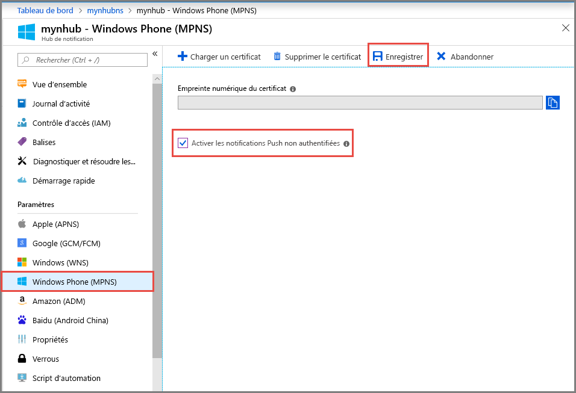

# <a name="tutorial-send-push-notifications-to-windows-phone-apps-using-notification-hubs"></a>Tutoriel : Envoyer des notifications Push à des applications Windows Phone avec Notification Hubs

[!INCLUDE [notification-hubs-selector-get-started](../../includes/notification-hubs-selector-get-started.md)]

Ce didacticiel montre comment utiliser Azure Notification Hubs pour envoyer des notifications Push vers des applications Windows Phone 8 ou Windows Phone 8.1 Silverlight. Si vous ciblez Windows Phone 8.1 (non-Silverlight), reportez-vous à la version [Windows Universel](notification-hubs-windows-store-dotnet-get-started-wns-push-notification.md) de ce didacticiel.

Ce didacticiel vous apprend à créer une application Windows Phone 8 vide qui reçoit des notifications Push au moyen du Service de notifications Push Microsoft (MPNS). Une fois l’application créée, vous utilisez votre hub de notification pour diffuser des notifications Push sur tous les appareils exécutant votre application.

> [!NOTE]
> Le kit de développement logiciel (SDK) Windows Phone Notification Hubs ne prend pas en charge l’utilisation des services WNS avec les applications Silverlight Windows Phone 8.1. Pour utiliser WNS (et non MPNS) avec les applications Windows Phone 8.1 Silverlight, suivez le [didacticiel Notification Hubs - Windows Phone Silverlight], qui s’appuie sur des API REST.

Dans ce tutoriel, vous allez apprendre à :

> [!div class="checklist"]
> * Création d’un hub de notifications
> * Créer une application Windows Phone
> * Test d’envoi d’une notification

## <a name="prerequisites"></a>Prérequis

* **Abonnement Azure**. Si vous n’avez pas d’abonnement Azure, créez un [compte Azure gratuit](https://azure.microsoft.com/free/) avant de commencer.
* [Visual Studio 2015 Express avec les composants de développement pour mobiles](https://www.visualstudio.com/vs/older-downloads/)

Vous devez suivre ce didacticiel avant de pouvoir suivre tous les autres didacticiels concernant les Notification Hubs pour les applications Windows Phone 8.

## <a name="create-your-notification-hub"></a>Création de votre hub de notification

[!INCLUDE [notification-hubs-portal-create-new-hub](../../includes/notification-hubs-portal-create-new-hub.md)]

### <a name="configure-windows-phone-mpns-settings"></a>Configurer les paramètres de Windows Phone (MPNS)

1. Sélectionnez **Windows Phone (MPNS)** sous **PARAMÈTRES DE NOTIFICATION**.
2. Sélectionnez **Activer l’authentification de notifications Push**.
3. Sélectionnez **Enregistrer** dans la barre d’outils.

    

    Le concentrateur est maintenant créé et configuré pour envoyer une notification non authentifiée pour Windows Phone.

    > [!NOTE]
    > Ce didacticiel utilise MPNS en mode non authentifié. Le mode MPNS non authentifié est assorti de restrictions sur les notifications que vous pouvez envoyer à chaque canal. Notification Hubs prend en charge le [mode authentifié MPNS](/previous-versions/windows/apps/ff941099(v=vs.105)) en vous permettant de télécharger votre certificat.

## <a name="create-a-windows-phone-application"></a>Créer une application Windows Phone

Dans cette section, vous créez une application Windows Phone qui s’inscrit elle-même auprès de votre hub de notification.

1. Dans Visual Studio, créez une application Windows Phone 8.

    ![Visual Studio - Nouveau projet - Application Windows Phone][13]

    Dans Visual Studio 2013 Update 2 ou version ultérieure, vous créez plutôt une application Silverlight Windows Phone.

    ![Visual Studio - Nouveau projet - Application vide - Windows Phone Silverlight][11]
2. Dans Visual Studio, cliquez avec le bouton droit sur la solution, puis cliquez sur **Gérer les packages NuGet**.
3. Recherchez `WindowsAzure.Messaging.Managed` , puis cliquez sur **Installer** et acceptez les conditions d’utilisation.

    ![Visual Studio - Gestionnaire de packages NuGet][20]
4. Ouvrez le fichier App.xaml.cs et ajoutez les instructions `using` suivantes :

    ```csharp
    using Microsoft.Phone.Notification;
    using Microsoft.WindowsAzure.Messaging;
    ```

5. Ajoutez le code suivant au début de la méthode `Application_Launching` dans `App.xaml.cs` :

    ```csharp
    private void Application_Launching(object sender, LaunchingEventArgs e)
    {

        var channel = HttpNotificationChannel.Find("MyPushChannel");
        if (channel == null)
        {
            channel = new HttpNotificationChannel("MyPushChannel");
            channel.Open();
            channel.BindToShellToast();
        }

        channel.ChannelUriUpdated += new EventHandler<NotificationChannelUriEventArgs>(async (o, args) =>
        {
            var hub = new NotificationHub("<hub name>", "<connection string>");
            var result = await hub.RegisterNativeAsync(args.ChannelUri.ToString());

            System.Windows.Deployment.Current.Dispatcher.BeginInvoke(() =>
            {
                MessageBox.Show("Registration :" + result.RegistrationId, "Registered", MessageBoxButton.OK);
            });
        });
    }
    ```

   > [!NOTE]
   > La valeur `MyPushChannel` est un index utilisé pour rechercher un canal existant dans la collection [HttpNotificationChannel](/previous-versions/ff402781(v=vs.110)). S’il n’y en a aucun, créez une entrée portant ce nom.

    Insérez le nom de votre hub et la chaîne de connexion appelée `DefaultListenSharedAccessSignature` que vous avez notée dans la section précédente.
    Ce code récupère l’URI de canal correspondant à l’application dans MPNS, puis inscrit ce dernier avec votre notification Hub. Il garantit également l’inscription de l’URI de canal dans votre hub de notification à chaque fois que l’application est lancée.

   > [!NOTE]
   > Ce didacticiel permet d'envoyer une notification toast à l'appareil. Lorsque vous envoyez une notification par vignette, vous devez appeler la méthode `BindToShellTile` sur le canal. Pour la prise en charge des notifications toast ainsi que des notifications par vignette, appelez `BindToShellTile` et `BindToShellToast`.

6. Dans l’Explorateur de solutions, développez **Propriétés**, ouvrez le fichier `WMAppManifest.xml`, cliquez sur l’onglet **Fonctionnalités** et assurez-vous que la fonctionnalité **ID_CAP_PUSH_NOTIFICATION** soit activée. Votre application peut maintenant recevoir des notifications Push.

    ![Visual Studio - Fonctionnalités des applications Windows Phone][14]
7. Appuyez sur la touche `F5` pour exécuter l’application. Un message d’inscription s’affiche dans l’application.
8. Fermez l’application ou basculez vers la page d’accueil.

   > [!NOTE]
   > Pour recevoir une notification Push toast, l’application ne doit pas s’exécuter au premier plan.

## <a name="test-send-a-notification"></a>Test d’envoi d’une notification

1. Dans le portail Azure, basculez vers l’onglet Vue d’ensemble.
2. Sélectionnez **Test d’envoi**.

    
3. Dans la fenêtre **Test d’envoi**, effectuez les actions suivantes :

    1. Pour **Plateformes**, sélectionnez **Windows Phone**.
    2. Pour **Type de Notification**, sélectionnez **Toast**.
    3. Sélectionnez **Envoyer**.
    4. Consultez le **résultat** dans la liste au bas de la fenêtre.

        
4. Dans l’émulateur Windows Phone ou sur le téléphone Windows, vérifiez que le message de notification s’affiche.

    

## <a name="next-steps"></a>Étapes suivantes

Dans cet exemple simple, vous avez diffusé des notifications Push à tous vos appareils Windows Phone 8. Passez au didacticiel suivant pour apprendre à envoyer des notifications Push à des appareils spécifiques :

> [!div class="nextstepaction"]
>[Notifications Push vers des appareils spécifiques](notification-hubs-windows-phone-push-xplat-segmented-mpns-notification.md)

<!-- Images. -->
[6]: ./media/notification-hubs-windows-phone-get-started/notification-hub-create-console-app.png
[7]: ./media/notification-hubs-windows-phone-get-started/notification-hub-create-from-portal.png
[8]: ./media/notification-hubs-windows-phone-get-started/notification-hub-create-from-portal2.png
[9]: ./media/notification-hubs-windows-phone-get-started/notification-hub-select-from-portal.png
[10]: ./media/notification-hubs-windows-phone-get-started/notification-hub-select-from-portal2.png
[11]: ./media/notification-hubs-windows-phone-get-started/notification-hub-create-wp-silverlight-app.png
[12]: ./media/notification-hubs-windows-phone-get-started/notification-hub-connection-strings.png
[13]: ./media/notification-hubs-windows-phone-get-started/notification-hub-create-wp-app.png
[14]: ./media/notification-hubs-windows-phone-get-started/mobile-app-enable-push-wp8.png
[15]: ./media/notification-hubs-windows-phone-get-started/notification-hub-pushauth.png
[20]: ./media/notification-hubs-windows-phone-get-started/notification-hub-windows-universal-app-install-package.png
[213]: ./media/notification-hubs-windows-phone-get-started/notification-hub-create-console-app.png

<!-- URLs. -->
[Notification Hubs Guidance]: /previous-versions/azure/azure-services/jj927170(v=azure.100)
[MPNS authenticated mode]: /previous-versions/windows/apps/ff941099(v=vs.105)
[Use Notification Hubs to push notifications to users]: notification-hubs-aspnet-backend-windows-dotnet-wns-notification.md
[Use Notification Hubs to send breaking news]: notification-hubs-windows-phone-push-xplat-segmented-mpns-notification.md
[toast catalog]: /previous-versions/windows/apps/jj662938(v=vs.105)
[tile catalog]: /previous-versions/windows/apps/hh202948(v=vs.105)
[didacticiel Notification Hubs - Windows Phone Silverlight]: https://github.com/Azure/azure-notificationhubs-samples/tree/master/PushToSafari
