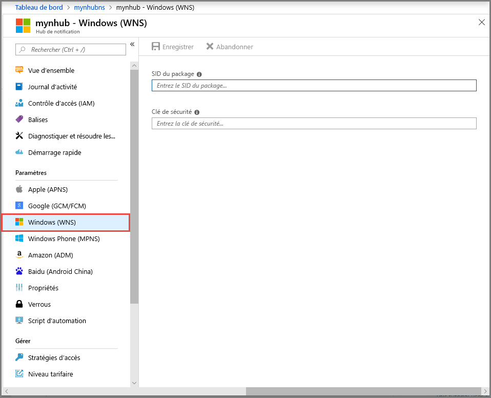

# <a name="tutorial-send-notifications-to-universal-windows-platform-apps-using-azure-notification-hubs"></a>Tutoriel : Envoyer des notifications à des applications de plateforme Windows universelle avec Azure Notification Hubs

[!INCLUDE [notification-hubs-selector-get-started](../../includes/notification-hubs-selector-get-started.md)]

Dans ce didacticiel, vous créez un hub de notification pour envoyer des notifications Push à une application de plateforme Windows universelle (UWP). Vous créez une application Windows Store vide qui reçoit des notifications Push au moyen du Service de notifications Windows Push (WNS). Vous utilisez ensuite votre hub de notification pour diffuser des notifications Push sur tous les appareils exécutant votre application.

> [!NOTE]
> Vous pouvez trouver le code complet de ce didacticiel sur [GitHub](https://github.com/Azure/azure-notificationhubs-dotnet/tree/master/Samples/UwpSample).

Procédez comme suit :

> [!div class="checklist"]
> * Créer une application dans Windows Store
> * Création d’un hub de notifications
> * Créer un exemple d’application Windows
> * Envoyer des notifications de test

## <a name="prerequisites"></a>Prérequis

- **Abonnement Azure**. Si vous n’avez pas d’abonnement Azure, créez un [compte Azure gratuit](https://azure.microsoft.com/free/?WT.mc_id=A261C142F) avant de commencer.
- Microsoft Visual Studio 2017 ou version ultérieure. L’exemple de ce tutoriel utilise [Visual Studio 2019](https://www.visualstudio.com/products).
- [Outils de développement d’applications UWP installés](/windows/uwp/get-started/get-set-up)
- Un compte Windows Store actif
- Vérifiez que le paramètre **Obtenir les notifications des applications et des autres expéditeurs** est activé. 
    - Lancez la fenêtre **Paramètres** sur votre ordinateur.
    - Sélectionnez la vignette **Système**.
    - Sélectionnez **Notifications et actions** dans le menu de gauche. 
    - Vérifiez que le paramètre **Obtenir les notifications des applications et des autres expéditeurs** est activé. Activez-le s’il ne l’est pas.

Vous devez terminer ce didacticiel avant de pouvoir suivre tous les autres didacticiels Notification Hubs pour les applications UWP.

## <a name="create-an-app-in-windows-store"></a>Créer une application dans Windows Store

Pour envoyer des notifications Push à des applications UWP, associez votre application au Windows Store. Ensuite, configurez votre Notification Hub pour l’intégrer à WNS.

1. Accédez à la page [Centre de développement Windows](https://partner.microsoft.com/dashboard/windows/first-run-experience), connectez-vous avec votre compte Microsoft, puis sélectionnez **Créer une application**.

    
2. Saisissez un nom pour votre application et sélectionnez **Réserver le nom de produit**. La nouvelle inscription au Windows Store pour votre application est alors créée.

    
3. Développez **Gestion des produits** , sélectionnez **WNS/MPNS**, puis le **site des services Microsoft Live**. vous connecter à votre compte Microsoft ; La page d’inscription des applications s’ouvre dans un nouvel onglet. Vous pouvez également naviguer directement jusqu’à la page [Mes applications](https://apps.dev.microsoft.com) et sélectionner le nom de votre application pour accéder à cette page.

    
4. Notez le mot de passe **Secrets de l’application** et la valeur **Identificateur de sécurité (SID) du package**.

    >[!WARNING]
    >Le secret d’application et le SID du package sont des informations d'identification de sécurité importantes. Ne partagez pas ces valeurs avec quiconque et ne les distribuez pas avec votre application.

## <a name="create-a-notification-hub"></a>Création d’un concentrateur de notification

[!INCLUDE [notification-hubs-portal-create-new-hub](../../includes/notification-hubs-portal-create-new-hub.md)]

### <a name="configure-wns-settings-for-the-hub"></a>Configurer les paramètres WNS le hub

1. Dans la catégorie **PARAMÈTRES DE NOTIFICATION**, sélectionnez **Windows (WNS)** .
2. Entrez les valeurs pour **SID de package** et **Clé de sécurité** notées à la section précédente.
3. Cliquez sur **Save** dans la barre d'outils.

    

Votre Notification Hub est désormais configuré pour fonctionner avec WNS. Vous disposez des chaînes de connexion pour inscrire votre application et envoyer des notifications.

## <a name="create-a-sample-windows-app"></a>Créer un exemple d’application Windows

1. Dans Visual Studio, ouvrez le menu **Fichier**, sélectionnez **Nouveau**, puis **Projet**.
2. Dans la boîte de dialogue **Créer un projet**, effectuez les étapes suivantes :

    1. Dans la zone de recherche située en haut, tapez **Windows universel**.
    2. Dans les résultats de la recherche, sélectionnez **Application vide (Windows universel)** , puis **Suivant**.

       

    3. Dans la boîte de dialogue **Configurer votre nouveau projet**, entrez un **Nom de projet** et un **Emplacement** pour les fichiers projet.
    4. Sélectionnez **Create** (Créer).

3. Acceptez les valeurs par défaut pour les versions de plateforme **cible** et **minimale** puis sélectionnez **OK**.
4. Dans l’Explorateur de solutions, cliquez avec le bouton droit sur le projet d’application Windows Store, sélectionnez **Publier**, puis **Associer l’application au Windows Store**. L'Assistant **Associer votre application au Windows Store** s'affiche.
5. Dans l’Assistant, connectez-vous avec votre compte Microsoft.
6. Sélectionnez l’application inscrite à l’étape 2, puis sélectionnez **Suivant** et **Associer**. Cela ajoute les informations d’inscription Windows Store requises au manifeste de l’application.
7. Dans Visual Studio, cliquez avec le bouton droit sur la solution, puis sélectionnez **Gérer les packages NuGet**. La fenêtre **Gérer les packages NuGet** s’ouvre.
8. Dans la zone de recherche, saisissez **WindowsAzure.Messaging.Managed**, sélectionnez **Installer**et acceptez les conditions d’utilisation.

    ![La fenêtre Gérer les packages NuGet][20]

    Cette action télécharge, installe et ajoute une référence à la bibliothèque Azure Notification Hubs pour Windows à l’aide du [package NuGet Microsoft.Azure.NotificationHubs](https://www.nuget.org/packages/Microsoft.Azure.NotificationHubs).
9. Ouvrez le fichier `App.xaml.cs` du projet et ajoutez les instructions qui suivent :

    ```csharp
    using Windows.Networking.PushNotifications;
    using Microsoft.WindowsAzure.Messaging;
    using Windows.UI.Popups;
    ```

10. Dans le fichier `App.xaml.cs` du projet, recherchez la classe `App` et ajoutez la définition de méthode `InitNotificationsAsync` suivante. Remplacez `<your hub name>` par le nom du hub de notification que vous avez créé dans le portail Azure et remplacez `<Your DefaultListenSharedAccessSignature connection string>` par la chaîne de connexion `DefaultListenSharedAccessSignature` de la page **Stratégies d’accès** de votre hub de notification :

    ```csharp
    private async void InitNotificationsAsync()
    {
        var channel = await PushNotificationChannelManager.CreatePushNotificationChannelForApplicationAsync();

        var hub = new NotificationHub("<your hub name>", "<Your DefaultListenSharedAccessSignature connection string>");
        var result = await hub.RegisterNativeAsync(channel.Uri);

        // Displays the registration ID so you know it was successful
        if (result.RegistrationId != null)
        {
            var dialog = new MessageDialog("Registration successful: " + result.RegistrationId);
            dialog.Commands.Add(new UICommand("OK"));
            await dialog.ShowAsync();
        }
    }
    ```

    Ce code récupère l’URI de canal pour l’application dans WNS et l’inscrit avec votre Notification Hub.

    >[!NOTE]
    > Remplacez l’espace réservé `hub name` par le nom du hub de notification affiché dans le portail Azure. Remplacez également l’espace réservé de la chaîne de connexion par la chaîne de connexion `DefaultListenSharedAccessSignature` que vous avez obtenue à la page **Stratégies d’accès** de votre hub de notification dans une section précédente.

11. En haut du gestionnaire d’événements `OnLaunched` dans `App.xaml.cs`, ajoutez l’appel suivant vers la nouvelle méthode `InitNotificationsAsync` :

    ```csharp
    InitNotificationsAsync();
    ```

    Cette action garantit l’inscription de l’URI de canal dans votre hub de notification chaque fois que l’application se lance.

12. Pour exécuter l’application, appuyez sur la touche **F5** du clavier. Une boîte de dialogue contenant la clé d’inscription s’affiche. Pour fermer la boîte de dialogue, cliquez sur **OK**.

    

Votre application est maintenant prête à recevoir des notifications toast.

## <a name="send-test-notifications"></a>Envoyer des notifications de test

Vous pouvez tester rapidement la réception de notifications dans votre application en envoyant des notifications dans le [Portail Azure](https://portal.azure.com/).

1. Dans le portail Azure, basculez vers l’onglet Vue d’ensemble, puis sélectionnez **Test d’envoi** sur la barre d’outils.

    
2. Dans la fenêtre **Test d’envoi**, effectuez les actions suivantes :
    1. Pour **Plateformes**, sélectionnez **Windows**.
    2. Pour **Type de Notification**, sélectionnez **Toast**.
    3. Sélectionnez **Envoyer**.

        
3. Examinez le résultat de l’opération d’envoi dans la liste **Résultat** au bas de la fenêtre. Vous voyez également un message d’alerte.

    
4. Vous voyez le message de notification : **Message de test** sur votre bureau.

    

## <a name="next-steps"></a>Étapes suivantes
Vous avez envoyé des notifications de diffusion à tous vos appareils Windows en utilisant le portail ou une application console. Pour savoir comment envoyer des notifications Push à des appareils spécifiques, passez au didacticiel suivant :

> [!div class="nextstepaction"]
>[Notifications Push vers des appareils spécifiques](
notification-hubs-windows-notification-dotnet-push-xplat-segmented-wns.md)

<!-- Images. -->
[13]: ./media/notification-hubs-windows-store-dotnet-get-started/notification-hub-create-console-app.png
[14]: ./media/notification-hubs-windows-store-dotnet-get-started/notification-hub-windows-toast.png
[19]: ./media/notification-hubs-windows-store-dotnet-get-started/notification-hub-windows-reg.png
[20]: ./media/notification-hubs-windows-store-dotnet-get-started/notification-hub-windows-universal-app-install-package.png

<!-- URLs. -->
[Use Notification Hubs to push notifications to users]: notification-hubs-aspnet-backend-windows-dotnet-wns-notification.md
[Use Notification Hubs to send breaking news]: notification-hubs-windows-notification-dotnet-push-xplat-segmented-wns.md
[toast catalog]: /previous-versions/windows/apps/hh761494(v=win.10)
[tile catalog]: /previous-versions/windows/apps/hh761491(v=win.10)
[badge overview]: /previous-versions/windows/apps/hh779719(v=win.10)
