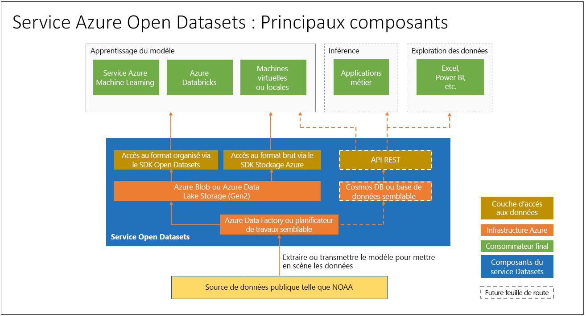

# Que sont les jeux de données Azure Open Datasets (préversion) et comment pouvez-vous les utiliser ?

Les jeux de données [Azure Open Datasets](https://azure.microsoft.com/services/open-datasets/) sont des jeux de données publics organisés que vous pouvez utiliser pour ajouter des fonctionnalités spécifiques à des scénarios à des solutions de Machine Learning afin d'obtenir des modèles plus précis. Les jeux de données ouverts se trouvent dans le cloud, sur Microsoft Azure, et sont facilement accessibles à Azure Databricks, au service Machine Learning et à Machine Learning Studio. Vous pouvez également accéder aux jeux de données via des API et les utiliser dans d'autres produits, tels que Power BI et Azure Data Factory.

Les jeux de données englobent des données du domaine public portant sur la météo, le recensement, les jours fériés, la sécurité publique et la localisation et vous aident à former des modèles Machine Learning et à enrichir des solutions prédictives. Vous pouvez également partager vos jeux de données publics sur la plateforme Azure Open Datasets. 

## Jeux de données organisés et préparés
Les jeux de données publics ouverts et organisés contenus dans Azure Open Datasets sont optimisés pour être utilisés dans les flux de travail de Machine Learning. 

Les scientifiques des données passent souvent la majeure partie de leur temps à nettoyer et à préparer les données pour les analyses avancées. Les jeux de données ouverts sont copiés dans le cloud Azure et prétraités afin de vous faire gagner du temps. À intervalles réguliers, les données sont extraites des sources, par exemple par une connexion FTP à la NOAA (National Oceanic and Atmospheric Administration), analysées sous un format structuré, puis enrichies, le cas échéant, avec des caractéristiques telles que le code postal ou l'emplacement de la station météo la plus proche.

Les jeux de données sont co-hébergés avec les ressources de calcul du cloud Azure, ce qui facilite l'accès et la manipulation.  

Voici quelques exemples de jeux de données disponibles. 

### Données météorologiques
 
|Jeu de données         | Notebooks     | Description                                    |
|----------------|---------------|------------------------------------------------|
|[Données de surface intégrées (DSI) de la NOAA](https://azure.microsoft.com/services/open-datasets/catalog/noaa-integrated-surface-data/) | [Azure Notebooks](https://azure.microsoft.com/services/open-datasets/catalog/noaa-integrated-surface-data/?tab=data-access#AzureNotebooks)   [Azure Databricks](https://azure.microsoft.com/services/open-datasets/catalog/noaa-integrated-surface-data/?tab=data-access#AzureDatabricks) | Données météorologiques horaires mondiales de la NOAA offrant la meilleure couverture spatiale pour l'Amérique du Nord, l'Europe, l'Australie et certaines parties de l'Asie. Mises à jour quotidiennement. |
|[Global Forecast System (GFS) de la NOAA](https://azure.microsoft.com/services/open-datasets/catalog/noaa-global-forecast-system/) | [Azure Notebooks](https://azure.microsoft.com/services/open-datasets/catalog/noaa-global-forecast-system/?tab=data-access#AzureNotebooks)   [Azure Databricks](https://azure.microsoft.com/services/open-datasets/catalog/noaa-global-forecast-system/?tab=data-access#AzureDatabricks) | Données de prévisions météorologiques horaires concernant les États-Unis, sur 15 jours, fournies par la NOAA. Mises à jour quotidiennement. |

### Données de calendrier

|Jeu de données         | Notebooks     | Description                                    |
|----------------|---------------|------------------------------------------------|
|[Jours fériés](https://azure.microsoft.com/services/open-datasets/catalog/public-holidays/) | [Azure Notebooks](https://azure.microsoft.com/services/open-datasets/catalog/public-holidays/?tab=data-access#AzureNotebooks)   [Azure Databricks](https://azure.microsoft.com/services/open-datasets/catalog/public-holidays/?tab=data-access#AzureDatabricks) | Données internationales portant sur les jours fériés et couvrant 41 pays ou régions, de 1970 à 2099. Désigne le pays et indique si la majorité des habitants bénéficient de congés payés. |

## Accès aux jeux de données  
Grâce à un compte Azure, vous pouvez accéder aux jeux de données ouverts à l'aide d'un code ou via l'interface de service Azure. Les données sont co-hébergées avec les ressources de calcul du cloud Azure pour être utilisées dans votre solution de Machine Learning.  

Open Datasets fournit des notebooks Azure Notebooks et Azure Databricks que vous pouvez utiliser pour connecter les données au service Azure Machine Learning et à Azure Databricks. Les jeux de données sont également accessibles via un kit de développement logiciel (SDK) Python. 

Toutefois, aucun compte Azure n'est nécessaire pour accéder aux jeux de données ouverts. Ils sont accessibles dans n'importe quel environnement Python, avec ou sans Spark.

## Demander ou contribuer à la création des jeux de données

Si vous ne trouvez pas les données que vous recherchez, envoyez-nous un e-mail pour [demander un jeu de données](mailto:aod@microsoft.com?Subject=Contribute%20dataset%3A%20%3Creplace%20with%20dataset%20name%3E&Body=%0AYour%20name%20and%20institution%3A%20%0A%0ADataset%20name%3A%0A%20%0ADataset%20description%3A%20%0A%3Cfill%20in%20a%20brief%20description%20and%20share%20any%20web%20links%20of%20the%20dataset%3E%20%0A%0ADataset%20size%3A%20%0A%3Chow%20much%20space%20does%20the%20dataset%20need%20today%20and%20how%20much%20is%20it%20expected%20to%20grow%20each%20year%3E%20%0A%0ADataset%20file%20formats%3A%20%0A%3Ccurrent%20dataset%20file%20formats%2C%20and%20optionally%2C%20any%20formats%20that%20the%20dataset%20must%20be%20transformed%20to%20for%20easy%20access%3E%0A%0ALicense%3A%20%0A%3Cwhat%20is%20the%20license%20or%20terms%20and%20conditions%20governing%20the%20distribution%20of%20this%20dataset%3E%0A%0AUse%20cases%3A%20%0A%3CExplain%20some%20common%20use%20of%20the%20dataset.%20E.g.%20weather%20dataset%20can%20be%20useful%20in%20demand%20forecasting%20and%20predictive%20maintenance%20scenarios%3E%20%0A%0AAny%20additional%20information%20you%20want%20us%20to%20know%3A%0A) ou [contribuer à la création d'un jeu de données](mailto:aod@microsoft.com?Subject=Request%20dataset%3A%20%3Creplace%20with%20dataset%20name%3E&Body=%0AYour%20name%20and%20institution%3A%20%0A%0ADataset%20name%3A%0A%20%0ADataset%20description%3A%20%0A%3Cfill%20in%20a%20brief%20description%20and%20share%20any%20web%20links%20of%20the%20dataset%3E%20%0A%0ADataset%20size%3A%20%0A%3Chow%20much%20space%20does%20the%20dataset%20need%20today%20and%20how%20much%20is%20it%20expected%20to%20grow%20each%20year%3E%20%0A%0ADataset%20file%20formats%3A%20%0A%3Ccurrent%20dataset%20file%20formats%2C%20and%20optionally%2C%20any%20formats%20that%20the%20dataset%20must%20be%20transformed%20to%20for%20easy%20access%3E%0A%0ALicense%3A%20%0A%3Cwhat%20is%20the%20license%20or%20terms%20and%20conditions%20governing%20the%20distribution%20of%20this%20dataset%3E%0A%0AUse%20cases%3A%20%0A%3CExplain%20some%20common%20use%20of%20the%20dataset.%20E.g.%20weather%20dataset%20can%20be%20useful%20in%20demand%20forecasting%20and%20predictive%20maintenance%20scenarios%3E%20%0A%0AAny%20additional%20information%20you%20want%20us%20to%20know%3A%0A). 

## Étapes suivantes
* [Exemple de notebook](samples.md)
* [Tutoriel : Modélisation de régression avec données sur les taxis de New York](tutorial-opendatasets-automl.md)
* [Kit de développement logiciel (SDK) Python pour jeux de données ouverts](https://aka.ms/open-datasets-api)
