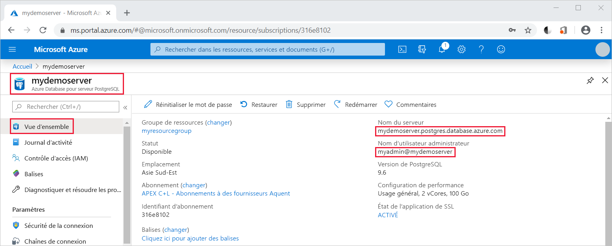

# <a name="quickstart-use-java-to-connect-to-and-query-data-in-azure-database-for-postgresql---single-server"></a>Démarrage rapide : Utiliser Java pour se connecter à Azure Database pour PostgreSQL et interroger les données (serveur unique)

Dans ce démarrage rapide, vous vous connectez à Azure Database pour PostgreSQL en utilisant une application Java. Il détaille l’utilisation d’instructions SQL pour interroger la base de données, la mettre à jour, y insérer des données ou en supprimer. Cet article suppose que vous connaissez les bases du développement via Java, et que vous ne savez pas utiliser Azure Database pour PostgreSQL.

## <a name="prerequisites"></a>Prérequis

- Compte Azure avec un abonnement actif. [Créez un compte gratuitement](https://azure.microsoft.com/free/?ref=microsoft.com&utm_source=microsoft.com&utm_medium=docs&utm_campaign=visualstudio).

- Exécution du [Démarrage rapide : Créer un serveur Azure Database pour PostgreSQL dans le portail Azure](quickstart-create-server-database-portal.md) ou [Démarrage rapide : Créer une instance de Azure Database pour PostgreSQL à l’aide de Azure CLI](quickstart-create-server-database-azure-cli.md).

- [Pilote JDBC PostgreSQL](https://jdbc.postgresql.org/download.html) : faites-le correspondre à votre version de Java et du kit de développement Java.
- [Détails du chemin de classe](https://jdbc.postgresql.org/documentation/head/classpath.html) : incluez le fichier .jar du pilote JDBC PostgreSQL (postgresql-42.1.1.jar, par exemple) dans le chemin de classe de votre application.

## <a name="get-connection-information"></a>Obtenir des informations de connexion
Obtenez les informations de connexion requises pour vous connecter à la base de données Azure pour PostgreSQL. Vous devez disposer du nom de serveur complet et des informations d’identification.

1. Dans le [portail Azure](https://portal.azure.com/), recherchez et sélectionnez le serveur que vous avez créé (par exemple, **mydemoserver**).

1. Dans le panneau **Vue d’ensemble** du serveur, notez le **nom du serveur** et le **nom d’utilisateur de l’administrateur**. Si vous oubliez votre mot de passe, vous pouvez également le réinitialiser dans ce panneau.

    

## <a name="connect-create-table-and-insert-data"></a>Se connecter, créer des tables et insérer des données
Utilisez le code suivant pour vous connecter et charger les données dans la base de données à l’aide d’une instruction SQL **INSERT**. Les méthodes [getConnection()](https://www.postgresql.org/docs/7.4/static/jdbc-use.html), [createStatement()](https://jdbc.postgresql.org/documentation/head/query.html), et [executeQuery()](https://jdbc.postgresql.org/documentation/head/query.html) permettent de se connecter à la base de données, de déposer et de créer une table. L’objet [prepareStatement](https://jdbc.postgresql.org/documentation/head/query.html) permet de générer les commandes d’insertion, en utilisant les méthodes setString() et setInt() pour lier les valeurs des paramètres. La méthode [executeUpdate()](https://jdbc.postgresql.org/documentation/head/update.html) exécute la commande pour chaque ensemble de paramètres. 

Remplacez les paramètres d’hôte, de la base de données, d’utilisateur et du mot de passe par les valeurs spécifiées lors de la création de votre serveur et de votre base de données.

```java
import java.sql.*;
import java.util.Properties;

public class CreateTableInsertRows {

    public static void main (String[] args)  throws Exception
    {

        // Initialize connection variables.
        String host = "mydemoserver.postgres.database.azure.com";
        String database = "mypgsqldb";
        String user = "mylogin@mydemoserver";
        String password = "<server_admin_password>";

        // check that the driver is installed
        try
        {
            Class.forName("org.postgresql.Driver");
        }
        catch (ClassNotFoundException e)
        {
            throw new ClassNotFoundException("PostgreSQL JDBC driver NOT detected in library path.", e);
        }

        System.out.println("PostgreSQL JDBC driver detected in library path.");

        Connection connection = null;

        // Initialize connection object
        try
        {
            String url = String.format("jdbc:postgresql://%s/%s", host, database);
            
            // set up the connection properties
            Properties properties = new Properties();
            properties.setProperty("user", user);
            properties.setProperty("password", password);
            properties.setProperty("ssl", "true");

            // get connection
            connection = DriverManager.getConnection(url, properties);
        }
        catch (SQLException e)
        {
            throw new SQLException("Failed to create connection to database.", e);
        }
        if (connection != null) 
        { 
            System.out.println("Successfully created connection to database.");
        
            // Perform some SQL queries over the connection.
            try
            {
                // Drop previous table of same name if one exists.
                Statement statement = connection.createStatement();
                statement.execute("DROP TABLE IF EXISTS inventory;");
                System.out.println("Finished dropping table (if existed).");
    
                // Create table.
                statement.execute("CREATE TABLE inventory (id serial PRIMARY KEY, name VARCHAR(50), quantity INTEGER);");
                System.out.println("Created table.");
    
                // Insert some data into table.
                int nRowsInserted = 0;
                PreparedStatement preparedStatement = connection.prepareStatement("INSERT INTO inventory (name, quantity) VALUES (?, ?);");
                preparedStatement.setString(1, "banana");
                preparedStatement.setInt(2, 150);
                nRowsInserted += preparedStatement.executeUpdate();

                preparedStatement.setString(1, "orange");
                preparedStatement.setInt(2, 154);
                nRowsInserted += preparedStatement.executeUpdate();

                preparedStatement.setString(1, "apple");
                preparedStatement.setInt(2, 100);
                nRowsInserted += preparedStatement.executeUpdate();
                System.out.println(String.format("Inserted %d row(s) of data.", nRowsInserted));
    
                // NOTE No need to commit all changes to database, as auto-commit is enabled by default.
    
            }
            catch (SQLException e)
            {
                throw new SQLException("Encountered an error when executing given sql statement.", e);
            }       
        }
        else {
            System.out.println("Failed to create connection to database.");
        }
        System.out.println("Execution finished.");
    }
}
```

## <a name="read-data"></a>Lire les données
Utilisez le code suivant pour lire des données à l’aide d’une instruction SQL **SELECT**. Les méthodes [getConnection()](https://www.postgresql.org/docs/7.4/static/jdbc-use.html), [createStatement()](https://jdbc.postgresql.org/documentation/head/query.html) et [executeQuery()](https://jdbc.postgresql.org/documentation/head/query.html) permettent de se connecter à la base de données, puis de créer et d’exécuter l’instruction SELECT. Les résultats sont traités à l’aide de l’objet [ResultSet](https://www.postgresql.org/docs/7.4/static/jdbc-query.html). 

Remplacez les paramètres d’hôte, de la base de données, d’utilisateur et du mot de passe par les valeurs spécifiées lors de la création de votre serveur et de votre base de données.

```java
import java.sql.*;
import java.util.Properties;

public class ReadTable {

    public static void main (String[] args)  throws Exception
    {

        // Initialize connection variables.
        String host = "mydemoserver.postgres.database.azure.com";
        String database = "mypgsqldb";
        String user = "mylogin@mydemoserver";
        String password = "<server_admin_password>";

        // check that the driver is installed
        try
        {
            Class.forName("org.postgresql.Driver");
        }
        catch (ClassNotFoundException e)
        {
            throw new ClassNotFoundException("PostgreSQL JDBC driver NOT detected in library path.", e);
        }

        System.out.println("PostgreSQL JDBC driver detected in library path.");

        Connection connection = null;

        // Initialize connection object
        try
        {
            String url = String.format("jdbc:postgresql://%s/%s", host, database);
            
            // set up the connection properties
            Properties properties = new Properties();
            properties.setProperty("user", user);
            properties.setProperty("password", password);
            properties.setProperty("ssl", "true");

            // get connection
            connection = DriverManager.getConnection(url, properties);
        }
        catch (SQLException e)
        {
            throw new SQLException("Failed to create connection to database.", e);
        }
        if (connection != null) 
        { 
            System.out.println("Successfully created connection to database.");
        
            // Perform some SQL queries over the connection.
            try
            {
    
                Statement statement = connection.createStatement();
                ResultSet results = statement.executeQuery("SELECT * from inventory;");
                while (results.next())
                {
                    String outputString = 
                        String.format(
                            "Data row = (%s, %s, %s)",
                            results.getString(1),
                            results.getString(2),
                            results.getString(3));
                    System.out.println(outputString);
                }
            }
            catch (SQLException e)
            {
                throw new SQLException("Encountered an error when executing given sql statement.", e);
            }       
        }
        else {
            System.out.println("Failed to create connection to database.");
        }
        System.out.println("Execution finished.");
    }
}

```

## <a name="update-data"></a>Mettre à jour des données
Utilisez le code suivant pour modifier les données à l’aide d’une instruction SQL **UPDATE**. Les méthodes [getConnection()](https://www.postgresql.org/docs/7.4/static/jdbc-use.html), [prepareStatement()](https://jdbc.postgresql.org/documentation/head/query.html) et [executeUpdate()](https://jdbc.postgresql.org/documentation/head/update.html) permettent de se connecter à la base de données, puis de préparer et d’exécuter l’instruction UPDATE. 

Remplacez les paramètres d’hôte, de la base de données, d’utilisateur et du mot de passe par les valeurs spécifiées lors de la création de votre serveur et de votre base de données.

```java
import java.sql.*;
import java.util.Properties;

public class UpdateTable {
    public static void main (String[] args)  throws Exception
    {

        // Initialize connection variables.
        String host = "mydemoserver.postgres.database.azure.com";
        String database = "mypgsqldb";
        String user = "mylogin@mydemoserver";
        String password = "<server_admin_password>";

        // check that the driver is installed
        try
        {
            Class.forName("org.postgresql.Driver");
        }
        catch (ClassNotFoundException e)
        {
            throw new ClassNotFoundException("PostgreSQL JDBC driver NOT detected in library path.", e);
        }

        System.out.println("PostgreSQL JDBC driver detected in library path.");

        Connection connection = null;

        // Initialize connection object
        try
        {
            String url = String.format("jdbc:postgresql://%s/%s", host, database);
            
            // set up the connection properties
            Properties properties = new Properties();
            properties.setProperty("user", user);
            properties.setProperty("password", password);
            properties.setProperty("ssl", "true");

            // get connection
            connection = DriverManager.getConnection(url, properties);
        }
        catch (SQLException e)
        {
            throw new SQLException("Failed to create connection to database.", e);
        }
        if (connection != null) 
        { 
            System.out.println("Successfully created connection to database.");
        
            // Perform some SQL queries over the connection.
            try
            {
                // Modify some data in table.
                int nRowsUpdated = 0;
                PreparedStatement preparedStatement = connection.prepareStatement("UPDATE inventory SET quantity = ? WHERE name = ?;");
                preparedStatement.setInt(1, 200);
                preparedStatement.setString(2, "banana");
                nRowsUpdated += preparedStatement.executeUpdate();
                System.out.println(String.format("Updated %d row(s) of data.", nRowsUpdated));
    
                // NOTE No need to commit all changes to database, as auto-commit is enabled by default.
            }
            catch (SQLException e)
            {
                throw new SQLException("Encountered an error when executing given sql statement.", e);
            }       
        }
        else {
            System.out.println("Failed to create connection to database.");
        }
        System.out.println("Execution finished.");
    }
}
```
## <a name="delete-data"></a>Suppression de données
Utilisez le code suivant pour supprimer des données à l’aide d’une instruction SQL **DELETE**. Les méthodes [getConnection()](https://www.postgresql.org/docs/7.4/static/jdbc-use.html), [prepareStatement()](https://jdbc.postgresql.org/documentation/head/query.html) et [executeUpdate()](https://jdbc.postgresql.org/documentation/head/update.html) permettent de se connecter à la base de données, puis de préparer et d’exécuter l’instruction DELETE. 

Remplacez les paramètres d’hôte, de la base de données, d’utilisateur et du mot de passe par les valeurs spécifiées lors de la création de votre serveur et de votre base de données.

```java
import java.sql.*;
import java.util.Properties;

public class DeleteTable {
    public static void main (String[] args)  throws Exception
    {

        // Initialize connection variables.
        String host = "mydemoserver.postgres.database.azure.com";
        String database = "mypgsqldb";
        String user = "mylogin@mydemoserver";
        String password = "<server_admin_password>";

        // check that the driver is installed
        try
        {
            Class.forName("org.postgresql.Driver");
        }
        catch (ClassNotFoundException e)
        {
            throw new ClassNotFoundException("PostgreSQL JDBC driver NOT detected in library path.", e);
        }

        System.out.println("PostgreSQL JDBC driver detected in library path.");

        Connection connection = null;

        // Initialize connection object
        try
        {
            String url = String.format("jdbc:postgresql://%s/%s", host, database);
            
            // set up the connection properties
            Properties properties = new Properties();
            properties.setProperty("user", user);
            properties.setProperty("password", password);
            properties.setProperty("ssl", "true");

            // get connection
            connection = DriverManager.getConnection(url, properties);
        }
        catch (SQLException e)
        {
            throw new SQLException("Failed to create connection to database.", e);
        }
        if (connection != null) 
        { 
            System.out.println("Successfully created connection to database.");
        
            // Perform some SQL queries over the connection.
            try
            {
                // Delete some data from table.
                int nRowsDeleted = 0;
                PreparedStatement preparedStatement = connection.prepareStatement("DELETE FROM inventory WHERE name = ?;");
                preparedStatement.setString(1, "orange");
                nRowsDeleted += preparedStatement.executeUpdate();
                System.out.println(String.format("Deleted %d row(s) of data.", nRowsDeleted));
    
                // NOTE No need to commit all changes to database, as auto-commit is enabled by default.
            }
            catch (SQLException e)
            {
                throw new SQLException("Encountered an error when executing given sql statement.", e);
            }       
        }
        else {
            System.out.println("Failed to create connection to database.");
        }
        System.out.println("Execution finished.");
    }
}
```

## <a name="next-steps"></a>Étapes suivantes
> [!div class="nextstepaction"]
> [Migration de votre base de données PostgreSQL par exportation et importation](./howto-migrate-using-export-and-import.md)
