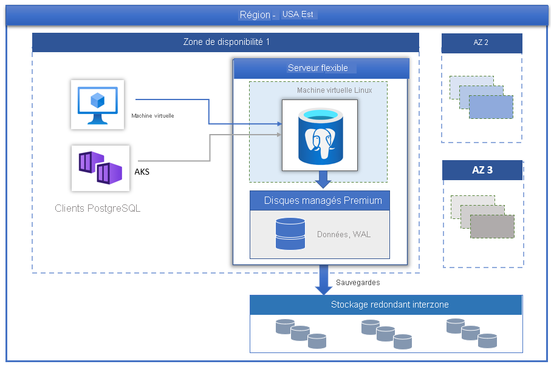

# Vue d’ensemble - Azure Database pour PostgreSQL - Serveur flexible

Trois modes de déploiement sont disponibles pour [Azure Database pour PostgreSQL](../overview.md) optimisé par PostgreSQL Community Edition :

- [Serveur unique](../overview-single-server.md)
- Serveur flexible (préversion)
- Hyperscale (Citus)

Cet article contient une vue d'ensemble et une présentation des concepts de base du modèle de déploiement de serveur unique.

> [!IMPORTANT]
> Azure Database pour PostgreSQL - Serveur flexible est en préversion

## Vue d’ensemble

Azure Database pour PostgreSQL - Serveur flexible est un service de base de données entièrement géré conçu pour offrir un contrôle et une flexibilité plus granulaires des fonctions de gestion de base de données et des paramètres de configuration. En général, le service fournit des personnalisations en termes de flexibilité et configuration de serveur suivant les besoins de l’utilisateur. L’architecture de serveur flexible permet de colocaliser le moteur de base de données avec le niveau client pour une latence plus faible, et d’opter pour une haute disponibilité au sein d’une même zone de disponibilité et dans plusieurs zones de disponibilité. Les serveurs flexibles offrent également de meilleurs contrôles d’optimisation des coûts grâce à la possibilité de d’arrêter/de démarrer votre serveur et un niveau de calcul expansible, ce qui est idéal pour les charges de travail ne nécessitant pas en permanence une capacité de calcul complète. Le service prend actuellement en charge la version de la communauté de PostgreSQL 11 et 12. Le service, en préversion, est aujourd'hui généralement disponible dans un grand nombre de [régions Azure](https://azure.microsoft.com/global-infrastructure/services/).

Les serveurs flexibles sont idéalement adaptés pour ce qui suit :

- Développement d’applications nécessitant un meilleur contrôle et des personnalisations.
- Haute disponibilité redondante interzone.
- Fenêtres de maintenance managées.
  
## Haute disponibilité

Le modèle de déploiement de serveur flexible est conçu pour prendre en charge une haute disponibilité au sein d’une même zone de disponibilité et dans plusieurs zones de disponibilité. L'architecture distingue le calcul du stockage. Le moteur de base de données s'exécute sur une machine virtuelle Linux, tandis que les fichiers de données résident sur le stockage Azure. Le stockage gère trois copies synchrones localement redondantes des fichiers de base de données, ce qui garantit la durabilité des données.

Lors des événements de basculement, qu'ils soient planifiés ou non, si le serveur tombe en panne, le service maintient la haute disponibilité des serveurs grâce à la procédure automatisée suivante :

1. Une nouvelle machine virtuelle de calcul Linux est approvisionnée.
2. Le stockage contenant les fichiers de données est mappé avec la machine virtuelle.
3. Le moteur de base de données PostgreSQL est mis en ligne sur le nouvelle machine virtuelle.

L’image ci-dessous montre la transition pour les machines virtuelles et l’échec de stockage.

 :::image type="content" source="./media/overview/overview-azure-postgres-flex-virtualmachine.png" alt-text="Serveur flexible - Machine virtuelle et échecs de stockage":::

Si la haute disponibilité redondante interzone est configurée, le service approvisionne et gère un serveur de secours dans la zone de disponibilité, au sein de la même région Azure. Les modifications apportées aux données sur le serveur source sont répliquées de façon synchrone sur le serveur de secours pour éviter toute perte de données. Avec la haute disponibilité redondante interzone, une fois l’événement de basculement planifié ou non planifié déclenché, le serveur de secours est immédiatement mis en ligne et disponible pour traiter les transactions entrantes. Cela permet la résilience du service en cas de défaillance de zone de disponibilité dans une région Azure prenant en charge plusieurs zones de disponibilité, comme illustré sur l’image ci-dessous.

 :::image type="content" source="./media/business-continuity/concepts-zone-redundant-high-availability-architecture.png" alt-text="Haute disponibilité redondante interzone":::

 Pour plus d’informations, consultez le document [Haute disponibilité](./concepts-high-availability.md).

## Mise à jour corrective automatisée avec fenêtre de maintenance gérée

Le service effectue une mise à jour corrective automatisée du matériel, du système d’exploitation et du moteur de base de données sous-jacents. Le correctif comprend les mises à jour de sécurité et de logiciel. Pour le moteur PostgreSQL, les mises à niveau de version mineure sont également incluses dans le cadre de la publication de maintenance planifiée. Les utilisateurs peuvent configurer la planification de la mise à jour corrective pour qu’elle soit gérée par le système, ou définir leur planification personnalisés. Lors de la planification de la maintenance, le correctif est appliqué et le serveur peut nécessiter un redémarrage dans le cadre du processus de mise à jour corrective pour achever la mise à jour. Avec la planification personnalisée, les utilisateurs peuvent rendre leur cycle de mise à jour prévisible, et choisir une fenêtre de maintenance avec un impact minimal sur l’activité. En général, le service suit un calendrier de publication mensuel dans le cadre de l’intégration et de la publication continues.

## Sauvegardes automatiques

Le service à serveur flexible crée automatiquement des sauvegardes de serveur et les conserve sur un stockage localement configuré par l'utilisateur avec redondance interzone (ZRS). Les sauvegardes peuvent être utilisées pour restaurer votre serveur à n'importe quel point dans le temps au cours de la période de rétention des sauvegardes. La période de rétention de sauvegarde par défaut est de sept jours. La rétention peut être configurée sur une durée maximum de 35 jours. Toutes les sauvegardes sont chiffrées à l’aide du chiffrement AES de 256 bits. Pour plus d’informations, consultez [Sauvegardes](./concepts-backup-restore.md).

## Ajustez les performances et la mise à l’échelle en quelques secondes

Trois niveaux de calcul sont disponibles pour le service à serveur flexible : Expansible, Usage général et À mémoire optimisée. Le niveau Expansible est idéalement adapté aux charges de travail de développement à faible coût et faible concurrence ne nécessitant pas en permanence une capacité de calcul complète. Les niveaux Usage général et À mémoire optimisée conviendront quant à eux aux charges de travail de production nécessitant une simultanéité et une mise à l'échelle de haut niveau, ainsi que des performances prévisibles. Vous pouvez créer votre première application sur une petite base de données pour un faible coût mensuel, puis adapter l’échelle en toute transparence aux besoins de votre solution.

## Arrêter/démarrer le serveur pour réduire le coût TCO

Le service à serveur flexible vous permet d’arrêter et de démarrer le serveur à la demande pour réduire votre coût TCO. La facturation du niveau de calcul est immédiatement arrêtée lorsque le serveur est arrêté. Cela peut vous permettre de réaliser des économies significatives en termes de développement, de test et de charges de travail de production prévisibles liées au temps. Le serveur reste à l’état arrêté pendant sept jours, sauf si le redémarrage intervient plus tôt.

## Sécurité de qualité professionnelle

Le service à serveur flexible utilise le module de chiffrement conforme à la norme FIPS 140-2 pour chiffrer le stockage des données au repos. Toutes les données sont chiffrées, y compris les sauvegardes et les fichiers temporaires créés lors de l'exécution des requêtes. Le service utilise le chiffrement AES 256 bits inclus dans le chiffrement de stockage Azure, et les clés peuvent être gérées par le système (par défaut). Le service chiffre les données en mouvement avec les protocoles SSL/TLS appliqués par défaut. Le service applique et prend en charge les versions TLS 1.2 uniquement.

Les serveurs flexibles permettent un accès privé complet aux serveurs à l’aide du réseau virtuel Azure (intégration au réseau virtuel). Les serveurs du réseau virtuel Azure sont uniquement accessibles et connectés via des adresses IP privées. Avec l’intégration au réseau virtuel, l’accès public est refusé et les serveurs ne sont pas accessibles à l’aide de points de terminaison publics.

## Surveillance et alerte

Le service à serveur flexible est équipé de fonctionnalités intégrées d'analyse des performances et d'alerte. Toutes les métriques Azure présentent une fréquence d’une minute et chaque métrique fournit 30 jours d’historique. Vous pouvez configurer des alertes basées sur les métriques. Le service expose les métriques du serveur hôte pour surveiller l’utilisation des ressources et permet de configurer les journaux des requêtes lentes. Grâce à ces outils, vous pouvez rapidement optimiser vos charges de travail et configurer votre serveur pour bénéficier de performances optimales.

## PgBouncer intégré

Le serveur flexible est fourni avec le pooler de connexions PgBouncer intégré. Si vous le souhaitez, vous pouvez l’activer et connecter vos applications à votre serveur de base de données par le biais de PgBouncer à l’aide du même nom d’hôte et du port 6432.

## Régions Azure

L’un des avantages de l’exécution de votre charge de travail dans Azure est sa portée mondiale. Le serveur flexible est actuellement disponible dans les régions Azure suivantes :

| Region | Disponibilité | Haute disponibilité redondante interzone | 
| --- | --- | --- |
| Australie Est | :heavy_check_mark: | :heavy_check_mark: | 
| Sud-Australie Est | :heavy_check_mark: | :x: | 
| Brésil Sud | :heavy_check_mark: | :x: |
| Centre du Canada | :heavy_check_mark: | :heavy_check_mark: | 
| USA Centre | :heavy_check_mark: | :heavy_check_mark: | 
| USA Est | :heavy_check_mark: | :heavy_check_mark: | 
| USA Est 2 | :heavy_check_mark: | :heavy_check_mark: |
| France Centre | :heavy_check_mark: | :heavy_check_mark: | 
| Japon Est | :heavy_check_mark: | :heavy_check_mark: | 
| Centre de la Corée | :heavy_check_mark: | :x: | 
| Europe Nord | :heavy_check_mark: | :heavy_check_mark: |
| Norvège Est | :heavy_check_mark: | :x: |
| Afrique du Sud Nord | :heavy_check_mark: | :x: |
| Asie Sud-Est | :heavy_check_mark: | :heavy_check_mark: |
| Suisse Nord | :heavy_check_mark: | :x: |
| Émirats arabes unis Nord | :heavy_check_mark: | :x: |
| Sud du Royaume-Uni | :heavy_check_mark: | :heavy_check_mark: | 
| Europe Ouest | :heavy_check_mark: | :heavy_check_mark: |
| USA Ouest | :heavy_check_mark: | :x: |
| USA Ouest 2 | :heavy_check_mark: | :heavy_check_mark: |

<!-- We continue to add more regions for flexible server. -->

## Migration

Le service exécute la version de la communauté de PostgreSQL. Cela permet une compatibilité totale des applications et requiert un coût de refactorisation minimal pour migrer une application existante développée sur le moteur PostgreSQL vers un serveur flexible. 

- **Image mémoire et restauration** : pour les migrations hors connexion, au cours desquelles les utilisateurs peuvent se permettre des temps d'arrêt, l'image mémoire et la restauration à l'aide d'outils communautaires tels que pg_dump et pg_restore peuvent constituer la méthode de migration la plus rapide. Pour plus d'informations, consultez [Migrer à l'aide de l'image mémoire et de la restauration](../howto-migrate-using-dump-and-restore.md).
- **Azure Database Migration Service** : pour les migrations transparentes et simplifiées vers un serveur flexible avec temps d'arrêt minimal, Azure Database Migration Service peut être utilisé. Consultez [DMS via le portail](../../dms/tutorial-postgresql-azure-postgresql-online-portal.md) et [DMS via l'interface CLI](../../dms/tutorial-postgresql-azure-postgresql-online.md). Vous pouvez effectuer une migration à partir de votre instance Azure Database pour PostgreSQL - Serveur unique vers Serveur flexible. Pour plus d’informations, consultez cet [article DMS](../../dms/tutorial-azure-postgresql-to-azure-postgresql-online-portal.md) article.

## Contacts
Pour toute question ou suggestion au sujet du serveur flexible Azure Database pour PostgreSQL, envoyez un e-mail à l’équipe Azure Database pour PostgreSQL ([@Ask Azure DB pour PostgreSQL](mailto:AskAzureDBforPostgreSQL@service.microsoft.com)). Notez que cette adresse e-mail n’est pas un alias de support technique.

En outre, tenez compte des points de contact suivants le cas échéant :

- Pour contacter le support technique Azure, [émettez un ticket à partir du Portail Azure](https://portal.azure.com/?#blade/Microsoft_Azure_Support/HelpAndSupportBlade).
- Pour résoudre un problème relatif à votre compte, enregistrez une [demande de support](https://ms.portal.azure.com/#blade/Microsoft_Azure_Support/HelpAndSupportBlade/newsupportrequest) sur le portail Azure.
- Pour donner votre avis ou demander de nouvelles fonctionnalités, créez une entrée via [UserVoice](https://feedback.azure.com/forums/597976-azure-database-for-postgresql).
  

## Étapes suivantes

Maintenant que vous avez lu l'introduction au mode de déploiement Azure Database pour PostgreSQL - Serveur flexible, vous êtes prêt à créer votre premier serveur : [Créer une instance Azure Database pour PostgreSQL - Serveur flexible à l’aide du portail Azure](./quickstart-create-server-portal.md)
