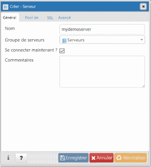
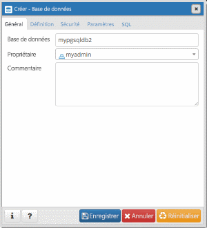

# <a name="quickstart-create-an-azure-database-for-postgresql---single-server-using-the-azure-cli"></a>Démarrage rapide : Créer une base de données Azure pour PostgreSQL (serveur unique) à l’aide d’Azure CLI

> [!TIP]
> Envisagez d’utiliser la commande Azure CLI plus simple [az postgres up](/cli/azure/ext/db-up/postgres#ext-db-up-az-postgres-up) (actuellement en préversion). Essayez le guide de [démarrage rapide](./quickstart-create-server-up-azure-cli.md).

Base de données Azure pour PostgreSQL est un service géré qui vous permet d’exécuter, de gérer et de mettre à l’échelle des bases de données PostgreSQL hautement disponibles dans le cloud. L’interface de ligne de commande (CLI) Azure permet de créer et gérer des ressources Azure à partir de la ligne de commande ou dans les scripts. Ce guide de démarrage rapide vous montre comment créer un serveur Azure Database pour PostgreSQL dans un [groupe de ressources Azure](https://docs.microsoft.com/azure/azure-resource-manager/resource-group-overview) avec la CLI Azure.

Si vous n’avez pas d’abonnement Azure, créez un compte [gratuit](https://azure.microsoft.com/free/) avant de commencer.

[!INCLUDE [cloud-shell-try-it](../../includes/cloud-shell-try-it.md)]

Si vous choisissez d’installer et d’utiliser l’interface de ligne de commande localement, vous devez exécuter Azure CLI version 2.0 ou une version ultérieure pour poursuivre la procédure décrite dans cet article. Pour afficher la version installée, exécutez la commande `az --version`. Si vous devez installer ou mettre à niveau, voir [Installer Azure CLI]( /cli/azure/install-azure-cli). 

Si vous exécutez l’interface CLI localement, vous devez vous connecter à votre compte à l’aide de la commande [az login](/cli/azure/authenticate-azure-cli?view=interactive-log-in). Notez la propriété **ID** de la sortie de commande pour le nom d’abonnement correspondant.
```azurecli-interactive
az login
```

Si vous avez plusieurs abonnements, sélectionnez l’abonnement approprié dans lequel la ressource doit être facturée. Sélectionnez l’ID d’abonnement spécifique sous votre compte à l’aide de la commande [az account set](/cli/azure/account). Remplacez la propriété **ID** à partir de la sortie **az login** pour votre abonnement dans l’espace réservé de l’ID abonnement.
```azurecli-interactive
az account set --subscription <subscription id>
```

## <a name="create-a-resource-group"></a>Créer un groupe de ressources

Créez un [groupe de ressources Azure](../azure-resource-manager/management/overview.md) avec la commande [az group create](/cli/azure/group). Un groupe de ressources est un conteneur logique dans lequel les ressources Azure sont déployées et gérées en tant que groupe. Vous devez fournir un nom unique. L’exemple suivant crée un groupe de ressources nommé `myresourcegroup` à l’emplacement `westus`.
```azurecli-interactive
az group create --name myresourcegroup --location westus
```

## <a name="create-an-azure-database-for-postgresql-server"></a>Créer un serveur Azure Database pour PostgreSQL

Créez un [serveur Azure Database pour PostgreSQL](overview.md) avec la commande [az sql server create](/cli/azure/postgres/server). Un serveur peut contenir plusieurs bases de données.


**Paramètre** | **Exemple de valeur** | **Description**
---|---|---
name | mydemoserver | Choisissez un nom unique qui identifie votre serveur de base de données Azure pour PostgreSQL. Le nom de serveur ne peut contenir que des lettres minuscules, des chiffres et le caractère de trait d’union (-). Il doit inclure entre 3 et 63 caractères.
resource-group | myResourceGroup | Indiquez le nom du groupe de ressources Azure.
sku-name | GP_Gen5_2 | Nom du la référence SKU. Suit la convention {niveau tarifaire}\_{génération de calcul}\_{vCores} dans le raccourci. Consultez le tableau ci-dessous pour plus d’informations sur le paramètre sku-name.
backup-retention | 7 | Durée pendant laquelle la sauvegarde doit être conservée. Exprimée en jours. La plage s’étend de 7 à 35. 
geo-redundant-backup | Désactivé | Indique si les sauvegardes géoredondantes doivent être activées ou non pour ce serveur. Valeurs autorisées : Activé, Désactivé.
location | westus | Emplacement Azure du serveur.
ssl-enforcement | activé | Indique si le protocole SSL doit être activé ou non pour ce serveur. Valeurs autorisées : Activé, Désactivé.
storage-size | 51200 | Capacité de stockage du serveur (en mégaoctets). storage-size doit avoir une valeur de 5 120 Mo minimum et augmenter par incréments de 1 024 Mo. Consultez le document [Niveaux tarifaires](./concepts-pricing-tiers.md) pour plus d’informations sur les limites de taille de stockage. 
version | 9.6 | La version principale de PostgreSQL.
admin-user | myadmin | Nom d’utilisateur du compte administrateur. Il ne peut pas être **azure_superuser** (superutilisateur), **admin**, **administrator** (administrateur), **root** (racine), **guest** (invité) ou **public**.
admin-password | *mot de passe sécurisé* | Mot de passe de l’utilisateur Administrateur. Il doit contenir entre 8 et 128 caractères. Votre mot de passe doit contenir des caractères de trois des catégories suivantes : Lettres majuscules, lettres minuscules, chiffres et caractères non alphanumériques.


La valeur du paramètre sku-name suit la convention {tarification}\_{génération de calcul}\_{vCores} comme dans les exemples ci-dessous :
+ `--sku-name B_Gen5_1` correspond à De base, Gen 5 et 1 vCore. Cette option correspond à la plus petite référence disponible.
+ `--sku-name GP_Gen5_32` correspond à Usage général, Gen 5 et 32 vCores.
+ `--sku-name MO_Gen5_2` correspond à Mémoire optimisée, Gen 5 et 2 vCores.

Consultez la documentation des [niveaux tarifaires](./concepts-pricing-tiers.md) pour comprendre les valeurs valides par région et par niveau.

L’exemple suivant crée un serveur PostgreSQL 9.6 dans la région USA Ouest, nommé `mydemoserver`, dans votre groupe de ressources `myresourcegroup` avec l’identifiant d’administrateur serveur `myadmin`. Il s’agit d’un serveur à **usage général**, de **4e génération** avec **2 vCores**. Remplacez `<server_admin_password>` par votre propre valeur.
```azurecli-interactive
az postgres server create --resource-group myresourcegroup --name mydemoserver  --location westus --admin-user myadmin --admin-password <server_admin_password> --sku-name GP_Gen4_2 --version 9.6
```

> [!NOTE]
> Choisissez le niveau tarifaire De base si votre charge de travail n’a pas besoin d’une grande capacité de calcul et d’E/S. Notez que les serveurs créés avec le niveau tarifaire De base ne peuvent plus ensuite être mis à l’échelle vers le niveau Usage général ou Mémoire optimisée. Pour plus d’informations, consultez la [page des tarifs](https://azure.microsoft.com/pricing/details/postgresql/).
> 

## <a name="configure-a-server-level-firewall-rule"></a>Configurer une règle de pare-feu au niveau du serveur

Créez une règle de pare-feu au niveau du serveur Azure PostgreSQL avec la commande [az postgres server firewall-rule create](/cli/azure/postgres/server/firewall-rule). Une règle de pare-feu au niveau du serveur permet à une application externe, comme [psql](https://www.postgresql.org/docs/9.2/static/app-psql.html) ou [PgAdmin](https://www.pgadmin.org/), de se connecter à votre serveur via le pare-feu du service Azure PostgreSQL. 

Vous pouvez définir une règle de pare-feu qui couvre une plage d’adresses IP afin de vous connecter à partir de votre réseau. L’exemple suivant utilise [az postgres server firewall-rule create](/cli/azure/postgres/server/firewall-rule) pour créer une règle de pare-feu `AllowMyIP` pour une plage d’adresses IP.
```azurecli-interactive
az postgres server firewall-rule create --resource-group myresourcegroup --server mydemoserver --name AllowMyIP --start-ip-address 192.168.0.1 --end-ip-address 192.168.0.1
```

> [!NOTE]
> Le serveur Azure PostgreSQL communique sur le port 5432. Lorsque vous vous connectez à partir d’un réseau d’entreprise, le trafic sortant sur le port 5432 peut être bloqué par le pare-feu de votre réseau. Pour vous connecter à votre serveur Azure PostgreSQL, demandez à votre service informatique d’ouvrir le port 5432.

## <a name="get-the-connection-information"></a>Obtenir les informations de connexion

Pour vous connecter à votre serveur, vous devez fournir des informations sur l’hôte et des informations d’identification pour l’accès.
```azurecli-interactive
az postgres server show --resource-group myresourcegroup --name mydemoserver
```

Le résultat est au format JSON. Prenez note des valeurs **administratorLogin** et **fullyQualifiedDomainName**.
```json
{
  "administratorLogin": "myadmin",
  "earliestRestoreDate": null,
  "fullyQualifiedDomainName": "mydemoserver.postgres.database.azure.com",
  "id": "/subscriptions/00000000-0000-0000-0000-000000000000/resourceGroups/myresourcegroup/providers/Microsoft.DBforPostgreSQL/servers/mydemoserver",
  "location": "westus",
  "name": "mydemoserver",
  "resourceGroup": "myresourcegroup",
  "sku": {
    "capacity": 2,
    "family": "Gen5",
    "name": "GP_Gen5_2",
    "size": null,
    "tier": "GeneralPurpose"
  },
  "sslEnforcement": "Enabled",
  "storageProfile": {
    "backupRetentionDays": 7,
    "geoRedundantBackup": "Disabled",
    "storageMb": 5120
  },
  "tags": null,
  "type": "Microsoft.DBforPostgreSQL/servers",
  "userVisibleState": "Ready",
  "version": "9.6"
}
```

## <a name="connect-to-postgresql-database-using-psql"></a>Se connecter à la base de données PostgreSQL avec psql

Si votre ordinateur client a PostgreSQL installé, vous pouvez utiliser une instance locale de [psql](https://www.postgresql.org/docs/current/static/app-psql.html) pour vous connecter à un serveur Azure PostgreSQL. Nous allons maintenant utiliser l’utilitaire de ligne de commande psql pour nous connecter au serveur Azure pour PostgreSQL.

1. Exécutez la commande psql suivante pour vous connecter à un serveur Azure Database pour PostgreSQL
   ```bash
   psql --host=<servername> --port=<port> --username=<user@servername> --dbname=<dbname>
   ```

   Par exemple, la commande suivante se connecte à la base de données par défaut appelée **postgres** sur votre serveur PostgreSQL **mydemoserver.postgres.database.azure.com** à l’aide des informations d’identification d’accès. Saisissez le `<server_admin_password>` que vous avez choisi à l’invite de mot de passe.
  
   ```bash
   psql --host=mydemoserver.postgres.database.azure.com --port=5432 --username=myadmin@mydemoserver --dbname=postgres
   ```

   > [!TIP]
   > Si vous préférez utiliser un chemin d’URL pour vous connecter à Postgres, encodez par URL le signe @ dans le nom d’utilisateur avec `%40`. La chaîne de connexion pour psql serait, par exemple,
   > ```
   > psql postgresql://myadmin%40mydemoserver@mydemoserver.postgres.database.azure.com:5432/postgres
   > ```


2. Une fois que vous êtes connecté au serveur, créez une base de données vide à l’invite.
   ```sql
   CREATE DATABASE mypgsqldb;
   ```

3. À l’invite, exécutez la commande suivante pour basculer la connexion sur la base de données **mypgsqldb** nouvellement créée :
   ```sql
   \c mypgsqldb
   ```

## <a name="connect-to-the-postgresql-server-using-pgadmin"></a>Se connecter au serveur PostgreSQL à l’aide de pgAdmin

pgAdmin est un outil open source utilisé avec PostgreSQL. Vous pouvez installer pgAdmin à partir du [site web pgadmin](https://www.pgadmin.org/). La version pgAdmin que vous utilisez peut être différente de celle utilisée dans ce démarrage rapide. Lisez la documentation pgAdmin si vous souhaitez obtenir des conseils supplémentaires.

1. Ouvrez l’application pgAdmin sur votre ordinateur client.

2. Dans la barre d’outils, accédez à **Objet**, placez le curseur sur **Créer**, puis sélectionnez **Serveur**.

3. Dans l’onglet **Général** de la boîte de dialogue **Créer - Serveur**, entrez un nom convivial unique pour le serveur, par exemple **mydemoserver**.

   

4. Dans l’onglet **Connexion** de la boîte de dialogue **Créer - Serveur**, remplissez le tableau Paramètres.

   

    Paramètre pgAdmin |Valeur|Description
    ---|---|---
    Nom/adresse de l’hôte | Nom du serveur | La valeur de nom de serveur utilisée lorsque vous avez créé le serveur Azure Database pour PostgreSQL. L’exemple de serveur utilisé ici est **mydemoserver.postgres.database.azure.com.** Utilisez le nom de domaine complet ( **\*.postgres.database.azure.com**), comme indiqué dans l’exemple. Si vous ne vous souvenez pas du nom de votre serveur, suivez les instructions de la section précédente pour obtenir les informations de connexion. 
    Port | 5432 | Le port à utiliser lorsque vous vous connectez au serveur Azure Database pour PostgreSQL. 
    Base de données de maintenance | *postgres* | Le nom de base de données par défaut généré par le système.
    Nom d’utilisateur | Nom de connexion de l’administrateur du serveur | Le nom d’utilisateur servant à la connexion de l’administrateur du serveur que vous avez fourni lorsque vous avez créé le serveur Azure Database pour PostgreSQL. Si vous ne vous souvenez pas du nom d’utilisateur, suivez les instructions de la section précédente pour obtenir les informations de connexion. Le format est *nom_utilisateur\@nom_serveur*.
    Mot de passe | Votre mot de passe d’administrateur | Le mot de passe que vous avez choisi lorsque vous avez créé le serveur précédemment dans ce guide de démarrage rapide.
    Role | Laisser vide | Il est inutile de fournir un nom de rôle à ce stade. Laissez le champ vide.
    Mode SSL | *Exiger* | Vous pouvez définir le mode SSL dans l’onglet SSL de pgAdmin. Par défaut, tous les serveurs Azure Database pour PostgreSQL sont créés avec l’application du protocole SSL activée. Pour désactiver l’application du SSL, consultez [Application du SSL](./concepts-ssl-connection-security.md).
    
5. Sélectionnez **Enregistrer**.

6. Dans la partie gauche du volet **Navigateur**, développez le nœud **Serveurs**. Sélectionnez votre serveur, par exemple, **mydemoserver**. Cliquez pour vous connecter à celui-ci.

7. Développez le nœud serveur, puis **Bases de données** situé en-dessous. La liste doit inclure votre base de données *postgres* existante ainsi que les autres bases de données que vous avez créé. Vous pouvez créer plusieurs bases de données par serveur avec Azure Database pour PostgreSQL.

8. Faites un clic droit sur **Bases de données**, choisissez le menu **Créer**, puis sélectionnez **Base de données**.

9. Tapez le nom de base de données de votre choix dans le champ **Base de données**, par exemple **mypgsqldb2**.

10. Sélectionnez le **Propriétaire** de la base de données dans la zone de liste. Choisissez le nom de connexion de l’administrateur du serveur, par exemple **myadmin**.

    

11. Sélectionnez **Enregistrer** pour créer une base de données vide.

12. Dans le volet **Navigateur**, vous pouvez remarquer la présence de la base de données que vous venez de créer dans la liste des bases de données qui se trouvent sous votre nom de serveur.


## <a name="clean-up-resources"></a>Nettoyer les ressources

Nettoyez toutes les ressources vous avez créées au cours de ce démarrage rapide en supprimant le [groupe de ressources Azure](../azure-resource-manager/management/overview.md).

> [!TIP]
> Les autres démarrages rapides de cette collection reposent sur ce démarrage rapide. Si vous souhaitez continuer à utiliser d’autres démarrages rapides, ne nettoyez pas les ressources créées au cours de ce démarrage rapide. Sinon, procédez comme suit pour supprimer toutes les ressources créées par ce démarrage rapide dans la CLI Azure.

```azurecli-interactive
az group delete --name myresourcegroup
```

Si vous souhaitez simplement supprimer le serveur nouvellement créé, vous pouvez exécuter la commande [az postgres server delete](/cli/azure/postgres/server).
```azurecli-interactive
az postgres server delete --resource-group myresourcegroup --name mydemoserver
```

## <a name="next-steps"></a>Étapes suivantes
> [!div class="nextstepaction"]
> [Migration de votre base de données PostgreSQL par exportation et importation](./howto-migrate-using-export-and-import.md)

