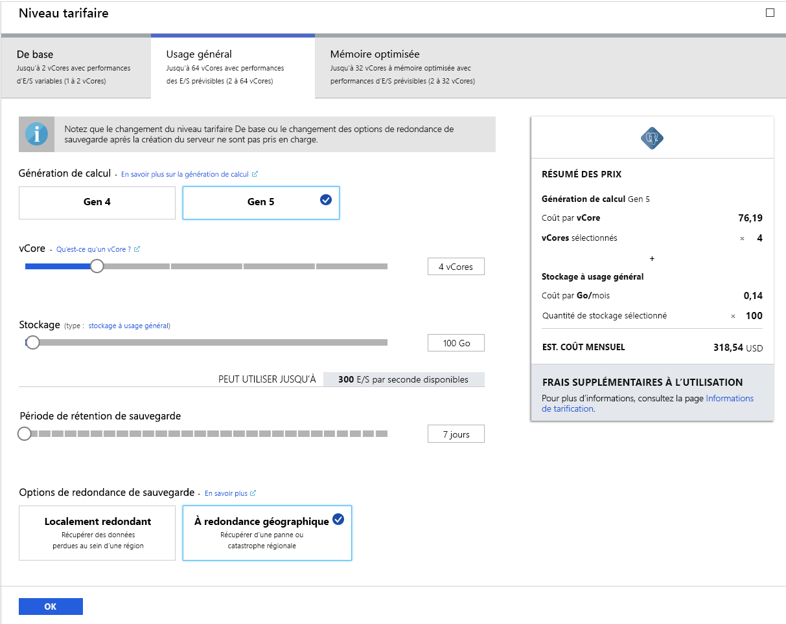
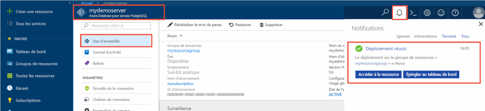

# <a name="tutorial-design-an-azure-database-for-postgresql---single-server-using-the-azure-portal"></a>Tutoriel : Concevoir une base de données Azure pour PostgreSQL (serveur unique) à l’aide du portail Azure

Base de données Azure pour PostgreSQL est un service géré qui vous permet d’exécuter, de gérer et de mettre à l’échelle des bases de données PostgreSQL hautement disponibles dans le cloud. À l’aide du portail Azure, vous pouvez facilement gérer votre serveur et concevoir une base de données.

Ce didacticiel vous montre comment utiliser le portail Azure pour :
> [!div class="checklist"]
> * Créer un serveur Azure Database pour PostgreSQL
> * Configurer le pare-feu du serveur
> * Utiliser l’utilitaire [**psql**](https://www.postgresql.org/docs/9.6/static/app-psql.html) pour créer une base de données
> * Charger un exemple de données
> * Interroger des données
> * Mettre à jour des données
> * Restaurer des données

## <a name="prerequisites"></a>Prérequis
Si vous n’avez pas d’abonnement Azure, créez un compte [gratuit](https://azure.microsoft.com/free/) avant de commencer.

## <a name="create-an-azure-database-for-postgresql"></a>Créer une base de données Azure pour PostgreSQL

Un serveur de base de données Azure pour PostgreSQL est créé. Il contient un ensemble défini de [ressources de calcul et de stockage](./concepts-compute-unit-and-storage.md). Ce serveur est créé dans un [groupe de ressources Azure](../azure-resource-manager/management/overview.md).

Pour créer un serveur de base de données Azure pour PostgreSQL, suivez les étapes ci-après :
1. Cliquez sur **Créer une ressource** en haut à gauche du portail Azure.
2. Sélectionnez **Bases de données** dans la page **Nouveau**, puis **Base de données Azure pour PostgreSQL** dans la page **Bases de données**.
   

3. Sélectionnez l’option de déploiement **Serveur unique**.

   

4. Remplissez le formulaire **Informations de base** avec les informations suivantes :

    

    Paramètre|Valeur suggérée|Description
    ---|---|---
    Abonnement|Votre nom d’abonnement|L’abonnement Azure que vous souhaitez utiliser pour votre serveur. Si vous avez plusieurs abonnements, sélectionnez l’abonnement dans lequel la ressource est facturée.
    Resource group|*myresourcegroup*| Un nouveau nom de groupe de ressources ou un nom de groupe existant dans votre abonnement.
    Nom du serveur |*mydemoserver*|Un nom unique qui identifie votre serveur Azure Database pour PostgreSQL. Le nom de domaine *postgres.database.azure.com* est ajouté au nom de serveur que vous fournissez. Le serveur ne peut contenir que des lettres minuscules, des chiffres et le caractère de trait d’union (-). Il doit contenir entre 3 et 63 caractères.
    Source de données | *Aucun* | Sélectionnez *Aucun* pour créer un serveur en partant de zéro. (Vous sélectionneriez *Sauvegarde* si vous créiez un serveur à partir d’une sauvegarde géographique d’un serveur Azure Database pour PostgreSQL existant).
    Nom d’utilisateur administrateur |*myadmin*| Votre propre compte de connexion en tant que compte à utiliser lorsque vous vous connectez au serveur. Le nom de connexion de l’administrateur ne doit pas être **azure_superuser**, **azure_pg_admin**, **admin**, **administrator**, **root**, **guest** ou **public**. Il ne peut pas commencer par **pg_** .
    Mot de passe |Votre mot de passe| Un nouveau mot de passe pour le compte Administrateur du serveur. Il doit contenir entre 8 et 128 caractères. Votre mot de passe doit contenir des caractères de trois des catégories suivantes : Lettres majuscules, lettres minuscules, chiffres (0 à 9) et caractères non alphanumériques (!, $, #, %, etc.).
    Emplacement|La région la plus proche de vos utilisateurs| L’emplacement géographique le plus proche de vos utilisateurs.
    Version|La version principale la plus récente| La version principale PostgreSQL la plus récente, sauf si vous avez des exigences précises.
    Calcul + stockage | **Usage général**, **Gen 5**, **2 vCores**, **5 Go**, **7 jours**, **Géoredondant** | Les configurations de calcul, de stockage et de sauvegarde pour votre nouveau serveur. Sélectionnez **Configurer le serveur**. Ensuite, sélectionnez l’onglet **Usage général**. *Gen 5*, *4 vCores*, *100 Go* et *7 jours* sont les valeurs par défaut pour **Génération de calcul**, **vCore**, **Stockage** et la **Période de conservation des sauvegardes**. Vous pouvez laisser ces curseurs en l’état ou les ajuster. Pour activer les sauvegardes de votre serveur dans le stockage géoredondant, sélectionnez **Géographiquement redondant** dans les **Options de redondance de sauvegarde**. Pour enregistrer cette sélection du niveau tarifaire, sélectionnez **OK**. La capture d’écran suivante capture ces sélections.

   > [!NOTE]
   > Choisissez le niveau tarifaire De base si votre charge de travail n’a pas besoin d’une grande capacité de calcul et d’E/S. Notez que les serveurs créés avec le niveau tarifaire De base ne peuvent plus ensuite être mis à l’échelle vers le niveau Usage général ou Mémoire optimisée. Pour plus d’informations, consultez la [page des tarifs](https://azure.microsoft.com/pricing/details/postgresql/).
   > 

    

    > [!TIP]
    > Lorsque la **croissance automatique** est activée, votre serveur augmente le stockage quand vous vous approchez de la limite allouée, sans impacter votre charge de travail.

5. Sélectionnez **Vérifier + créer** pour passer en revue vos sélections. Sélectionnez **Créer** pour approvisionner le serveur. Cette opération peut prendre quelques minutes.

6. Dans la barre d’outils, sélectionnez l’icône **Notifications** (en forme de cloche) pour surveiller le processus de déploiement. Une fois le déploiement terminé, vous pouvez sélectionner **Épingler au tableau de bord**, ce qui crée une vignette pour ce serveur dans votre tableau de bord du portail Azure, en tant que raccourci vers la page **Vue d’ensemble** du serveur. En sélectionnant **Accéder à la ressource**, ouvrez la page **Vue d’ensemble** du serveur.

    
   
   Par défaut, la création d’une base de données **postgres** s’effectue sous votre serveur. La base de données [postgres](https://www.postgresql.org/docs/9.6/static/app-initdb.html) est une base de données par défaut qui est destinée aux utilisateurs, aux utilitaires et aux applications tierces. (L’autre base de données par défaut est **azure_maintenance**. Son rôle consiste à séparer les processus de service administré des actions des utilisateurs. Vous ne pouvez pas accéder à cette base de données.)


## <a name="configure-a-server-level-firewall-rule"></a>Configurer une règle de pare-feu au niveau du serveur

Le service Azure Database pour PostgreSQL utilise un pare-feu au niveau du serveur. Par défaut, ce pare-feu empêche l’ensemble des applications et des outils externes de se connecter au serveur et à toute base de données sur le serveur, sauf si une règle de pare-feu est créée de manière à ouvrir le pare-feu pour une plage d’adresses IP spécifique. 

1. Une fois le déploiement terminé, cliquez sur **Toutes les ressources** dans le menu de gauche et saisissez le nom **mydemoserver** pour rechercher le serveur qui vient d’être créé. Cliquez sur le nom du serveur figurant dans les résultats de la recherche. La page **Présentation** correspondant à votre serveur s’ouvre et propose des options pour poursuivre la configuration de la page.

   

2. Sur la page du serveur, sélectionnez **Sécurité de la connexion**. 

3. Cliquez dans la zone de texte sous **Nom de la règle**, puis ajoutez une nouvelle règle de pare-feu pour spécifier la plage IP pour la connectivité. Entrez votre plage IP. Cliquez sur **Enregistrer**.

   

4. Cliquez sur **Enregistrer**, puis sur **X** pour fermer la page **Sécurité de la connexion**.

   > [!NOTE]
   > Le serveur Azure PostgreSQL communique sur le port 5432. Si vous essayez de vous connecter à partir d’un réseau d’entreprise, le trafic sortant sur le port 5432 peut être bloqué par le pare-feu de votre réseau. Dans ce cas, vous ne pouvez pas vous connecter à votre serveur Azure SQL Database, sauf si votre service informatique ouvre le port 5432.
   >

## <a name="get-the-connection-information"></a>Obtenir les informations de connexion

Lorsque vous avez créé le serveur Azure Database pour PostgreSQL, la base de données **postgres** par défaut a également été créée. Pour vous connecter à votre serveur de base de données, vous devez fournir des informations sur l’hôte et des informations d’identification pour l’accès.

1. Dans le menu de gauche du portail Azure, cliquez sur **Toutes les ressources**, puis recherchez le serveur que vous venez de créer.

   

2. Cliquez sur le nom du serveur **mydemoserver**.

3. Sélectionnez la page **Présentation** du serveur. Prenez note du **nom du serveur** et du **nom de connexion d’administrateur du serveur**.

   


## <a name="connect-to-postgresql-database-using-psql"></a>Se connecter à la base de données PostgreSQL avec psql
Si PostgreSQL est installé sur votre ordinateur client, vous pouvez utiliser une instance locale de [psql](https://www.postgresql.org/docs/9.6/static/app-psql.html) ou la console Azure Cloud pour vous connecter à un serveur Azure PostgreSQL. Nous allons maintenant utiliser l’utilitaire de ligne de commande psql pour nous connecter au serveur de base de données Azure pour PostgreSQL.

1. Exécutez la commande psql suivante pour vous connecter à une base de données Azure Database pour PostgreSQL :
   ```
   psql --host=<servername> --port=<port> --username=<user@servername> --dbname=<dbname>
   ```

   Par exemple, la commande suivante se connecte à la base de données par défaut appelée **postgres** sur votre serveur PostgreSQL **mydemoserver.postgres.database.azure.com** à l’aide des informations d’identification d’accès. Saisissez le `<server_admin_password>` que vous avez choisi à l’invite de mot de passe.
  
   ```
   psql --host=mydemoserver.postgres.database.azure.com --port=5432 --username=myadmin@mydemoserver --dbname=postgres
   ```

   > [!TIP]
   > Si vous préférez utiliser un chemin d’URL pour vous connecter à Postgres, encodez par URL le signe @ dans le nom d’utilisateur avec `%40`. La chaîne de connexion pour psql serait, par exemple,
   > ```
   > psql postgresql://myadmin%40mydemoserver@mydemoserver.postgres.database.azure.com:5432/postgres
   > ```

2. Une fois que vous êtes connecté au serveur, créez une base de données vide à l’invite :
   ```sql
   CREATE DATABASE mypgsqldb;
   ```

3. À l’invite, exécutez la commande suivante pour basculer la connexion sur la base de données **mypgsqldb** nouvellement créée :
   ```sql
   \c mypgsqldb
   ```

## <a name="create-tables-in-the-database"></a>Créer des tables dans la base de données
Maintenant que vous savez comment vous connecter à la base de données Azure Database pour PostgreSQL, vous pouvez effectuer certaines tâches de base :

Tout d’abord, créez une table et chargez-y des données. Nous allons créer une table qui assure le suivi des informations d’inventaire en utilisant ce code SQL :
```sql
CREATE TABLE inventory (
    id serial PRIMARY KEY, 
    name VARCHAR(50), 
    quantity INTEGER
);
```

Vous pouvez localiser cette nouvelle table dans la liste des tables en tapant :
```sql
\dt
```

## <a name="load-data-into-the-tables"></a>Charger des données dans les tables
Maintenant que vous disposez d’une table, insérez-y des données. Dans la fenêtre d’invite de commandes ouverte, exécutez la requête suivante pour insérer des lignes de données.
```sql
INSERT INTO inventory (id, name, quantity) VALUES (1, 'banana', 150); 
INSERT INTO inventory (id, name, quantity) VALUES (2, 'orange', 154);
```

La table d’inventaire que vous avez créée précédemment contient maintenant deux lignes d’exemples de données.

## <a name="query-and-update-the-data-in-the-tables"></a>Interroger et mettre à jour les données des tables
Exécutez la requête suivante pour récupérer des informations à partir de la table de base de données d’inventaire. 
```sql
SELECT * FROM inventory;
```

Vous pouvez également mettre à jour les données de la table.
```sql
UPDATE inventory SET quantity = 200 WHERE name = 'banana';
```

Vous pouvez voir les valeurs mises à jour quand vous récupérez les données.
```sql
SELECT * FROM inventory;
```

## <a name="restore-data-to-a-previous-point-in-time"></a>Restaurer les données à un point antérieur dans le temps
Imaginez que vous avez supprimé cette table par erreur. La récupération dans ce cas n’est pas simple. Azure Database pour PostgreSQL vous permet de revenir à n’importe quel point dans le temps pour lequel votre serveur possède des sauvegardes (selon la période de rétention de sauvegarde que vous avez configuré) et de restaurer ce point dans le temps vers un nouveau serveur. Vous pouvez alors utiliser ce nouveau serveur pour récupérer les données supprimées. Les étapes suivantes permettent de restaurer le serveur **mydemoserver** à un point dans le temps antérieur à l’ajout de la table.

1. Dans la page **Vue d’ensemble** d’Azure Database pour PostgreSQL pour votre serveur, cliquez sur **Restaurer** dans la barre d’outils. La page **Restauration** s’ouvre.

   

2. Remplissez le formulaire **Restaurer** avec les informations requises :

   

   - **Point de restauration** : sélectionnez un point dans le temps avant la modification du serveur
   - **Serveur cible** : indiquez le nom du nouveau serveur sur lequel vous souhaitez effectuer la restauration
   - **Emplacement** : vous ne pouvez pas sélectionner la région. Par défaut, elle est identique à celle du serveur source
   - **Niveau tarifaire** : vous ne pouvez pas changer cette valeur lors de la restauration d’un serveur. Elle est identique à celle du serveur source. 
3. Cliquez sur **OK** pour [restaurer le serveur à un point dans le temps](./howto-restore-server-portal.md) antérieur à la suppression de la table. La restauration d’un serveur à un autre point dans le temps crée un serveur en double par rapport au serveur d’origine en date du point dans le temps que vous spécifiez, à condition qu’il se trouve dans la période de rétention de votre [niveau tarifaire](./concepts-pricing-tiers.md).

## <a name="next-steps"></a>Étapes suivantes
Ce didacticiel vous montre comment utiliser le portail Azure et d’autres utilitaires pour :
> [!div class="checklist"]
> * Créer un serveur Azure Database pour PostgreSQL
> * Configurer le pare-feu du serveur
> * Utiliser l’utilitaire [**psql**](https://www.postgresql.org/docs/9.6/static/app-psql.html) pour créer une base de données
> * Charger un exemple de données
> * Interroger des données
> * Mettre à jour des données
> * Restaurer des données

Ensuite, suivez ce tutoriel afin d’apprendre à utiliser Azure CLI pour effectuer des tâches similaires : [Concevoir votre première base de données Azure Database pour PostgreSQL à l’aide d’Azure CLI](tutorial-design-database-using-azure-cli.md)
