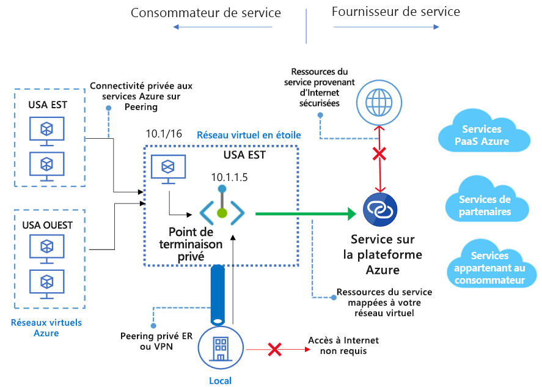

# Qu’est-ce que Liaison privée Azure ? 
Azure Private Link vous permet d’accéder aux services Azure PaaS (par exemple Stockage Azure et SQL Database) ainsi qu’aux services de partenaires ou de clients hébergés par Azure sur un [point de terminaison privé](private-endpoint-overview.md) dans votre réseau virtuel.

Le trafic entre votre réseau virtuel et le service transite par le réseau principal de Microsoft. L’exposition de votre service à l’Internet public n’est plus nécessaire. Vous pouvez créer votre propre [service de liaison privée](private-link-service-overview.md) dans votre réseau virtuel et le distribuer à vos clients. La configuration et la consommation à l’aide d’Azure Private Link est cohérente entre le service Azure PaaS, les services appartenant au client et les services de partenaires partagés.

> [!IMPORTANT]
> Azure Private Link est maintenant en disponibilité générale. Le point de terminaison privé et le service Private Link (service derrière l’équilibreur de charge standard) sont tous les deux en disponibilité générale. Différentes versions d’Azure PaaS seront intégrées à Azure Private Link à différentes échéances. Vérifiez la section [Disponibilité](https://docs.microsoft.com/azure/private-link/private-link-overview#availability) ci-dessous pour connaître l’état précis d’Azure PaaS sur Private Link. Pour en savoir plus sur les limitations connues, consultez [Point de terminaison privé](private-endpoint-overview.md#limitations) et [Service Liaison privée](private-link-service-overview.md#limitations). 

## Principaux avantages
Le service Liaison privée Azure offre les avantages suivants :  
- **Accès en privé aux services sur la plateforme Azure** : Connectez votre réseau virtuel à des services dans Azure sans adresse IP publique au niveau de la source ou de la destination. Les fournisseurs de services peuvent afficher leurs services dans leur propre réseau virtuel et les consommateurs peuvent accéder à ces services dans leur réseau virtuel local. La plateforme Liaison privée gère la connectivité entre le consommateur et les services sur le réseau principal Azure. 
 
- **Réseaux locaux et appairés** : Accédez aux services s’exécutant dans Azure en local par le biais du peering privé ExpressRoute, de tunnels VPN et de réseaux virtuels appairés à l’aide de points de terminaison privés. Il n’est pas nécessaire de configurer le peering public ni de transiter par Internet pour atteindre le service. Private Link offre un moyen sécurisé de migrer des charges de travail vers Azure.
 
- **Protection contre la fuite de données** : Un point de terminaison privé est mappé à une instance d’une ressource PaaS plutôt qu’au service entier. Les consommateurs peuvent se connecter uniquement à la ressource spécifique. L’accès à toute autre ressource du service est bloqué. Ce mécanisme offre une protection contre les risques de fuite de données. 
 
- **Global Reach** : Connectez-vous en privé à des services s’exécutant dans d’autres régions. Le réseau virtuel du consommateur peut se trouver dans la région A et se connecter aux services qui se trouvent derrière Private Link dans la région B.  
 
- **Extension à vos propres services** : Activez les mêmes expériences et fonctionnalités pour afficher votre service en privé aux consommateurs dans Azure. En plaçant votre service derrière une instance Azure Load Balancer standard, vous pouvez l’activer pour Private Link. Le consommateur peut alors se connecter directement à votre service à l’aide d’un point de terminaison privé dans son propre réseau virtuel. Vous pouvez gérer les demandes de connexion à l’aide d’un flux d’appels d’approbation. Azure Private Link fonctionne pour les consommateurs et services appartenant à différents locataires Azure Active Directory. 

## Disponibilité 
 Le tableau suivant liste les services Private Link et les régions où ils sont disponibles. 

|Scénario  |Services pris en charge  |Régions disponibles | Statut  |
|:---------|:-------------------|:-----------------|:--------|
|Liaison privée pour les services appartenant au client |Services Private Link derrière l’instance Azure Load Balancer standard | Toutes les régions publiques  | GA   [En savoir plus](https://docs.microsoft.com/azure/private-link/private-link-service-overview) |
|Liaison privée pour les services PaaS Azure   | Stockage Azure        |  Toutes les régions publiques      | GA   [En savoir plus](/azure/storage/common/storage-private-endpoints)  |
|  | Azure Data Lake Storage Gen2        |  Toutes les régions publiques      | GA   [En savoir plus](/azure/storage/common/storage-private-endpoints)  |
|  |  Azure SQL Database         | Toutes les régions publiques      |   GA   [En savoir plus](https://docs.microsoft.com/azure/sql-database/sql-database-private-endpoint-overview)      |
|  |Azure Synapse Analytics (SQL Data Warehouse)| Toutes les régions publiques |GA   [En savoir plus](https://docs.microsoft.com/azure/sql-database/sql-database-private-endpoint-overview)|
|  |Azure Cosmos DB|  USA EST, USA EST2, USA WEST, USA WEST2, USA CENTRE, USA CENTRE SUD, USA CENTRE-OUEST, USA CENTRE NORD, EUROPE NORD, EUROPE OUEST  |GA   [En savoir plus](https://docs.microsoft.com/azure/cosmos-db/how-to-configure-private-endpoints)|
|  |  Azure Database pour PostgreSQL - Serveur unique         | Toutes les régions publiques      |   GA   [En savoir plus](https://docs.microsoft.com/azure/postgresql/concepts-data-access-and-security-private-link)      |
|  |  Azure Database pour MySQL         | Toutes les régions publiques      |   GA   [En savoir plus](https://docs.microsoft.com/azure/mysql/concepts-data-access-security-private-link)     |
|  |  Azure Database for MariaDB         | Toutes les régions publiques      |   GA   [En savoir plus](https://docs.microsoft.com/azure/mariadb/concepts-data-access-security-private-link)      |
|  |  Azure Key Vault         | Toutes les régions publiques      |   GA     [En savoir plus](https://docs.microsoft.com/azure/key-vault/private-link-service)   |
|  |Azure Kubernetes Service - API Kubernetes | Toutes les régions publiques      |   GA     [En savoir plus](https://docs.microsoft.com/azure/aks/private-clusters)   |
|  |Recherche Azure | USA EST, USA WEST2, USA CENTRE SUD |   PRÉVERSION    |
|  |Azure Container Registry | Toutes les régions publiques      |   PRÉVERSION   |
|  |Azure App Configuration | Toutes les régions publiques      |   PRÉVERSION   |
|  |Sauvegarde Azure | USA EST, USA WEST2, USA CENTRE SUD     |   PRÉVERSION   |
|  |Azure Event Hub | Toutes les régions publiques      |   PRÉVERSION    |
|  |Azure Service Bus | Toutes les régions publiques      |   PRÉVERSION   |
|  |Azure Relay | Toutes les régions publiques      |   PRÉVERSION   |
|  |Azure Event Grid| Toutes les régions publiques      |   PRÉVERSION     [En savoir plus](https://docs.microsoft.com/azure/event-grid/network-security)   |
|  |Azure Web Apps | USA EST, USA WEST2, USA CENTRE SUD      |   PRÉVERSION     [En savoir plus](https://docs.microsoft.com/azure/app-service/networking/private-endpoint)   |

Pour obtenir les notifications les plus récentes, consultez la [page relative aux mises à jour du réseau virtuel Azure](https://azure.microsoft.com/updates/?product=virtual-network).

## Enregistrement et surveillance

Azure Private Link offre une intégration à Azure Monitor. Cette combinaison permet les opérations suivantes :

 - Archive de journaux dans un compte de stockage.
 - Streaming d’événements vers votre hub d’événements.
 - Journalisation d’Azure Monitor.

Vous pouvez accéder aux informations suivantes sur Azure Monitor : 
- **Point de terminaison privé** : 
    - Données traitées par le point de terminaison privé (entrée/sortie)
 
- **Service Liaison privée** :
    - Données traitées par le service Liaison privée (entrée/sortie)
    - Disponibilité du port NAT  
 
## Tarifs   
Pour plus d’informations sur les tarifs, consultez [Tarification Liaison privée Azure](https://azure.microsoft.com/pricing/details/private-link/).
 
## FAQ  
Pour examiner les questions fréquentes, consultez [FAQ sur Liaison privée Azure](private-link-faq.md).
 
## limites  
Pour connaître les limites, consultez [Limites de Liaison privée Azure](../azure-resource-manager/management/azure-subscription-service-limits.md#private-link-limits).

## Contrat de niveau de service
Pour connaître les détails du SLA, consultez [SLA pour Azure Private Link](https://azure.microsoft.com/support/legal/sla/private-link/v1_0/).

## Étapes suivantes

- [Démarrage rapide : Créer un point de terminaison privé au moyen du portail Azure](create-private-endpoint-portal.md)
- [Démarrage rapide : Créer un service Private Link avec le portail Azure](create-private-link-service-portal.md)

 
