# <a name="quickstart-create-a-aspnet-web-app-with-redis-cache"></a>Démarrage rapide : Créer une application web ASP.NET avec le Cache Redis


## <a name="introduction"></a>Introduction

Ce guide de démarrage rapide explique comment créer et déployer une application web ASP.NET vers Azure App Service à l’aide de Visual Studio 2017. L’exemple d’application se connecte à un Cache Redis Azure pour stocker des données et les récupérer à partir du cache. Une fois que vous aurez suivi ce guide de démarrage rapide, vous disposerez d’une application web hébergée dans Azure qui effectue des opérations de lecture et écriture dans un Cache Redis Azure.

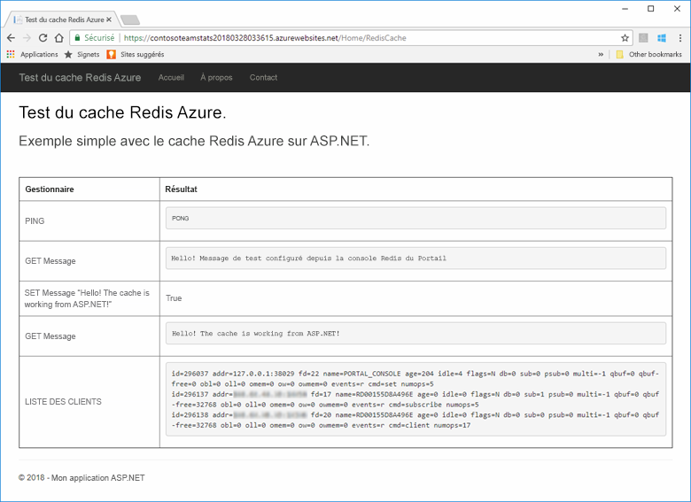

[!INCLUDE [quickstarts-free-trial-note](../../includes/quickstarts-free-trial-note.md)]

## <a name="prerequisites"></a>Prérequis

Pour suivre ce guide de démarrage rapide, vous devez disposer des éléments suivants :

* Installez [Visual Studio 2017](https://www.visualstudio.com/downloads/) avec les charges de travail suivantes :
    * Développement web et ASP.NET
    * Développement Azure

## <a name="create-the-visual-studio-project"></a>Créer le projet Visual Studio

Ouvrez Visual Studio et cliquez sur **Fichier**, **Nouveau**, **Projet**.

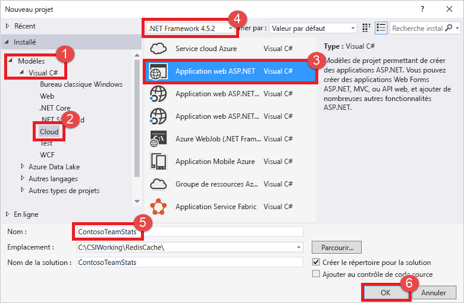

Dans la boîte de dialogue Nouveau projet, procédez comme suit :

1. Dans la liste **Visual C#**, développez le nœud **Modèles**.
1. Sélectionnez **Cloud**.
1. Cliquez sur **Application web ASP.NET**.
1. Sélectionnez **.NET Framework 4.5.2** ou version supérieure.
1. Dans la zone de texte **Nom**, indiquez un nom pour le projet. Pour cet exemple, nous avons utilisé **ContosoTeamStats**.
1. Cliquez sur **OK**.

L’écran Nouvelle application web ASP.NET s’affiche alors :


Sélectionnez le type de projet **MVC** .

Vérifiez que la valeur **Aucune authentification** est spécifiée dans les paramètres **Authentification**. Selon votre version de Visual Studio, la valeur par défaut peut être différente. Pour la modifier, cliquez sur **Modifier l’authentification** et sélectionnez **Aucune authentification**.

Cliquez sur **OK** pour créer le projet.

## <a name="create-a-cache"></a>Création d'un cache

Vous devez maintenant créer le cache pour l’application.

[!INCLUDE [redis-cache-create](../../includes/redis-cache-create.md)]

[!INCLUDE [redis-cache-access-keys](../../includes/redis-cache-access-keys.md)]

Créez un fichier nommé *CacheSecrets.config* sur votre ordinateur, à un emplacement qui ne sera pas archivé avec le code source de votre exemple d’application. Pour ce guide de démarrage rapide, le fichier *CacheSecrets.config* se trouve à l’emplacement suivant : *C:\AppSecrets\CacheSecrets.config*.

Modifiez le fichier *CacheSecrets.config* et ajoutez le contenu suivant :

```xml
<appSettings>
    <add key="CacheConnection" value="<cache-name>.redis.cache.windows.net,abortConnect=false,ssl=true,password=<access-key>"/>
</appSettings>
```

Remplacez `<cache-name>` par le nom d’hôte de votre cache.

Remplacez `<access-key>` par la clé primaire de votre cache.

> [!TIP]
> La clé d’accès secondaire est utilisée en tant que clé de remplacement lors de la rotation des clés pendant que vous régénérez la clé d’accès primaire.
>

Enregistrez le fichier .

## <a name="update-the-mvc-application"></a>Mettre à jour l’application MVC

Dans cette section, vous allez mettre à jour l’application pour prendre en charge une nouvelle vue qui affichera un test simple avec un Cache Redis Azure.

* [Mettre à jour le fichier web.config avec un paramètre d’application pour le cache](#Update-the-webconfig-file-with-an-app-setting-for-the-cache)
* [Configurer l’application pour utiliser le client StackExchange.Redis](#configure-the-application-to-use-stackexchangeredis)
* [Mettre à jour les fichiers HomeController et Layout](#update-the-homecontroller-and-layout)
* [Ajouter une nouvelle vue RedisCache](#add-a-new-rediscache-view)

### <a name="update-the-webconfig-file-with-an-app-setting-for-the-cache"></a>Mettre à jour le fichier web.config avec un paramètre d’application pour le cache

Quand vous exécutez l’application localement, les informations stockées dans le fichier *CacheSecrets.config* sont utilisées pour la connexion à votre instance de Cache Redis Azure. Vous déploierez cette application vers Azure ultérieurement. À ce moment-là, vous configurerez dans Azure un paramètre d’application que l’application utilisera pour récupérer les informations de connexion au cache au lieu de ce fichier. Étant donné que le fichier *CacheSecrets.config* n’est pas déployé vers Azure avec votre application, il sert uniquement pour les tests de l’application en local. Sécurisez ces informations au maximum pour empêcher tout accès malveillant aux données de votre cache.

Dans l’**Explorateur de solutions**, double-cliquez sur le fichier *web.config* pour l’ouvrir.

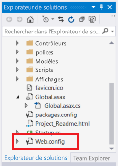

Dans le fichier *web.config*, recherchez l’élément `<appSetting>` et ajoutez l’attribut `file` suivant. Si vous avez utilisé un autre nom de fichier ou un autre emplacement, remplacez ces valeurs pour celles indiquées dans l’exemple.

* Avant : `<appSettings>`
* Après : ` <appSettings file="C:\AppSecrets\CacheSecrets.config">`

Le runtime ASP.NET fusionne le contenu du fichier externe avec le balisage dans l’élément `<appSettings>`. Le runtime ignore l’attribut de fichier si le fichier spécifié est introuvable. Vos secrets (la chaîne de connexion à votre cache) ne sont pas inclus dans le code source de l’application. Quand vous déployez votre application web vers Azure, le fichier *CacheSecrests.config* n’est pas déployé.

### <a name="configure-the-application-to-use-stackexchangeredis"></a>Configurer l’application pour utiliser StackExchange.Redis

Pour configurer l’application de sorte qu’elle utilise le package NuGet [StackExchange.Redis](https://github.com/StackExchange/StackExchange.Redis) pour Visual Studio, cliquez sur **Outils > Gestionnaire de package NuGet > Console du Gestionnaire de package**.

Exécutez la commande suivante depuis la fenêtre `Package Manager Console` :

```powershell
Install-Package StackExchange.Redis
```

Le package NuGet télécharge et ajoute les références d'assembly nécessaires pour que votre application cliente puisse accéder à Cache Redis Azure avec le client du cache StackExchange.Redis. Si vous préférez utiliser une version avec nom fort de la bibliothèque du client `StackExchange.Redis`, installez le package `StackExchange.Redis.StrongName`.

### <a name="update-the-homecontroller-and-layout"></a>Mettre à jour les fichiers HomeController et Layout

Dans l’**Explorateur de solutions**, développez le dossier **Contrôleurs** et ouvrez le fichier *HomeController.cs*.

Ajoutez les deux instructions `using` suivantes en haut du fichier pour prendre en charge le client de cache et les paramètres d’application.

```csharp
using System.Configuration;
using StackExchange.Redis;
```

Ajoutez la méthode suivante à la classe `HomeController` pour prendre en charge une nouvelle action `RedisCache` qui exécute certaines commandes sur le nouveau cache.

```csharp
    public ActionResult RedisCache()
    {
        ViewBag.Message = "A simple example with Azure Redis Cache on ASP.NET.";

        var lazyConnection = new Lazy<ConnectionMultiplexer>(() =>
        {
            string cacheConnection = ConfigurationManager.AppSettings["CacheConnection"].ToString();
            return ConnectionMultiplexer.Connect(cacheConnection);
        });

        // Connection refers to a property that returns a ConnectionMultiplexer
        // as shown in the previous example.
        IDatabase cache = lazyConnection.Value.GetDatabase();

        // Perform cache operations using the cache object...

        // Simple PING command
        ViewBag.command1 = "PING";
        ViewBag.command1Result = cache.Execute(ViewBag.command1).ToString();

        // Simple get and put of integral data types into the cache
        ViewBag.command2 = "GET Message";
        ViewBag.command2Result = cache.StringGet("Message").ToString();

        ViewBag.command3 = "SET Message \"Hello! The cache is working from ASP.NET!\"";
        ViewBag.command3Result = cache.StringSet("Message", "Hello! The cache is working from ASP.NET!").ToString();

        // Demostrate "SET Message" executed as expected...
        ViewBag.command4 = "GET Message";
        ViewBag.command4Result = cache.StringGet("Message").ToString();

        // Get the client list, useful to see if connection list is growing...
        ViewBag.command5 = "CLIENT LIST";
        ViewBag.command5Result = cache.Execute("CLIENT", "LIST").ToString().Replace(" id=", "\rid=");

        lazyConnection.Value.Dispose();

        return View();
    }
```

Dans l’**Explorateur de solutions**, développez le dossier **Views**>**Shared** et ouvrez le fichier *_Layout.cshtml*.

Remplacez :

```csharp
@Html.ActionLink("Application name", "Index", "Home", new { area = "" }, new { @class = "navbar-brand" })
```

Par :

```csharp
@Html.ActionLink("Azure Redis Cache Test", "RedisCache", "Home", new { area = "" }, new { @class = "navbar-brand" })
```

### <a name="add-a-new-rediscache-view"></a>Ajouter une nouvelle vue RedisCache

Dans l’**Explorateur de solutions**, développez le dossier **Vues** et cliquez avec le bouton droit sur le dossier **Accueil**. Choisissez **Ajouter** > **Vue...**.

Dans la boîte de dialogue Ajouter une vue, entrez **RedisCache** dans le champ Nom de la vue, puis cliquez sur **Ajouter**.

Remplacez le code du fichier *RedisCache.cshtml* par le code suivant :

```csharp
@{
    ViewBag.Title = "Azure Redis Cache Test";
}

<h2>@ViewBag.Title.</h2>
<h3>@ViewBag.Message</h3>
<br /><br />
<table border="1" cellpadding="10">
    <tr>
        <th>Command</th>
        <th>Result</th>
    </tr>
    <tr>
        <td>@ViewBag.command1</td>
        <td><pre>@ViewBag.command1Result</pre></td>
    </tr>
    <tr>
        <td>@ViewBag.command2</td>
        <td><pre>@ViewBag.command2Result</pre></td>
    </tr>
    <tr>
        <td>@ViewBag.command3</td>
        <td><pre>@ViewBag.command3Result</pre></td>
    </tr>
    <tr>
        <td>@ViewBag.command4</td>
        <td><pre>@ViewBag.command4Result</pre></td>
    </tr>
    <tr>
        <td>@ViewBag.command5</td>
        <td><pre>@ViewBag.command5Result</pre></td>
    </tr>
</table>
```

## <a name="run-the-app-locally"></a>Exécutez l’application localement.

Par défaut, le projet est configuré pour héberger l’application localement dans [IIS Express](https://docs.microsoft.com/iis/extensions/introduction-to-iis-express/iis-express-overview) à des fins de test et de débogage.

Dans le menu de Visual Studio, cliquez sur **Déboguer** > **Démarrer le débogage** pour générer et démarrer l’application localement à des fins de test et de débogage.

Dans la barre de navigation du navigateur, cliquez sur **Azure Redis Cache Test** (Test du Cache Redis Azure).

Dans l’exemple ci-dessous, vous pouvez voir que la clé `Message` présentait auparavant une valeur mise en cache, qui avait été définie à l’aide de la console Redis du portail. L’application a mis à jour cette valeur mise en cache. Elle a également exécuté les commandes `PING` et `CLIENT LIST`.

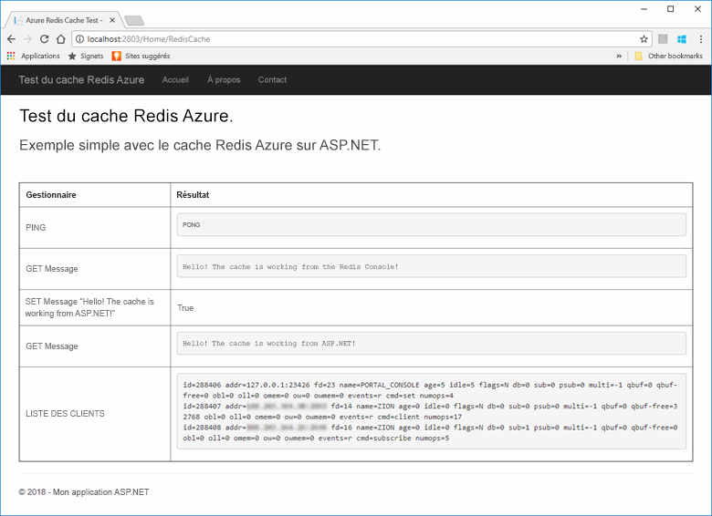

## <a name="publish-and-run-in-azure"></a>Publier et exécuter l’application dans Azure

Une fois que vous avez testé l’application avec succès localement, l’étape suivante consiste à déployer l’application vers Azure et à l’exécuter dans le cloud.

### <a name="publish-the-app-to-azure"></a>Publier l’application dans Azure

Dans l’Explorateur de solutions de Visual Studio, cliquez avec le bouton droit sur le nœud du projet, puis choisissez **Publier**.

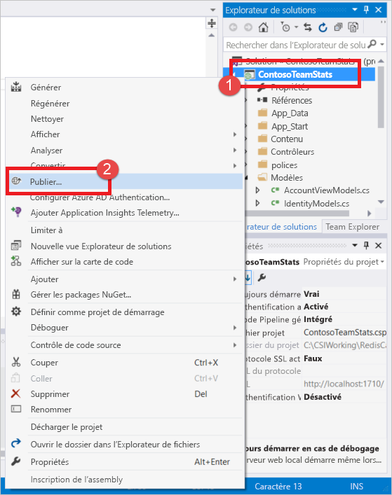

Cliquez sur **Microsoft Azure App Service**, sélectionnez **Créer**, puis cliquez sur **Publier**.

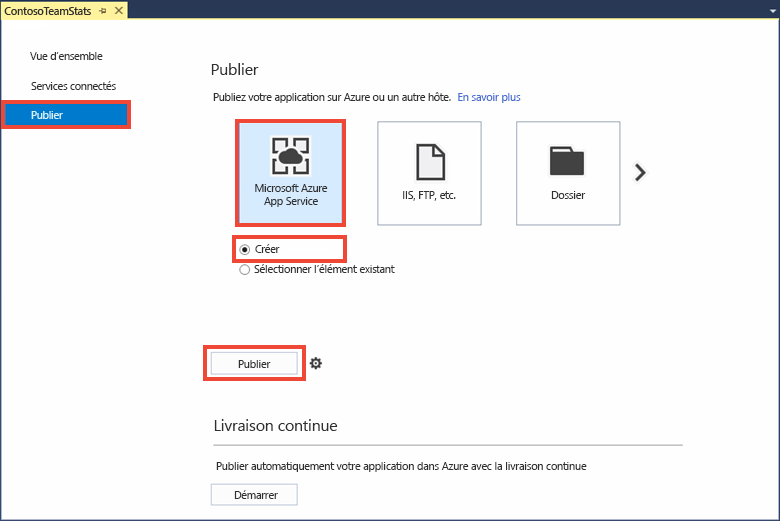

Dans la boîte de dialogue **Créer App Service**, apportez les modifications suivantes :

| Paramètre | Valeur recommandée | Description |
| ------- | :---------------: | ----------- |
| **Nom de l’application** | Utiliser la valeur par défaut | Le nom de l’application sera le nom d’hôte de l’application lors du déploiement vers Azure. Un suffixe d’horodatage peut être ajouté au nom si nécessaire pour le rendre unique. |
| **Abonnement** | Choisir votre abonnement Azure | Tous les frais d’hébergement associés seront facturés sur cet abonnement. Si vous possédez plusieurs abonnements Azure, vérifiez que l’abonnement souhaité est sélectionné.|
| **Groupe de ressources** | Utilisez le groupe de ressources où vous avez créé le cache, par exemple *TestResourceGroup*. | Le groupe de ressources vous permet de gérer toutes les ressources en tant que groupe. Pour supprimer l’application ultérieurement, vous pourrez simplement supprimer le groupe. |
| **Plan App Service** | Cliquez sur **Nouveau** et créez un nouveau plan App Service nommé *TestingPlan*. <br />Utilisez le même **emplacement** que pour la création de votre cache. <br />Pour la taille, choisissez **Gratuit**. | Un plan App Service définit un ensemble de ressources de calcul à utiliser pour l’exécution d’une application web. |

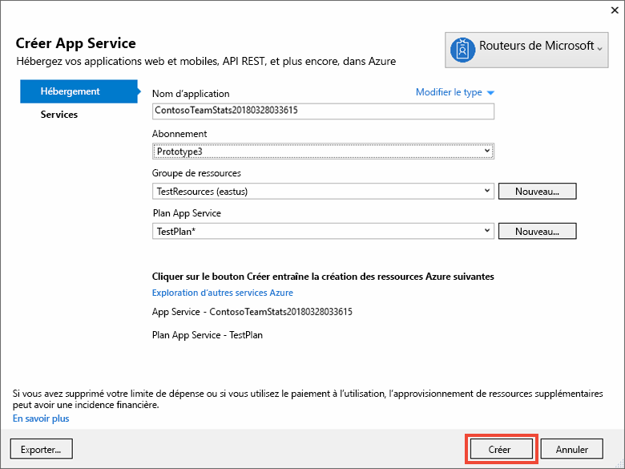

Une fois les paramètres d’hébergement App Service configurés, cliquez sur **Créer** pour créer une nouvelle instance App Service pour votre application.

Surveillez la fenêtre **Sortie** de Visual Studio pour connaître l’état de la publication dans Azure. Une fois la publication terminée avec succès, l’URL de l’instance App Service est consignée comme illustré ci-dessous :

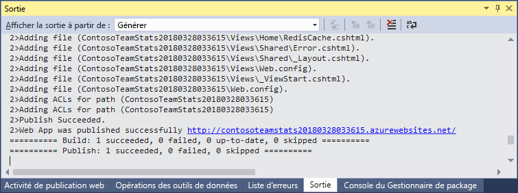

### <a name="add-the-app-setting-for-the-cache"></a>Ajouter le paramètre d’application pour le cache

Une fois la publication terminée pour la nouvelle instance App Service, ajoutez un nouveau paramètre d’application. Ce paramètre sera utilisé pour stocker les informations de connexion au cache. Tapez le nom de l’application dans la barre de recherche en haut du portail Azure pour rechercher la nouvelle instance App Service que vous venez de créer.

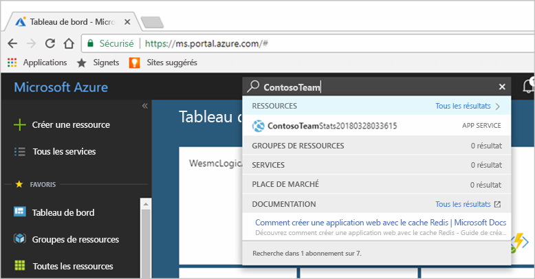

Ajoutez un nouveau paramètre d’application nommé **CacheConnection** qui sera utilisé par l’application pour se connecter au cache. Utilisez la valeur que vous avez configurée pour `CacheConnection` dans votre fichier *CacheSecrets.config*. Cette valeur contient le nom d’hôte et la clé accès du cache.

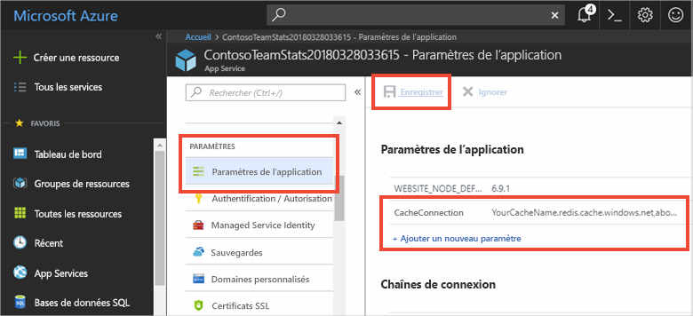

### <a name="run-the-app-in-azure"></a>Exécuter l’application dans Microsoft Azure

Dans votre navigateur, accédez à l’URL de l’instance App Service. Cette URL figure dans les résultats de l’opération de publication, dans la fenêtre Sortie de Visual Studio. Elle est également indiquée dans le portail Azure, dans la page Vue d’ensemble de l’instance App Service que vous avez créée.

Dans la barre de navigation, cliquez sur **Azure Redis Cache Test** (Test du Cache Redis Azure) pour tester l’accès au cache.


## <a name="clean-up-resources"></a>Supprimer des ressources

Si vous envisagez d’exécuter le didacticiel suivant, vous pouvez conserver les ressources créées dans le cadre de ce guide de démarrage rapide afin de les réutiliser.

Sinon, si l’exemple d’application de démarrage rapide était votre dernière opération, vous pouvez supprimer les ressources Azure créées dans ce démarrage rapide afin d’éviter tout frais. 

> [!IMPORTANT]
> La suppression d’un groupe de ressources est définitive ; le groupe de ressources et l’ensemble des ressources qu’il contient sont supprimés de manière permanente. Veillez à ne pas supprimer accidentellement des ressources ou un groupe de ressources incorrects. Si vous avez créé les ressources pour l’hébergement de cet exemple dans un groupe de ressources existant contenant des ressources que vous souhaitez conserver, vous pouvez supprimer chaque ressource individuellement à partir de son panneau respectif, au lieu de supprimer l’intégralité du groupe de ressources.
>

Connectez-vous au [Portail Azure](https://portal.azure.com) et cliquez sur **Groupes de ressources**.

Dans la zone de texte **Filtrer par nom.**, saisissez le nom de votre groupe de ressources. Les instructions de cet article ont utilisé un groupe de ressources nommé *TestResources*. Sur votre groupe de ressources dans la liste des résultats, cliquez sur **...**, puis sur **Supprimer le groupe de ressources**.

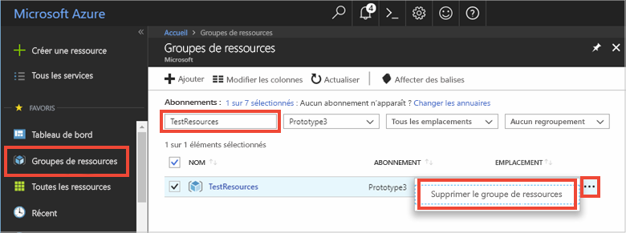

Il vous sera demandé de confirmer la suppression du groupe de ressources. Saisissez le nom de votre groupe de ressources pour confirmer, puis cliquez sur **Supprimer**.

Après quelques instants, le groupe de ressources et toutes les ressources qu’il contient sont supprimés.

## <a name="next-steps"></a>Étapes suivantes

Dans le didacticiel suivant, vous utiliserez le Cache Redis Azure dans un scénario plus concret pour améliorer les performances d’une application. Vous mettrez à jour cette application pour mettre en cache les résultats d’un leaderboard en utilisant le modèle Cache-Aside avec ASP.NET et une base de données.

> [!div class="nextstepaction"]
> [Créer un leaderboard de type Cache-Aside sur ASP.NET](cache-web-app-cache-aside-leaderboard.md)
