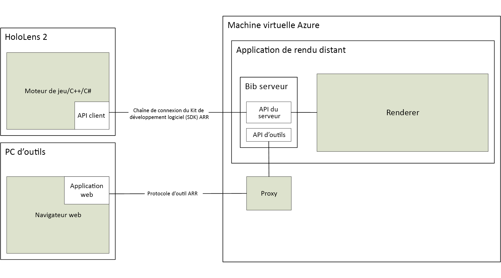

# À propos d’Azure Remote Rendering

*Azure Remote Rendering* (ARR) est un service qui vous permet d’effectuer le rendu de contenu 3D interactif de haute qualité dans le cloud et de le diffuser en temps réel sur des appareils comme HoloLens 2.

Les appareils qui ne sont pas attachés disposent d’une puissance de calcul limitée pour le rendu de modèles complexes. Toutefois, pour de nombreuses applications, il ne serait pas acceptable de réduire la fidélité visuelle de quelque manière que ce soit. La capture d’écran suivante compare le modèle détaillé à un modèle qui a été simplifié à l’aide d’un outil de création de contenu courant :

Le modèle simplifié se compose d’environ 200 000 triangles (parties internes détaillées incluses), alors que le modèle d’origine en comprend plus de 18 millions.

*Remote Rendering* résout ce problème en déplaçant la charge de travail de rendu vers des GPU haut de gamme dans le cloud. Un moteur graphique hébergé dans le cloud effectue le rendu de l’image, l’encode sous forme de flux vidéo et la diffuse en streaming sur l’appareil cible.

## Rendu hybride

Dans la plupart des applications, il n’est pas suffisant de rendre uniquement un modèle complexe. Vous avez également besoin d’une interface utilisateur personnalisée pour fournir des fonctionnalités à l’utilisateur. Azure Remote Rendering ne vous oblige pas à utiliser un framework d’interface utilisateur dédié, mais prend en charge le *rendu hybride*. Ceci signifie que vous pouvez effectuer le rendu des éléments sur l’appareil à l’aide de la méthode de votre choix, par exemple [MRTK](https://microsoft.github.io/MixedRealityToolkit-Unity/Documentation/GettingStartedWithTheMRTK.html).

Quand une image est rendue, Azure Remote Rendering combine automatiquement votre contenu rendu localement avec l’image distante. Il est même en mesure de le faire avec l’occlusion correcte.

## Rendu avec plusieurs GPU

Certains modèles sont trop complexes pour être rendus avec des fréquences d’images interactives, même avec un GPU haut de gamme. Il s’agit d’un problème courant, en particulier dans le domaine de la visualisation industrielle. Pour repousser les limites, Azure Remote Rendering peut distribuer la charge de travail sur plusieurs GPU. Les résultats sont fusionnés au sein d’une seule image, ce qui rend le processus totalement transparent pour l’utilisateur.

## Architecture de haut niveau

Ce schéma illustre l’architecture de rendu distant :

Un cycle complet de génération d’images implique les étapes suivantes :

1. Côté client : configuration des images
    1. Votre code : l’entrée utilisateur est traitée et le graphique de scène est mis à jour.
    1. Code ARR : le graphique de scène est mis à jour et la posture de tête prévue est envoyée au serveur.
1. Côté serveur : rendu à distance
    1. Le moteur de rendu distribue le rendu entre les GPU disponibles.
    1. La sortie des différents GPU est composée en une seule image.
    1. L’image est encodée comme flux vidéo et renvoyée au client.
1. Côté client : finalisation
    1. Votre code : le contenu local facultatif (IU, marqueurs, etc.) est rendu.
    1. Code ARR : sur le moment, le contenu rendu localement est fusionné automatiquement avec le flux vidéo

La latence du réseau représente le problème principal. Le délai entre l’envoi d’une demande et la réception du résultat est généralement trop long pour des fréquences d’images interactives. Il se peut donc que plusieurs images soient en cours de traitement à tout moment.

## Étapes suivantes

* [Configuration système requise](system-requirements.md)
* [Démarrage rapide : Afficher un modèle avec Unity](../quickstarts/render-model.md)
