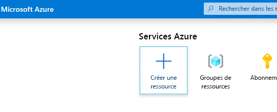
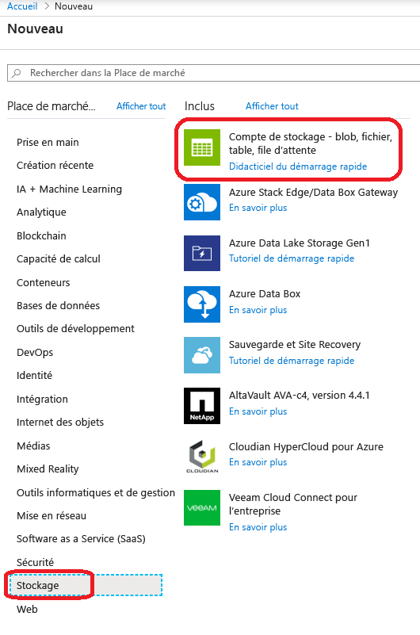
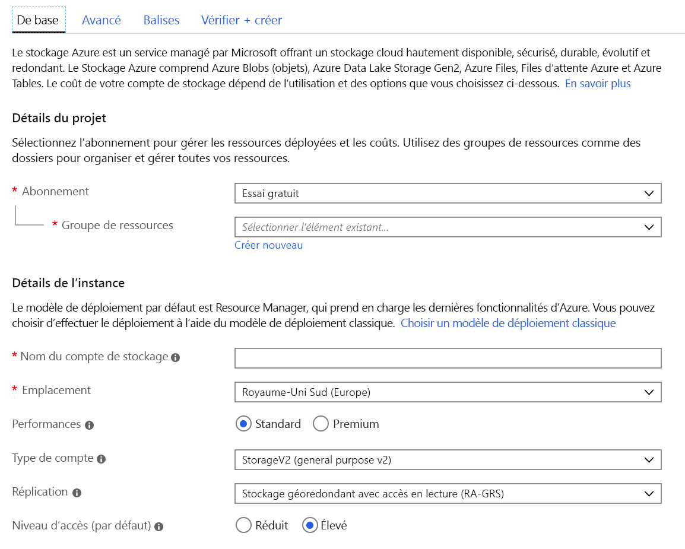
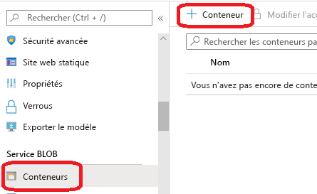
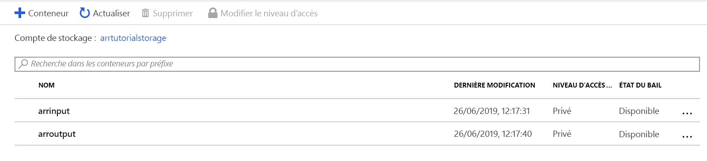
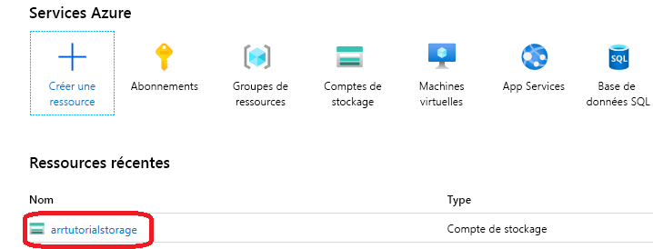
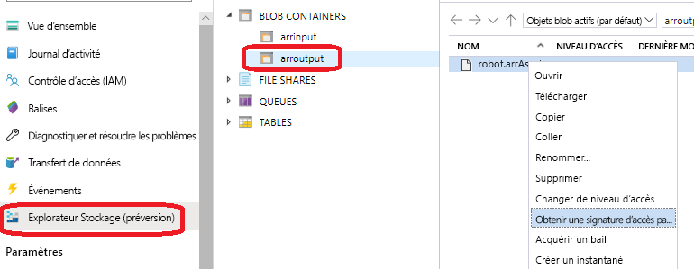

# <a name="quickstart-convert-a-model-for-rendering"></a>Démarrage rapide : Convertir un modèle pour le rendu

Dans [Démarrage rapide : Afficher un modèle avec Unity](render-model.md), vous avez appris à utiliser l’exemple de projet Unity pour effectuer le rendu d’un modèle intégré. Ce guide montre comment convertir vos propres modèles.

Vous découvrirez comment effectuer les actions suivantes :

> [!div class="checklist"]
>
> * Configurer un compte de stockage Blob Azure pour l’entrée et la sortie
> * Charger et convertir un modèle 3D à utiliser avec Azure Remote Rendering
> * Inclure le modèle 3D converti dans une application pour le rendu

## <a name="prerequisites"></a>Prérequis

* Effectuer l’étape [Démarrage rapide : Afficher un modèle avec Unity](render-model.md)
* Installer Azure PowerShell ([documentation](https://docs.microsoft.com/powershell/azure/))
  * Ouvrir PowerShell avec des droits d’administrateur
  * Exécutez l’instruction suivante : `Install-Module -Name Az -AllowClobber`

## <a name="overview"></a>Vue d’ensemble

Le renderer sur le serveur ne peut pas fonctionner directement avec des formats de modèle sources tels que FBX ou GLTF. En fait, le modèle doit être dans un format binaire propriétaire.
Le service de conversion consomme les modèles du stockage Blob Azure et réécrit les modèles convertis dans un conteneur de stockage Blob Azure fourni.

Ce dont vous avez besoin :

* Abonnement Azure
* Un compte « StorageV2 » dans votre abonnement
* Un conteneur de stockage Blob pour le modèle d’entrée
* Un conteneur de stockage Blob pour les données de sortie
* Un modèle à convertir (consultez les [exemples de modèles](../samples/sample-model.md))
  * Consultez la liste des [formats sources pris en charge](../how-tos/conversion/model-conversion.md#supported-source-formats).
  * Pour utiliser l’exemple de script de conversion, veillez à préparer un dossier d’entrée contenant le modèle et toutes les dépendances externes (telles que la géométrie ou les textures externes).

## <a name="azure-setup"></a>Configuration Azure

Si vous n’avez pas encore de compte, accédez à [https://azure.microsoft.com/get-started/](https://azure.microsoft.com/get-started/), cliquez sur l’option Compte gratuit, puis suivez les instructions.

Quand vous disposez d’un compte Azure, accédez à [https://ms.portal.azure.com/#home](https://ms.portal.azure.com/#home).

### <a name="storage-account-creation"></a>Création de compte de stockage

Pour créer un stockage Blob, il vous faut d’abord un compte de stockage.
Pour en créer un, cliquez sur le bouton « Créer une ressource » :



Dans le nouvel écran, choisissez **Stockage** sur le côté gauche, puis **Compte de stockage - blob, fichier, table, file d’attente** dans la colonne suivante :



Quand vous cliquez sur ce bouton, l’écran suivant s’affiche avec les propriétés de stockage à renseigner :



Remplissez le formulaire de la manière suivante :

* Créez un groupe de ressources à partir du lien situé sous la zone de liste déroulante et nommez-le **ARR_Tutorial**.
* Sous **Nom du groupe de stockage**, entrez un nom unique. **Ce nom doit être globalement unique**. Sinon, une invite vous informe qu’il est déjà pris. Dans le cadre de ce guide de démarrage rapide, nous le nommons **arrtutorialstorage**. Chaque occurrence de ce nom dans ce guide de démarrage rapide doit donc être remplacée par le nom de votre propre compte.
* Sélectionnez un **emplacement** proche de vous. Dans l’idéal, utilisez le même emplacement que celui utilisé pour la configuration du rendu dans l’autre guide de démarrage rapide.
* **Performances** défini sur Standard
* **Type de compte** défini sur StorageV2 (v2 universel)
* **Réplication** défini sur Stockage géo-redondant avec accès en lecture (RA-GRS)
* **Niveau d’accès** défini sur Chaud

Aucune des propriétés des autres onglets ne doit être modifiée. Vous pouvez donc poursuivre en sélectionnant **Vérifier + Créer**, puis suivre les étapes nécessaires pour terminer la configuration.

Le site web vous informe de la progression de votre déploiement. À la fin, il affiche le message « Votre déploiement a été effectué ». Cliquez sur le bouton **Accéder à la ressource** pour poursuivre la procédure :


### <a name="blob-storage-creation"></a>Création d’un stockage Blob

Nous avons à présent besoin de deux conteneurs d’objets Blob : un pour l’entrée et un pour la sortie.

Le bouton **Accéder à la ressource** ci-dessus vous permet d’accéder à une page comprenant, à gauche, un menu sous forme de liste. Dans cette liste, sous la catégorie **Service Blob**, cliquez sur le bouton **Conteneurs** :



Sélectionnez le bouton **+ Conteneur** pour créer le conteneur de stockage Blob d’**entrée**.
Utilisez les paramètres suivants pour la création du conteneur :
  
* Nom = arrinput
* Niveau d’accès public = Privé

Après la création du conteneur, cliquez à nouveau sur **+ Conteneur** et utilisez les mêmes paramètres pour le conteneur de **sortie** :

* Nom = arroutput
* Niveau d’accès public = Privé

Vous devez maintenant disposer de deux conteneurs de stockage Blob :



## <a name="run-the-conversion"></a>Exécuter la conversion

Nous fournissons un script utilitaire pour faciliter l’appel du service de conversion de ressource. Il se trouve dans le dossier *Scripts* et se nomme **Conversion.ps1**.

Ce script effectue notamment les tâches suivantes :

1. Il charge tous les fichiers d’un répertoire donné du disque local vers le conteneur de stockage d’entrée.
1. Il appelle l’[API REST de conversion de ressource](../how-tos/conversion/conversion-rest-api.md), qui récupère les données à partir du conteneur de stockage d’entrée et démarre une conversion qui retourne un ID de conversion.
1. Il interroge l’API d’état de conversion avec l’ID de conversion récupéré jusqu’à ce que le processus de conversion se termine (avec succès ou non).
1. Il récupère un lien vers la ressource convertie dans le stockage de sortie.

Le script lit sa configuration à partir du fichier *Scripts\arrconfig.json*. Ouvrez ce fichier JSON dans un éditeur de texte.

```json
{
    "accountSettings": {
        "arrAccountId": "8*******-****-****-****-*********d7e",
        "arrAccountKey": "R***************************************l04=",
        "region": "<your-region>"
    },
    "renderingSessionSettings": {
        "vmSize": "standard",
        "maxLeaseTime": "1:00:00"
    },
    "assetConversionSettings": {
        "localAssetDirectoryPath": "D:\\tmp\\robot",
        "resourceGroup": "ARR_Tutorial",
        "storageAccountName": "arrexamplestorage",
        "blobInputContainerName": "arrinput",
        "inputFolderPath": "robotConversion",
        "inputAssetPath": "robot.fbx",
        "blobOutputContainerName": "arroutput",
        "outputFolderPath":"converted/robot",
        "outputAssetFileName": "robot.arrAsset"
    }
}
```

Vous devez renseigner la configuration dans le groupe **accountSettings** (clé et ID de compte) comme décrit dans le guide de démarrage rapide [Afficher un modèle avec Unity](render-model.md) pour les informations d’identification.

Dans le groupe **assetConversionSettings**, veillez à modifier **resourceGroup**, **blobInputContainerName** et **blobOutputContainerName** comme indiqué précédemment.
Notez que la valeur **arrtutorialstorage** doit être remplacée par le nom unique que vous avez choisi quand vous avez créé le compte de stockage.

Modifiez **localAssetDirectoryPath** pour qu’il pointe vers le répertoire de votre disque contenant le modèle que vous souhaitez convertir. Veillez à utiliser correctement les barres obliques inverses d’échappement (« \\ ») dans le chemin : utilisez des barres obliques inverses doubles (« \\\\ »).

Toutes les données sous le chemin **localAssetDirectoryPath** seront chargées vers le conteneur d’objets Blob **blobInputContainerName** sous le sous-chemin **inputFolderPath**. Ainsi, dans l’exemple de configuration ci-dessus, le contenu du répertoire « D:\\tmp\\robot » est chargé dans le conteneur d’objets Blob « arrinput » du compte de stockage « arrtutorialstorage » sous le chemin « robotConversion ». Les fichiers existants sont remplacés.

Définissez **inputAssetPath** sur le chemin du modèle à convertir (chemin relatif à localAssetDirectoryPath). Utilisez « / » comme séparateur de chemin au lieu de « \\ ». Ainsi, pour un fichier « robot.fbx » situé directement dans « D:\\tmp\\robot », utilisez « robot.fbx ».

Quand le modèle est converti, il est réécrit dans le conteneur de stockage **blobOutputContainerName**. Vous pouvez spécifier un sous-chemin en définissant **outputFolderPath** si vous le souhaitez. Dans l’exemple ci-dessus, le fichier « robot.arrAsset » obtenu est copié dans le conteneur d’objets Blob de sortie sous « converted/robot ».

Le paramètre de configuration **outputAssetFileName** détermine le nom de la ressource convertie. Ce paramètre est facultatif. S’il n’est pas défini, le nom du fichier de sortie est déduit du nom du fichier d’entrée.

Ouvrez PowerShell. Assurez-vous que vous avez installé *Azure PowerShell* comme indiqué dans les [prérequis](#prerequisites). Ensuite, connectez-vous à votre abonnement avec la commande suivante et suivez les instructions à l’écran :

```PowerShell
Connect-AzAccount
```

> [!NOTE]
> Si votre organisation a plusieurs abonnements, vous devrez peut-être spécifier les arguments SubscriptionId et Tenant. Pour plus d’informations, consultez la [documentation sur Connect-AzAccount](https://docs.microsoft.com/powershell/module/az.accounts/connect-azaccount).

Placez-vous dans le répertoire `azure-remote-rendering\Scripts` et exécutez le script de conversion :

```PowerShell
.\Conversion.ps1 -UseContainerSas
```

Le résultat suivant devrait s'afficher : 

## <a name="insert-new-model-into-quickstart-sample-app"></a>Insérer un nouveau modèle dans l’exemple d’application de démarrage rapide

Le script de conversion génère un URI de *signature d’accès partagé (SAS)* pour le modèle converti. Vous pouvez maintenant copier cet URI comme **Nom de modèle** dans l’exemple d’application de démarrage rapide (consultez [Démarrage rapide : Afficher un modèle avec Unity](render-model.md)).


 L’exemple doit maintenant charger et effectuer le rendu de votre modèle personnalisé.

## <a name="optional-re-creating-a-sas-uri"></a>Facultatif : Recréation d’un URI SAS

L’URI SAS créé par le script de conversion sera valide pendant 24 heures uniquement. Toutefois, après son expiration, vous n’avez pas besoin de reconvertir votre modèle. En fait, vous pouvez créer une nouvelle SAS dans le portail comme décrit dans les étapes suivantes :

1. Accédez au [Portail Azure](https://www.portal.azure.com).
1. Cliquez sur votre ressource **Compte de stockage** : 
1. Dans l’écran suivant, cliquez sur **Explorateur de stockage** dans le panneau de gauche et recherchez votre modèle de sortie (fichier *.arrAsset*) dans le conteneur de stockage Blob *arroutput*. Cliquez sur le fichier avec le bouton droit, puis sélectionnez **Obtenir la signature d’accès partagé** dans le menu contextuel : 
1. Un nouvel écran s’ouvre. Vous pouvez y sélectionner une date d’expiration. Sélectionnez **Créer**, puis copiez l’URI affiché dans la boîte de dialogue suivante. Ce nouvel URI remplace l’URI temporaire créé par le script.

## <a name="next-steps"></a>Étapes suivantes

Vous connaissez maintenant les principes de base. À présent, consultez nos tutoriels pour approfondir vos connaissances.

Pour obtenir des informations détaillées sur la conversion de modèle, consultez l’article sur l’[API REST de conversion de modèle](../how-tos/conversion/conversion-rest-api.md).

> [!div class="nextstepaction"]
> [Tutoriel : Affichage de modèles rendus à distance](../tutorials/unity/view-remote-models/view-remote-models.md)
