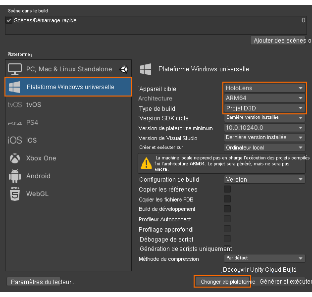

# Démarrage rapide : Déployer l’exemple Unity sur HoloLens

Ce guide de démarrage rapide explique comment déployer et exécuter l’exemple d’application de démarrage rapide pour Unity sur un appareil HoloLens 2.

Dans ce guide de démarrage rapide, vous allez apprendre à :

> [!div class="checklist"]
>
>* Générer l’exemple d’application de démarrage rapide pour HoloLens
>* Déployer l’exemple sur l’appareil
>* Exécuter l’exemple sur l’appareil

## Prérequis

Dans ce guide de démarrage rapide, nous allons déployer l’exemple de projet du [Démarrage rapide : Afficher un modèle avec Unity](render-model.md).

Vérifiez que vos informations d’identification sont correctement enregistrées avec la scène et que vous pouvez vous connecter à une session à partir de l’éditeur Unity.

## Générer l’exemple de projet

1. Sélectionnez *File > Build Settings*.
1. Sélectionnez **Universal Windows Platform** sous *Platform*.
1. Définissez *Target Device* sur **HoloLens**.
1. Définissez *Architecture* sur **ARM64**.
1. Définissez *Build Type* sur **D3D Project**\.
    
1. Sélectionnez **Switch to Platform**.
1. Quand vous sélectionnez **Build** (ou « Build And Run »), vous êtes invité à sélectionner le dossier dans lequel la solution doit être stockée.
1. Ouvrez le fichier **Quickstart.sln** généré dans Visual Studio.
1. Changez la configuration en la définissant sur **Version** et **ARM64**.
1. Basculez le mode du débogueur sur **Ordinateur distant**\.
    
1. Générez la solution.
1. Pour le projet « Quickstart », accédez à *Propriétés > Débogage*.
    1. Vérifiez que la configuration *Version* est active.
    1. Définissez l’option *Débogueur à lancer* sur **Ordinateur distant**.
    1. Remplacez la valeur sous *Nom de l’ordinateur* par l’**adresse IP de votre appareil HoloLens**.

## Lancer l’exemple de projet

1. Connectez l’appareil HoloLens à votre PC avec un câble USB.
1. Démarrez le débogueur dans Visual Studio (F5). Il déploie automatiquement l’application sur l’appareil.

L’exemple d’application doit être lancé, puis une nouvelle session doit démarrer. Après un certain temps, la session est prête et le modèle rendu à distance s’affiche devant vous.
Désormais, si vous souhaitez relancer l’exemple, vous le trouvez également dans le menu Démarrer de l’appareil HoloLens.

## Étapes suivantes

Dans le prochain guide de démarrage rapide, nous aborderons la conversion d’un modèle personnalisé.

> [!div class="nextstepaction"]
> [Démarrage rapide : Convertir un modèle pour le rendu](convert-model.md)
