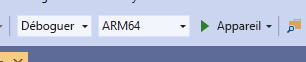

# <a name="quickstart-deploy-native-c-sample-to-hololens"></a>Démarrage rapide : Déployer l’exemple C++ natif sur HoloLens

Ce guide de démarrage rapide explique comment déployer et exécuter l’application de tutoriel C++ native sur un appareil HoloLens 2.

Dans ce guide de démarrage rapide, vous allez apprendre à :

> [!div class="checklist"]
>
>* Générer l’application de tutoriel pour HoloLens.
>* Modifier les informations d’identification ARR dans le code source.
>* Déployer et exécuter l’exemple sur l’appareil.

## <a name="prerequisites"></a>Prérequis

Pour pouvoir accéder au service Azure Remote Rendering, vous devez d’abord [créer un compte](../../../how-tos/create-an-account.md).

Les logiciels suivants doivent être installés :

* SDK Windows 10.0.18362.0 [(télécharger)](https://developer.microsoft.com/windows/downloads/windows-10-sdk)
* Installez la dernière version de Visual Studio 2019 [(télécharger)](https://visualstudio.microsoft.com/vs/older-downloads/)
* [Outils Visual Studio pour Mixed Reality](/windows/mixed-reality/install-the-tools). Plus précisément, les installations de *charge de travail* suivantes sont obligatoires :
  * **Développement Desktop en C++**
  * **Développement de la plateforme Windows universelle (UWP)**
* Git [(télécharger)](https://git-scm.com/downloads)

## <a name="clone-the-arr-samples-repository"></a>Cloner le dépôt des exemples ARR

La première étape consiste à cloner le dépôt Git, qui héberge les exemples globaux Azure Remote Rendering. Ouvrez une invite de commandes (tapez `cmd` dans le menu Démarrer de Windows) et accédez au répertoire dans lequel vous souhaitez stocker l’exemple de projet ARR.

Exécutez les commandes suivantes :

```cmd
mkdir ARR
cd ARR
git clone https://github.com/Azure/azure-remote-rendering
```

La dernière commande crée dans le répertoire ARR un sous-répertoire contenant les différents exemples de projets pour Azure Remote Rendering.

Le tutoriel HoloLens C++ se trouve dans le sous-répertoire *NativeCpp/HoloLens*.

## <a name="build-the-project"></a>Créer le projet

Ouvrez le fichier solution *HolographicApp.sln* situé dans le sous-répertoire *NativeCpp/HoloLens* à l’aide de Visual Studio 2019.

Basculez la configuration de build sur *Débogage* (ou *Release*) et *ARM64*. Vérifiez également que le mode du débogueur est défini sur *Appareil* plutôt que *Ordinateur distant* :



Les informations d’identification du compte étant codées en dur dans le code source du tutoriel, vous devez les remplacer par des informations d’identification valides. Pour ce faire, ouvrez le fichier `HolographicAppMain.cpp` dans Visual Studio et changez la partie où le client est créé dans le constructeur de la classe `HolographicAppMain` :

```cpp
// 2. Create Client
{
    // Users need to fill out the following with their account data and model
    RR::SessionConfiguration init;
    init.AccountId = "00000000-0000-0000-0000-000000000000";
    init.AccountKey = "<account key>";
    init.RemoteRenderingDomain = "westus2.mixedreality.azure.com"; // <change to the region that the rendering session should be created in>
    init.AccountDomain = "westus2.mixedreality.azure.com"; // <change to the region the account was created in>
    m_modelURI = "builtin://Engine";
    m_sessionOverride = ""; // If there is a valid session ID to re-use, put it here. Otherwise a new one is created
    m_client = RR::ApiHandle(RR::RemoteRenderingClient(init));
}
```

Plus spécifiquement, modifiez les valeurs suivantes :
* `init.AccountId`, `init.AccountKey` et `init.AccountDomain` pour utiliser les données de votre compte. Consultez le paragraphe sur la façon de [récupérer les informations du compte](../../../how-tos/create-an-account.md#retrieve-the-account-information).
* Spécifiez où créer la session de rendu à distance en modifiant la partie région de la chaîne `init.RemoteRenderingDomain` pour les régions autres que `westus2`, par exemple `"westeurope.mixedreality.azure.com"`.
* Vous pouvez aussi remplacer `m_sessionOverride` par un ID de session existant. Des sessions peuvent être créées en dehors de cet exemple, en utilisant le [script PowerShell](../../../samples/powershell-example-scripts.md#script-renderingsessionps1) ou l’[API REST de session](../../../how-tos/session-rest-api.md#create-a-session) directement.
La création d’une session en dehors de l’exemple est recommandée quand celui-ci doit s’exécuter plusieurs fois. Si aucune session n’est transmise, l’exemple crée une nouvelle session à chaque démarrage, ce qui peut prendre plusieurs minutes.

L’application peut maintenant être compilée.

## <a name="launch-the-application"></a>Lancer l’application

1. Connectez l’appareil HoloLens à votre PC avec un câble USB.
1. Activez l’appareil HoloLens et attendez que le menu de démarrage apparaisse.
1. Démarrez le débogueur dans Visual Studio (F5). Il déploie automatiquement l’application sur l’appareil.

L’exemple d’application doit être lancé, et un volet de texte doit s’afficher pour vous informer de l’état actuel de l’application. L’état au moment du démarrage est soit le démarrage d’une nouvelle session, soit la connexion à une session existante. Une fois le chargement du modèle terminé, le modèle de moteur intégré s’affiche juste à hauteur de tête. En ce qui concerne l’occlusion, le modèle de moteur interagit correctement avec le cube en rotation qui est rendu localement.

 Si vous souhaitez relancer l’exemple, vous le trouverez également dans le menu Démarrer de l’appareil HoloLens, mais notez qu’un ID de session ayant expiré peut y être compilé.

## <a name="next-steps"></a>Étapes suivantes

Ce guide de démarrage rapide est basé sur le résultat d’un tutoriel qui explique comment intégrer tous les éléments associés à Remote Rendering dans une *application holographique*. Pour savoir quelles sont les étapes nécessaires, suivez ce tutoriel :

> [!div class="nextstepaction"]
> [Tutoriel : Intégrer Remote Rendering dans une application holographique HoloLens](../../../tutorials/native-cpp/hololens/integrate-remote-rendering-into-holographic-app.md)