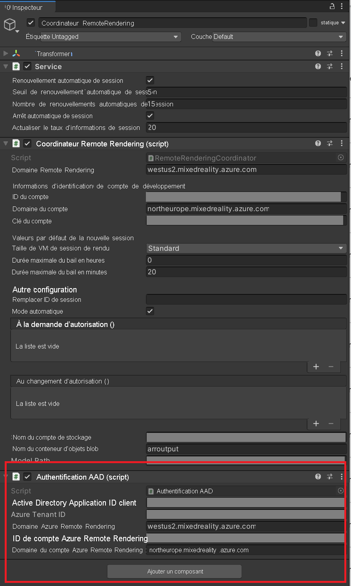

# <a name="tutorial-securing-azure-remote-rendering-and-model-storage"></a>Tutoriel : Sécurisation d’Azure Remote Rendering et du stockage de modèles

Dans ce tutoriel, vous allez apprendre à :

> [!div class="checklist"]
>
> * Sécuriser le stockage d’objets blob Azure contenant des modèles Azure Remote Rendering
> * S’authentifier auprès d’Azure AD pour accéder à votre instance Azure Remote Rendering
> * Utiliser les informations d’identification Azure pour l’authentification d’Azure Remote Rendering

## <a name="prerequisites"></a>Prérequis

* Ce tutoriel s’appuie sur le [Tutoriel : Affinage des matériaux, de l’éclairage et des effets](..\materials-lighting-effects\materials-lighting-effects.md).

## <a name="why-additional-security-is-needed"></a>Pourquoi un supplément de sécurité est nécessaire

L’état actuel de l’application et son accès à vos ressources Azure se présente comme suit :


Dans l’absolu, « AccountID + AccountKey » et « URL + jeton SAS » réunissent un nom d’utilisateur et un mot de passe. Par exemple, si « AccountID + AccountKey » venait à être exposé à un attaquant, il serait facile pour celui-ci d’utiliser à vos dépens vos ressources ARR sans votre autorisation.

## <a name="securing-your-content-in-azure-blob-storage"></a>Sécurisation de votre contenu dans Stockage Blob Azure

Azure Remote Rendering peut accéder de manière sécurisée au contenu de votre stockage d’objets blob Azure avec la configuration adéquate. Suivez la [procédure : Lier des comptes de stockage](../../../how-tos/create-an-account.md#link-storage-accounts) pour configurer votre instance Azure Remote Rendering avec vos comptes de stockage d’objets blob.

Si vous utilisez un stockage d’objets blob lié, vous allez employer des méthodes légèrement différentes pour charger les modèles :

```cs
var loadModelParams = new LoadModelFromSasOptions(modelPath, modelEntity);
var task = ARRSessionService.CurrentActiveSession.Connection.LoadModelFromSasAsync(loadModelParams);
```

Les lignes ci-dessus utilisent la version `FromSas` des paramètres et de l’action de session. Elles doivent être converties aux versions non SAS :

```cs
var loadModelParams = new LoadModelOptions(storageAccountPath, blobContainerName, modelPath, modelEntity);
var task = ARRSessionService.CurrentActiveSession.Connection.LoadModelAsync(loadModelParams);
```

Modifions **RemoteRenderingCoordinator** pour charger un modèle personnalisé à partir d’un compte de stockage d’objets blob lié.

1. Si vous ne l’avez pas déjà fait, suivez la [procédure : Lier des comptes de stockage](../../../how-tos/create-an-account.md#link-storage-accounts) pour accorder à votre instance ARR l’autorisation d’accéder à votre instance Stockage Blob.
1. Ajoutez la méthode **LoadModel** modifiée suivante à **RemoteRenderingCoordinator** juste en dessous de la méthode **LoadModel** actuelle :

    ```cs
    /// <summary>
    /// Loads a model from blob storage that has been linked to the ARR instance
    /// </summary>
    /// <param name="storageAccountName">The storage account name, this contains the blob containers </param>
    /// <param name="blobContainerName">The blob container name, i.e. arroutput</param>
    /// <param name="modelPath">The relative path inside the container to the model, i.e. test/MyCustomModel.arrAsset</param>
    /// <param name="parent">The parent Transform for this remote entity</param>
    /// <param name="progress">A call back method that accepts a float progress value [0->1]</param>
    /// <returns></returns>
    public async Task<Entity> LoadModel(string storageAccountName, string blobContainerName, string modelPath, Transform parent = null, Action<float> progress = null)
    {
        //Create a root object to parent a loaded model to
        var modelEntity = ARRSessionService.CurrentActiveSession.Connection.CreateEntity();

        //Get the game object representation of this entity
        var modelGameObject = modelEntity.GetOrCreateGameObject(UnityCreationMode.DoNotCreateUnityComponents);

        //Ensure the entity will sync its transform with the server
        var sync = modelGameObject.GetComponent<RemoteEntitySyncObject>();
        sync.SyncEveryFrame = true;

        //Parent the new object under the defined parent
        if (parent != null)
        {
            modelGameObject.transform.SetParent(parent, false);
            modelGameObject.name = parent.name + "_Entity";
        }

    #if UNITY_WSA
        //Anchor the model in the world, prefer anchoring parent if there is one
        if (parent != null)
        {
            parent.gameObject.AddComponent<WorldAnchor>();
        }
        else
        {
            modelGameObject.AddComponent<WorldAnchor>();
        }
    #endif

        //Load a model that will be parented to the entity
        var loadModelParams = new LoadModelOptions($"{storageAccountName}.blob.core.windows.net", blobContainerName, modelPath, modelEntity);
        var loadModelAsync = ARRSessionService.CurrentActiveSession.Connection.LoadModelAsync(loadModelParams, progress);
        var result = await loadModelAsync;
        return modelEntity;
    }
    ```

    Si, pour l’essentiel, ce code est identique à la méthode `LoadModel` d’origine, nous avons néanmoins remplacé la version SAS des appels de méthode par les versions non SAS.

    Les entrées supplémentaires `storageAccountName` et `blobContainerName` ont aussi été ajoutées aux arguments. Nous allons appeler cette nouvelle méthode **LoadModel** à partir d’une autre méthode similaire à la toute première méthode **LoadTestModel** que nous avons créée dans le premier tutoriel.

1. Ajoutez la méthode suivante à **RemoteRenderingCoordinator** juste après **LoadTestModel**.

    ```cs
    private bool loadingLinkedCustomModel = false;

    [SerializeField]
    private string storageAccountName;
    public string StorageAccountName {
        get => storageAccountName.Trim();
        set => storageAccountName = value;
    }

    [SerializeField]
    private string blobContainerName;
    public string BlobContainerName {
        get => blobContainerName.Trim();
        set => blobContainerName = value;
    }

    [SerializeField]
    private string modelPath;
    public string ModelPath {
        get => modelPath.Trim();
        set => modelPath = value;
    }

    [ContextMenu("Load Linked Custom Model")]
    public async void LoadLinkedCustomModel()
    {
        if (CurrentCoordinatorState != RemoteRenderingState.RuntimeConnected)
        {
            Debug.LogError("Please wait for the runtime to connect before loading the test model. Try again later.");
            return;
        }
        if (loadingLinkedCustomModel)
        {
            Debug.Log("Linked Test model already loading or loaded!");
            return;
        }
        loadingLinkedCustomModel = true;

        // Create a parent object to use for positioning
        GameObject testParent = new GameObject("LinkedCustomModel");
        testParent.transform.position = new Vector3(0f, 0f, 3f);

        await LoadModel(StorageAccountName, BlobContainerName, ModelPath, testParent.transform, (progressValue) => Debug.Log($"Loading Test Model progress: {Math.Round(progressValue * 100, 2)}%"));
    }
    ```

    Ce code ajoute trois variables de chaîne supplémentaires à votre composant **RemoteRenderingCoordinator**.
    

1. Ajoutez vos valeurs au composant **RemoteRenderingCoordinator**. Après avoir suivi le [Démarrage rapide de conversion de modèle](../../../quickstarts/convert-model.md), vos valeurs doivent être les suivantes :

    * **Storage Account Name** : nom de votre compte de stockage, nom global unique que vous choisissez pour votre compte de stockage. Dans le démarrage rapide, il s’agissait de *arrtutorialstorage*, mais votre valeur sera différente.
    * **Blob Container Name** : arroutput, le conteneur de stockage d’objets blob.
    * **Model Path** : combinaison de « outputFolderPath » et de « outputAssetFileName » définis dans le fichier *arrconfig.json*. Dans le démarrage rapide, la valeur de « outputFolderPath » était « converted/robot » et celle de « outputAssetFileName » était « robot.arrAsset ». La valeur de Model Path (Chemin du modèle) était donc « converted/robot/robot.arrAsset » ; votre valeur sera différente.

    >[!TIP]
    > Si vous [exécutez le script **Conversion. ps1**](../../../quickstarts/convert-model.md#run-the-conversion), sans l’argument « -UseContainerSas », le script génère automatiquement toutes les valeurs précédentes du jeton SAS. 
1. Pour le moment, supprimez ou désactivez le GameObject **TestModel** de façon à libérer de l’espace pour le chargement de votre modèle personnalisé.
1. Lisez la scène et connectez-vous à une session à distance.
1. Cliquez avec le bouton droit sur votre **RemoteRenderingCoordinator**, puis sélectionnez **Load Linked Custom Model** (Charger le modèle personnalisé lié).
    

Ces étapes ont permis de renforcer la sécurité de l’application en supprimant le jeton SAS de l’application locale.

Désormais, l’état actuel de l’application et son accès à vos ressources Azure se présentent comme suit :


Il nous reste un « mot de passe » (AccountKey) à supprimer de l’application locale. Pour ce faire, nous pouvons utiliser l’authentification Azure Active Directory (AAD).

## <a name="azure-active-directory-azure-ad-authentication"></a>Authentification Azure Active Directory (Azure AD)

L’authentification AAD vous permet de mieux contrôler les individus ou les groupes qui utilisent ARR. ARR offre une prise en charge intégrée des [jetons d’accès ](../../../../active-directory/develop/access-tokens.md), qui peuvent être utilisés à la place d’une clé de compte. Vous pouvez considérer les jetons d’accès comme une clé utilisateur limitée dans le temps, qui déverrouille seulement certaines parties de la ressource pour laquelle elle a été demandée.

Le script **RemoteRenderingCoordinator** comporte un délégué nommé **ARRCredentialGetter**, dont l’une des méthodes retourne un objet **SessionConfiguration**, qui sert à configurer la gestion des sessions à distance. Il est possible d’affecter une autre méthode à **ARRCredentialGetter**, nous permettant d’utiliser un flux de connexion Azure pour générer un objet **SessionConfiguration** qui contient un jeton d’accès Azure. Ce jeton d’accès est propre à l’utilisateur qui se connecte.

1. Suivez la [procédure : Configurer l’authentification – Authentification des applications déployées](../../../how-tos/authentication.md#authentication-for-deployed-applications), en particulier les instructions de la section [Authentification utilisateur Azure AD](../../../../spatial-anchors/concepts/authentication.md?tabs=csharp#azure-ad-user-authentication) dans la documentation Azure Spatial Anchors. Cela implique d’inscrire une nouvelle application Azure Active Directory et de configurer l’accès à votre instance ARR.
1. Après avoir configuré la nouvelle application AAD, vérifiez que votre application AAD se présente comme dans l’image suivante :

    **Application AAD -> Authentification** 

    **Application AAD -> Autorisations de l’API** 

1. Après avoir configuré votre compte Remote Rendering, vérifiez que votre configuration se présente comme dans l’image suivante :

    **AAR -> AccessControl (IAM)** 

    >[!NOTE]
    > Un rôle *Propriétaire* n’est pas suffisant pour gérer les sessions via l’application cliente. Vous devez attribuer le rôle **Client Remote Rendering** à chaque utilisateur auquel vous souhaitez accorder la possibilité de gérer des sessions. Par ailleurs, vous devez attribuer le rôle **Administrateur Remote Rendering** à chaque utilisateur qui doit pouvoir gérer les sessions et convertir les modèles.

Maintenant que tout est configuré du côté d’Azure, nous devons modifier la façon dont votre code se connecte au service AAR. Pour ce faire, nous allons implémenter une instance de **BaseARRAuthentication**, qui retournera un nouvel objet **SessionConfiguration**. Dans ce cas, les informations de compte seront configurées avec le jeton d’accès Azure.

1. Créez un script sous le nom **AADAuthentication** et remplacez son code par le suivant :

    ```cs
    // Copyright (c) Microsoft Corporation. All rights reserved.
    // Licensed under the MIT License. See LICENSE in the project root for license information.
    
    using Microsoft.Azure.RemoteRendering;
    using Microsoft.Identity.Client;
    using System;
    using System.Linq;
    using System.Threading;
    using System.Threading.Tasks;
    using UnityEngine;
    
    public class AADAuthentication : BaseARRAuthentication
    {
        [SerializeField]
        private string activeDirectoryApplicationClientID;
        public string ActiveDirectoryApplicationClientID
        {
            get => activeDirectoryApplicationClientID.Trim();
            set => activeDirectoryApplicationClientID = value;
        }
    
        [SerializeField]
        private string azureTenantID;
        public string AzureTenantID
        {
            get => azureTenantID.Trim();
            set => azureTenantID = value;
        }
    
        [SerializeField]
        private string azureRemoteRenderingDomain;
        public string AzureRemoteRenderingDomain
        {
            get => azureRemoteRenderingDomain.Trim();
            set => azureRemoteRenderingDomain = value;
        }
    
        [SerializeField]
        private string azureRemoteRenderingAccountID;
        public string AzureRemoteRenderingAccountID
        {
            get => azureRemoteRenderingAccountID.Trim();
            set => azureRemoteRenderingAccountID = value;
        }
    
        [SerializeField]
        private string azureRemoteRenderingAccountDomain;
        public string AzureRemoteRenderingAccountDomain
        {
            get => azureRemoteRenderingAccountDomain.Trim();
            set => azureRemoteRenderingAccountDomain = value;
        }    
    
        public override event Action<string> AuthenticationInstructions;
    
        string authority => "https://login.microsoftonline.com/" + AzureTenantID;
    
        string redirect_uri = "https://login.microsoftonline.com/common/oauth2/nativeclient";
    
        string[] scopes => new string[] { "https://sts." + AzureRemoteRenderingAccountDomain + "/mixedreality.signin" };
    
        public void OnEnable()
        {
            RemoteRenderingCoordinator.ARRCredentialGetter = GetAARCredentials;
            this.gameObject.AddComponent<ExecuteOnUnityThread>();
        }
    
        public async override Task<SessionConfiguration> GetAARCredentials()
        {
            var result = await TryLogin();
            if (result != null)
            {
                Debug.Log("Account signin successful " + result.Account.Username);
    
                var AD_Token = result.AccessToken;
    
                return await Task.FromResult(new SessionConfiguration(AzureRemoteRenderingAccountDomain, AzureRemoteRenderingDomain, AzureRemoteRenderingAccountID, "", AD_Token, ""));
            }
            else
            {
                Debug.LogError("Error logging in");
            }
            return default;
        }
    
        private Task DeviceCodeReturned(DeviceCodeResult deviceCodeDetails)
        {
            //Since everything in this task can happen on a different thread, invoke responses on the main Unity thread
            ExecuteOnUnityThread.Enqueue(() =>
            {
                // Display instructions to the user for how to authenticate in the browser
                Debug.Log(deviceCodeDetails.Message);
                AuthenticationInstructions?.Invoke(deviceCodeDetails.Message);
            });
    
            return Task.FromResult(0);
        }
    
        public override async Task<AuthenticationResult> TryLogin()
        {
            var clientApplication = PublicClientApplicationBuilder.Create(ActiveDirectoryApplicationClientID).WithAuthority(authority).WithRedirectUri(redirect_uri).Build();
            AuthenticationResult result = null;
            try
            {
                var accounts = await clientApplication.GetAccountsAsync();
    
                if (accounts.Any())
                {
                    result = await clientApplication.AcquireTokenSilent(scopes, accounts.First()).ExecuteAsync();
    
                    return result;
                }
                else
                {
                    try
                    {
                        result = await clientApplication.AcquireTokenWithDeviceCode(scopes, DeviceCodeReturned).ExecuteAsync(CancellationToken.None);
                        return result;
                    }
                    catch (MsalUiRequiredException ex)
                    {
                        Debug.LogError("MsalUiRequiredException");
                        Debug.LogException(ex);
                    }
                    catch (MsalServiceException ex)
                    {
                        Debug.LogError("MsalServiceException");
                        Debug.LogException(ex);
                    }
                    catch (MsalClientException ex)
                    {
                        Debug.LogError("MsalClientException");
                        Debug.LogException(ex);
                        // Mitigation: Use interactive authentication
                    }
                    catch (Exception ex)
                    {
                        Debug.LogError("Exception");
                        Debug.LogException(ex);
                    }
                }
            }
            catch (Exception ex)
            {
                Debug.LogError("GetAccountsAsync");
                Debug.LogException(ex);
            }
    
            return null;
        }
    }
    ```

>[!NOTE]
> En aucun cas ce code n’est complet et ne convient pour une application commerciale. Par exemple, peut-être souhaiterez-vous aussi ajouter au minimum une fonction de déconnexion. Pour cela, vous pouvez utiliser la méthode `Task RemoveAsync(IAccount account)` fournie par l’application cliente. Ce code est destiné uniquement à être utilisé dans ce tutoriel ; votre implémentation sera propre à votre application.

Le code essaie dans un premier temps de récupérer le jeton en mode silencieux à l’aide de **AquireTokenSilent**. Cette tentative aboutira si l’utilisateur a préalablement authentifié cette application. Dans le cas contraire, adoptez une stratégie qui implique l’utilisateur.

Pour ce code, nous utilisons le [flux de code d’appareil](../../../../active-directory/develop/v2-oauth2-device-code.md) pour obtenir un jeton d’accès. Ce flux permet à l’utilisateur de se connecter à son compte Azure sur un ordinateur ou un appareil mobile et d’avoir l’assurance que le jeton obtenu est renvoyé à l’application HoloLens.

La partie la plus importante de ce cours du point de vue d’ARR est cette ligne :

```cs
return await Task.FromResult(new SessionConfiguration(AzureRemoteRenderingAccountDomain, AzureRemoteRenderingDomain, AzureRemoteRenderingAccountID, "", AD_Token, ""));
```

Ici, nous créons un objet **SessionConfiguration** en utilisant le domaine Remote Rendering, l’ID du compte, le domaine du compte et le jeton d’accès. Ce jeton est ensuite utilisé par le service ARR pour interroger, créer et rejoindre les sessions de rendu à distance aussi longtemps que l’utilisateur dispose des autorisations basées sur un rôle configurées précédemment.

À la suite de cette modification, l’état actuel de l’application et son accès à vos ressources Azure ressemblent à ceci :


Sachant que les informations d’identification utilisateur ne sont pas stockées sur l’appareil (ni même dans ce cas entrées sur l’appareil), le risque d’exposition est très faible. L’appareil utilise désormais un jeton d’accès utilisateur limité dans le temps pour accéder à ARR, qui utilise le contrôle d’accès (IAM) pour accéder à Stockage Blob. Ces deux étapes ont entièrement supprimé les « mots de passe » du code source et ont nettement renforcé la sécurité. Ceci dit, il est possible de renforcer encore la sécurité en transférant la gestion des modèles et des sessions sur un service web. Des considérations de sécurité supplémentaires sont abordées dans le chapitre relatif à la [préparation commerciale](../commercial-ready/commercial-ready.md).

### <a name="testing-aad-auth"></a>Test de l’authentification AAD

Dans l’éditeur Unity, quand l’authentification AAD est active, il est nécessaire de s’authentifier à chaque lancement de l’application. Sur l’appareil, l’étape d’authentification se produit la première fois et ne redevient nécessaire que lorsque le jeton arrive à expiration ou qu’il est invalidé.

1. Ajoutez le composant **AADAuthentication** au GameObject **RemoteRenderingCoordinator**.

    

1. Entrez vos valeurs dans Client ID (ID client) et Tenant ID (ID de locataire). Ces valeurs se trouvent dans la page Vue d’ensemble de l’inscription d’application :

    * **Active Directory Application Client ID** correspond à l’*ID d’application (client)* qui se trouve dans l’inscription de votre application AAD (voir l’image ci-dessous).
    * **Azure Tenant ID** correspond à l’*ID de l’annuaire (locataire)* qui se trouve dans l’inscription de votre application AAD (voir l’image ci-dessous).
    * Le **domaine Azure Remote Rendering** est le même que celui que vous avez utilisé dans le domaine Remote Rendering de **RemoteRenderingCoordinator**.
    * **Azure Remote Rendering Account ID** correspond à l’**ID de compte** que vous utilisez pour **RemoteRenderingCoordinator**.
    * Le **domaine de compte Azure Remote Rendering** est identique au **domaine de compte** que vous utilisez dans **RemoteRenderingCoordinator**.

    

1. Appuyez sur Play (Lecture) dans l’éditeur Unity et acceptez l’exécution d’une session.
    Comme le composant **AADAuthentication** dispose d’un contrôleur d’affichage, il est automatiquement connecté pour afficher une invite après le panneau modal d’autorisation de session.
1. Suivez les instructions figurant dans le panneau à droite de **AppMenu**.
    Vous devez voir quelque chose de semblable à ceci : 
    Après avoir entré le code fourni sur votre appareil secondaire (ou dans le navigateur de ce même appareil) et vous être connecté avec vos informations d’identification, un jeton d’accès est retourné à l’application à l’origine de la demande, en l’occurrence, l’éditeur Unity.
1. Après cette étape, tout doit se dérouler normalement dans l’application. Si les étapes ne s’enchaînent pas comme prévu, vérifiez s’il y a des erreurs dans la console Unity.

## <a name="build-to-device"></a>Générer pour l’appareil

Si vous générez une application en utilisant MSAL pour l’appareil, vous devez inclure un fichier dans le dossier **Assets** de votre projet. Cela aidera le compilateur à générer correctement l’application en utilisant *Microsoft.Identity.Client.dll*, qui se trouve dans les **ressources du tutoriel**.

1. Ajoutez un nouveau fichier dans **Assets** sous le nom **link.xml**.
1. Ajoutez le code suivant au fichier :

    ```xml
    <linker>
        <assembly fullname="Microsoft.Identity.Client" preserve="all"/>
        <assembly fullname="System.Runtime.Serialization" preserve="all"/>
        <assembly fullname="System.Core">
            <type fullname="System.Linq.Expressions.Interpreter.LightLambda" preserve="all" />
        </assembly>
    </linker>
    ```

1. Enregistrez les modifications

Suivez les étapes décrites dans [Démarrage rapide : Déployer l’exemple Unity sur HoloLens – Générer l’exemple de projet](../../../quickstarts/deploy-to-hololens.md#build-the-sample-project) pour une génération à destination de HoloLens.

## <a name="next-steps"></a>Étapes suivantes

Les autres tutoriels de la série contiennent des rubriques conceptuelles qui traitent de la création d’une application prête pour la production utilisant Azure Remote Rendering.

> [!div class="nextstepaction"]
> [Étape suivante : Préparation commerciale](../commercial-ready/commercial-ready.md)