# <a name="move-resources-across-regions-in-powershell"></a>Déplacer des ressources entre des régions dans PowerShell

Cet article explique comment déplacer des ressources dans une région Azure différente, en utilisant PowerShell dans [Azure Resource Mover](overview.md).

Dans ce tutoriel, vous allez apprendre à :

> [!div class="checklist"]
> * Vérifier les prérequis et la configuration exigée.
> * Configurer la collection de déplacement.
> * Ajouter des ressources à la collection de déplacement et résoudre les dépendances.
> * Préparer et déplacer le groupe de ressources source. 
> * Préparer et déplacer les autres ressources.
> * Décider si vous souhaitez abandonner ou valider le déplacement. 
> * Le cas échéant, supprimer les ressources dans la région source après le déplacement.

> [!NOTE]
> Les tutoriels enseignent le moyen le plus rapide de tester un scénario et d’utiliser les options par défaut. 

Si vous n’avez pas d’abonnement Azure, créez un [compte gratuit](https://azure.microsoft.com/pricing/free-trial/) avant de commencer. Puis, connectez-vous au [portail Azure](https://portal.azure.com).

## <a name="prerequisites"></a>Prérequis
**Prérequis** | **Description**
--- | ---
**Autorisations d’abonnement** | Veillez à disposer d’un accès *Propriétaire* sur l’abonnement contenant les ressources que vous souhaitez déplacer.<br/><br/> **Pourquoi ai-je besoin d’un accès Propriétaire ?** La première fois que vous ajoutez une ressource pour une paire source et destination spécifique dans un abonnement Azure, Resource Mover crée une [identité managée affectée par le système](../active-directory/managed-identities-azure-resources/overview.md#managed-identity-types) (anciennement Managed Service Identify, MSI) qui est approuvée par l’abonnement. Afin de créer l’identité et lui affecter le rôle demandé (Contributeur ou Administrateur de l’accès utilisateur dans l’abonnement source), le compte que vous utilisez pour ajouter des ressources a besoin des autorisations *Propriétaire* sur l’abonnement. [Explorez en détail](../role-based-access-control/rbac-and-directory-admin-roles.md#azure-roles) les rôles Azure.
**Prise en charge de Resource Mover** | [Consultez](common-questions.md) les régions prises en charge et les autres questions courantes.
**Prise en charge des machines virtuelles** |  Assurez-vous que toutes les machines virtuelles que vous souhaitez déplacer sont prises en charge.<br/><br/> - [Vérifiez](support-matrix-move-region-azure-vm.md#windows-vm-support) les machines virtuelles Windows prises en charge.<br/><br/> - [Vérifiez](support-matrix-move-region-azure-vm.md#linux-vm-support) les machines virtuelles Linux et les versions du noyau prises en charge.<br/><br/> - Contrôlez les paramètres de [calcul](support-matrix-move-region-azure-vm.md#supported-vm-compute-settings), de [stockage](support-matrix-move-region-azure-vm.md#supported-vm-storage-settings) et de [réseau](support-matrix-move-region-azure-vm.md#supported-vm-networking-settings) pris en charge.
**Prise en charge SQL** | Si vous souhaitez déplacer des ressources SQL, examinez la [liste des exigences SQL](tutorial-move-region-sql.md#check-sql-requirements).
**Abonnement de destination** | L’abonnement dans la région de destination a besoin d’un quota suffisant pour créer les ressources que vous déplacez dans la région cible. S’il n’a pas le quota, [demandez des limites supplémentaires](../azure-resource-manager/management/azure-subscription-service-limits.md).
**Frais relatifs à la région de destination** | Vérifiez le tarif et les frais associés à la région cible vers laquelle vous déplacez des machines virtuelles. Utilisez la [calculatrice de prix](https://azure.microsoft.com/pricing/calculator/) pour vous aider.

### <a name="review-powershell-requirements"></a>Examiner les exigences PowerShell

La plupart des opérations de déplacement des ressources sont les mêmes, que vous utilisiez le portail Azure ou PowerShell, à quelques exceptions près.

**Opération** | **PowerShell** | **Portail**
--- | --- | ---
**Créer une collection de déplacement** | Une collection de déplacement (liste de toutes les ressources que vous déplacez) est créée automatiquement. Les autorisations d’identité requises sont affectées dans le back-end par le portail. | Vous utilisez des applets de commande PowerShell pour :<br/><br/> - Créer un groupe de ressources pour la collection de déplacement et spécifier la localisation correspondante<br/><br/> - Affecter une identité managée à la collection<br/><br/> - Ajouter des ressources à la collection
**Supprimer une collection de déplacement** | Vous ne pouvez pas supprimer directement une collection de déplacement dans le portail. | Vous utilisez une applet de commande PowerShell pour supprimer une collection de déplacement.
**Opérations de déplacement de ressources**<br/><br/> (Préparation, lancement du déplacement, validation, etc.).| Étapes simples avec validation automatique par Resource Mover. | Applets de commande PowerShell pour :<br/><br/> 1) Valider les dépendances<br/><br/> 2) Effectuer le déplacement
**Supprimer les ressources sources** | Directement dans le portail Resource Mover | Applets de commande PowerShell au niveau du type de ressource


### <a name="sample-values"></a>Exemples de valeurs

Voici les valeurs que nous utilisons dans nos exemples de script :

**Paramètre** | **Valeur** 
--- | ---
Identifiant d’abonnement | subscription-id
Région source |  USA Centre
Région cible | Centre-USA Ouest
Groupe de ressources (contenant les métadonnées de la collection de déplacement) | RG-MoveCollection-demoRMS
Nom de la collection de déplacement | PS-centralus-westcentralus-demoRMS
Groupe de ressources (région source) | PSDemoRM 
Groupe de ressources (région cible) | PSDemoRM-target
Localisation du service Resource Mover | USA Est 2
Type d’identité | SystemAssigned
Machine virtuelle à déplacer | PSDemoVM


## <a name="sign-into-azure"></a>Se connecter à Azure

Connectez-vous à votre abonnement Azure avec l’applet de commande Connect-AzAccount :

```azurepowershell-interactive
Connect-AzAccount – Subscription "<subscription-id>"
```

## <a name="set-up-the-move-collection"></a>Configurer la collection de déplacement

L’objet MoveCollection stocke les métadonnées et les informations de configuration relatives aux ressources à déplacer. Pour configurer une collection de déplacement, procédez comme suit :

- Créez un groupe de ressources pour la collection de déplacement.
- Inscrivez le fournisseur de services auprès de l’abonnement de façon à pouvoir créer la ressource MoveCollection.
- Créez l’objet MoveCollection avec une identité managée. Pour que l’objet MoveCollection accède à l’abonnement dans lequel se trouve le service Resource Mover, il a besoin d’une [identité managée affectée par le système](../active-directory/managed-identities-azure-resources/overview.md#managed-identity-types) (anciennement Managed Service Identity (MSI)) et approuvée par l’abonnement.
- Accordez l’accès à l’abonnement Resource Mover pour l’identité managée.

### <a name="create-the-resource-group"></a>Créer le groupe de ressources

Créez le groupe de ressources pour les métadonnées de la collection de déplacement ainsi que les informations de configuration, comme suit :

```azurepowershell-interactive
New-AzResourceGroup -Name "RG-MoveCollection-demoRMS" -Location "East US 2"
```
**Sortie**:

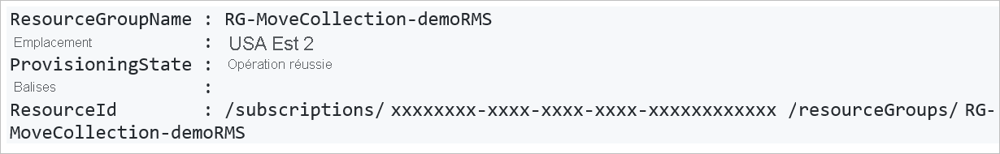

### <a name="register-the-resource-provider"></a>Inscrire le fournisseur de ressources

1. Inscrivez le fournisseur de ressources Microsoft.Migrate de façon à pouvoir créer la ressource MoveCollection, comme suit :

    ```azurepowershell-interactive
    Register-AzResourceProvider -ProviderNamespace Microsoft.Migrate
    
2. Wait for registration:

    ```azurepowershell-interactive 
    While(((Get-AzResourceProvider -ProviderNamespace Microsoft.Migrate)| where {$_.RegistrationState -eq "Registered" -and $_.ResourceTypes.ResourceTypeName -eq "moveCollections"}|measure).Count -eq 0)
    {
        Start-Sleep -Seconds 5
        Write-Output "Waiting for registration to complete."
    }
    ```
### <a name="create-a-movecollection-object"></a>Créer un objet MoveCollection

Créez un objet MoveCollection et assignez-lui une identité managée, comme suit : 

```azurepowershell-interactive
New-AzResourceMoverMoveCollection -Name "PS-centralus-westcentralus-demoRMS"  -ResourceGroupName "RG-MoveCollection-demoRMS" -SourceRegion "centralus" -TargetRegion "westcentralus" -Location "centraluseuap" -IdentityType "SystemAssigned"
```

**Sortie**:

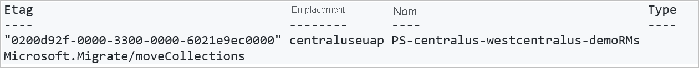


### <a name="grant-access-to-the-managed-identity"></a>Accorder à l’identité managée un accès

Accordez à l’identité managée un accès à l’abonnement Resource Mover, comme suit : Vous devez être le propriétaire de l’abonnement.

1. Récupérez les détails de l’identité de l’objet MoveCollection.

    ```azurepowershell-interactive
    $moveCollection = Get-AzResourceMoverMoveCollection -SubscriptionId $subscriptionId -ResourceGroupName "RG-MoveCollection-demoRMS" -Name "PS-centralus-westcentralus-demoRMS"

    $identityPrincipalId = $moveCollection.IdentityPrincipalId   
    ``` 

2. Affectez les rôles requis à l’identité afin qu’Azure Resource Mover puisse accéder à votre abonnement pour faciliter le déplacement des ressources.

    ```azurepowershell-interactive
    New-AzRoleAssignment -ObjectId $identityPrincipalId -RoleDefinitionName Contributor -Scope "/subscriptions/$subscriptionId"

    New-AzRoleAssignment -ObjectId $identityPrincipalId -RoleDefinitionName "User Access Administrator" -Scope "/subscriptions/$subscriptionId"
    ``` 

## <a name="add-resources-to-the-move-collection"></a>Ajouter des ressources à la collection de déplacement

Récupérez les ID des ressources sources existantes que vous souhaitez déplacer. Créez l’objet de paramètres de ressource de destination, puis ajoutez les ressources à la collection de déplacement.

> [!NOTE]
> Les ressources ajoutées à une collection de déplacement doivent figurer dans le même abonnement, mais peuvent se trouver dans des groupes de ressources différents.

Ajoutez les ressources comme suit :

1. Récupérez l’ID de ressource source :

    ```azurepowershell-interactive
    Get-AzResource -Name PSDemoVM -ResourceGroupName PSDemoRM
    ```

    **Sortie**

    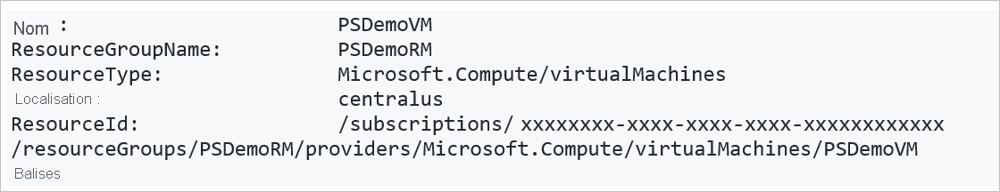

2. Créez l’objet de paramètres de ressource cible en fonction de la ressource que vous déplacez. Dans notre cas, il s’agit d’une machine virtuelle.

    ```azurepowershell-interactive
    $targetResourceSettingsObj = New-Object Microsoft.Azure.PowerShell.Cmdlets.ResourceMover.Models.Api202101.VirtualMachineResourceSettings
    ```

3. Définissez le type de ressource et le nom de la ressource cible pour l’objet.

    ```azurepowershell-interactive
    $targetResourceSettingsObj.ResourceType = "Microsoft.Compute/virtualMachines"
    $targetResourceSettingsObj.TargetResourceName = "PSDemoVM"
    ```
    > [!NOTE]
    > Notre machine virtuelle cible porte le même nom que la machine virtuelle dans la région source. Vous pouvez choisir un autre nom.

4. Ajoutez les ressources sources à la collection de déplacement en utilisant l’ID de ressource et l’objet de paramètres de ressource cible que vous avez récupérés/créés.

    ```azurepowershell-interactive
    Add-AzResourceMoverMoveResource -ResourceGroupName "RG-MoveCollection-demoRMS" -MoveCollectionName "PS-centralus-westcentralus-demoRMS" -SourceId "/subscriptions/xxxxxxxx-xxxx-xxxx-xxxx xxxxxxxxxxxx/resourceGroups/
    PSDemoRM/providers/Microsoft.Compute/virtualMachines/PSDemoVM" -Name "PSDemoVM" -ResourceSetting $targetResourceSettingsObj
    ```

    **Sortie** 

## <a name="validate-and-add-dependencies"></a>Valider et ajouter des dépendances

Vérifiez si les ressources que vous avez ajoutées ont des dépendances vis-à-vis d’autres ressources, puis ajoutez-les en fonction des besoins. 

1. Validez les dépendances comme suit :

    ```azurepowershell-interactive
    Resolve-AzResourceMoverMoveCollectionDependency -ResourceGroupName "RG-MoveCollection-demoRMS" -MoveCollectionName "PS-centralus-westcentralus-demoRMS"
    ```
    **Sortie (quand des dépendances existent)**

    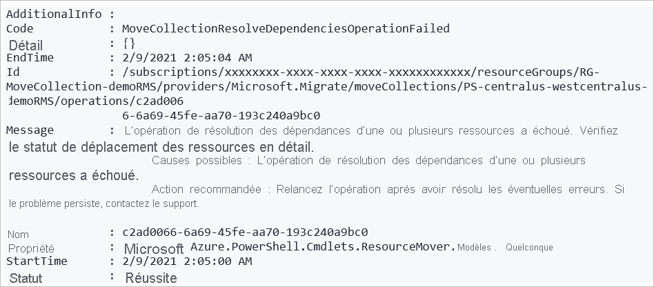

2. Identifier les dépendances manquantes :

    - Pour récupérer la liste de toutes les dépendances manquantes :

        ```azurepowershell-interactive
        Get-AzResourceMoverUnresolvedDependency -MoveCollectionName "PS-centralus-westcentralus-demoRMS" -ResourceGroupName "RG-MoveCollection-demoRMS" -DependencyLevel Descendant"
        ```
        **Sortie**   

    - Pour récupérer uniquement les dépendances de premier niveau (dépendances directes pour la ressource) :

        ```azurepowershell-interactive
        Get-AzResourceMoverUnresolvedDependency -MoveCollectionName "PS-centralus-westcentralus-demoRMS" -ResourceGroupName "RG-MoveCollection-demoRMS" -DependencyLevel Direct
        ```
        **Sortie**   

3. Pour ajouter des dépendances manquantes en attente, répétez les instructions indiquées plus haut dans la section [Ajouter des ressources à la collection de déplacement](#add-resources-to-the-move-collection) et effectuez une revalidation jusqu’à ce qu’il n’y ait aucune ressource en attente.

> [!NOTE]
> Si, pour une raison quelconque, vous souhaitez supprimer des ressources de la collection de ressources, suivez les instructions de [cet article](remove-move-resources.md).

## <a name="add-the-source-resource-group"></a>Ajouter le groupe de ressources source

Ajoutez à la collection de déplacement le groupe de ressources source contenant les ressources que vous souhaitez déplacer.

1. Récupérez l’ID du groupe de ressources.

    ```azurepowershell-interactive
    Get-AzResourceMoverUnresolvedDependency -MoveCollectionName "PS-centralus-westcentralus-demoRMS" -ResourceGroupName "RG-MoveCollection-demoRMS" -DependencyLevel Direct
    ```
    **Sortie**   

    > [!NOTE]
    > Nous utilisons un groupe de ressources qui se trouve déjà dans la région cible.

 
2. Utilisez l’ID récupéré pour ajouter le groupe de ressources à la collection.

    ```azurepowershell-interactive
    Add-AzResourceMoverMoveResource -ResourceGroupName "RG-MoveCollection-demoRMS"  -MoveCollectionName "PS-centralus-westcentralus-demoRMS" -SourceId "/subscriptions/xxxxxxxx-xxxx-xxxx-xxxx-xxxxxxxxxxxx/resourcegroups/psdemorm"  -Name "psdemorm"  -ExistingTargetId "/subscriptions/xxxxxxxx-xxxx-xxxx-xxxx-xxxxxxxxxxxx/resourcegroups/PSDemoRM-target"
    ```
    **Sortie** 

3. Vérifiez les dépendances pour vous assurer que vous n’avez rien manqué après avoir ajouté le groupe de ressources.

    ```azurepowershell-interactive
    Resolve-AzResourceMoverMoveCollectionDependency -ResourceGroupName "RG-MoveCollection-demoRMS" -MoveCollectionName "PS-centralus-westcentralus-demoRMS"
    ```
4. Nous voyons qu’il n’y a pas de dépendances en attente.

    **Sortie** 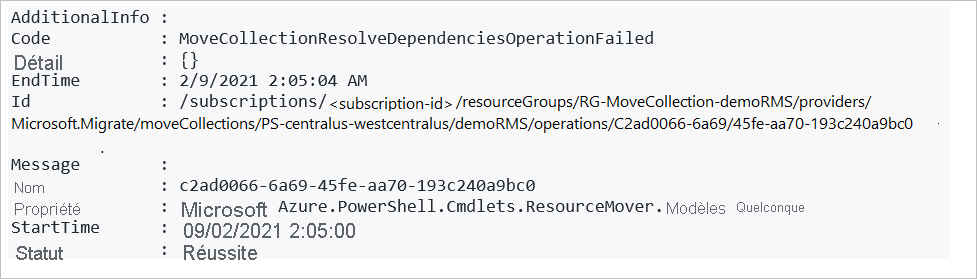


## <a name="prepare-resources"></a>Préparer les ressources

Vous devez généralement préparer les ressources dans la région source avant le déplacement. Par exemple :

- Pour déplacer des ressources sans état, telles que des réseaux virtuels Azure, des cartes réseau, des équilibreurs de charge et des groupes de sécurité réseau, vous devrez peut-être exporter un modèle Azure Resource Manager.
- Pour déplacer des ressources avec état, telles que des machines virtuelles Azure et des bases de données SQL, vous devrez peut-être démarrer la réplication des ressources de la région source vers la région de destination.

Dans ce tutoriel, puisque nous allons déplacer des machines virtuelles, nous devons préparer le groupe de ressources source, puis lancer et valider son déplacement, avant de pouvoir commencer à préparer les machines virtuelles.

> [!NOTE]
> Si vous disposez d’un groupe de ressources cible existant, vous pouvez directement valider le déplacement du groupe de ressources source et ignorer les étapes de préparation et de lancement du déplacement.

  
### <a name="prepare-the-source-resource-group"></a>Préparer le groupe de ressources source

1. Préparer le groupe de ressources :

    ```azurepowershell-interactive
    Invoke-AzResourceMoverPrepare -ResourceGroupName "RG-MoveCollection-demoRMS" -MoveCollectionName "PS-centralus-westcentralus-demoRMS"  -MoveResource “PSDemoRM”
    ```
    **Sortie**

    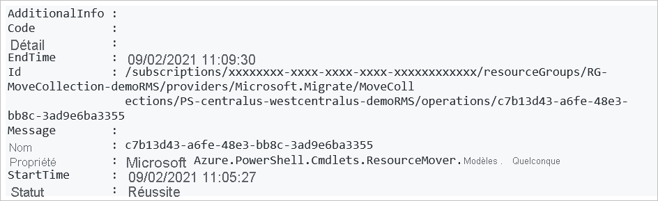

2. Lancez le déplacement du groupe de ressources source.

    ```azurepowershell-interactive
    "RG-MoveCollection-demoRMS" -MoveCollectionName "PS-centralus-westcentralus-demoRMS"  -MoveResource “PSDemoRM”
    ```
    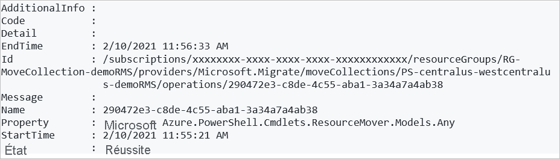

3. Validez le déplacement du groupe de ressources source.

    ```azurepowershell-interactive
    Invoke-AzResourceMoverCommit -ResourceGroupName "RG-MoveCollection-demoRMS" -MoveCollectionName "PS-centralus-westcentralus-demoRMS"  -MoveResource “PSDemoRM”
    ```
    **Sortie**

    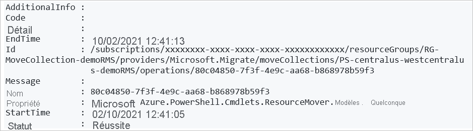


### <a name="prepare-vm-resources"></a>Préparer les ressources VM

Après avoir préparé et déplacé le groupe de ressources source, nous pouvons préparer les ressources VM pour le déplacement.

1. Validez les dépendances avant de préparer les ressources VM.

    ```azurepowershell-interactive
    $resp = Invoke-AzResourceMoverPrepare -ResourceGroupName "RG-MoveCollection-demoRMS" -MoveCollectionName "PS-centralus-westcentralus-demoRMS"  -MoveResource $('psdemovm') -ValidateOnly
    ```
    **Sortie**

    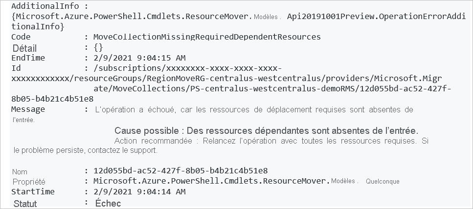

2. Récupérez les ressources dépendantes qui doivent être préparées avec la machine virtuelle.

    ```azurepowershell-interactive
    $resp.AdditionalInfo[0].InfoMoveResource
    ```
    **Sortie**

    

3. Lancez le processus de préparation pour toutes les ressources dépendantes.

    ```azurepowershell-interactive
    Invoke-AzResourceMoverPrepare -ResourceGroupName "RG-MoveCollection-demoRMS" -MoveCollectionName "PS-centralus-westcentralus-demoRMS"  -MoveResource $('PSDemoVM','psdemovm111', 'PSDemoRM-vnet','PSDemoVM-nsg')
    ```
    **Sortie**

    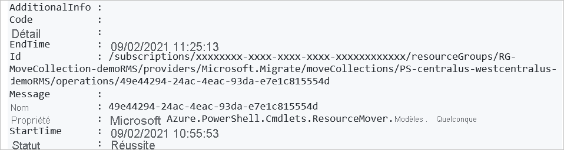


    > [!NOTE]
    > Vous pouvez fournir l’ID de ressource source au lieu du nom de ressource en tant que paramètres d’entrée pour l’applet de commande de préparation ainsi que dans les applets de commande de lancement et de validation. Pour ce faire, exécutez :


    ```azurepowershell-interactive
        Invoke-AzResourceMoverPrepare -ResourceGroupName "RG-MoveCollection-demoRMS" -MoveCollectionName "PS-centralus-westcentralus-demoRMS" -MoveResourceInputType MoveResourceSourceId  -MoveResource $('/subscriptions/xxxxxxxx-xxxx-xxxx-xxxx-xxxxxxxxxxxx/resourceGroups/PSDemoRMS/providers/Microsoft.Network/networkSecurityGroups/PSDemoVM-nsg')
    ```

## <a name="initiate-move-of-vm-resources"></a>Lancer le déplacement des ressources VM

1. Vérifiez que les ressources VM sont dans un état *Lancement du déplacement en attente* :

    ```azurepowershell-interactive
    Get-AzResourceMoverMoveResource  -SubscriptionId “ xxxxxxxx-xxxx-xxxx-xxxx-xxxxxxxxxxxx “ -ResourceGroupName “RG-MoveCollection-demoRMS” -MoveCollectionName “PS-centralus-westcentralus-demoRMS ”   | Where-Object {  $_.MoveStatusMoveState -eq “InitiateMovePending” } | Select Name
    ```    

    **Sortie**

    

2. Lancez le déplacement :

    ```azurepowershell-interactive
    Invoke-AzResourceMoverInitiateMove -ResourceGroupName "RG-MoveCollection-demoRMS" -MoveCollectionName "PS-centralus-westcentralus-demoRMS"  -MoveResource $('psdemovm111', 'PSDemoRM-vnet','PSDemoVM-nsg', ‘PSDemoVM’) -MoveResourceInputType "MoveResourceId"
    ```    

    **Sortie**

    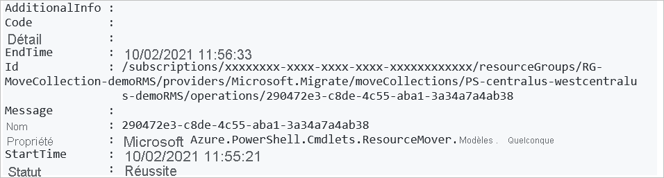


## <a name="discard-or-commit"></a>Abandonner ou valider ?

Après le déplacement initial, vous pouvez décider de valider le déplacement ou de l’abandonner. 

- **Abandonner** : vous pouvez abandonner un déplacement si vous effectuez un test et que vous ne souhaitez pas déplacer réellement la ressource source. Si vous abandonnez le déplacement, la ressource reviendra à l’état *Lancement du déplacement en attente*. Vous pouvez alors lancer à nouveau le déplacement, si nécessaire.
- **Valider** : La validation termine le déplacement vers la région cible. Après sa validation, une ressource source se présente avec l’état de *Suppression de la source en attente*, et vous pouvez décider si vous voulez la supprimer.

### <a name="discard-the-move"></a>Abandonner le déplacement

Pour abandonner le déplacement :

```azurepowershell-interactive
Invoke-AzResourceMoverDiscard -ResourceGroupName "RG-MoveCollection-demoRMS" -MoveCollectionName "PS-centralus-westcentralus-demoRMS"  -MoveResource $('psdemovm111', 'PSDemoRM-vnet','PSDemoVM-nsg', ‘PSDemoVM’) -MoveResourceInputType "MoveResourceId"
```
**Sortie**

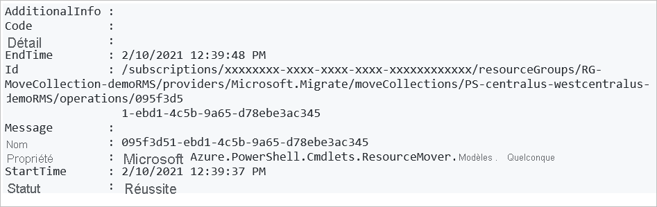


### <a name="commit-the-move"></a>Valider le déplacement

1. Validez le déplacement de la manière suivante :

    ```azurepowershell-interactive
    Invoke-AzResourceMoverCommit -ResourceGroupName "RG-MoveCollection-demoRMS" -MoveCollectionName "PS-centralus-westcentralus-demoRMS"  -MoveResource $('psdemovm111', 'PSDemoRM-vnet','PSDemoVM-nsg', ‘PSDemoVM’) -MoveResourceInputType "MoveResourceId"
    ```
    **Sortie**

    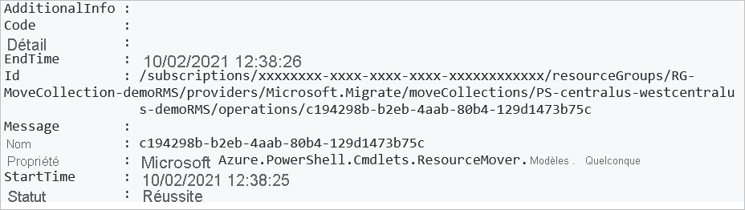

2. Vérifiez que toutes les ressources ont été déplacées vers la région cible :

    ```azurepowershell-interactive
    Get-AzResourceMoverMoveResource  -ResourceGroupName “RG-MoveCollection-demoRMS ” -MoveCollectionName “PS-centralus-westcentralus-demoRMS”   
    ```
    Toutes les ressources sont désormais dans un état *Suppression de la source en attente* dans la région cible.

## <a name="delete-source-resources"></a>Supprimer les ressources sources

Après avoir validé le déplacement et vérifié que les ressources fonctionnent comme prévu dans la région cible, vous pouvez supprimer chaque ressource source à partir du [portail Azure](../azure-resource-manager/management/manage-resources-portal.md#delete-resources), de [PowerShell](../azure-resource-manager/management/manage-resources-powershell.md#delete-resources) ou d’[Azure CLI](../azure-resource-manager/management/manage-resources-cli.md#delete-resources).

## <a name="next-steps"></a>Étapes suivantes

Dans ce tutoriel, vous allez :

> [!div class="checklist"]
> * Avez déplacé des machines virtuelles Azure dans une autre région Azure avec PowerShell.
> * Avez déplacé les ressources associées aux machines virtuelles dans une autre région.

Essayez à présent de déplacer des machines virtuelles Azure à l’aide du portail.

> [!div class="nextstepaction"]
> [Déplacer des machines virtuelles Azure dans le portail](./tutorial-move-region-virtual-machines.md)


