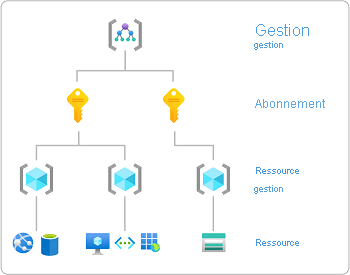

# Démarrage rapide : Vérifier l’accès d’un utilisateur aux ressources Azure

Parfois, vous devez vérifier l’accès dont dispose un utilisateur à un ensemble de ressources Azure. Vous vérifiez son accès en listant ses affectations. Un moyen rapide de vérifier l’accès d’un seul utilisateur consiste à utiliser la fonctionnalité **Vérifier l’accès** dans la page **Contrôle d’accès (IAM)** .

## Étape 1 : Ouvrir les ressources Azure

Pour vérifier l’accès d’un utilisateur, vous devez d’abord ouvrir les ressources Azure pour lesquelles vous souhaitez vérifier l’accès. Les ressources Azure sont organisées en niveaux, qui sont généralement appelés l’*étendue*. Dans Azure, vous pouvez spécifier une étendue à quatre niveaux, allant du plus large au plus petit : groupe d’administration, abonnement, groupe de ressources et ressource.

Suivez ces étapes pour ouvrir l’ensemble des ressources Azure pour lesquelles vous souhaitez vérifier l’accès.

1. Ouvrez le [portail Azure](https://portal.azure.com).

1. Ouvrez l’ensemble de ressources Azure, comme **Groupes d’administration**, **Abonnements**, **Groupes de ressources** ou une ressource particulière.

1. Cliquez sur la ressource spécifique dans cette étendue.

    Voici l’illustration d’un exemple de groupe de ressources.

    

## Étape 2 : Vérifier l’accès pour un utilisateur

Suivez ces étapes pour vérifier l’accès d’un utilisateur, groupe, principal de service ou d’une identité managée aux ressources Azure précédemment sélectionnées.

1. Cliquez sur **Contrôle d’accès (IAM)**.

    Voici un exemple de la page Contrôle d’accès (IAM) pour un groupe de ressources.

    

1. Sous l’onglet **Vérifier l’accès**, dans la liste **Rechercher**, sélectionnez l’utilisateur, le groupe, le principal de service ou l’identité managée dont vous souhaitez vérifier l’accès.

1. Dans la zone de recherche, entrez une chaîne afin de rechercher, dans le répertoire, des noms d’affichage, des adresses e-mail ou des identificateurs d’objet.

    

1. Cliquez sur le principal de sécurité pour ouvrir le volet **Affectations**.

    Dans ce volet, vous pouvez voir l’accès du principal de sécurité sélectionné pour cette étendue et celui hérité de cette étendue. Les affectations pour les étendues enfants ne sont pas listées. Les affectations suivantes s’affichent :

    - Attributions de rôle ajoutées avec RBAC Azure.
    - Affectations de refus ajoutées en utilisant Azure Blueprints ou des applications managées Azure.
    - Affectations de l’administrateur de service classique ou de coadministrateurs pour les déploiements classiques. 

    

## Étape 3 : Vérifier votre accès

Suivez ces étapes pour vérifier votre accès aux ressources Azure précédemment sélectionnées.

1. Cliquez sur **Contrôle d’accès (IAM)**.

1. Sous l’onglet **Vérifier l’accès**, cliquez sur le bouton **Afficher mon accès**.

    Un volet des affectations s’affiche, dans lequel est listé votre accès pour cette étendue et celui hérité de cette étendue. Les affectations pour les étendues enfants ne sont pas listées.

    

## Étapes suivantes

> [!div class="nextstepaction"]
> [Répertorier les attributions de rôle Azure à l’aide du portail Azure](role-assignments-list-portal.md)
