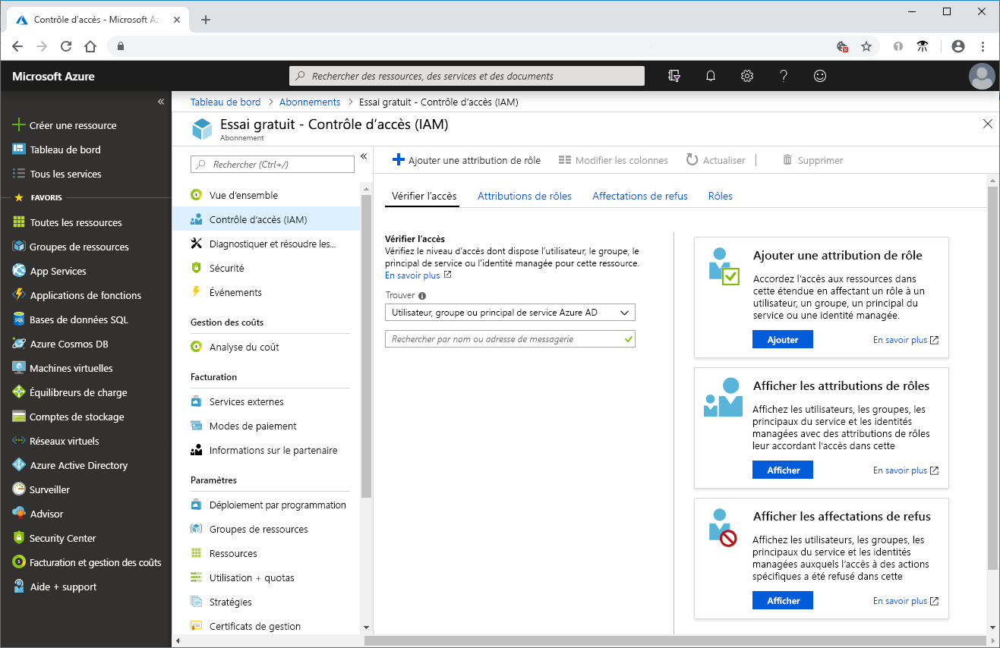
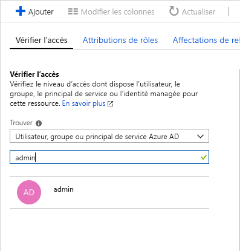
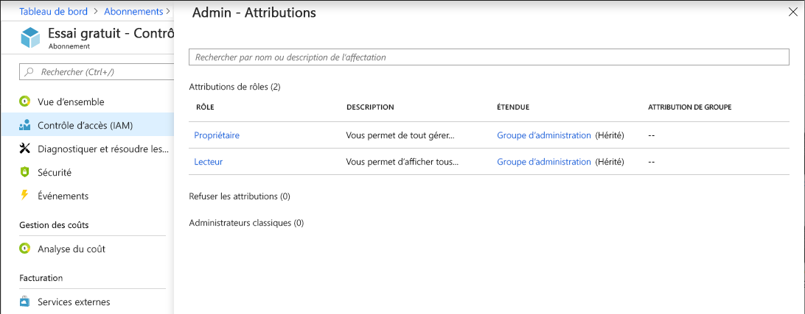

# Démarrage rapide : Afficher l’accès dont dispose un utilisateur aux ressources Azure

Vous pouvez utiliser le panneau **Contrôle d’accès (IAM)** dans [Contrôle d’accès en fonction du rôle (RBAC)](overview.md) pour afficher l’accès dont dispose un utilisateur ou un autre principal de sécurité aux ressources Azure. Cependant, vous devez parfois simplement afficher rapidement l’accès pour un seul utilisateur ou un autre principal de sécurité. Pour cela, le moyen le plus simple consiste à utiliser la fonctionnalité **Vérifier l’accès** dans le portail Azure.

## Voir les attributions de rôles

 La façon d’afficher l’accès pour un utilisateur consiste à lister ses attributions de rôles. Suivez ces étapes pour voir les attributions de rôles d’un utilisateur, groupe, principal de service ou identité managée au niveau de l’abonnement.

1. Dans le portail Azure, cliquez sur **Tous les services**, puis sur **Abonnements**.

1. Cliquez sur votre abonnement.

1. Cliquez sur **Contrôle d’accès (IAM)** .

1. Cliquez sur l’onglet **Vérifier l’accès**.

    

1. Dans la liste **Rechercher**, sélectionnez le type principal de sécurité dont vous souhaitez contrôler l’accès.

1. Dans la zone de recherche, entrez une chaîne afin de rechercher, dans le répertoire, des noms d’affichage, des adresses e-mail ou des identificateurs d’objet.

    

1. Cliquez sur le principal de sécurité pour ouvrir le volet **Affectations**.

    

    Dans ce volet, vous pouvez voir les rôles attribués au principal de sécurité sélectionné et la portée. S’il existe des affectations de refus dans cette étendue, ou héritées par cette étendue, elles sont listées.

## Étapes suivantes

> [!div class="nextstepaction"]
> [Tutoriel : Accorder un accès utilisateur aux ressources Azure à l’aide du contrôle RBAC et du portail Azure](quickstart-assign-role-user-portal.md)
