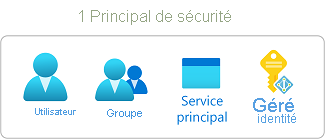
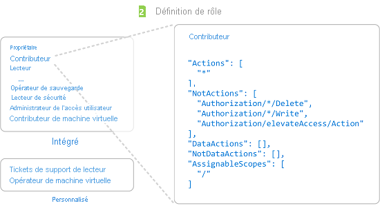
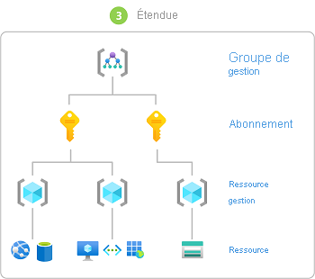
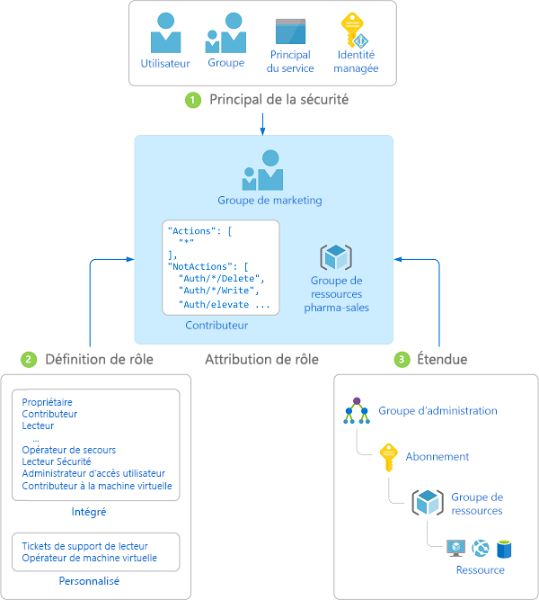
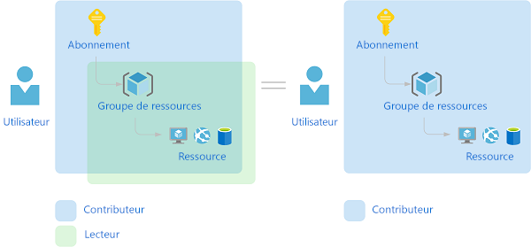

# Qu’est-ce que le contrôle d’accès en fonction du rôle Azure (RBAC Azure) ?

Il est vital pour toute organisation qui utilise le cloud de pouvoir gérer les accès aux ressources situées dans cloud. Le contrôle d’accès basé sur un rôle Azure (RBAC Azure) permet de gérer les utilisateurs ayant accès aux ressources Azure, les modes d’utilisation des ressources par ces derniers et les zones auxquelles ils ont accès.

Le contrôle RBAC Azure est un système d’autorisation basé sur [Azure Resource Manager](../azure-resource-manager/management/overview.md) qui propose une gestion affinée des accès des ressources Azure.

Cette vidéo fournit une vue d’ensemble rapide du RBAC Azure.

>[!VIDEO https://www.youtube.com/embed/Dzhm-garKBM]

## Comment utiliser le contrôle RBAC Azure ?

Voici quelques exemples de ce que vous pouvez faire avec le contrôle RBAC Azure :

- Autoriser un utilisateur à gérer des machines virtuelles dans un abonnement et un autre utilisateur à gérer des réseaux virtuels
- Permettre à un groupe d’administrateurs de base de données de gérer des bases de données SQL dans un abonnement
- Permettre à un utilisateur à gérer toutes les ressources dans un groupe de ressources, telles que des machines virtuelles, des sites Web et des sous-réseaux
- Permettre à une application d’accéder à toutes les ressources d’un groupe de ressources

## Fonctionnement du contrôle RBAC Azure

Les attributions de rôles vous permettent de contrôler l’accès aux ressources à l’aide du contrôle RBAC Azure. Il s’agit d’un concept clé dont la compréhension est essentielle, à savoir la façon dont les autorisations sont appliquées. Une attribution de rôle se compose de trois éléments : un principal de sécurité, une définition de rôle et une étendue.

### Principal de sécurité

Un *principal de sécurité* est un objet qui représente un utilisateur, un groupe, un principal de service ou une identité managée demandant l’accès à des ressources Azure. Vous pouvez attribuer un rôle à l’un de ces principaux de sécurité.

### Définition de rôle

Une *définition de rôle* est une collection d’autorisations. Elle est généralement simplement appelée *rôle*. Une définition de rôle répertorie les opérations qui peuvent être effectuées, telles que lire, écrire et supprimer. Les rôles peuvent être de haut niveau, comme propriétaire, ou spécifiques, comme lecteur de machines virtuelles.

Azure inclut plusieurs [rôles intégrés](built-in-roles.md) que vous pouvez utiliser. Par exemple, le rôle de [contributeur de machine virtuelle](built-in-roles.md#virtual-machine-contributor) permet à l’utilisateur de créer et gérer des machines virtuelles. Si les rôles intégrés ne répondent pas aux besoins spécifiques de votre organisation, vous pouvez créer vos propres [rôles personnalisés Azure](custom-roles.md).

Cette vidéo fournit une vue d’ensemble rapide des rôles intégrés et des rôles personnalisés.

>[!VIDEO https://www.youtube.com/embed/I1mefHptRgo]

Azure propose des opérations de données qui vous permettent d’accorder l’accès aux données au sein d’un objet. Par exemple, si un utilisateur dispose d’un accès en lecture aux données d’un compte de stockage, il peut lire les objets blob ou les messages de ce compte de stockage.

Pour plus d’informations, consultez [Comprendre les définitions de rôle Azure](role-definitions.md).

### Étendue

*Étendue* représente l’ensemble des ressources auxquelles l’accès s’applique. Lorsque vous attribuez un rôle, vous pouvez restreindre les actions autorisées en définissant une étendue. Cette possibilité s’avère utile si vous voulez par exemple attribuer le rôle de [contributeur de site web](built-in-roles.md#website-contributor) à quelqu’un, mais seulement pour un groupe de ressources.

Dans Azure, vous pouvez spécifier une étendue à quatre niveaux : [groupe d’administration](../governance/management-groups/overview.md), abonnement, [groupe de ressources](../azure-resource-manager/management/overview.md#resource-groups) ou ressource. Les étendues sont structurées dans une relation parent-enfant. Vous pouvez attribuer des rôles à n’importe de ces niveaux d’étendue.

Pour plus d’informations sur l’étendue, consultez [Comprendre l’étendue](scope-overview.md).

### Affectations de rôles

Une *attribution de rôle* est le processus d’attachement d’une définition de rôle à un utilisateur, un groupe, un principal de service ou une identité managée au niveau d’une étendue spécifique pour accorder des accès. La création d’une attribution de rôle permet d’accorder un accès, qui peut être révoqué par la suppression d’une attribution de rôle.

Le diagramme suivant montre un exemple d’attribution de rôle. Dans cet exemple, le rôle de [contributeur](built-in-roles.md#contributor) a été attribué au groupe Marketing pour le groupe de ressources pharma-sales. Cela signifie que les utilisateurs du groupe Marketing peuvent créer ou gérer n’importe quelle ressource Azure dans le groupe de ressources pharma-sales. Les utilisateurs Marketing n’ont pas accès aux ressources en dehors du groupe de ressources pharma-sales, sauf si elles font partie d’une autre attribution de rôle.

Vous pouvez créer des attributions de rôles à l’aide du Portail Azure, d’Azure CLI, d’Azure PowerShell, des kits de développement logiciel (SDK) Azure ou d’API REST.

Pour plus d’informations, consultez [Étapes pour ajouter une attribution de rôle](role-assignments-steps.md).

## Attributions de rôles multiples

Que se passe-t-il si plusieurs attributions de rôles se chevauchent ? Le contrôle RBAC Azure étant un modèle additif, vos autorisations effectives correspondent à la somme de vos attributions de rôles. Prenons l’exemple suivant où un utilisateur reçoit le rôle Contributeur pour l’étendue de l’abonnement et le rôle Lecteur pour un groupe de ressources. La somme des autorisations du rôle Contributeur et des autorisations du rôle Lecteur correspond effectivement au rôle Contributeur pour le groupe de ressources. Ainsi, dans ce cas, l’attribution du rôle Lecteur n’a aucun impact.

## Affectations de refus

Le contrôle RBAC Azure, qui était jusqu’à maintenant exclusivement un modèle d’autorisation sans possibilité de refus, prend désormais en charge des affectations de refus dans une certaine mesure. À l’instar d’une attribution de rôle, une *affectation de refus* attache un ensemble d’actions de refus à un utilisateur, un groupe, un principal de service ou une identité managée, sur une étendue spécifique, afin de refuser l’accès. Une attribution de rôle définit un ensemble d’actions *autorisées*, tandis qu’une affectation de refus définit un ensemble d’actions *non autorisées*. En d’autres termes, les affectations de refus empêchent les utilisateurs d’effectuer des actions spécifiées, même si une attribution de rôle leur accorde l’accès. Les affectations de refus ont priorité sur les attributions de rôles.

Pour plus d’informations, consultez [Comprendre les affectations de refus Azure](deny-assignments.md).

## Comment le contrôle RBAC Azure détermine si un utilisateur a accès à une ressource

Voici les principales étapes suivies par le contrôle RBAC Azure pour déterminer si vous avez accès à une ressource sur le plan de gestion. Cela s’avère utile pour comprendre si vous tentez de résoudre un problème d’accès.

1. Un utilisateur (ou principal de service) se procure un jeton pour Azure Resource Manager.

    Le jeton inclut les appartenances de l’utilisateur à des groupes (notamment les appartenances à des groupes transitifs).

1. L’utilisateur effectue un appel d’API REST vers Azure Resource Manager avec le jeton joint.

1. Azure Resource Manager récupère toutes les attributions de rôle et les affectations de refus qui s’appliquent à la ressource sur laquelle l’action est entreprise.

1. Azure Resource Manager restreint les attributions de rôles qui s’appliquent à cet utilisateur ou à son groupe, et détermine les rôles dont l’utilisateur dispose pour cette ressource.

1. Azure Resource Manager détermine si l’action contenue dans l’appel d’API est incluse dans les rôles dont l’utilisateur dispose pour cette ressource.

1. Si l’utilisateur n’a aucun rôle avec l’action appropriée dans l’étendue demandée, l’accès n’est pas octroyé. Sinon, Azure Resource Manager vérifie si une affectation de refus s’applique.

1. Si c’est le cas, l’accès est bloqué. Autrement, l’accès est accordé.

## Conditions de licence :

[!INCLUDE [Azure AD free license](../../includes/active-directory-free-license.md)]

## Étapes suivantes

- [Ajouter ou supprimer des attributions de rôles Azure avec le portail Azure](role-assignments-portal.md)
- [Comprendre les différents rôles](rbac-and-directory-admin-roles.md)
- [Framework d’adoption du cloud : Gestion de l’accès aux ressources dans Azure](/azure/cloud-adoption-framework/govern/resource-consistency/resource-access-management)
