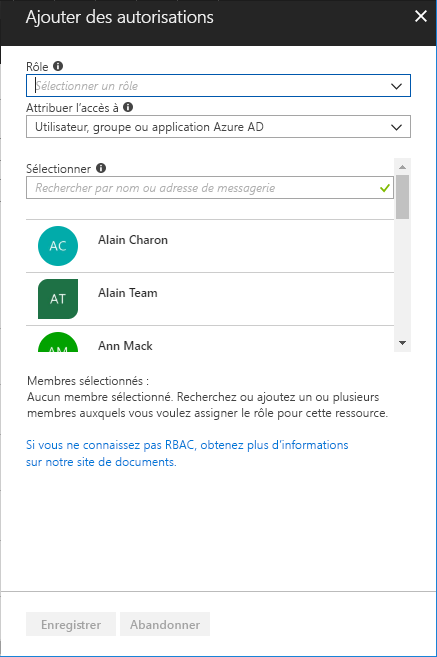

# Démarrage rapide : Accorder l’accès à un utilisateur avec RBAC et le portail Azure

Le contrôle d’accès en fonction du rôle (RBAC) vous permet de gérer l’accès aux ressources dans Azure. Dans ce guide de démarrage rapide, vous autorisez un utilisateur à créer et à gérer des machines virtuelles dans un groupe de ressources.

Si vous n’avez pas d’abonnement Azure, créez un [compte gratuit](https://azure.microsoft.com/free/?WT.mc_id=A261C142F) avant de commencer.

## Connexion à Azure

Connectez-vous au portail Azure sur http://portal.azure.com.

## Créer un groupe de ressources

1. Dans la liste de navigation, sélectionnez **Groupes de ressources**.

1. Choisissez **Ajouter** pour ouvrir le panneau **Groupe de ressources**.

   

1. Dans **Nom du groupe de ressources**, entrez **rbac-quickstart-resource-group**.

1. Sélectionnez un abonnement et un emplacement.

1. Choisissez **Créer** pour créer le groupe de ressources.

1. Choisissez **Actualiser** pour actualiser la liste des groupes de ressources.

   Le nouveau groupe de ressources apparaît dans la liste de vos groupes de ressources.

   

## Accorder l'accès

Dans le contrôle d’accès en fonction du rôle, vous créez une attribution de rôle pour accorder l’accès.

1. Dans la liste **Groupes de ressources**, choisissez le nouveau groupe de ressources **rbac-quickstart-resource-group**.

1. Choisissez **Contrôle d’accès (IAM)** pour afficher la liste actuelle des attributions de rôles.

   

1. Choisissez **Ajouter** pour ouvrir le volet **Ajouter des autorisations**.

   Si vous n’êtes pas autorisé à attribuer des rôles, l’option **Ajouter** ne s’affiche pas.

   

1. Dans la liste déroulante **Rôle**, sélectionnez **Contributeur de machines virtuelles**.

1. Dans la liste **Sélectionner**, sélectionnez un utilisateur : vous-même ou un autre.

1. Sélectionnez **Enregistrer** pour créer l’attribution de rôle.

   Après quelques instants, l’utilisateur se voit attribuer le rôle Contributeur de machines virtuelles dans l’étendue du groupe de ressources rbac-quickstart-resource-group.

   

## Suppression d'accès

Dans le RBAC, vous supprimez une attribution de rôle pour supprimer un accès.

1. Dans la liste des attributions de rôles, ajoutez une coche en regard de l’utilisateur titulaire du rôle Contributeur de machines virtuelles.

1. Choisissez **Supprimer**.

   

1. Dans le message d’attribution de rôle qui s’affiche, choisissez **Oui**.

## Nettoyer

1. Dans la liste de navigation, sélectionnez **Groupes de ressources**.

1. Choisissez **rbac-quickstart-resource-group** pour ouvrir le groupe de ressources.

1. Choisissez **Supprimez le groupe de ressources** pour supprimer le groupe de ressources.

   

1. Dans le panneau **Voulez-vous vraiment supprimer**, tapez le nom du groupe de ressources : **rbac-quickstart-resource-group**.

1. Choisissez **Supprimer** pour supprimer le groupe de ressources.

## Étapes suivantes

> [!div class="nextstepaction"]
> [Tutoriel : Accorder l’accès à un utilisateur avec RBAC et PowerShell](tutorial-role-assignments-user-powershell.md)

