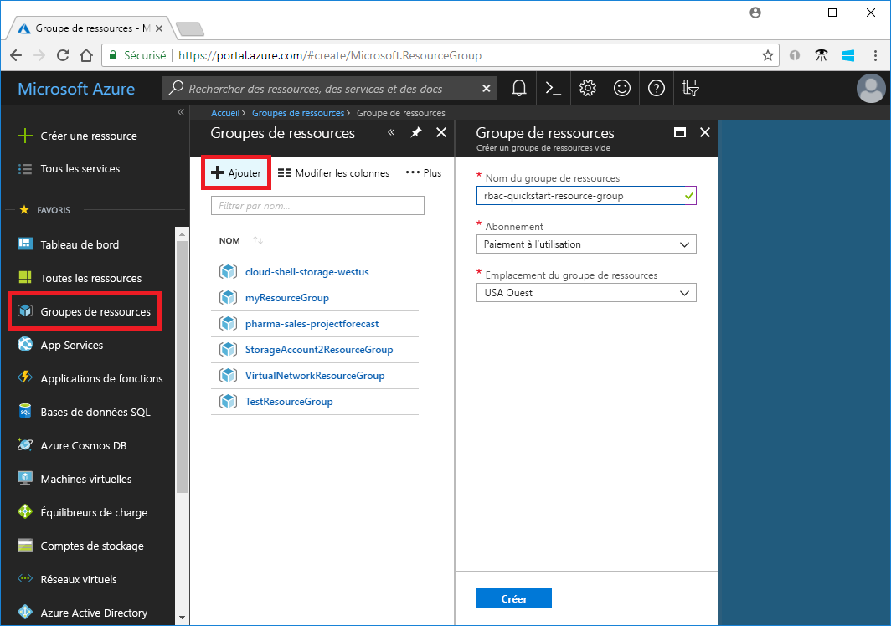
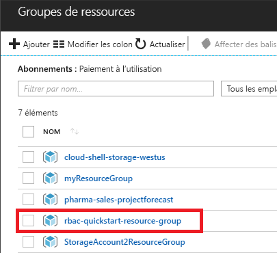
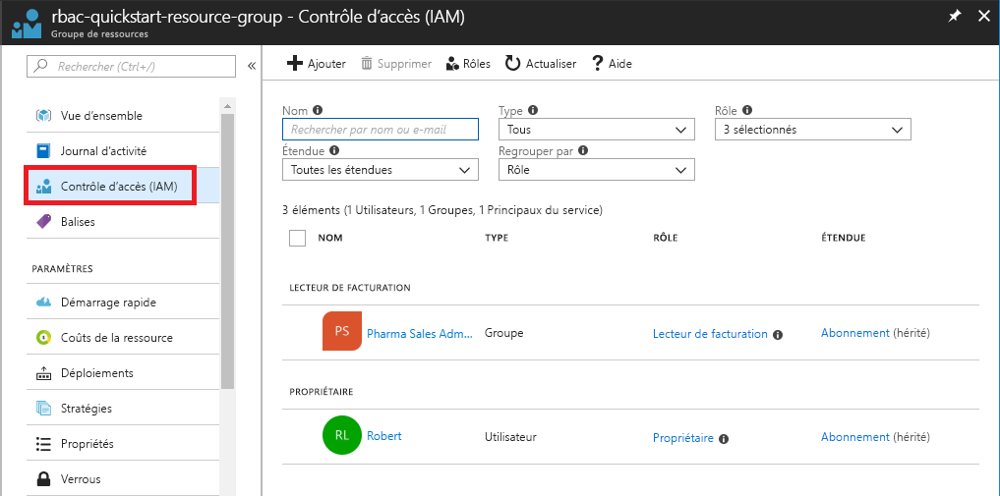
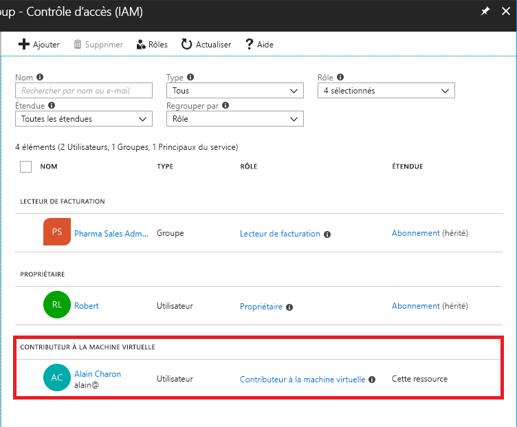
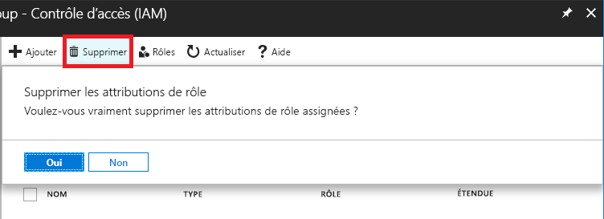
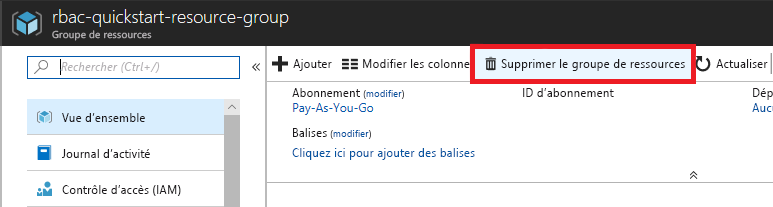

# Tutoriel : Accorder un accès utilisateur aux ressources Azure à l’aide du portail Azure

Le [contrôle d’accès en fonction du rôle Azure (RBAC Azure)](overview.md) vous permet de gérer l’accès aux ressources Azure. Dans ce tutoriel, vous allez autoriser un utilisateur à créer et à gérer des machines virtuelles dans un groupe de ressources.

Dans ce tutoriel, vous allez apprendre à :

> [!div class="checklist"]
> * Accorder l’accès à un utilisateur au niveau du groupe de ressources
> * Suppression d'accès

Si vous n’avez pas d’abonnement Azure, créez un [compte gratuit](https://azure.microsoft.com/free/?WT.mc_id=A261C142F) avant de commencer.

## Connexion à Azure

Connectez-vous au portail Azure sur https://portal.azure.com.

## Créer un groupe de ressources

1. Dans la liste de navigation, cliquez sur **Groupes de ressources**.

1. Cliquez sur **Ajouter** pour ouvrir le panneau **Groupe de ressources**.

   

1. Dans **Nom du groupe de ressources**, entrez **rbac-resource-group**.

1. Sélectionnez un abonnement et un emplacement.

1. Cliquez sur **Créer** pour créer le groupe de ressources.

1. Cliquez sur **Actualiser** pour actualiser la liste des groupes de ressources.

   Le nouveau groupe de ressources apparaît dans la liste de vos groupes de ressources.

   

## Accorder l'accès

Dans le contrôle d’accès en fonction du rôle Azure, vous créez une attribution de rôle pour accorder l’accès.

1. Dans la liste **Groupes de ressources**, cliquez sur le nouveau groupe de ressources **rbac-resource-group**.

1. Cliquez sur **Contrôle d’accès (IAM)** .

1. Cliquez sur l’onglet **Attributions de rôles** pour afficher la liste actuelle des attributions de rôles.

   

1. Cliquez sur **Ajouter** > **Ajouter une attribution de rôle** pour ouvrir le volet Ajouter une attribution de rôle.

   Si vous n’avez pas les autorisations pour attribuer des rôles, l’option Ajouter une attribution de rôle sera désactivée.

   

    Le volet Ajouter une attribution de rôle s’ouvre.

   

1. Dans la liste déroulante **Rôle**, sélectionnez **Contributeur de machines virtuelles**.

1. Dans la liste **Sélectionner**, sélectionnez un utilisateur : vous-même ou un autre.

1. Cliquez sur **Enregistrer** pour créer l’attribution de rôle.

   Après quelques instants, l’utilisateur se voit attribuer le rôle Contributeur de machines virtuelles dans l’étendue du groupe de ressources rbac-resource-group.

   

## Suppression d'accès

Dans le RBAC Azure, pour supprimer un accès, vous supprimez une attribution de rôle.

1. Dans la liste des attributions de rôles, ajoutez une coche en regard de l’utilisateur titulaire du rôle Contributeur de machines virtuelles.

1. Cliquez sur **Supprimer**.

   

1. Dans le message d’attribution de rôle qui s’affiche, cliquez sur **Oui**.

## Nettoyer

1. Dans la liste de navigation, cliquez sur **Groupes de ressources**.

1. Cliquez sur **rbac-resource-group** pour ouvrir le groupe de ressources.

1. Cliquez sur **Supprimer le groupe de ressources** pour supprimer le groupe de ressources.

   

1. Dans le panneau **Voulez-vous vraiment supprimer**, tapez le nom du groupe de ressources : **rbac-resource-group**.

1. Cliquez sur **Supprimer** pour supprimer le groupe de ressources.

## Étapes suivantes

> [!div class="nextstepaction"]
> [Tutoriel : Accorder un accès utilisateur aux ressources Azure à l’aide d’Azure PowerShell](tutorial-role-assignments-user-powershell.md)
