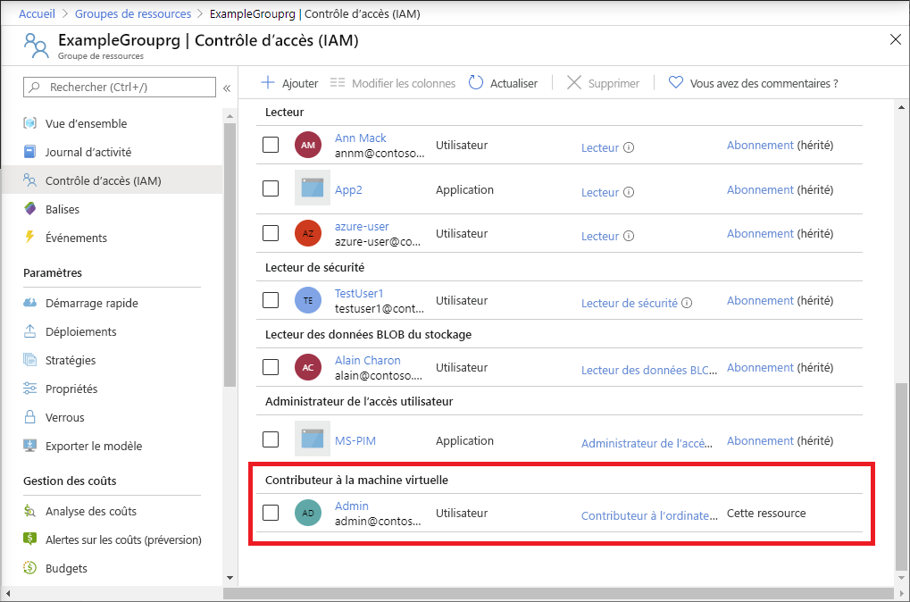

# <a name="quickstart-add-an-azure-role-assignment-using-an-arm-template"></a>Démarrage rapide : Ajouter une attribution de rôle Azure à l’aide d’un modèle ARM

Le [contrôle d’accès en fonction du rôle Azure (RBAC Azure)](overview.md) vous permet de gérer l’accès aux ressources Azure. Dans ce démarrage rapide, vous allez créer un groupe de ressources et autoriser un utilisateur à créer et à gérer des machines virtuelles dans le groupe de ressources. Ce guide de démarrage rapide utilise un modèle Azure Resource Manager (modèle ARM) pour accorder l’accès.

[!INCLUDE [About Azure Resource Manager](../../includes/resource-manager-quickstart-introduction.md)]

Si votre environnement remplit les prérequis et que vous êtes déjà familiarisé avec l’utilisation des modèles ARM, sélectionnez le bouton **Déployer sur Azure**. Le modèle s’ouvre dans le portail Azure.

[](https://portal.azure.com/#create/Microsoft.Template/uri/https%3A%2F%2Fraw.githubusercontent.com%2FAzure%2Fazure-quickstart-templates%2Fmaster%2F101-rbac-builtinrole-resourcegroup%2Fazuredeploy.json)

## <a name="prerequisites"></a>Prérequis

Pour ajouter des attributions de rôles, vous devez disposer :

- Si vous n’avez pas d’abonnement Azure, créez un [compte gratuit](https://azure.microsoft.com/free/?WT.mc_id=A261C142F) avant de commencer.
- d’autorisations `Microsoft.Authorization/roleAssignments/write` et `Microsoft.Authorization/roleAssignments/delete`, telles que [Administrateur de l’accès utilisateur](built-in-roles.md#user-access-administrator) ou [Propriétaire de l’accès utilisateur](built-in-roles.md#owner)
- Pour ajouter une attribution de rôle, vous devez spécifier trois éléments : un principal de sécurité, une définition de rôle et une étendue. Pour ce démarrage rapide, vous ou un autre utilisateur dans votre annuaire avez le rôle de principal de sécurité, la définition de rôle est [Contributeur de machine virtuelle](built-in-roles.md#virtual-machine-contributor) et l’étendue est un groupe de ressources que vous spécifiez.

## <a name="review-the-template"></a>Vérifier le modèle

Le modèle utilisé dans ce démarrage rapide est tiré des [modèles de démarrage rapide Azure](https://azure.microsoft.com/resources/templates/101-rbac-builtinrole-resourcegroup/). Le modèle a trois paramètres et une section de ressources. Notez que la section de ressources contient les trois éléments d’une attribution de rôle : principal de sécurité, définition de rôle et étendue.

:::code language="json" source="~/quickstart-templates/101-rbac-builtinrole-resourcegroup/azuredeploy.json" highlight="30-32":::

La ressource définie dans le modèle est :

- [Microsoft.Authorization/roleAssignments](/azure/templates/Microsoft.Authorization/roleAssignments)

## <a name="deploy-the-template"></a>Déployer le modèle

1. Connectez-vous au [portail Azure](https://portal.azure.com).

1. Déterminez votre adresse e-mail associée à votre abonnement Azure. Ou déterminez l’adresse e-mail d’un autre utilisateur dans votre annuaire.

1. Ouvrez Azure Cloud Shell pour PowerShell.

1. Copiez et collez le script suivant dans Cloud Shell.

    ```azurepowershell
    $resourceGroupName = Read-Host -Prompt "Enter a resource group name (i.e. ExampleGrouprg)"
    $emailAddress = Read-Host -Prompt "Enter an email address for a user in your directory"
    $location = Read-Host -Prompt "Enter a location (i.e. centralus)"
    
    $roleAssignmentName = New-Guid
    $principalId = (Get-AzAdUser -Mail $emailAddress).id
    $roleDefinitionId = (Get-AzRoleDefinition -name "Virtual Machine Contributor").id
    $templateUri = "https://raw.githubusercontent.com/Azure/azure-quickstart-templates/master/101-rbac-builtinrole-resourcegroup/azuredeploy.json"
    
    New-AzResourceGroup -Name $resourceGroupName -Location $location
    New-AzResourceGroupDeployment -ResourceGroupName $resourceGroupName -TemplateUri $templateUri -roleAssignmentName $roleAssignmentName -roleDefinitionID $roleDefinitionId -principalId $principalId
    ```

1. Entrez un nom de groupe de ressources, comme ExampleGrouprg.

1. Entrez une adresse e-mail pour vous-même ou un autre utilisateur de votre annuaire.

1. Entrez un emplacement pour le groupe de ressources, comme USA Centre.

1. Si nécessaire, appuyez sur Entrée pour exécuter la commande New-AzResourceGroupDeployment.

    La commande [New-AzResourceGroup](/powershell/module/az.resources/new-azresourcegroup) crée un groupe de ressources et la commande [New-AzResourceGroupDeployment](/powershell/module/az.resources/new-azresourcegroupdeployment) déploie le modèle pour ajouter l’attribution de rôle.

    Vous devez obtenir une sortie similaire à la suivante :

    ```azurepowershell
    PS> New-AzResourceGroupDeployment -ResourceGroupName $resourceGroupName -TemplateUri $templateUri -roleAssignmentName $roleAssignmentName -roleDefinitionID $roleDefinitionId -principalId $principalId
    
    DeploymentName          : azuredeploy
    ResourceGroupName       : ExampleGrouprg
    ProvisioningState       : Succeeded
    Timestamp               : 5/22/2020 9:01:30 PM
    Mode                    : Incremental
    TemplateLink            :
                              Uri            : https://raw.githubusercontent.com/Azure/azure-quickstart-templates/master/101-rbac-builtinrole-resourcegroup/azuredeploy.json
                              ContentVersion : 1.0.0.0
    
    Parameters              :
                              Name                  Type                       Value
                              ====================  =========================  ==========
                              roleAssignmentName    String                     {roleAssignmentName}
                              roleDefinitionID      String                     9980e02c-c2be-4d73-94e8-173b1dc7cf3c
                              principalId           String                     {principalId}
    
    Outputs                 :
    DeploymentDebugLogLevel :
    ```

## <a name="review-deployed-resources"></a>Vérifier les ressources déployées

1. Sur le portail Azure, ouvrez le groupe de ressources que vous venez de créer.

1. Dans le menu de gauche, cliquez sur **Contrôle d’accès (IAM)** .

1. Cliquez sur l’onglet **Attributions de rôles**.

1. Vérifiez que le rôle **Contributeur de machine virtuelle** est attribué à l’utilisateur que vous avez spécifié.

   

## <a name="clean-up-resources"></a>Nettoyer les ressources

Pour supprimer l’attribution de rôle et le groupe de ressources que vous avez créés, procédez comme suit.

1. Copiez et collez le script suivant dans Cloud Shell.

    ```azurepowershell
    $emailAddress = Read-Host -Prompt "Enter the email address of the user with the role assignment to remove"
    $resourceGroupName = Read-Host -Prompt "Enter the resource group name to remove (i.e. ExampleGrouprg)"
    
    $principalId = (Get-AzAdUser -Mail $emailAddress).id
    
    Remove-AzRoleAssignment -ObjectId $principalId -RoleDefinitionName "Virtual Machine Contributor" -ResourceGroupName $resourceGroupName
    Remove-AzResourceGroup -Name $resourceGroupName
    ```
    
1. Entrez l’adresse e-mail de l’utilisateur avec l’attribution de rôle à supprimer.

1. Entrez le nom du groupe de ressources à supprimer, comme ExampleGrouprg.

1. Si nécessaire, appuyez sur Entrée pour exécuter la commande Remove-AzResourceGroup.

1. Entrez **Y** pour confirmer la suppression du groupe de ressources.

## <a name="next-steps"></a>Étapes suivantes

> [!div class="nextstepaction"]
> [Tutoriel : Accorder un accès utilisateur aux ressources Azure à l’aide d’Azure PowerShell](tutorial-role-assignments-user-powershell.md)