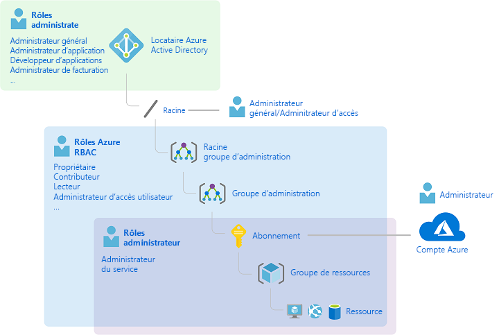
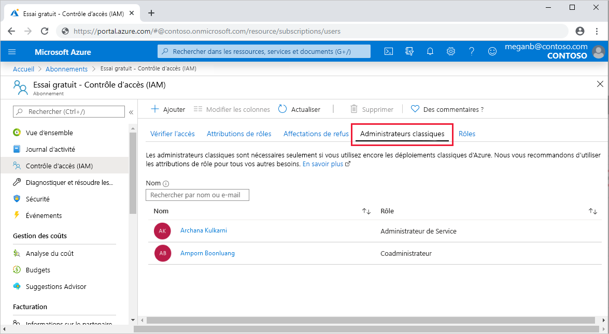
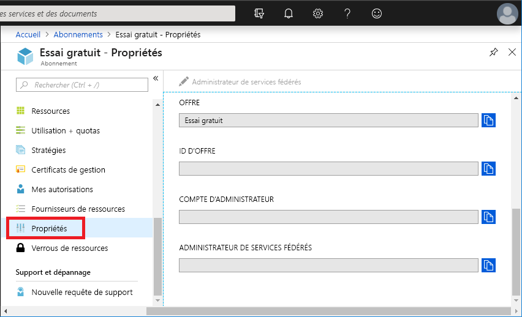
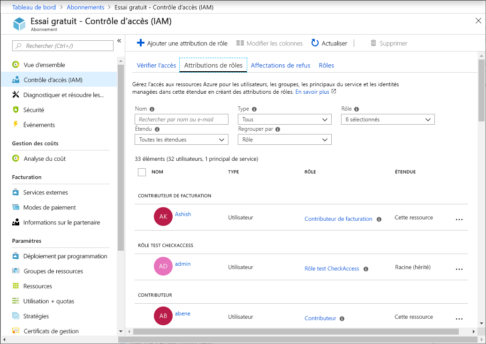
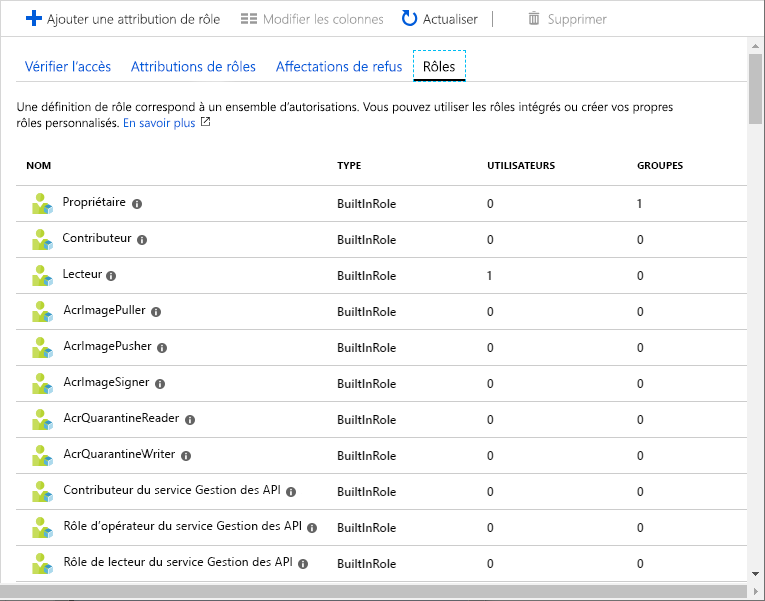
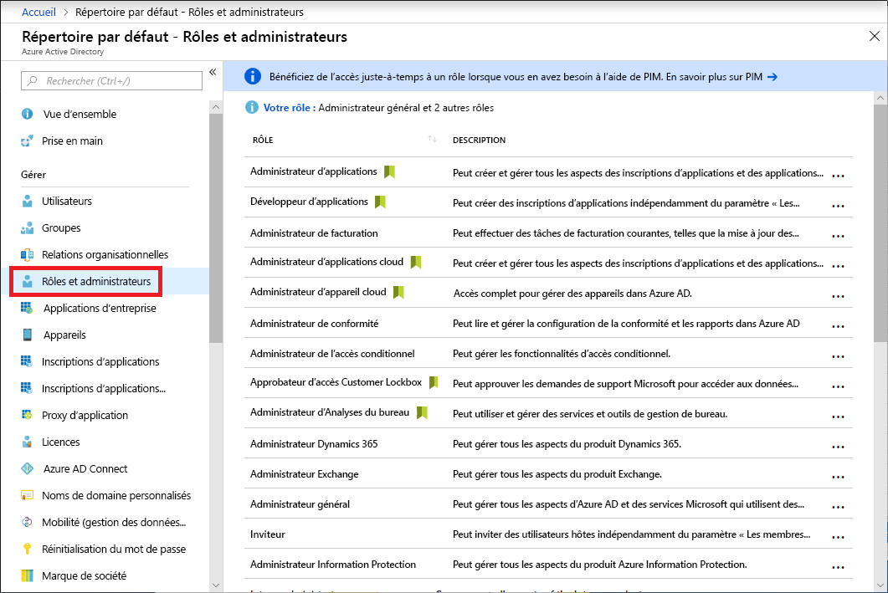
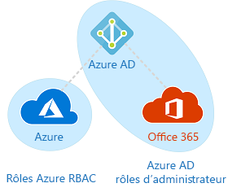

# Rôles d’administrateur d’abonnement classique, rôles RBAC Azure et rôles d’administrateur Azure AD

Si vous débutez sur Azure, vous trouverez peut-être un peu difficile de comprendre l’ensemble des différents rôles dans Azure. Cet article vous aide en décrivant les rôles suivants et en indiquant quand les utiliser :
- Rôles d’administrateur d’abonnements classique
- Rôles de contrôle d’accès en fonction du rôle (RBAC) Azure
- Rôles d’administrateur Azure Active Directory (Azure AD)

## Relation entre les rôles

Pour mieux comprendre les rôles dans Azure, connaître leur historique peut aider. Quand Azure a été publié au départ, l’accès aux ressources était géré avec seulement trois rôles d’administrateur : administrateur de comptes, administrateur de services et coadministrateur. Par la suite, le contrôle d’accès en fonction du rôle (RBAC) a été ajouté pour les ressources Azure. Le contrôle RBAC Azure est un système d’autorisations plus récent qui fournit une gestion précise des accès aux ressources Azure. Le contrôle RBAC compte de nombreux rôles intégrés, peut être assigné à différentes étendues et vous permet de créer vos propres rôles personnalisés. Pour gérer les ressources dans Azure AD, comme les utilisateurs, les groupes et les domaines, il existe plusieurs rôles d’administrateur Azure AD.

Le diagramme suivant est une vue d’ensemble des relations entre les rôles d’administrateur d’abonnements classique, les rôles RBAC Azure et les rôles d’administrateur Azure AD.

## Rôles d’administrateur d’abonnements classique

Dans Azure, les trois rôles d’administrateur d’abonnements classique sont Administrateur de comptes, Administrateur de services et Coadministrateur. Les administrateurs d’abonnements classiques ont un accès total à l’abonnement Azure. Ils peuvent gérer les ressources en utilisant le portail Azure, les API Azure Resource Manager et les API du modèle de déploiement classique. Le compte qui est utilisé pour l’inscription à Azure est automatiquement défini en tant qu’administrateur de compte et administrateur de services fédérés. Par la suite, des coadministrateurs peuvent être ajoutés. Les administrateurs de services et les coadministrateurs ont un accès équivalent aux utilisateurs qui ont reçu le rôle Propriétaire (rôle RBAC Azure) sur l’étendue de l’abonnement. Le tableau suivant décrit les différences entre ces trois rôles d’administrateurs d’abonnements classiques.

| Administrateur d’abonnements classiques | Limite | Autorisations | Notes |
| --- | --- | --- | --- |
| Administrateur de comptes | 1 par compte Azure | <ul><li>Accès au [Centre des comptes Azure](https://account.azure.com/Subscriptions)</li><li>Gestion de tous les abonnements d’un compte</li><li>Création de nouveaux abonnements</li><li>Annulation d’abonnements</li><li>Changement du mode de facturation d’un abonnement</li><li>Changement d’administrateur de services</li></ul> | Le concept est qu’il est propriétaire de la facturation de l’abonnement. L’Administrateur de compte n’a pas accès au portail Azure. |
| Administrateur de services | 1 par abonnement Azure | <ul><li>Gestion des services dans le [portail Azure](https://portal.azure.com)</li><li>Annuler l’abonnement</li><li>Attribution d’utilisateurs au rôle Coadministrateur</li></ul> | Par défaut, pour un nouvel abonnement, l’administrateur de compte est également l’administrateur de services fédérés. L’administrateur de services dispose de l’accès équivalent à un utilisateur qui se voit attribuer le rôle Propriétaire sur l’étendue de l’abonnement. L’Administrateur de service a un accès complet au portail Azure. |
| Coadministrateur | 200 par abonnement | <ul><li>Mêmes privilèges d’accès que l’administrateur de services, à ceci près qu’il ne peut pas changer l’association des abonnements aux annuaires Azure</li><li>Attribution des utilisateurs au rôle Coadministrateur, mais ne peut pas changer d’administrateur de services</li></ul> | Le coadministrateur dispose de l’accès équivalent à un utilisateur qui se voit attribuer le rôle Propriétaire sur l’étendue de l’abonnement. |

Sur le portail Azure, vous pouvez gérer les Coadministrateurs ou afficher l’Administrateur de Service sous l’onglet **Administrateurs classiques**.

Sur le portail Azure, vous pouvez afficher ou modifier l’Administrateur de Service ou afficher l’Administrateur de compte dans le panneau des propriétés de votre abonnement.

Pour plus d’informations, consultez [Administrateurs d’abonnement Azure Classic](classic-administrators.md).

### Compte Azure et abonnements Azure

Un compte Azure représente une relation de facturation. Un compte Azure est une identité d’utilisateur, un ou plusieurs abonnements Azure et un ensemble de ressources Azure associé. La personne qui crée le compte est l’administrateur de comptes de tous les abonnements créés dans ce compte. Cette personne est également l’administrateur de services par défaut de l’abonnement.

Les abonnements Azure vous permettent d’organiser l’accès aux ressources Azure. Ils vous permettent également de contrôler le signalement, la facturation et le paiement des ressources utilisées. Comme chaque abonnement peut avoir une configuration de facturation et de paiement différente, vous pouvez avoir différents abonnements et différents plans par bureau, service, projet, etc. Chaque service appartient à un abonnement, et l’ID d’abonnement peut être nécessaire pour les opérations de programmation.

Chaque abonnement est associé à un annuaire Azure AD. Pour identifier l’annuaire auquel est associé l’abonnement, ouvrez **Abonnements** dans le portail Azure, puis sélectionnez un abonnement pour voir l’annuaire.

Les comptes et les abonnements sont gérés dans le [Centre des comptes Azure](https://account.azure.com/Subscriptions).

## Rôles RBAC Azure

Le contrôle RBAC Azure est un système d’autorisations basé sur [Azure Resource Manager](../azure-resource-manager/management/overview.md) qui offre une gestion précise des accès aux ressources Azure, comme les ressources de calcul et de stockage. Le contrôle RBAC Azure compte plus de 70 rôles intégrés. Il existe quatre rôles RBAC fondamentaux. Les trois premiers s’appliquent à tous les types de ressources :

| Rôle RBAC Azure | Autorisations | Notes |
| --- | --- | --- |
| [Propriétaire](built-in-roles.md#owner) | <ul><li>Accès total à toutes les ressources</li><li>Délégation de l’accès à d’autres personnes</li></ul> | L’administrateur de services et les coadministrateurs se voient attribuer le rôle Propriétaire dans l’étendue de l’abonnement S’applique à tous les types de ressources. |
| [Contributeur](built-in-roles.md#contributor) | <ul><li>Création et gestion de tous les types de ressources Azure</li><li>Ne peut pas accorder l’accès à d’autres personnes</li></ul> | S’applique à tous les types de ressources. |
| [Lecteur](built-in-roles.md#reader) | <ul><li>Consultation des ressources Azure</li></ul> | S’applique à tous les types de ressources. |
| [Administrateur de l'accès utilisateur](built-in-roles.md#user-access-administrator) | <ul><li>Gestion de l’accès utilisateur aux ressources Azure</li></ul> |  |

Les autres rôles intégrés permettent de gérer des ressources Azure spécifiques. Par exemple, le rôle [Contributeur de machines virtuelles](built-in-roles.md#virtual-machine-contributor) permet à l’utilisateur de créer et de gérer des machines virtuelles. Pour obtenir la liste de tous les rôles intégrés, consultez [Rôles intégrés pour les ressources Azure](built-in-roles.md).

Seuls le portail Azure et les API Azure Resource Manager prennent en charge RBAC. Les utilisateurs, les groupes et les applications qui se voient attribuer des rôles RBAC ne peuvent pas utiliser les [API du modèle de déploiement classique Azure](../azure-resource-manager/management/deployment-models.md).

Dans le portail Azure, les attributions de rôles avec RBAC s’affichent dans le panneau **Contrôle d’accès (IAM)** . Ce panneau se trouve dans le portail, notamment pour les groupes d’administration, les abonnements, les groupes de ressources et diverses ressources.

Quand vous cliquez sur l’onglet **Rôles**, vous voyez la liste des rôles intégrés et personnalisés.

Pour plus d’informations, consultez [Gérer l’accès aux ressources Azure à l’aide de RBAC et du portail Azure](role-assignments-portal.md).

## Rôles d’administrateur Azure AD

Les rôles d’administrateur Azure AD sont utilisés pour gérer les ressources Azure AD d’un annuaire, par exemple pour créer ou changer des utilisateurs, attribuer des rôles d’administration à d’autres personnes, réinitialiser les mots de passe des utilisateurs, gérer les licences utilisateur et gérer les domaines. Le tableau suivant décrit quelques-uns des rôles d’administrateur Azure AD plus importants.

| Rôle d’administrateur Azure AD | Autorisations | Notes |
| --- | --- | --- |
| [Administrateur général](../active-directory/users-groups-roles/directory-assign-admin-roles.md#company-administrator-permissions) | <ul><li>Gestion de l’accès à toutes les fonctionnalités d’administration dans Azure Active Directory, ainsi que les services qui sont fédérés à Azure Active Directory</li><li>Attribution des rôles d’administrateur à d’autres personnes</li><li>Réinitialisation des mots de passe des utilisateurs et de tous les autres administrateurs</li></ul> | La personne qui s’inscrit au locataire Azure Active Directory devient administrateur général. |
| [Administrateur d’utilisateurs](../active-directory/users-groups-roles/directory-assign-admin-roles.md#user-administrator) | <ul><li>Création et gestion de tous les aspects liés aux utilisateurs et aux groupes</li><li>Gestion des tickets de support</li><li>Suivi de l’intégrité des services</li><li>Changement des mots de passe des utilisateurs, des administrateurs du support technique et autres administrateurs d’utilisateurs</li></ul> |  |
| [Administrateur de facturation](../active-directory/users-groups-roles/directory-assign-admin-roles.md#billing-administrator) | <ul><li>Achats</li><li>Gérer les abonnements</li><li>Gestion des tickets de support</li><li>Suivi de l’intégrité des services</li></ul> |  |

Dans le portail Azure, vous pouvez voir la liste des rôles d’administrateur Azure AD dans le panneau **Rôles et administrateurs**. Pour obtenir une liste de tous les rôles d’administrateur Azure AD, consultez [Autorisations des rôles d’administrateur dans Azure Active Directory](../active-directory/users-groups-roles/directory-assign-admin-roles.md).

## Différences entre les rôles RBAC Azure et les rôles d’administrateur Azure AD

Globalement, les rôles RBAC Azure contrôlent les autorisations pour gérer les ressources Azure, tandis que les rôles d’administrateur Azure AD contrôlent les autorisations pour gérer les ressources Azure Active Directory. Le tableau suivant compare quelques différences.

| Rôles RBAC Azure | Rôles d’administrateur Azure AD |
| --- | --- |
| Gérer l’accès aux ressources Azure | Gérer l’accès aux ressources Azure Active Directory |
| Prise en charge des rôles personnalisés | Prise en charge des rôles personnalisés |
| L’étendue peut être spécifiée à plusieurs niveaux (groupe d’administration, abonnement, groupe de ressources, ressource) | L’étendue est au niveau du locataire |
| Les informations sur les rôles sont accessibles dans le portail Azure, Azure CLI, Azure PowerShell, les modèles Azure Resource Manager et l’API REST | Les informations sur les rôles sont accessibles dans le portail d’administration Azure, le centre d’administration Office 365, Microsoft Graph et AzureAD PowerShell |

### Les rôles RBAC Azure et les rôles d’administrateur Azure AD se chevauchent-ils ?

Par défaut, les rôles RBAC Azure et les rôles d’administrateur Azure AD ne couvrent pas Azure et Azure AD. Toutefois, si un administrateur général élève son accès en choisissant **L'administrateur général peut gérer les groupes d'administration et les abonnements Azure** dans le portail Azure, il reçoit le rôle [Administrateur de l’accès utilisateur](built-in-roles.md#user-access-administrator) (rôle RBAC) sur tous les abonnements d’un locataire spécifique. Le rôle Administrateur de l’accès utilisateur permet à l’utilisateur d’accorder à d’autres utilisateurs l’accès aux ressources Azure. Ce commutateur peut être utile pour récupérer l’accès à un abonnement. Pour plus d’informations, consultez [Élever l’accès en tant qu’administrateur Azure AD](elevate-access-global-admin.md).

Plusieurs rôles d’administrateur Azure AD couvrent Azure AD et Microsoft Office 365, tels que les rôles Administrateur général et Administrateur d’utilisateurs. Par exemple, si vous êtes membre du rôle Administrateur général, vous disposez des fonctionnalités de l’administrateur général dans Azure AD et Office 365, avec par exemple la possibilité d’apporter des changements dans Microsoft Exchange et Microsoft SharePoint. Toutefois, par défaut, l’administrateur général n’a pas accès aux ressources Azure.

## Étapes suivantes

- [Qu’est-ce que le contrôle d’accès en fonction du rôle (RBAC) pour les ressources Azure ?](overview.md)
- [Autorisations des rôles d'administrateur dans Azure Active Directory](../active-directory/users-groups-roles/directory-assign-admin-roles.md)
- [Administrateurs d’abonnement Azure Classic](classic-administrators.md)
