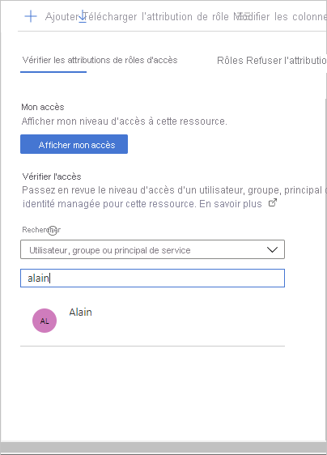
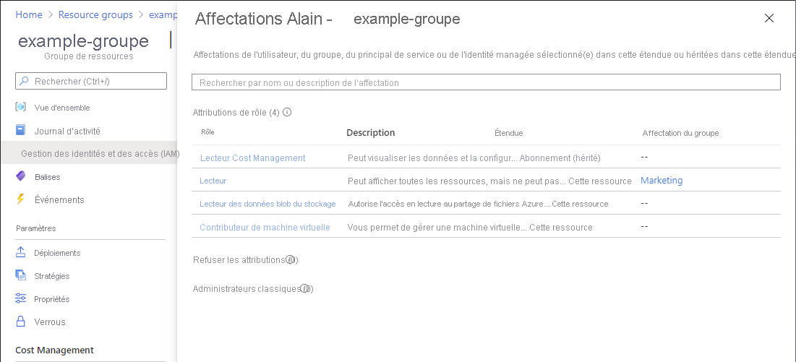

# Répertorier les attributions de rôles Azure à l’aide du portail Azure

[!INCLUDE [Azure RBAC definition list access](../../includes/role-based-access-control/definition-list.md)] Cet article explique comment lister les attributions de rôles à l’aide du portail Azure.

> [!NOTE]
> Si votre organisation possède des fonctions de gestion externalisées pour un fournisseur de services qui utilise la [gestion des ressources déléguées Azure](../lighthouse/concepts/azure-delegated-resource-management.md), les attributions de rôles autorisées par ce fournisseur de services ne seront pas affichées ici.

## Lister les attributions de rôles pour un utilisateur ou un groupe

Une façon rapide de voir les rôles attribués à un utilisateur ou à un groupe dans un abonnement consiste à utiliser le volet **Attributions de rôles Azure**.

1. Dans le Portail Azure, sélectionnez **Tous les services** dans le menu Portail Azure.

1. Sélectionnez **Azure Active Directory**, puis **Utilisateurs** ou **Groupes**.

1. Cliquez sur l’utilisateur ou le groupe pour lequel vous voulez lister les attributions de rôles.

1. Cliquez sur **Attributions de rôles Azure**.

    Vous voyez une liste de rôles attribués à l’utilisateur ou au groupe sélectionné dans différentes étendues, comme un groupe d’administration, un abonnement, un groupe de ressources ou une ressource. Cette liste inclut toutes les attributions de rôles que vous êtes autorisé à lire.

        

1. Pour changer d’abonnement, cliquez sur la liste **Abonnements**.

## Répertorier les propriétaires d’un abonnement

Les utilisateurs qui se sont vu attribuer le rôle [Propriétaire](built-in-roles.md#owner) pour un abonnement peuvent gérer tous les éléments de l’abonnement. Procédez comme suit pour répertorier les propriétaires d’un abonnement.

1. Dans le portail Azure, cliquez sur **Tous les services**, puis sur **Abonnements**.

1. Cliquez sur l’abonnement dont vous souhaitez répertorier les propriétaires.

1. Cliquez sur **Contrôle d’accès (IAM)** .

1. Cliquez sur l’onglet **Attributions de rôles** afin d’afficher toutes les attributions de rôles pour cet abonnement.

1. Faites défiler la page jusqu’à la section **Propriétaires** pour voir tous les utilisateurs auxquels le rôle Propriétaire a été attribué pour cet abonnement.

   

## Lister les attributions de rôles dans une étendue

1. Dans le portail Azure, cliquez sur **Tous les services**, puis sélectionnez l’étendue. Par exemple, vous pouvez sélectionner **Groupes d’administration**, **Abonnements**, **Groupes de ressources**, ou une ressource.

1. Cliquez sur la ressource spécifique.

1. Cliquez sur **Contrôle d’accès (IAM)** .

1. Cliquez sur l’onglet **Attributions de rôles** afin d’afficher toutes les attributions de rôles pour cette étendue.

   

   L’onglet Attributions de rôles indique les personnes qui ont accès à cette étendue. Notez que certains rôles sont inclus dans l’étendue de **cette ressource**, tandis que d’autres sont **hérités** à partir d’une autre étendue. L’accès est attribué spécifiquement à cette ressource ou hérité d’une affectation à l’étendue parente.

## Lister les attributions de rôles pour un utilisateur dans une étendue

Pour lister l’accès pour un utilisateur, un groupe, un principal de service ou une identité managée, vous listez leurs attributions de rôles. Suivez ces étapes pour lister les attributions de rôles pour un utilisateur, un groupe, un principal de service ou une identité managée dans une étendue particulière.

1. Dans le portail Azure, cliquez sur **Tous les services**, puis sélectionnez l’étendue. Par exemple, vous pouvez sélectionner **Groupes d’administration**, **Abonnements**, **Groupes de ressources**, ou une ressource.

1. Cliquez sur la ressource spécifique.

1. Cliquez sur **Contrôle d’accès (IAM)** .

1. Cliquez sur l’onglet **Vérifier l’accès**.

    

1. Dans la liste **Rechercher**, sélectionnez l’utilisateur, le groupe, le principal de service ou l’identité managée dont vous souhaitez vérifier l’accès.

1. Dans la zone de recherche, entrez une chaîne afin de rechercher, dans le répertoire, des noms d’affichage, des adresses e-mail ou des identificateurs d’objet.

    

1. Cliquez sur le principal de sécurité pour ouvrir le volet **Affectations**.

    Dans ce volet, vous pouvez voir l’accès du principal de sécurité sélectionné pour cette étendue et celui hérité de cette étendue. Les affectations pour les étendues enfants ne sont pas listées. Les affectations suivantes s'affichent :

    - Attributions de rôle ajoutées avec RBAC Azure.
    - Affectations de refus ajoutées à l’aide d’Azure Blueprints ou des applications managées Azure.
    - Affectations de l’administrateur de service classique ou de coadministrateurs pour les déploiements classiques. 

    

## Lister les attributions de rôles pour une identité managée

Vous pouvez répertorier les attributions de rôles pour les identités gérées attribuées par le système et affectées par l’utilisateur au niveau d’une étendue particulière à l’aide du panneau de **Contrôle d’accès (IAM)** , comme décrit précédemment. Cette section décrit comment répertorier les attributions de rôles uniquement pour l’identité managée.

### Identité managée affectée par le système

1. Dans le Portail Azure, ouvrez une identité gérée affectée par le système.

1. Dans le menu de gauche, cliquez sur **identité**.

    

1. Sous **Autorisations**, cliquez sur **Attributions de rôles Azure**.

    Vous voyez une liste de rôles affectés à l’identité gérée affectée par le système sélectionnée à différentes étendues, telles que groupe d’administration, abonnement, groupe de ressources ou ressource. Cette liste inclut toutes les attributions de rôles que vous êtes autorisé à lire.

    

1. Pour changer d’abonnement, cliquez sur la liste **Abonnement**.

### Identité managée affectée par l’utilisateur

1. Dans le Portail Azure, ouvrez une identité gérée affectée par l’utilisateur.

1. Cliquez sur **Attributions de rôles Azure**.

    Vous voyez une liste de rôles affectés à l’identité gérée affectée à l’utilisateur sélectionnée à différentes étendues, telles que groupe d’administration, abonnement, groupe de ressources ou ressource. Cette liste inclut toutes les attributions de rôles que vous êtes autorisé à lire.

    

1. Pour changer d’abonnement, cliquez sur la liste **Abonnement**.

## Répertorier le nombre d’attributions de rôles

Vous pouvez avoir jusqu’à **2 000** attributions de rôles dans chaque abonnement. Cette limite comprend les attributions de rôles au niveau de l’abonnement, du groupe de ressources et des étendues de ressources. Pour vous aider à suivre cette limite, l’onglet **Attributions de rôles** comprend un graphe indiquant le nombre d’attributions de rôles de l’abonnement actif.

Si vous vous approchez du nombre maximal et que vous essayez d’ajouter d’autres attributions de rôles, un avertissement s’affiche dans le volet **Ajouter une attribution de rôle**. Pour savoir comment réduire le nombre d’attributions de rôles, consultez [Résolution des problèmes de contrôle d’accès en fonction du rôle Azure](troubleshooting.md#azure-role-assignments-limit).

## Télécharger les attributions de rôle

Vous pouvez télécharger des attributions de rôles au niveau d’une étendue au format CSV ou JSON. Cela peut être utile si vous avez besoin d’inspecter la liste dans une feuille de calcul ou d’effectuer un inventaire lors de la migration d’un abonnement.

Lorsque vous téléchargez des attributions de rôles, vous devez garder à l’esprit les critères suivants :

- Si vous ne disposez pas des autorisations nécessaires pour lire le répertoire, par exemple le rôle Lecteur de répertoires, les colonnes DisplayName, SignInName et ObjectType sont vides.
- Les attributions de rôles dont l’entité de sécurité a été supprimée ne sont pas incluses.
- L’accès accordé aux administrateurs classiques n’est pas inclus.

Procédez comme suit pour télécharger les attributions de rôles sur une étendue.

1. Dans le portail Azure, cliquez sur **Tous les services**, puis sélectionnez l’étendue sur laquelle vous souhaitez télécharger les attributions de rôles. Par exemple, vous pouvez sélectionner **Groupes d’administration**, **Abonnements**, **Groupes de ressources**, ou une ressource.

1. Cliquez sur la ressource spécifique.

1. Cliquez sur **Contrôle d’accès (IAM)** .

1. Cliquez sur **Télécharger les attributions de rôles** pour ouvrir le volet Télécharger les attributions de rôles.

    

1. Utilisez les cases à cocher pour sélectionner les attributions de rôles que vous souhaitez inclure dans le fichier téléchargé.

    - **Héritées** : inclut les attributions de rôles héritées pour l'étendue actuelle.
    - **Sur l’étendue actuelle** : inclut les attributions de rôles pour l'étendue actuelle.
    - **Enfants** : inclut les attributions de rôles aux niveaux inférieurs à l'étendue actuelle. Cette case à cocher est désactivée pour l’étendue du groupe d’administration.

1. Sélectionnez le format de fichier CSV (fichier de valeurs séparées par des virgules) ou le format JSON (JavaScript Object Notation).

1. Spécifiez le nom du fichier.

1. Cliquez sur **Démarrer** pour lancer le téléchargement.

    Les éléments suivants présentent des exemples de sortie pour chaque format de fichier.

    

    

## Étapes suivantes

- [Attribuer des rôles Azure à l’aide du portail Azure](role-assignments-portal.md)
- [Résoudre les problèmes liés à Azure RBAC](troubleshooting.md)
